Welcome to this comprehensive guide on migrating from a k3s Kubernetes cluster to RKE2 without experiencing any
downtime. This guide documents the complete process of transitioning a 3-node k3s cluster to a 4-node RKE2 cluster
with high availability, using enterprise-grade tools and practices.

{% include alert.liquid.html type='note' title='Please read this!' content='

I originally planned to offer this guide as a paid online course, but as a strong believer in free open source resources, I made it available for free instead.

  
Please, if my guides helped you, I would be very grateful if you could support my work by becoming a <a href="https://github.com/sponsors/philprime" style="color: #000;">GitHub Sponsor</a> and by sharing the guides in your network. 🙏

  
Eventually I might offer additional guides as paid online courses, but for now, I want to focus on providing free guides.

  
Thank you! ❤️

' %}

## Why Migrate from k3s to RKE2?

I started our original cluster using k3s due to the ease of setup and lightweight nature for our CI/CD workloads, as they were not considered as mission-critical tasks at the time.
As our migration from bare-metal GitHub Action runners to Kubernetes GitHub Action Runner Controller (ARC) continued, we noticed a significant increase in our resource demand.
So, I decided to add two additional Hetzner dedicated servers as worker nodes to our cluster and looked into getting them production-ready, using e.g. inter-node communication via vSwitch (see my existing blog post [New K3s agent node for our cluster](/2025-11-23-new-k3s-agent-node) if you want to learn more).

This enabled us to move even more development and proof-of-concept workloads from an comparably expensive Elastic Kubernetes Service (EKS) in Amazon Web Services (AWS) to our self-managed cluster, allowing us to save a fortune. However, as we continued to grow and add more workloads, we started to feel the limitations of k3s, as it was not designed for larger, more complex clusters with high availability requirements, but instead focused on simplicity and ease of use for edge and IoT environments.

This made me look into alternatives and that's when I came across RKE2, which is a more robust and enterprise-grade Kubernetes distribution also maintained by SUSE/Rancher, the same company behind k3s.
k3s is great as it offers a lot of built-in features and convenience tools, but as the cluster grows, I wanted to be closer to enterprise-level Kubernetes behavior and have more control over the cluster components, which RKE2 provides.

On top of that I have noticed that the etcd component in k3s was causing stability issues, especially as I did not get to migrate to high availability yet. With RKE2, I can now set up a proper HA control plane with multiple etcd nodes, which will significantly improve the stability and reliability of our cluster. Furthermore, with RKE2's focus on security and compliance, I expect to have a stronger security foundation to begin with, which is crucial as we continue to add more critical workloads to our cluster.

As a final great reason to migrate now, was the decision to add another bare-metal dedicated server to our cluster, allowing me to build and migrate to RKE2 without downtime by using the new node as the starting point for the new cluster, without touching the existing cluster nodes.

## Migration Overview

This guide covers a step-by-step migration process while maintaining service availability from a 3-node k3s cluster to a 4-node RKE2 cluster. In detail our setup looks like the following:

```mermaid!
%%{init: {
  "theme": "base",
  "flowchart": {
    "nodeSpacing": 20,
    "rankSpacing": 30
  },
  "themeVariables": {
    "padding": 6,
    "nodePadding": 6,
    "subGraphPadding": 8,
    "fontSize": "12px"
  }
}}%%

flowchart LR

%% =========================
%% Global Styles
%% =========================
classDef clusterA fill:#2563eb,color:#ffffff,stroke:#1e40af
classDef clusterB fill:#16a34a,color:#ffffff,stroke:#166534
classDef unassigned fill:#9ca3af,color:#ffffff,stroke:#6b7280
classDef critical stroke:#dc2626,stroke-width:3px
classDef success stroke:#16a34a,stroke-width:2px

%% =========================
%% Phase 0 — Initial State
%% =========================
subgraph Phase0["Phase 0 · Initial State"]
  direction LR

  subgraph P0A["k3s"]
    direction TB
    P0A1["🧠 Node 1"]
    P0A2["⚙️ Node 2"]
    P0A3["⚙️ Node 3"]
  end

  P0U["Node 4 · Unassigned"]
end

class P0A clusterA
class P0U unassigned

%% =========================
%% Phase 1 — Bootstrap
%% =========================
subgraph Phase1["Phase 1 · Bootstrap"]
  direction LR

  subgraph P1A["k3s"]
    direction TB
    P1A1["🧠 Node 1"]
    P1A2["⚙️ Node 2"]
    P1A3["⚙️ Node 3"]
  end

  subgraph P1B["RKE2"]
    direction TB
    P1B4["🧠 Node 4"]
  end
end

class P1A clusterA
class P1B clusterB

%% =========================
%% Phase 2 — Critical Split
%% =========================
subgraph Phase2["Phase 2 · Critical"]
  direction LR

  subgraph P2A["k3s"]
    direction TB
    P2A1["🧠 Node 1"]
    P2A2["⚙️ Node 2"]
  end

  subgraph P2B["RKE2"]
    direction TB
    P2B3["🧠 Node 3"]
    P2B4["🧠 Node 4"]
  end
end

class P2A clusterA
class P2B clusterB
class Phase2 critical

%% =========================
%% Phase 3 — HA Achieved
%% =========================
subgraph Phase3["Phase 3 · HA Achieved"]
  direction LR

  subgraph P3A["k3s"]
    direction TB
    P3A1["🧠 Node 1"]
  end

  subgraph P3B["RKE2"]
    direction TB
    P3B2["🧠 Node 2"]
    P3B3["🧠 Node 3"]
    P3B4["🧠 Node 4"]
  end
end

class P3A clusterA
class P3B clusterB
class Phase3 success

%% =========================
%% Phase 4 — Migration Complete
%% =========================
subgraph Phase4["Phase 4 · Complete"]
  direction LR

  subgraph P4B["RKE2"]
    direction TB
    P4B1["⚙️ Node 1"]
    P4B2["🧠 Node 2"]
    P4B3["🧠 Node 3"]
    P4B4["🧠 Node 4"]
  end
end

class P4B clusterB
class Phase4 success

%% =========================
%% Timeline
%% =========================
Phase0 -.-> Phase1 -.-> Phase2 -.-> Phase3 -.-> Phase4
```

## What You Will Learn

In this guide, you will learn to:

- Plan and execute a zero-downtime Kubernetes cluster migration
- Install and configure Rocky Linux 9 as our host operating system for RKE2
- Deploy RKE2 with high-availability control plane configuration
- Configure Cilium CNI for advanced eBPF-based networking in inter-node communication
- Set up dual storage classes with Longhorn (highly available) and local-path-provisioner (fast)
- Implement highly available ingress using Traefik DaemonSet with Hetzner Cloud Load Balancer
- Migrate workloads and persistent volumes between clusters
- Handle the critical 2-node transition phase safely

## Prerequisites

To follow this guide, you must have:

- Basic understanding of Kubernetes concepts (pods, services, deployments, persistent volumes)
- Experience with Linux system administration (command line, systemd, networking)
- Familiarity with k3s cluster management
- Access to 4 dedicated servers in Hetzner for exact networking replication
- A working k3s cluster to migrate from

Let's begin the migration journey!
