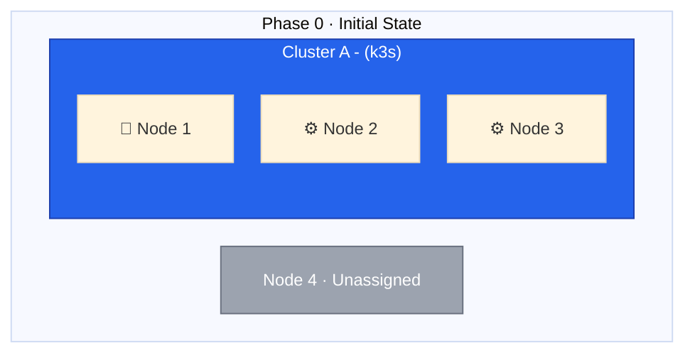
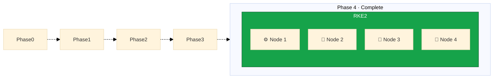

Welcome to this comprehensive guide on migrating from k3s to RKE2 without downtime. In this first lesson, we will
establish the context for our migration, understand the goals, and preview the journey ahead.



## The Migration Challenge

Migrating a production Kubernetes cluster is one of the most complex operations in infrastructure management. The
challenge multiplies when you need to:

1. **Maintain zero downtime** - Your services must remain available throughout
2. **Change the underlying distribution** - Moving from k3s to RKE2
3. **Reconfigure the node topology** - Shifting from 1 control plane + 2 workers to 3 control planes + 1 worker
4. **Replace the operating system** - Moving to Rocky Linux 9
5. **Upgrade networking and storage** - Implementing Cilium and Longhorn

## Current State: Cluster A (k3s)

Our starting point is a 3-node k3s cluster:

This setup has served well, but it presents a couple of critical limitations:

- Node 1 is a single point of failure as it's the only control plane node
- No distributed or replicated storage solution is in place, relying on local storage on each node
- Flannel CNI provides basic networking but external ingress is routed directly to fixed node IPs, limiting flexibility

## Target State: Cluster B (RKE2)

Our target is a 4-node RKE2 cluster with high availability set up for the control plane, storage and networking:

This configuration provides:

- 3 control plane nodes for high availability and resilience
- Extensibility to add more worker nodes in the future
- Robust storage options using Longhorn for slower replicated volumes and local-path for performance-sensitive workloads
- Advanced networking with Cilium for better performance and observability
- High-availability ingress with Traefik DaemonSet and Hetzner Cloud Load Balancer

## Guide Structure

This guide is organized into 5 sections with 25 lessons:

| Section                                       | Focus                      |
| --------------------------------------------- | -------------------------- |
| 1. Introduction and Migration Strategy        | Planning and preparation   |
| 2. Preparing Rocky Linux and RKE2 Environment | Bootstrap Cluster B        |
| 3. Migrating Nodes to the New Cluster         | Node-by-node transition    |
| 4. Workload Migration and Cutover             | Move workloads and traffic |
| 5. Cluster Consolidation and Cleanup          | Finalize and document      |

## Time and Risk Considerations

This migration requires careful execution. While the actual migration can be completed in a single maintenance
window, I recommend:

- Thoroughly review all lessons before starting
- Practice the node installation process on a test system if possible
- Ensure you have complete backups of all persistent data

The highest-risk phase occurs during the 2-node transition when both clusters are at minimum viable capacity. We
will cover this in detail in the migration strategy lesson.

Let's begin by understanding the RKE2 architecture and how it differs from k3s in the next lesson.
