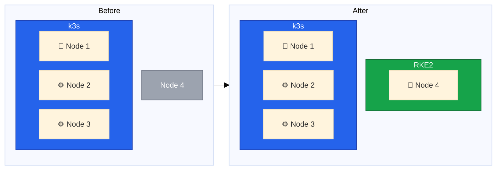
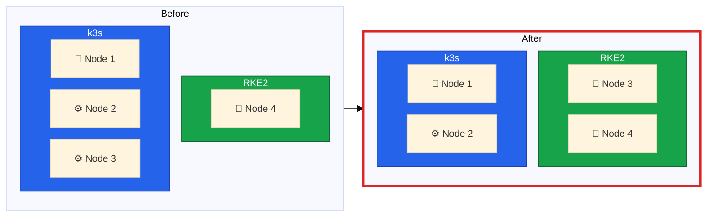
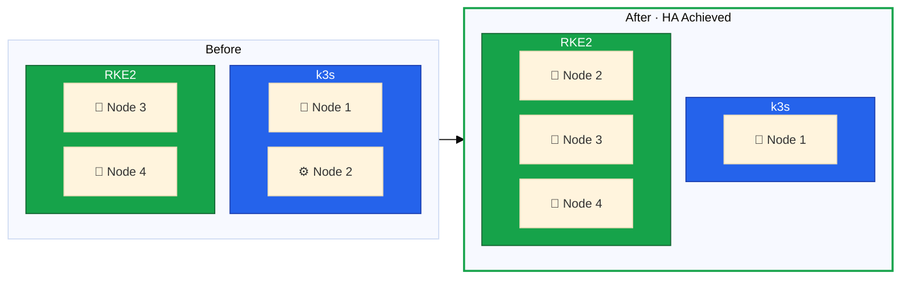
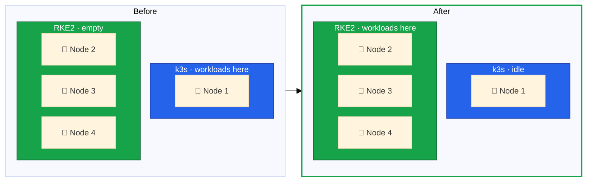
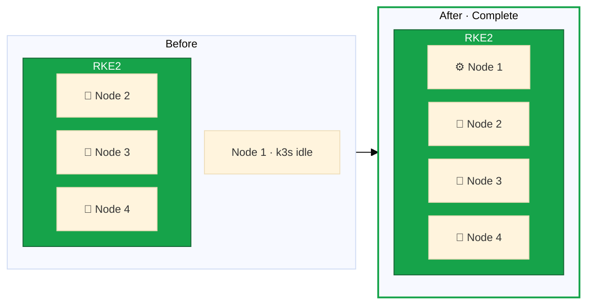

A successful zero-downtime migration requires meticulous planning.
In this lesson, we'll establish the context for our migration, develop the complete strategy, and understand the risks involved.



## The Migration Challenge

Migrating a production Kubernetes cluster is one of the most complex operations in infrastructure management.
Our migration must accomplish several goals simultaneously:

- Maintain zero downtime with services available throughout
- Change the underlying distribution from k3s to RKE2
- Reconfigure topology from 1 control plane + 2 workers to 3 control planes + 1 worker
- Replace the operating system with Rocky Linux 10
- Upgrade networking and storage with Cilium and Longhorn



## Current State vs Target State

**Current state** - 3-node k3s cluster with critical limitations:

- Node 1 is a single point of failure as the only control plane
- No replicated storage, relying on local storage per node
- Flannel CNI with external ingress routed directly to fixed node IPs

**Target state** - 4-node RKE2 cluster providing:

- 3 control plane nodes for high availability
- Extensibility to add more worker nodes
- Longhorn for replicated volumes and local-path for performance workloads
- Cilium for advanced networking and observability
- HA ingress with Traefik DaemonSet and Hetzner Cloud Load Balancer

## Phase 1: Bootstrap Cluster B

Create a new RKE2 cluster on Node 4 while Cluster A remains fully operational.

**Steps:**

- Install Rocky Linux 10 on Node 4
- Configure Hetzner vSwitch networking
- Install RKE2 as first control plane
- Deploy Cilium CNI
- Verify cluster functionality

**Result:** Single-node RKE2 cluster on Node 4, Cluster A unchanged with Nodes 1-3.

## Phase 2: First Node Migration

Remove Node 3 from Cluster A and add it as a control plane to Cluster B.



**Steps:**

- Cordon and drain Node 3 from Cluster A
- Remove Node 3 from Cluster A
- Reinstall OS with Rocky Linux 10 (optional)
- Join as RKE2 control plane
- Verify etcd cluster health

**Prerequisites:** All workloads running on Nodes 1-2, DNS not pointing to Node 3, external traffic routed elsewhere.

## Phase 3: Second Node Migration

Remove Node 2 from Cluster A and add it as a control plane to Cluster B, achieving high availability.

**Steps:**

- Cordon and drain Node 2 from Cluster A
- Remove Node 2 and uninstall k3s
- Reinstall with Rocky Linux 10 (optional)
- Join as RKE2 control plane
- Verify 3-node etcd quorum

**Result:** Cluster B has 3 control planes with full HA. Workload migration can begin.

## Phase 4: Workload Migration

**Risk Level: LOW** - Both clusters operational, DNS can be switched back if issues arise.

**Steps:**

- Set up storage on Cluster B (Longhorn + local-path)
- Configure ingress (Traefik + Hetzner LB)
- Export workload manifests from Cluster A
- Migrate persistent data if needed
- Deploy workloads to Cluster B
- Switch DNS to Cluster B ingress

**Result:** All workloads running on Cluster B, Cluster A idle with only Node 1.

## Phase 5: Cleanup and Consolidation

Decommission Cluster A and complete the RKE2 cluster.

**Steps:**

- Verify Cluster B stability (24-48 hour soak)
- Drain and remove Node 1 from Cluster A
- Uninstall k3s on Node 1
- Reinstall with Rocky Linux 10 (optional)
- Join as RKE2 agent (worker)

**Result:** Complete 4-node RKE2 cluster with 3 control planes and 1 worker.

## Risk Considerations

The highest-risk phase is Phase 2 when both clusters run at minimum viable capacity.
Never proceed to workload migration until Cluster B achieves full HA with 3 control plane nodes.

Before starting:

- Review all lessons thoroughly
- Practice the node installation process on a test system if possible
- Ensure complete backups of all persistent data
