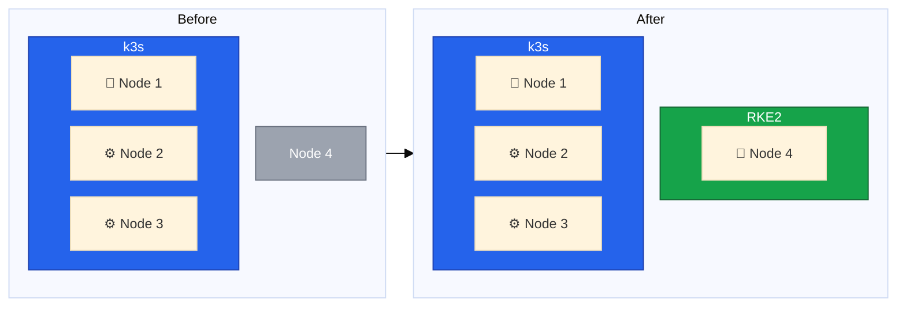
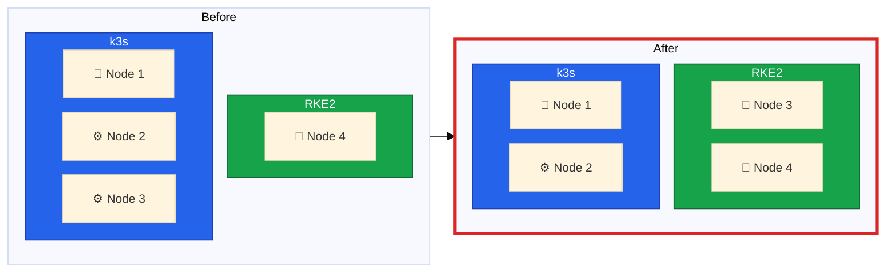
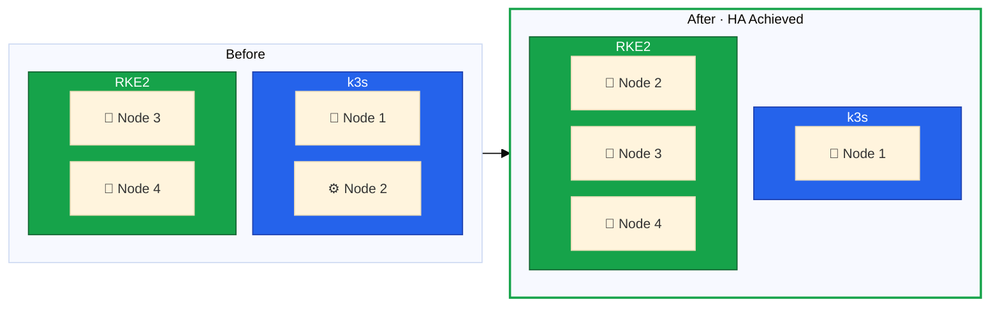
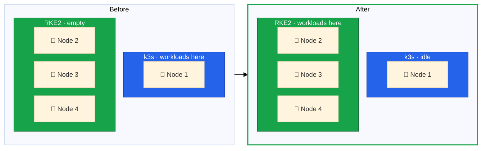
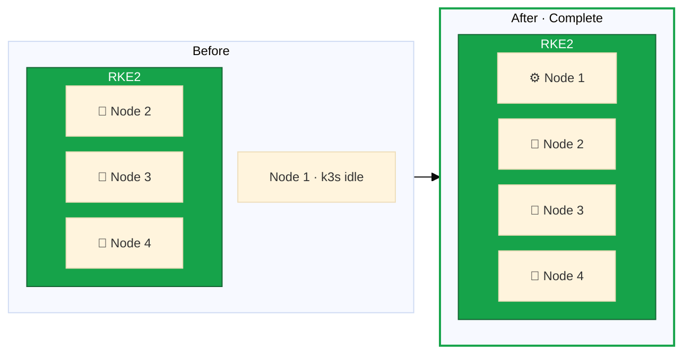

A successful zero-downtime migration requires meticulous planning.
This lesson establishes the context for our migration, develops a phased strategy, and maps the risks involved at each step.



## The Migration Challenge

Migrating a production Kubernetes cluster is one of the most complex operations in infrastructure management.
Our migration must maintain zero downtime while keeping services available, change the underlying distribution from k3s to RKE2, and reconfigure the topology from a single control plane with two workers to three control planes with one worker—all at the same time.
We're also replacing the operating system with Rocky Linux 10 and upgrading to Cilium for networking and Longhorn for storage.



## Current State vs Target State

The current k3s cluster has Node 1 as its sole control plane—a single point of failure that puts the entire cluster at risk if that node goes down.
Storage relies on local volumes per node with no replication, and Flannel provides basic CNI networking with external ingress routed directly to fixed node IPs.

The target RKE2 cluster addresses each of these limitations:

| Aspect        | Current (k3s)                         | Target (RKE2)                        |
| ------------- | ------------------------------------- | ------------------------------------ |
| Control Plane | Node 1 only (single point of failure) | Nodes 2, 3, 4 (HA with etcd quorum)  |
| Workers       | Nodes 2, 3                            | Node 1 (extensible to more)          |
| Storage       | Local storage per node                | Longhorn replicated + local-path     |
| CNI           | Flannel                               | Cilium with eBPF                     |
| Ingress       | Fixed node IPs                        | Traefik DaemonSet + Hetzner Cloud LB |

The migration happens in five phases, each moving one step closer to the target architecture while preserving service availability.

## Phase 1: Bootstrap Cluster B

This phase creates a new RKE2 cluster on Node 4 while Cluster A remains fully operational with all three nodes.
We install Rocky Linux 10 on Node 4, configure the Hetzner vSwitch networking, install RKE2 as the first control plane, and deploy Cilium as the CNI plugin.
After verifying cluster functionality, Node 4 runs as a single-node RKE2 cluster while Nodes 1-3 continue serving workloads unchanged.

## Phase 2: First Node Migration

Node 3 leaves Cluster A and joins Cluster B as a second control plane, giving the new cluster its first step toward high availability.
Before beginning, ensure all workloads run on Nodes 1 and 2, DNS does not point to Node 3, and external traffic is routed elsewhere.



The process involves cordoning and draining Node 3, removing it from Cluster A, optionally reinstalling the OS with Rocky Linux 10, and joining it as an RKE2 control plane.
After verifying etcd cluster health, both clusters operate at minimum viable capacity—Cluster A with two nodes and Cluster B with two etcd members, neither of which tolerates losing a node.

## Phase 3: Second Node Migration

Node 2 follows the same process: cordon, drain, remove from Cluster A, uninstall k3s, optionally reinstall the OS, and join Cluster B as the third control plane.
With three etcd members, Cluster B achieves full high availability—it can tolerate the loss of one control plane node while maintaining quorum.
Workload migration can now begin safely.

## Phase 4: Workload Migration

With Cluster B running three control planes and both clusters fully operational, the risk of this phase is low—DNS can be switched back to Cluster A if issues arise.
We set up storage on Cluster B with Longhorn and local-path provisioner, configure ingress through Traefik and the Hetzner Cloud Load Balancer, and export workload manifests from Cluster A.
After migrating any persistent data and deploying workloads to Cluster B, we switch DNS to point at the new cluster's ingress.
All workloads now run on Cluster B while Cluster A sits idle with only Node 1.

## Phase 5: Cleanup and Consolidation

The final phase decommissions Cluster A and brings Node 1 into the RKE2 cluster as a worker node.
After a 24-48 hour soak period to verify Cluster B stability, we drain Node 1, uninstall k3s, optionally reinstall with Rocky Linux 10, and join it as an RKE2 agent.
The result is a complete 4-node RKE2 cluster with three control planes and one dedicated worker.

## Risk Considerations

The highest-risk phase is Phase 2, when both clusters run at minimum viable capacity.
Cluster A loses one of its three nodes, and Cluster B has only two etcd members—which has zero fault tolerance, the same as a single-node cluster.
Minimize time in this state by ensuring both nodes are stable and proceeding to Phase 3 as quickly as practical.

Never proceed to workload migration until Cluster B achieves full HA with three control plane nodes.
Before starting the migration, review all lessons thoroughly, practice the node installation process on a test system if possible, and ensure you have complete backups of all persistent data.
