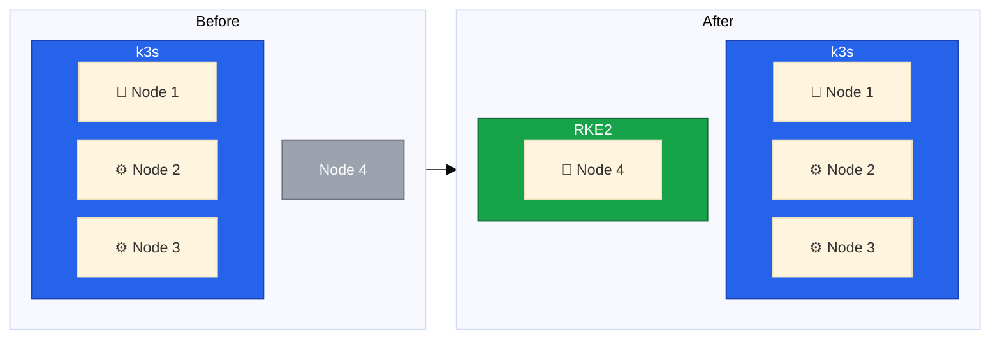
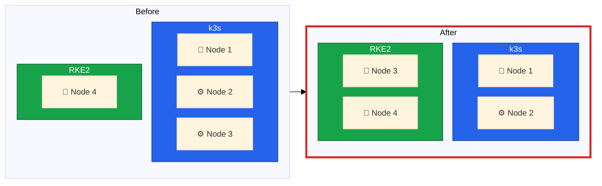
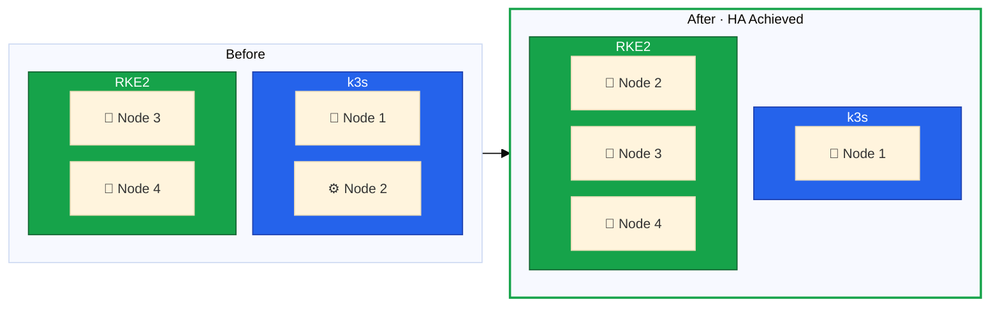
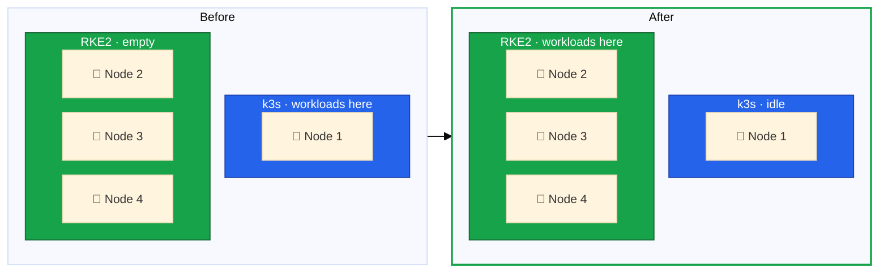
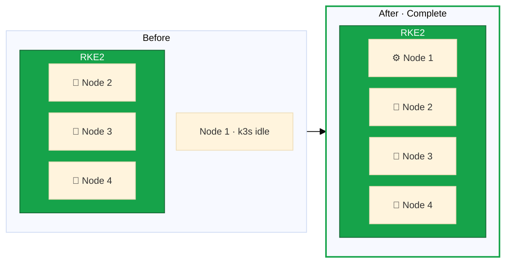

A successful zero-downtime migration requires meticulous planning. In this lesson, we'll establish the context for our
migration, develop our complete migration strategy, and understand the risks involved.



## The Migration Challenge

Migrating a production Kubernetes cluster is one of the most complex operations in infrastructure management. The
challenge multiplies when you need to:

1. **Maintain zero downtime** - Your services must remain available throughout
2. **Change the underlying distribution** - Moving from k3s to RKE2
3. **Reconfigure the node topology** - Shifting from 1 control plane + 2 workers to 3 control planes + 1 worker
4. **Replace the operating system** - Moving to Rocky Linux 9
5. **Upgrade networking and storage** - Implementing Cilium and Longhorn

## Current State vs Target State

Our starting point is a 3-node k3s cluster with critical limitations:

- Node 1 is a single point of failure as the only control plane node
- No distributed or replicated storage solution, relying on local storage on each node
- Flannel CNI provides basic networking but external ingress is routed directly to fixed node IPs

Our target is a 4-node RKE2 cluster providing:

- 3 control plane nodes for high availability and resilience
- Extensibility to add more worker nodes in the future
- Robust storage options using Longhorn for replicated volumes and local-path for performance-sensitive workloads
- Advanced networking with Cilium for better performance and observability
- High-availability ingress with Traefik DaemonSet and Hetzner Cloud Load Balancer

The [Migration Overview](/guides/migrating-k3s-to-rke2-without-downtime#migration-overview) on the guide index shows the complete phase timeline diagram.

## Phase 1: Bootstrap Cluster B

**Risk Level: LOW** - Cluster A is not affected; we can abandon Node 4 setup if issues arise.

We start with our existing k3s cluster using Node 1 as the control plane and Nodes 2 and 3 as workers. Our objective
is creating a new RKE2 cluster using Node 4 as the first control plane.

The steps we will take are:

1. Install Rocky Linux 9 on Node 4
2. Configure Hetzner vSwitch networking
3. Install RKE2 with first control plane
4. Deploy Cilium CNI
5. Verify cluster functionality

At the end of this phase we will have a single-node RKE2 cluster running on Node 4, while Cluster A remains fully
operational with Nodes 1-3.

## Phase 2: First Node Migration

**Risk Level: CRITICAL** - Both clusters are at minimum viable capacity. Cluster B has 2 control planes (no quorum
tolerance yet).

In this phase we will remove Node 3 from Cluster A and add it as a control plane node to Cluster B. This phase is
critical because achieving control plane quorum requires an odd number of nodes.

The actions we will take are:

1. Cordon and drain Node 3 from Cluster A
2. Remove Node 3 from Cluster A
3. (Optional) Reinstall OS with Rocky Linux 9
4. Join as RKE2 control plane node
5. Verify etcd cluster health

Before draining the nodes, ensure that all workloads are running on Node 1 and Node 2, and that Node 3 is not hosting
any critical services. Furthermore, ensure all DNS records are not pointing to Node 3, and that any external traffic
is routed to Nodes 1 and 2.

This will reduce compute capacity from Cluster A, so make sure that Node 1 is healthy and can handle the load.

## Phase 3: Second Node Migration

**Risk Level: MODERATE** - Cluster A is at minimum (single node), but Cluster B achieves full HA with 3 control planes.

In this phase we will remove Node 2 from Cluster A and add it as a control plane node to Cluster B. This is important
because it allows us to achieve high availability in Cluster B with 3 control plane nodes.

The steps we will take are:

1. Cordon and drain Node 2 from Cluster A
2. Remove Node 2 from cluster and uninstall k3s
3. (Optional) Reinstall with Rocky Linux 9
4. Join as RKE2 control plane
5. Verify 3-node etcd quorum

Once again we need to ensure that all workloads are running on Node 1, but at this point we can start switching
workloads to Cluster B if needed, as it will have a healthy control plane with 3 nodes.

## Phase 4: Workload Migration

**Risk Level: LOW** - Both clusters are operational; we can switch DNS back if issues arise.

Now that we have a fully operational RKE2 cluster with 3 control plane nodes, we can proceed to migrate workloads from
Cluster A to Cluster B.

The steps we will take are:

1. Set up storage on Cluster B (Longhorn + local-path)
2. Configure ingress (Traefik + Hetzner LB)
3. Export workload manifests from Cluster A
4. Migrate persistent data
5. Deploy workloads to Cluster B
6. Verify workload health
7. Switch DNS to Cluster B ingress
8. Monitor and validate

At the end of this phase, all workloads will be running on Cluster B, and external traffic will be routed to it.
Cluster A will still have Node 1 running, but it will not be serving any production workloads.

## Phase 5: Cleanup and Consolidation

**Risk Level: LOW** - All workloads already on Cluster B; Node 1 can be rolled back if needed.

Now that the migration is complete and all workloads are running on Cluster B, we can decommission Cluster A and
finalize our new RKE2 cluster.

The steps we will take are:

1. Verify Cluster B stability (24-48 hour soak)
2. Stop and uninstall k3s on Node 1
3. (Optional) Reinstall with Rocky Linux 9
4. Join as RKE2 agent (worker)
5. Verify final cluster health

## Time and Risk Considerations

This migration requires careful execution. While the actual migration can be completed in a single maintenance window,
I recommend:

- Thoroughly review all lessons before starting
- Practice the node installation process on a test system if possible
- Ensure you have complete backups of all persistent data

The highest-risk phase occurs during Phase 2 when both clusters are at minimum viable capacity. Never proceed to
workload migration until Cluster B has achieved full HA with 3 control plane nodes.
