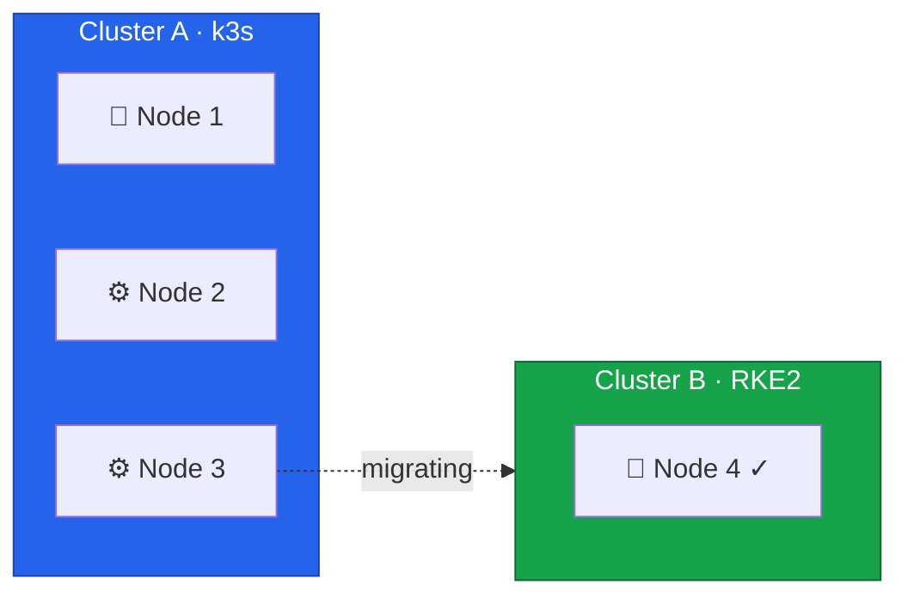
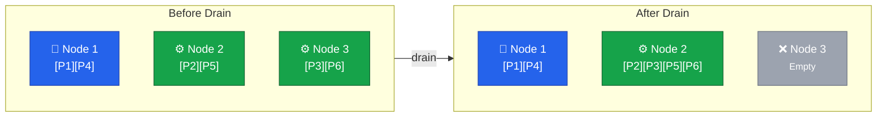
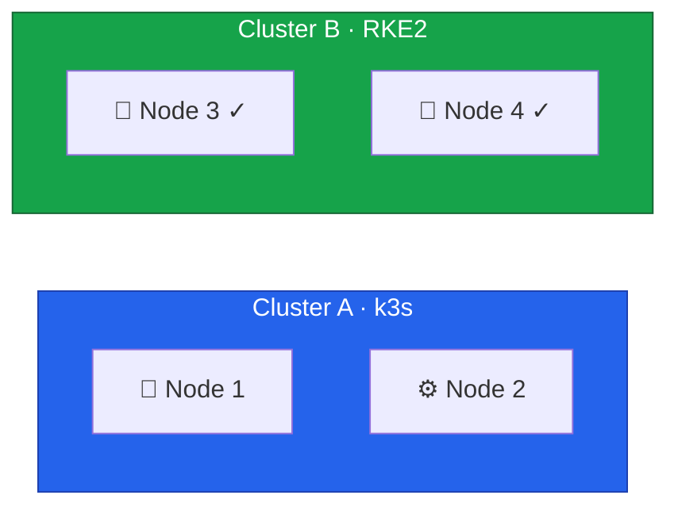

Node 3 is the first node we'll move from Cluster A to Cluster B.
The process involves analyzing what's running on the node, creating backups, draining it from the k3s cluster, reinstalling the OS, and joining it to RKE2.
Every subsequent node migration follows this same pattern, so this lesson covers each step in detail.



## Current State



## Understanding the Drain Process

When you drain a node, Kubernetes evicts all pods and marks the node as unschedulable.
Pods managed by controllers — Deployments, StatefulSets, DaemonSets — will be recreated on other nodes automatically.
Standalone pods without controllers will be deleted permanently.

The drain happens in three stages:

1. **Cordon** marks the node as unschedulable so no new pods land on it
2. **Evict** sends termination signals to all pods, respecting Pod Disruption Budgets
3. **Reschedule** controllers recreate evicted pods on remaining nodes



Several factors can block or complicate a drain.
Pod Disruption Budgets may prevent eviction if removing a pod would violate availability guarantees.
Pods with local storage won't migrate their data automatically.
Single-replica deployments will experience brief unavailability between eviction and rescheduling on another node.

Understanding these factors before running the drain command prevents surprises during the migration.

## Analyzing Workloads on Node 3

Every cluster is different.
The workloads running on your Node 3 depend on your applications, scheduling constraints, and how pods were distributed.
The commands below provide general guidance for discovering what needs attention before draining.

### Discovering Pods

Start by listing all pods scheduled on Node 3:

```bash
$ export KUBECONFIG=/path/to/cluster-a-kubeconfig
$ kubectl get pods -A -o wide --field-selector spec.nodeName=node3
NAMESPACE     NAME                      READY   STATUS    NODE
default       web-app-7d4b8c6f9-x2k9p   1/1     Running   node3
monitoring    prometheus-0              1/1     Running   node3
kube-system   canal-node3               1/1     Running   node3
```

DaemonSet pods like `canal` run on every node and will be recreated automatically.
Application pods managed by a Deployment or StatefulSet will be rescheduled to other nodes.

### StatefulSets and Local Storage

StatefulSets may have ordered shutdown requirements, so identify them first:

```bash
$ kubectl get statefulsets -A
NAMESPACE    NAME         READY   AGE
database     postgres     1/1     30d
monitoring   prometheus   1/1     15d
```

If a StatefulSet pod runs on Node 3, Kubernetes will recreate it on another node.
For databases, verify replication is healthy before proceeding.

Pods with local storage — hostPath or emptyDir volumes — won't carry their data to the new node:

```bash
$ kubectl get pods -A -o jsonpath='{range .items[*]}{.metadata.namespace}/{.metadata.name}: {.spec.volumes[*].name}{"\n"}{end}' | grep -E "local|hostPath"
monitoring/prometheus-0: data local-storage config
```

Back up any important data from these pods before draining.

### Disruption Budgets and Single Replicas

Pod Disruption Budgets can block the drain entirely:

```bash
$ kubectl get pdb -A
NAMESPACE   NAME         MIN AVAILABLE   MAX UNAVAILABLE   ALLOWED DISRUPTIONS
default     web-app      2               N/A               1
database    postgres     1               N/A               0
```

If `ALLOWED DISRUPTIONS` is `0`, the drain will wait or fail.
You may need to temporarily relax the PDB or ensure enough replicas are running on other nodes first.

Single-replica deployments will cause brief unavailability during the transition:

```bash
$ kubectl get deployments -A -o jsonpath='{range .items[*]}{.metadata.namespace}/{.metadata.name}: {.spec.replicas}{"\n"}{end}' | grep ": 1$"
default/backend-api: 1
tools/cron-runner: 1
```

These workloads will be unavailable between eviction and rescheduling, typically seconds to minutes.

### Capacity Verification

Confirm that the remaining nodes have enough headroom to absorb Node 3's workloads:

```bash
$ kubectl top nodes
NAME    CPU(cores)   CPU%   MEMORY(bytes)   MEMORY%
node1   450m         11%    2100Mi          26%
node2   380m         9%     1800Mi          22%
node3   520m         13%    2400Mi          30%
```

After draining Node 3, its workloads shift to Nodes 1 and 2.
Both CPU and memory utilization should stay below 80% after absorbing the additional load.

## Creating Backups

### k3s etcd Snapshot

Create an etcd snapshot on the k3s control plane node before making any changes:

```bash
# On Node 1 (k3s control plane)
$ ssh root@node1
$ sudo k3s etcd-snapshot save --name pre-node3-migration-$(date +%Y%m%d-%H%M%S)
$ sudo k3s etcd-snapshot ls
```

### Application Data

For applications with persistent data, create application-level backups as well:

```bash
# Example: PostgreSQL database
$ kubectl exec -n <namespace> <pod-name> -- pg_dump -U postgres > backup.sql

# Or use Velero if available
$ velero backup create pre-migration-backup
```

## Executing the Drain

### Cordon the Node

Mark Node 3 as unschedulable:

```bash
$ kubectl cordon node3
$ kubectl get nodes
```

Expected output shows `SchedulingDisabled`:

```
NAME    STATUS                     ROLES    AGE   VERSION
node1   Ready                      master   30d   v1.28.5+k3s1
node2   Ready                      <none>   30d   v1.28.5+k3s1
node3   Ready,SchedulingDisabled   <none>   30d   v1.28.5+k3s1
```

### Monitor the Drain

In a separate terminal, watch for pod transitions:

```bash
$ watch -n 2 'kubectl get pods -A -o wide | grep -E "node3|Terminating|Pending|ContainerCreating"'
```

### Drain the Node

```bash
$ kubectl drain node3 \
  --ignore-daemonsets \
  --delete-emptydir-data \
  --grace-period=300 \
  --timeout=600s
```

| Flag                     | Purpose                                                |
| ------------------------ | ------------------------------------------------------ |
| `--ignore-daemonsets`    | Skip DaemonSet pods (they'll be removed with the node) |
| `--delete-emptydir-data` | Allow eviction of pods using emptyDir volumes          |
| `--grace-period=300`     | Give pods 5 minutes to shut down gracefully            |
| `--timeout=600s`         | Fail if drain doesn't complete in 10 minutes           |

DaemonSet pods are a special case.
The `--ignore-daemonsets` flag tells the drain to skip them since they're meant to run on every node and will be cleaned up when the node is removed.

### Handling Blocked Drains

**PDB blocking eviction:**

```bash
# Check which PDB is blocking
$ kubectl get pdb -A

# If safe, temporarily reduce the minimum (restore after drain!)
$ kubectl patch pdb <name> -n <namespace> -p '{"spec":{"minAvailable":0}}'
```

**Stuck terminating pods:**

```bash
# Find stuck pods
$ kubectl get pods -A --field-selector spec.nodeName=node3 | grep Terminating

# Force delete if necessary (may lose in-flight data)
$ kubectl delete pod <pod-name> -n <namespace> --grace-period=0 --force
```

**Local storage preventing eviction:**

Pods with hostPath or local-path-provisioner volumes may block the drain.
Back up any important data, then use `--force` or delete the pod manually.

## Removing Node 3 from Cluster A

### Verify Drain Success

```bash
# Should show only DaemonSet pods or be empty
$ kubectl get pods -A -o wide --field-selector spec.nodeName=node3

# Verify workloads are running elsewhere
$ kubectl get pods -A | grep -v Running | grep -v Completed
```

### Delete from Cluster

```bash
$ kubectl delete node node3
$ kubectl get nodes
```

### Stop k3s on Node 3

```bash
$ ssh root@node3
$ sudo systemctl stop k3s-agent
$ sudo systemctl disable k3s-agent
```



## Preparing Node 3 for RKE2

The setup follows the same process as Node 4.
The full details for each step are covered in the referenced lessons — this quickstart lists every command needed to get Node 3 ready.

### Installing Rocky Linux 10

Boot into the Hetzner Rescue System and run the installer.
See [Lesson 2](/guides/migrating-k3s-to-rke2-without-downtime/lesson-2) for the full walkthrough.

```bash
$ installimage
```

Select Rocky Linux 10, set the hostname to `node3`, and use a simple partition layout without swap:

```
PART  /boot  ext3   1024M
PART  /      ext4   all
```

After installation completes, reboot into the new OS:

```bash
$ reboot
```

### Security Hardening

Reconnect via SSH (accept the new host key) and harden the server:

```bash
# Change the root password
$ passwd

# Update all packages
$ dnf update -y

# Create a dedicated admin user
$ useradd k8sadmin
$ passwd k8sadmin
$ usermod -aG wheel k8sadmin
```

From your local machine, set up SSH key authentication:

```bash
$ ssh-keygen -t ed25519 -f ~/.ssh/node3_k8sadmin_ed25519
$ ssh-copy-id -i ~/.ssh/node3_k8sadmin_ed25519 k8sadmin@<node3-public-ip>
```

Add an entry to `~/.ssh/config`:

```
Host node3
  HostName <node3-public-ip>
  User k8sadmin
  IdentityFile ~/.ssh/node3_k8sadmin_ed25519
  IdentitiesOnly yes
```

Disable root login:

```bash
$ sudo vi /etc/ssh/sshd_config
# Set: PermitRootLogin no
$ sudo systemctl restart sshd
```

### Timezone, Hostname, and Essential Tools

```bash
$ sudo timedatectl set-timezone Europe/Helsinki
$ sudo hostnamectl set-hostname node3

$ sudo dnf install -y \
    vim \
    git \
    bash-completion \
    tar \
    unzip \
    net-tools \
    bind-utils \
    jq \
    wireguard-tools
```

### Optional: Tailscale

```bash
$ sudo dnf config-manager --add-repo https://pkgs.tailscale.com/stable/fedora//tailscale.repo
$ sudo dnf install -y tailscale
$ sudo systemctl enable --now tailscaled
$ sudo tailscale up
```

### Configuring Dual-Stack vSwitch Networking

Configure the VLAN interface with both IPv4 and IPv6 addresses.
See [Lesson 3](/guides/migrating-k3s-to-rke2-without-downtime/lesson-3) for the full networking walkthrough.

```bash
# Replace enp35s0 with your actual interface name
$ sudo nmcli connection add \
    type vlan \
    con-name vswitch0 \
    dev enp35s0 \
    id 4000 \
    ipv4.method manual \
    ipv4.addresses 10.1.0.13/16 \
    ipv4.routes "10.0.0.0/24 10.1.0.1" \
    ipv6.method manual \
    ipv6.addresses fd00::13/64

$ sudo nmcli connection up vswitch0
```

If a `vswitch0` connection already exists, use `modify` instead of `add`:

```bash
$ sudo nmcli connection modify vswitch0 \
    ipv4.method manual \
    ipv4.addresses 10.1.0.13/16 \
    ipv4.routes "10.0.0.0/24 10.1.0.1" \
    ipv6.method manual \
    ipv6.addresses fd00::13/64

$ sudo nmcli connection up vswitch0
```

Configure public IPv6 on the main interface:

```bash
# Replace the address with your assigned IPv6 from Hetzner
$ sudo nmcli connection modify "Wired connection 1" \
    ipv6.method manual \
    ipv6.addresses "2a01:4f9:XX:XX::2/64" \
    ipv6.gateway "fe80::1"
$ sudo nmcli connection up "Wired connection 1"
```

Enable IPv6 forwarding:

```bash
$ sudo tee /etc/sysctl.d/99-ipv6-forward.conf <<EOF
net.ipv6.conf.all.forwarding = 1
net.ipv6.conf.default.forwarding = 1
EOF
$ sudo sysctl -p /etc/sysctl.d/99-ipv6-forward.conf
```

### Configuring the Firewall

Configure the Hetzner Robot firewall for Node 3 with the same rules as Node 4.
See [Lesson 4](/guides/migrating-k3s-to-rke2-without-downtime/lesson-4) for rule explanations and verification steps.

| ID | Name               | Version | Protocol | Source IP   | Dest Port   | TCP Flags | Action |
| -- | ------------------ | ------- | -------- | ----------- | ----------- | --------- | ------ |
| #1 | vswitch            | ipv4    | \*       | 10.1.0.0/16 |             |           | accept |
| #2 | tcp established    | ipv4    | tcp      |             | 32768-65535 | ack       | accept |
| #3 | tcp established-v6 | ipv6    | tcp      |             | 32768-65535 | ack       | accept |
| #4 | dns responses      | ipv4    | udp      |             | 32768-65535 |           | accept |
| #5 | well-known         | ipv4    | tcp      |             | 22-587      |           | accept |
| #6 | well-known-v6      | ipv6    | tcp      |             | 22-587      |           | accept |
| #7 | k8s-api            | ipv4    | tcp      |             | 6443        |           | accept |
| #8 | k8s-api-v6         | ipv6    | tcp      |             | 6443        |           | accept |
| #9 | nodeports          | \*      | \*       |             | 30000-32767 |           | accept |

### Verifying Connectivity

```bash
$ ping -c 3 10.1.0.14
PING 10.1.0.14 (10.1.0.14) 56(84) bytes of data.
64 bytes from 10.1.0.14: icmp_seq=1 ttl=64 time=0.486 ms
64 bytes from 10.1.0.14: icmp_seq=2 ttl=64 time=0.353 ms
64 bytes from 10.1.0.14: icmp_seq=3 ttl=64 time=0.413 ms

--- 10.1.0.14 ping statistics ---
3 packets transmitted, 3 received, 0% packet loss, time 2086ms
rtt min/avg/max/mdev = 0.353/0.417/0.486/0.054 ms

$ ping6 -c 3 fd00::14
PING fd00::14 (fd00::14) 56 data bytes
64 bytes from fd00::14: icmp_seq=1 ttl=64 time=0.508 ms
64 bytes from fd00::14: icmp_seq=2 ttl=64 time=0.358 ms
64 bytes from fd00::14: icmp_seq=3 ttl=64 time=0.388 ms

--- fd00::14 ping statistics ---
3 packets transmitted, 3 received, 0% packet loss, time 2084ms
rtt min/avg/max/mdev = 0.358/0.418/0.508/0.064 ms

$ nc -zv 10.1.0.14 9345
Ncat: Version 7.92 ( https://nmap.org/ncat )
Ncat: Connected to 10.1.0.14:9345.
Ncat: 0 bytes sent, 0 bytes received in 0.01 seconds.
```

The last command verifies the RKE2 supervisor port is reachable.

## Installing and Configuring RKE2

When a new node joins an existing RKE2 cluster, the process differs from bootstrapping the first node:

| Aspect | First Node (Bootstrap)   | Additional Nodes (Join)     |
| ------ | ------------------------ | --------------------------- |
| Config | Defines cluster settings | References existing cluster |
| etcd   | Creates new cluster      | Joins existing cluster      |
| Certs  | Generates CA             | Receives certs from server  |
| State  | Empty                    | Syncs from existing nodes   |

The key configuration difference is the `server` directive, which tells RKE2 where to register with the existing cluster.
The `rke2 server` process on Node 4 listens on port `9345` for new nodes to register, while the Kubernetes API remains on port `6443`.

### Install RKE2

On Rocky Linux the install script detects RPM support and installs via `dnf` automatically:

```bash
$ curl -sfL https://get.rke2.io | sudo sh -
$ sudo systemctl enable rke2-server.service
```

This installs the `rke2-server` service (the default type) and places additional utilities — `kubectl`, `crictl`, and `ctr` — in `/var/lib/rancher/rke2/bin/`.

### Create Configuration

Retrieve the cluster token from Node 4.
RKE2 generated this token during the initial bootstrap and stored it at `/var/lib/rancher/rke2/server/node-token`:

```bash
# On Node 4
$ sudo cat /var/lib/rancher/rke2/server/node-token
K10...::server:xxxx
```

Back on Node 3, create the configuration directory using the same multi-file layout from [Lesson 5](/guides/migrating-k3s-to-rke2-without-downtime/lesson-5):

```bash
$ sudo mkdir -p /etc/rancher/rke2/config.yaml.d
```

The join configuration tells RKE2 where to register and how to authenticate.
This file is the only difference between a bootstrap node and a joining node:

```yaml
# /etc/rancher/rke2/config.yaml.d/00-join.yaml

server: https://10.1.0.14:9345
token: <paste-token-from-node4>
```

The network configuration mirrors Node 4's settings with Node 3's addresses:

```yaml
# /etc/rancher/rke2/config.yaml.d/10-network.yaml

cni: canal

node-ip: 10.1.0.13,fd00::13
node-external-ip:
  - 65.109.XX.XX # Replace with Node 3's public IPv4
  - 2a01:4f9:XX:XX::2 # Replace with Node 3's public IPv6
advertise-address: 10.1.0.13
bind-address: 10.1.0.13

cluster-cidr: 10.42.0.0/16,fd00:42::/56
service-cidr: 10.43.0.0/16,fd00:43::/112
cluster-dns: 10.43.0.10
```

The external access configuration adds Node 3's names and IPs to the API server certificate:

```yaml
# /etc/rancher/rke2/config.yaml.d/20-external-access.yaml

tls-san:
  - node3
  - node3.k8s.local
  - 10.1.0.13
  - fd00::13
  - cluster.yourdomain.com
```

The security configuration is identical to Node 4:

```yaml
# /etc/rancher/rke2/config.yaml.d/30-security.yaml

secrets-encryption: true

disable:
  - rke2-ingress-nginx

etcd-snapshot-schedule-cron: "0 */6 * * *"
etcd-snapshot-retention: 5
```

Each control plane node runs its own kube-apiserver, so the authentication configuration from [Lesson 9](/guides/migrating-k3s-to-rke2-without-downtime/lesson-9) must also be present.
Copy `auth-config.yaml` from Node 4 and create the corresponding RKE2 config file:

```bash
# Copy the AuthenticationConfiguration from Node 4
$ sudo scp node4:/etc/rancher/rke2/auth-config.yaml /etc/rancher/rke2/auth-config.yaml
```

```yaml
# /etc/rancher/rke2/config.yaml.d/40-authentication.yaml
kube-apiserver-arg:
  - "authentication-config=/etc/rancher/rke2/auth-config.yaml"
```



### Start RKE2

```bash
$ sudo systemctl start rke2-server.service
$ sudo journalctl -u rke2-server -f
```

The join process takes several minutes.
The node contacts Node 4's supervisor API on port `9345`, retrieves cluster certificates, joins etcd as a new member, starts control plane components, and syncs existing cluster state.

Watch for these log messages indicating success:

```
level=info msg="Starting etcd member..."
level=info msg="etcd member started"
level=info msg="Running kube-apiserver..."
```

## Verification

### Check Nodes

Using the `kubectl` installed with RKE2, check that Node 3 has joined successfully:

```bash
$ kubectl get nodes -o wide
```

Expected output showing both nodes with dual-stack IPs:

```
NAME    STATUS   ROLES                       AGE   VERSION          INTERNAL-IP
node3   Ready    control-plane,etcd,master   2m    v1.31.x+rke2r1   10.1.0.13,fd00::13
node4   Ready    control-plane,etcd,master   3h    v1.31.x+rke2r1   10.1.0.14,fd00::14
```

### Check etcd Membership

On the old node (Node 4), use the already installed `etcdctl` to verify that Node 3 has joined the etcd cluster:

```bash
$ sudo etcdctl member list
xxxx, started, node4-xxxx, https://10.1.0.14:2380, https://10.1.0.14:2379, false
yyyy, started, node3-xxxx, https://10.1.0.13:2380, https://10.1.0.13:2379, false
```

### Check Canal and WireGuard

Canal automatically deploys to new nodes:

```bash
$ kubectl get pods -n kube-system -l k8s-app=canal -o wide
NAME               READY   STATUS    RESTARTS   AGE     IP          NODE       NOMINATED NODE   READINESS GATES
rke2-canal-6qrrc   2/2     Running   0          7m45s   10.1.0.14   node4   <none>           <none>
rke2-canal-ntzcl   2/2     Running   0          7m41s   10.1.0.13   node3   <none>           <none>
```

This is the first time we can verify that WireGuard tunnels actually work — until now, Node 4 had no peers.
Check that both nodes see each other as WireGuard peers with a recent handshake:

```bash
$ sudo wg show flannel-wg
interface: flannel-wg
  public key: <node3-public-key>
  private key: (hidden)
  listening port: 51820

peer: <node4-public-key>
  endpoint: 135.181.XX.XX:51820
  allowed ips: 10.42.0.0/24
  latest handshake: 1 minute, 47 seconds ago
  transfer: 727.82 KiB received, 615.54 KiB sent
```

The `allowed ips` entry shows Node 4's pod subnet, and the handshake confirms the encrypted tunnel is active.
Test cross-node pod connectivity through the tunnel:

```bash
# Ping a pod IP on Node 4 (from the 10.42.0.x range)
$ ping -c 3 10.42.0.8
```

If pings fail with "Required key not available" or "No route to host", see the WireGuard troubleshooting section below.

### Cluster A Stability

Verify that Cluster A is still healthy with its remaining two nodes:

```bash
$ export KUBECONFIG=/path/to/cluster-a-kubeconfig
$ kubectl get nodes
$ kubectl get pods -A | grep -v Running | grep -v Completed
$ kubectl top nodes
```

## Preparing Longhorn Storage

Longhorn is already running on the cluster — the `HelmChart` manifest deployed in [Lesson 7](/guides/migrating-k3s-to-rke2-without-downtime/lesson-7) handles that automatically.
However, each new node needs system-level dependencies (iSCSI for block storage and NFSv4 for RWX volumes) before Longhorn can schedule replicas on it.

Install `longhornctl` and run the preflight installer on Node 3:

```bash
$ curl -fL -o /usr/local/bin/longhornctl \
    https://github.com/longhorn/cli/releases/download/v1.11.0/longhornctl-linux-amd64
$ chmod +x /usr/local/bin/longhornctl

$ /usr/local/bin/longhornctl --kubeconfig /etc/rancher/rke2/rke2.yaml install preflight
```

Run the preflight check to confirm all dependencies are in place:

```bash
$ /usr/local/bin/longhornctl --kubeconfig /etc/rancher/rke2/rke2.yaml check preflight
```

The check should report no errors for Node 3.
See [Lesson 7](/guides/migrating-k3s-to-rke2-without-downtime/lesson-7) for a detailed walkthrough of what each dependency does and how to troubleshoot failures.

Once the preflight passes, verify that Longhorn recognizes Node 3 as schedulable:

```bash
$ kubectl get nodes.longhorn.io -n longhorn-system
NAME    READY   ALLOWSCHEDULING   SCHEDULABLE   AGE
node3   True    true              True          2m
node4   True    true              True          3h
```

With two storage nodes, Longhorn can now replicate volumes across nodes.
We'll increase the replica count once a third node joins the cluster in [Lesson 12](/guides/migrating-k3s-to-rke2-without-downtime/lesson-12).

Repeat this `longhornctl` preflight process on every node that joins the cluster going forward.

## Current State





## Troubleshooting

### WireGuard / VXLAN Backend Mismatch

If cross-node pod traffic fails with "no route to host" or "Required key not available", the most likely cause is a Flannel backend mismatch between nodes.

This happens when the existing node is still running the VXLAN backend while the new node picks up the WireGuard configuration from the HelmChartConfig applied in [Lesson 6](/guides/migrating-k3s-to-rke2-without-downtime/lesson-6).
The new node creates a `flannel-wg` interface, but the existing node still uses `flannel.1` (VXLAN) — so the two nodes can't exchange pod traffic.

Check which interfaces each node is using:

```bash
# On each node
$ ip link show | grep -E "flannel|wg"
18: flannel.1: <BROADCAST,MULTICAST,UP,LOWER_UP> mtu 1450 qdisc noqueue state UNKNOWN mode DEFAULT group default
23: flannel-v6.1: <BROADCAST,MULTICAST,UP,LOWER_UP> mtu 1430 qdisc noqueue state UNKNOWN mode DEFAULT group default
87: flannel-wg: <POINTOPOINT,NOARP,UP,LOWER_UP> mtu 1420 qdisc noqueue state UNKNOWN mode DEFAULT group default
88: flannel-wg-v6: <POINTOPOINT,NOARP,UP,LOWER_UP> mtu 1420 qdisc noqueue state UNKNOWN mode DEFAULT group default
```

If one node shows `flannel.1` and the other shows `flannel-wg`, restart the Canal DaemonSet to align both nodes on the WireGuard backend:

```bash
$ kubectl rollout restart ds rke2-canal -n kube-system
$ kubectl rollout status ds rke2-canal -n kube-system --timeout=120s
```

After the restart, both nodes should show `flannel-wg` and `flannel-wg-v6` interfaces.
Verify the tunnel is established with `wg show flannel-wg` — look for a peer entry with a recent handshake.
