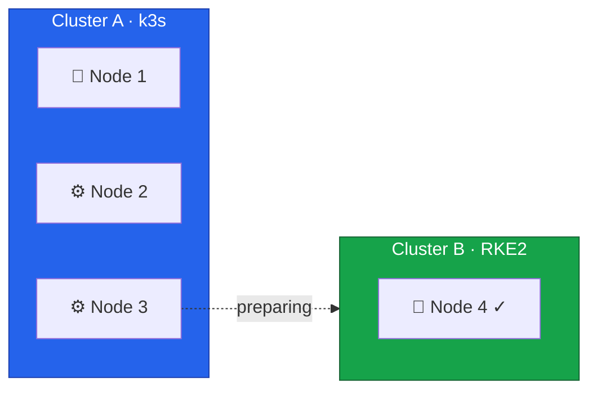

Before draining a node from Cluster A, you need a clear picture of what's running on it, whether the remaining nodes can absorb the load, and whether Cluster B is ready to accept a new member.
This lesson walks through the preparation steps for Node 3.



## Current State



## Understanding the Drain Process

When you drain a node, Kubernetes evicts all pods and marks the node as unschedulable.
Pods managed by controllers — Deployments, StatefulSets, DaemonSets — will be recreated on other nodes automatically.
Standalone pods without controllers will be deleted permanently.

The drain process can be blocked or complicated by several factors.
Pod Disruption Budgets may prevent eviction if removing a pod would violate availability guarantees.
Pods with local storage won't migrate their data automatically.
Single-replica deployments will experience brief unavailability between eviction and rescheduling on another node.

Understanding these factors before running the drain command prevents surprises during the migration.

## Analyzing Workloads on Node 3

Every cluster is different.
The workloads running on your Node 3 depend on your applications, scheduling constraints, and how pods were distributed.
The commands below provide general guidance for discovering what needs attention before draining.

### Discovering Pods

Start by listing all pods scheduled on Node 3:

```bash
$ export KUBECONFIG=/path/to/cluster-a-kubeconfig
$ kubectl get pods -A -o wide --field-selector spec.nodeName=node3
NAMESPACE     NAME                      READY   STATUS    NODE
default       web-app-7d4b8c6f9-x2k9p   1/1     Running   node3
monitoring    prometheus-0              1/1     Running   node3
kube-system   canal-node3               1/1     Running   node3
```

DaemonSet pods like `canal` run on every node and will be recreated automatically.
Application pods managed by a Deployment or StatefulSet will be rescheduled to other nodes.

### StatefulSets and Local Storage

StatefulSets may have ordered shutdown requirements, so identify them first:

```bash
$ kubectl get statefulsets -A
NAMESPACE    NAME         READY   AGE
database     postgres     1/1     30d
monitoring   prometheus   1/1     15d
```

If a StatefulSet pod runs on Node 3, Kubernetes will recreate it on another node.
For databases, verify replication is healthy before proceeding.

Pods with local storage — hostPath or emptyDir volumes — won't carry their data to the new node:

```bash
$ kubectl get pods -A -o jsonpath='{range .items[*]}{.metadata.namespace}/{.metadata.name}: {.spec.volumes[*].name}{"\n"}{end}' | grep -E "local|hostPath"
monitoring/prometheus-0: data local-storage config
```

Back up any important data from these pods before draining.

### Disruption Budgets and Single Replicas

Pod Disruption Budgets can block the drain entirely:

```bash
$ kubectl get pdb -A
NAMESPACE   NAME         MIN AVAILABLE   MAX UNAVAILABLE   ALLOWED DISRUPTIONS
default     web-app      2               N/A               1
database    postgres     1               N/A               0
```

If `ALLOWED DISRUPTIONS` is `0`, the drain will wait or fail.
You may need to temporarily relax the PDB or ensure enough replicas are running on other nodes first.

Single-replica deployments will cause brief unavailability during the transition:

```bash
$ kubectl get deployments -A -o jsonpath='{range .items[*]}{.metadata.namespace}/{.metadata.name}: {.spec.replicas}{"\n"}{end}' | grep ": 1$"
default/backend-api: 1
tools/cron-runner: 1
```

These workloads will be unavailable between eviction and rescheduling, typically seconds to minutes.

### Capacity Verification

Confirm that the remaining nodes have enough headroom to absorb Node 3's workloads:

```bash
$ kubectl top nodes
NAME    CPU(cores)   CPU%   MEMORY(bytes)   MEMORY%
node1   450m         11%    2100Mi          26%
node2   380m         9%     1800Mi          22%
node3   520m         13%    2400Mi          30%
```

After draining Node 3, its workloads shift to Nodes 1 and 2.
Both CPU and memory utilization should stay below 80% after absorbing the additional load.

## Creating Backups

### k3s etcd Snapshot

Create an etcd snapshot on the k3s control plane node before making any changes:

```bash
# On Node 1 (k3s control plane)
$ ssh root@node1
$ sudo k3s etcd-snapshot save --name pre-node3-migration-$(date +%Y%m%d-%H%M%S)
$ sudo k3s etcd-snapshot ls
```

### Application Data

For applications with persistent data, create application-level backups as well:

```bash
# Example: PostgreSQL database
$ kubectl exec -n <namespace> <pod-name> -- pg_dump -U postgres > backup.sql

# Or use Velero if available
$ velero backup create pre-migration-backup
```

## Verifying Cluster B Readiness

Before proceeding, confirm Cluster B is healthy and ready to receive Node 3:

```bash
$ export KUBECONFIG=/etc/rancher/rke2/rke2.yaml
$ kubectl get nodes
$ kubectl get pods -n kube-system -l k8s-app=canal
```

Node 4 should be in `Ready` state with all system pods running and Canal healthy.

Save the RKE2 configuration that Node 3 will use when joining Cluster B:

```bash
$ cat <<'EOF' > /root/node3-rke2-config.yaml
server: https://10.1.0.14:9345
token: <your-token-from-node4>
tls-san:
  - node3
  - node3.k8s.local
  - 10.1.0.13
  - fd00::13
cni: none
node-ip: 10.1.0.13,fd00::13
EOF
```

## Pre-Migration Verification

Before draining Node 3, walk through each of these areas to confirm readiness.

Cluster A should have all nodes in `Ready` state with no pods stuck in `Error` or `CrashLoopBackOff`.
The etcd snapshot and any application-level backups should be completed and verified.

Capacity planning should confirm that Nodes 1 and 2 can absorb Node 3's workloads without exceeding 80% utilization.
Review any Pod Disruption Budgets and accept the brief unavailability of single-replica deployments.

Cluster B should have Node 4 in `Ready` state with all system pods running, Canal healthy, and the RKE2 configuration file prepared for Node 3.

External dependencies should be in order — Rocky Linux installation media ready if reinstalling the OS, IPMI or rescue system access verified, network configuration documented, and DNS not pointing to Node 3.



In the next lesson, we'll drain Node 3 from Cluster A.
