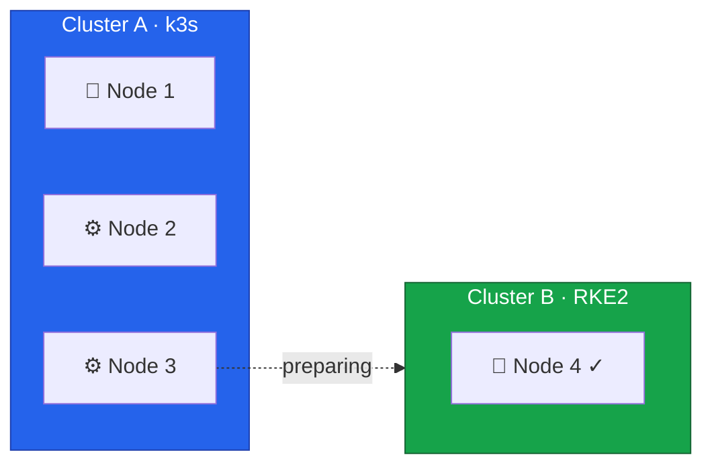

We're now entering the critical phase of the migration. In this lesson, we'll prepare Node 3 for migration from
Cluster A (k3s) to Cluster B (RKE2).



## Current State



## Pre-Migration Analysis

### Analyze Workloads on Node 3

First, understand what's running on Node 3:

```bash
# Connect to Cluster A
export KUBECONFIG=/path/to/cluster-a-kubeconfig

# List all pods on Node 3
kubectl get pods -A -o wide --field-selector spec.nodeName=node3

# Get a summary by namespace
kubectl get pods -A --field-selector spec.nodeName=node3 -o jsonpath='{range .items[*]}{.metadata.namespace}{"\n"}{end}' | sort | uniq -c

# Check for DaemonSet pods (will be recreated on other nodes)
kubectl get pods -A -o wide --field-selector spec.nodeName=node3 | grep -v "DaemonSet"
```

### Identify Critical Workloads

```bash
# Check for StatefulSets
kubectl get statefulsets -A

# Check for pods with local storage
kubectl get pods -A -o jsonpath='{range .items[*]}{.metadata.namespace}/{.metadata.name}: {.spec.volumes[*].name}{"\n"}{end}' | grep -E "local|hostPath"

# Check Pod Disruption Budgets
kubectl get pdb -A
```

### Verify Cluster A Can Handle Reduced Capacity

```bash
# Check current resource usage
kubectl top nodes

# Calculate total resources vs. used
kubectl describe nodes | grep -A 5 "Allocated resources"

# Verify Node 2 has capacity for Node 3's workloads
TOTAL_PODS_NODE3=$(kubectl get pods -A --field-selector spec.nodeName=node3 --no-headers | wc -l)
echo "Total pods on Node 3: $TOTAL_PODS_NODE3"
```

## Prepare for Workload Migration

### Check Replica Counts

Ensure critical deployments have enough replicas:

```bash
# List deployments and their replica counts
kubectl get deployments -A

# Identify single-replica deployments
kubectl get deployments -A -o jsonpath='{range .items[*]}{.metadata.namespace}/{.metadata.name}: {.spec.replicas}{"\n"}{end}' | grep ": 1$"
```

### Scale Up Critical Deployments (If Needed)

For deployments that must remain available during the drain:

```bash
# Example: Scale up a critical deployment temporarily
# kubectl scale deployment <name> -n <namespace> --replicas=2

# Note: Only do this if resources allow
```

### Check Persistent Volumes

```bash
# List PVCs on Node 3
kubectl get pvc -A

# Check PV affinity (some PVs may be node-specific)
kubectl get pv -o jsonpath='{range .items[*]}{.metadata.name}: {.spec.nodeAffinity}{"\n"}{end}'
```

## Backup Critical Data

### Backup k3s etcd

```bash
# On Node 1 (k3s control plane)
ssh root@node1

# Create backup
sudo k3s etcd-snapshot save --name pre-node3-migration-$(date +%Y%m%d-%H%M%S)

# Verify backup
sudo k3s etcd-snapshot ls
```

### Backup Application Data

For each critical application with persistent data:

```bash
# Example: Backup a database
kubectl exec -n <namespace> <pod-name> -- pg_dump -U postgres > backup.sql

# Or use your backup solution
# velero backup create pre-migration-backup
```

## Create Migration Runbook

Document the specific steps for your environment:

```bash
cat <<'EOF' > /root/node3-migration-runbook.md
# Node 3 Migration Runbook

## Pre-Migration Checklist
- [ ] All critical workloads identified
- [ ] Cluster A capacity verified
- [ ] k3s etcd backup created
- [ ] Application data backed up
- [ ] Stakeholders notified

## Pods Currently on Node 3
$(kubectl get pods -A --field-selector spec.nodeName=node3 -o wide)

## Critical Workloads
- List your critical workloads here

## Rollback Procedure
1. Reinstall original OS on Node 3
2. Rejoin Node 3 to k3s cluster
3. Restore workloads if needed

## Contact Information
- On-call: <contact>
- Escalation: <contact>
EOF
```

## Communication Preparation

### Notify Stakeholders

Prepare a communication for affected parties:

```
Subject: Kubernetes Cluster Migration - Node 3 Transition

Dear Team,

We are performing a planned migration of Node 3 from our k3s cluster to a new RKE2 cluster.

Timeline: [DATE/TIME]
Expected Duration: [DURATION]
Impact: Minimal - workloads will be redistributed to remaining nodes

What to expect:
- Brief pod restarts as workloads are rescheduled
- No service downtime expected due to replica distribution

Actions Required: None

Please contact [NAME] with any questions.
```

## Verify Cluster B Readiness

Before proceeding, confirm Cluster B is ready:

```bash
# Switch to Cluster B
export KUBECONFIG=/etc/rancher/rke2/rke2.yaml

# Run verification
/root/verify-cluster.sh

# Confirm all checks pass
```

## Prepare Rocky Linux Installation

Have the Rocky Linux installation ready:

```bash
# On Node 3, prepare for reinstallation:
# 1. Access Hetzner Robot console
# 2. Enable Rescue System
# 3. Have installimage configuration ready

# Save the RKE2 configuration that will be used:
cat <<'EOF' > /root/node3-rke2-config.yaml
server: https://10.1.1.4:9345
token: <your-token-from-node4>
tls-san:
  - node3
  - node3.k8s.example.com
  - 10.1.1.3
cni: none
node-ip: 10.1.1.3
advertise-address: 10.1.1.3
EOF
```

## Pre-Migration Verification Checklist

Complete this checklist before proceeding to the drain:

### Cluster A Health

- [ ] All nodes are Ready
- [ ] No pods in Error/CrashLoopBackOff state
- [ ] etcd backup created and verified
- [ ] Application backups completed

### Capacity Planning

- [ ] Node 2 has sufficient capacity for Node 3's workloads
- [ ] PDB configurations reviewed
- [ ] Single-replica deployments identified

### Cluster B Health

- [ ] Node 4 is Ready
- [ ] All system pods running
- [ ] Cilium healthy
- [ ] Prepared RKE2 config for Node 3

### External Dependencies

- [ ] Rocky Linux installation media ready
- [ ] IPMI/Rescue system access verified
- [ ] Network configuration documented
- [ ] Stakeholders notified

## Ready to Proceed

With preparation complete, we're ready for the critical 2-node transition. In the next lesson, we'll drain Node 3
from Cluster A.


