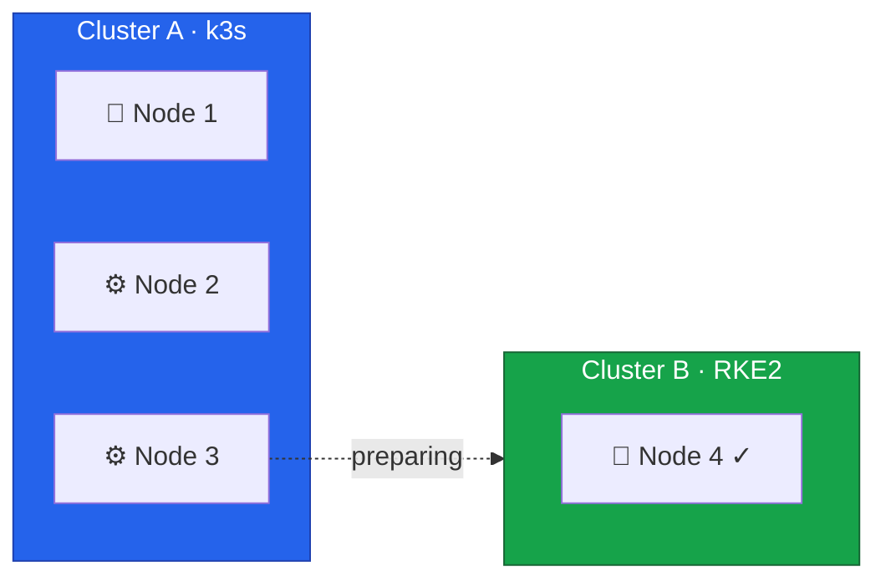

We're entering the critical phase of the migration.
In this lesson, we'll prepare Node 3 for migration from Cluster A (k3s) to Cluster B (RKE2).



## Current State



## Understanding the Drain Process

When you drain a node, Kubernetes evicts all pods and marks the node as unschedulable.
Pods managed by controllers (Deployments, StatefulSets, DaemonSets) will be recreated on other nodes.
Standalone pods without controllers will be deleted permanently.

Before draining, you need to understand:

- Which workloads are running on Node 3
- Whether remaining nodes have capacity for those workloads
- Which pods have local storage that won't migrate automatically
- What Pod Disruption Budgets might block the drain

## Analyzing Workloads

Every cluster is different.
The workloads running on your Node 3 will depend on your specific applications, scheduling constraints, and how pods were distributed.
The commands below provide general guidance for discovering what needs attention before draining.

### Pods on Node 3

```bash
export KUBECONFIG=/path/to/cluster-a-kubeconfig

kubectl get pods -A -o wide --field-selector spec.nodeName=node3
```

Example output:

```
NAMESPACE     NAME                      READY   STATUS    NODE
default       web-app-7d4b8c6f9-x2k9p   1/1     Running   node3
monitoring    prometheus-0              1/1     Running   node3
kube-system   canal-node3               1/1     Running   node3
```

DaemonSet pods (like `canal`) will be recreated automatically on other nodes.
Application pods need to be rescheduled, which happens automatically if they're managed by a Deployment or StatefulSet.

### Critical Workloads

**StatefulSets** may have ordered shutdown requirements:

```bash
kubectl get statefulsets -A
```

```
NAMESPACE    NAME         READY   AGE
database     postgres     1/1     30d
monitoring   prometheus   1/1     15d
```

If a StatefulSet pod runs on Node 3, it will be recreated on another node.
For databases, verify replication is healthy before proceeding.

**Pods with local storage** won't migrate automatically:

```bash
kubectl get pods -A -o jsonpath='{range .items[*]}{.metadata.namespace}/{.metadata.name}: {.spec.volumes[*].name}{"\n"}{end}' | grep -E "local|hostPath"
```

```
monitoring/prometheus-0: data local-storage config
```

These pods use node-local data that won't follow them to another node.
Back up any important data before draining.

**Pod Disruption Budgets** may block the drain:

```bash
kubectl get pdb -A
```

```
NAMESPACE   NAME         MIN AVAILABLE   MAX UNAVAILABLE   ALLOWED DISRUPTIONS
default     web-app      2               N/A               1
database    postgres     1               N/A               0
```

If `ALLOWED DISRUPTIONS` is 0, the drain will wait or fail.
You may need to temporarily relax the PDB or ensure enough replicas are running elsewhere.

**Single-replica deployments** will cause brief unavailability:

```bash
kubectl get deployments -A -o jsonpath='{range .items[*]}{.metadata.namespace}/{.metadata.name}: {.spec.replicas}{"\n"}{end}' | grep ": 1$"
```

```
default/backend-api: 1
tools/cron-runner: 1
```

These workloads will be unavailable between eviction and rescheduling (typically seconds to minutes).

### Capacity Verification

```bash
kubectl top nodes
```

```
NAME    CPU(cores)   CPU%   MEMORY(bytes)   MEMORY%
node1   450m         11%    2100Mi          26%
node2   380m         9%     1800Mi          22%
node3   520m         13%    2400Mi          30%
```

After draining Node 3, its workloads move to Nodes 1-2.
Verify the remaining nodes have enough headroom (CPU% and MEMORY% should stay below 80% after absorbing Node 3's load).

## Creating Backups

### k3s etcd Backup

```bash
# On Node 1 (k3s control plane)
ssh root@node1

sudo k3s etcd-snapshot save --name pre-node3-migration-$(date +%Y%m%d-%H%M%S)
sudo k3s etcd-snapshot ls
```

### Application Data

For applications with persistent data, create application-level backups:

```bash
# Example: PostgreSQL database
kubectl exec -n <namespace> <pod-name> -- pg_dump -U postgres > backup.sql

# Or use Velero if available
velero backup create pre-migration-backup
```

## Verifying Cluster B Readiness

Before proceeding, confirm Cluster B is ready to receive Node 3:

```bash
export KUBECONFIG=/etc/rancher/rke2/rke2.yaml

kubectl get nodes
kubectl get pods -n kube-system -l k8s-app=canal
```

### Prepare RKE2 Configuration

Save the configuration Node 3 will use when joining Cluster B:

```bash
cat <<'EOF' > /root/node3-rke2-config.yaml
server: https://10.0.0.4:9345
token: <your-token-from-node4>
tls-san:
  - node3
  - node3.k8s.local
  - 10.0.0.3
  - fd00::3
cni: none
node-ip: 10.0.0.3,fd00::3
EOF
```

## Pre-Migration Checklist

### Cluster A Health

- [ ] All nodes are Ready
- [ ] No pods in Error or CrashLoopBackOff state
- [ ] etcd backup created and verified
- [ ] Application backups completed

### Capacity Planning

- [ ] Node 2 has sufficient capacity for Node 3's workloads
- [ ] Pod Disruption Budgets reviewed
- [ ] Single-replica deployments identified and acceptable

### Cluster B Health

- [ ] Node 4 is Ready
- [ ] All system pods running
- [ ] Canal healthy
- [ ] RKE2 config prepared for Node 3

### External Dependencies

- [ ] Rocky Linux installation ready (if reinstalling OS)
- [ ] IPMI/Rescue system access verified
- [ ] Network configuration documented
- [ ] DNS not pointing to Node 3



In the next lesson, we'll drain Node 3 from Cluster A.
