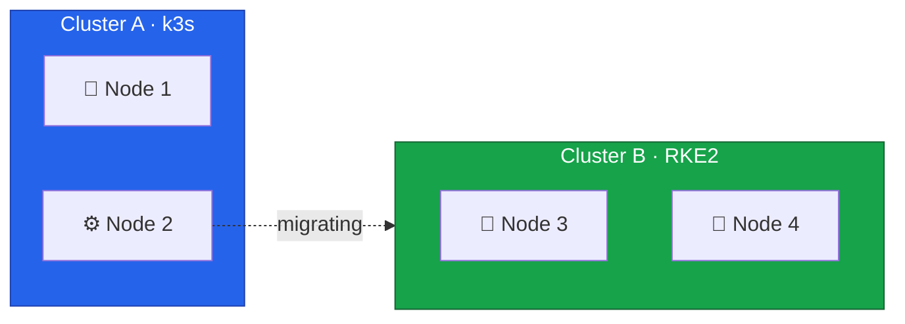
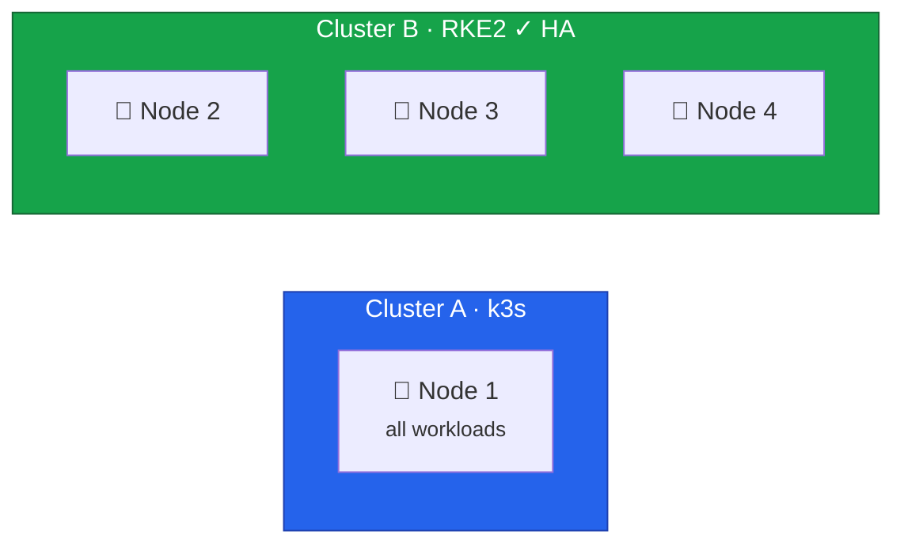

The process for migrating Node 2 is identical to Node 3 — backup, drain, reinstall, join.
This lesson focuses on what's different: the impact on Cluster A capacity, and the significance of reaching 3 control plane nodes for etcd quorum.
Refer to [Lesson 11](/guides/migrating-k3s-to-rke2-without-downtime/lesson-11) for detailed explanations of each step.



## Current State



This migration reduces Cluster A to a single node temporarily, but completes Cluster B's HA setup.

## Understanding etcd Quorum

etcd uses the Raft consensus algorithm, which requires a majority of nodes to agree on any change.
This majority is called quorum.

| Nodes | Quorum Needed | Can Lose | HA Status |
| ----- | ------------- | -------- | --------- |
| 1     | 1             | 0        | None      |
| 2     | 2             | 0        | None      |
| 3     | 2             | 1        | HA        |
| 5     | 3             | 2        | Better HA |

With 2 nodes, losing either one breaks quorum.
With 3 nodes, the cluster continues operating if one node fails.
This is why achieving 3 control planes is a critical milestone.

## Draining Node 2 from Cluster A

### Backup

Create an etcd snapshot before making changes:

```bash
# On Node 1
$ ssh root@node1
$ sudo k3s etcd-snapshot save --name pre-node2-migration-$(date +%Y%m%d-%H%M%S)
```

### Drain and Remove

```bash
$ export KUBECONFIG=/path/to/cluster-a-kubeconfig

$ kubectl cordon node2
$ kubectl drain node2 \
  --ignore-daemonsets \
  --delete-emptydir-data \
  --grace-period=300 \
  --timeout=600s

$ kubectl delete node node2

$ ssh root@node2 "sudo systemctl stop k3s-agent && sudo systemctl disable k3s-agent"
```



## Installing RKE2 on Node 2

### Prepare the OS

1. Install Rocky Linux 10 ([Lesson 5](/guides/migrating-k3s-to-rke2-without-downtime/lesson-5))
2. Configure dual-stack networking with `10.1.0.12` and `fd00::12` ([Lesson 6](/guides/migrating-k3s-to-rke2-without-downtime/lesson-6))
3. Configure firewall ([Lesson 7](/guides/migrating-k3s-to-rke2-without-downtime/lesson-7))

### Install and Configure RKE2

```bash
$ sudo hostnamectl set-hostname node2

$ curl -sfL https://get.rke2.io | sudo sh -
$ sudo systemctl enable rke2-server.service
```

Create the configuration using the same multi-file layout as Node 3 ([Lesson 11](/guides/migrating-k3s-to-rke2-without-downtime/lesson-11)), with Node 2's addresses:

```bash
$ sudo mkdir -p /etc/rancher/rke2/config.yaml.d
```

```yaml
# /etc/rancher/rke2/config.yaml.d/10-network.yaml
cni: canal

node-ip: 10.1.0.12,fd00::12
node-external-ip:
  - 65.109.XX.XX # Node 2's public IPv4
  - 2a01:4f9:XX:XX::2 # Node 2's public IPv6
advertise-address: 10.1.0.12
bind-address: 10.1.0.12

cluster-cidr: 10.42.0.0/16,fd00:42::/56
service-cidr: 10.43.0.0/16,fd00:43::/112
cluster-dns: 10.43.0.10
```

```yaml
# /etc/rancher/rke2/config.yaml.d/20-external-access.yaml
tls-san:
  - node2
  - node2.k8s.local
  - 10.1.0.12
  - fd00::12
  - cluster.yourdomain.com
```

The `00-join.yaml` and `30-security.yaml` files are identical to Node 3 — see [Lesson 11](/guides/migrating-k3s-to-rke2-without-downtime/lesson-11) for their contents.

### Start RKE2

```bash
$ sudo systemctl start rke2-server.service
$ sudo journalctl -u rke2-server -f
```

When Node 2 starts, several things happen in sequence.
The node contacts Node 4's supervisor API on port `9345` and retrieves cluster certificates.
It then joins the etcd cluster as the third member — bringing the cluster to quorum tolerance for the first time.
Canal deploys automatically and establishes WireGuard tunnels to both Node 3 and Node 4.

Unlike the Node 3 join, there should be no WireGuard/VXLAN mismatch here because all existing nodes are already running the WireGuard backend.
If you do see "no route to host" errors, restart the Canal DaemonSet as described in [Lesson 11's troubleshooting section](/guides/migrating-k3s-to-rke2-without-downtime/lesson-11#wireguard--vxlan-backend-mismatch).

## Verification

### Check 3-Node Control Plane

```bash
$ kubectl get nodes -o wide
```

Expected output:

```
NAME    STATUS   ROLES                       AGE   VERSION          INTERNAL-IP
node2   Ready    control-plane,etcd,master   2m    v1.31.x+rke2r1   10.1.0.12,fd00::12
node3   Ready    control-plane,etcd,master   2h    v1.31.x+rke2r1   10.1.0.13,fd00::13
node4   Ready    control-plane,etcd,master   4h    v1.31.x+rke2r1   10.1.0.14,fd00::14
```

### Verify etcd HA

On Node 4, where `etcdctl` is available, check the etcd cluster members to confirm three nodes are present and healthy:

```bash
$ sudo etcdctl member list

xxxx, started, node2-xxxx, https://10.1.0.12:2380, https://10.1.0.12:2379, false
yyyy, started, node3-xxxx, https://10.1.0.13:2380, https://10.1.0.13:2379, false
zzzz, started, node4-xxxx, https://10.1.0.14:2380, https://10.1.0.14:2379, true
```

Check cluster health:

```bash
$ sudo etcdctl endpoint health --cluster
```

All 3 endpoints should be healthy, with one showing as leader.

### Verify Canal and WireGuard

Verify that Canal shows 3 pods (`kubectl get pods -n kube-system -l k8s-app=canal -o wide`) and that `wg show flannel-wg` on Node 2 shows two peers — one for Node 3 and one for Node 4.
With 3 nodes, the WireGuard mesh forms a full triangle where each node maintains a direct encrypted tunnel to every other node.
See [Lesson 11](/guides/migrating-k3s-to-rke2-without-downtime/lesson-11) for expected output and troubleshooting.

## Preparing Longhorn Storage

Run the same `longhornctl` preflight process on Node 2 as described in [Lesson 11](/guides/migrating-k3s-to-rke2-without-downtime/lesson-11).
Once complete, verify that Longhorn recognizes all three nodes:

```bash
$ kubectl get nodes.longhorn.io -n longhorn-system
NAME    READY   ALLOWSCHEDULING   SCHEDULABLE   AGE
node2   True    true              True          2m
node3   True    true              True          2h
node4   True    true              True          4h
```

With a third storage node available, Longhorn can now maintain 2 replicas of each volume across different nodes.
If you set `defaultReplicaCount` to `1` during initial setup, consider increasing it to `2` now that multiple nodes are available.

## Current State



Cluster B now has 3 control plane nodes with full HA.
The cluster can tolerate one node failure while maintaining quorum.

With the control plane complete, we can proceed to verify the cluster's HA capabilities in detail.
