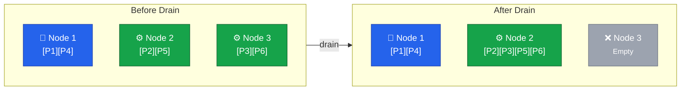
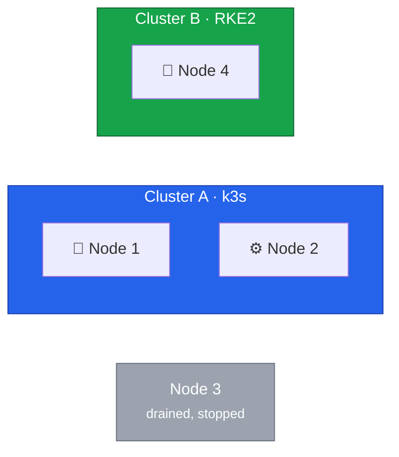

This lesson covers the critical 2-node transition phase.
We will drain Node 3 from Cluster A and prepare it for migration to Cluster B.





## Understanding the Drain Process

When draining a node, Kubernetes performs three steps:

1. **Cordon** - marks the node as unschedulable so no new pods land on it
2. **Evict** - sends termination signals to all pods, respecting Pod Disruption Budgets
3. **Reschedule** - controllers recreate evicted pods on remaining nodes



DaemonSet pods are a special case.
The `--ignore-daemonsets` flag tells the drain to skip them since they're meant to run on every node and will be cleaned up when the node is removed.

## Pre-Drain Verification

```bash
export KUBECONFIG=/path/to/cluster-a-kubeconfig

# Verify all nodes are Ready
kubectl get nodes

# Check for problematic pods (should be empty or only show Completed jobs)
kubectl get pods -A | grep -v Running | grep -v Completed

# Verify PDBs won't block the drain
kubectl get pdb -A
```

## Executing the Drain

### Cordon the Node

Mark Node 3 as unschedulable:

```bash
kubectl cordon node3
kubectl get nodes
```

Expected output shows `SchedulingDisabled`:

```
NAME    STATUS                     ROLES    AGE   VERSION
node1   Ready                      master   30d   v1.28.5+k3s1
node2   Ready                      <none>   30d   v1.28.5+k3s1
node3   Ready,SchedulingDisabled   <none>   30d   v1.28.5+k3s1
```

### Monitor the Drain

In a separate terminal, watch for pod transitions:

```bash
watch -n 2 'kubectl get pods -A -o wide | grep -E "node3|Terminating|Pending|ContainerCreating"'
```

### Drain the Node

```bash
kubectl drain node3 \
  --ignore-daemonsets \
  --delete-emptydir-data \
  --grace-period=300 \
  --timeout=600s
```

| Flag                     | Purpose                                                |
| ------------------------ | ------------------------------------------------------ |
| `--ignore-daemonsets`    | Skip DaemonSet pods (they'll be removed with the node) |
| `--delete-emptydir-data` | Allow eviction of pods using emptyDir volumes          |
| `--grace-period=300`     | Give pods 5 minutes to shut down gracefully            |
| `--timeout=600s`         | Fail if drain doesn't complete in 10 minutes           |

### Handling Blocked Drains

**PDB blocking eviction:**

```bash
# Check which PDB is blocking
kubectl get pdb -A

# If safe, temporarily reduce the minimum (restore after drain!)
kubectl patch pdb <name> -n <namespace> -p '{"spec":{"minAvailable":0}}'
```

**Stuck terminating pods:**

```bash
# Find stuck pods
kubectl get pods -A --field-selector spec.nodeName=node3 | grep Terminating

# Force delete if necessary (may lose in-flight data)
kubectl delete pod <pod-name> -n <namespace> --grace-period=0 --force
```

**Local storage preventing eviction:**

Pods with hostPath or local-path-provisioner volumes may block the drain.
Back up any important data, then use `--force` or delete the pod manually.

## Removing Node 3

### Verify Drain Success

```bash
# Should show only DaemonSet pods or be empty
kubectl get pods -A -o wide --field-selector spec.nodeName=node3

# Verify workloads are running elsewhere
kubectl get pods -A | grep -v Running | grep -v Completed
```

### Delete from Cluster

```bash
kubectl delete node node3
kubectl get nodes
```

### Stop k3s on Node 3

```bash
ssh root@node3

sudo systemctl stop k3s-agent
sudo systemctl disable k3s-agent
```

## Verification

### Cluster A Stability

```bash
# Check remaining nodes
kubectl get nodes

# Verify all pods are running
kubectl get pods -A | grep -v Running | grep -v Completed

# Check resource pressure
kubectl top nodes
```

### Current State



## Rollback Procedure

If issues arise and you need Node 3 back in Cluster A:

```bash
# On Node 3
ssh root@node3
sudo systemctl start k3s-agent

# On your workstation (may need to wait for node to rejoin)
kubectl get nodes
kubectl uncordon node3
```



In the next lesson, we'll install Rocky Linux 10 and RKE2 on Node 3, joining it to Cluster B as the second control plane.
