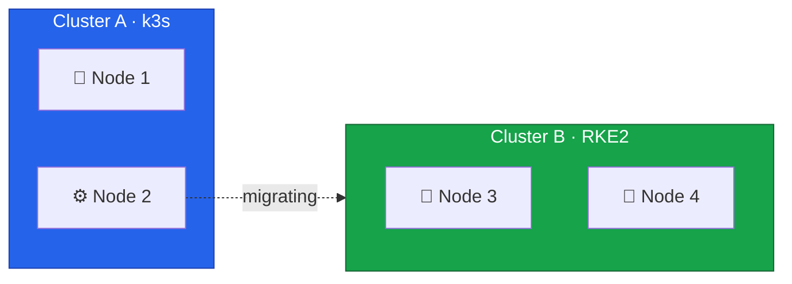
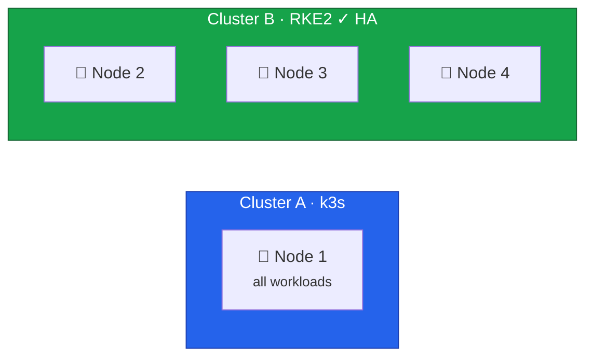

Node 2 follows the same migration path as Node 3 — backup, drain, reinstall, join.
Rather than repeating every step in detail, this lesson focuses on what changes: the impact on Cluster A's remaining capacity, the configuration values specific to Node 2, and the significance of reaching three control plane nodes for etcd quorum.
Refer to Lesson 11 for full explanations of each stage.



## Current State



Cluster A currently holds two nodes, with Node 1 as the control plane and Node 2 as a worker.
Moving Node 2 out reduces Cluster A to a single node temporarily, but brings Cluster B to its full three-node high-availability configuration.

## Understanding etcd Quorum

etcd uses the Raft consensus algorithm, which requires a majority of members to agree on any state change.
This majority is called quorum.

| Nodes | Quorum Needed | Can Lose | HA Status |
| ----- | ------------- | -------- | --------- |
| 1     | 1             | 0        | None      |
| 2     | 2             | 0        | None      |
| 3     | 2             | 1        | HA        |
| 5     | 3             | 2        | Better HA |

With only two nodes, losing either one breaks quorum — the cluster becomes read-only and eventually stops serving requests entirely.
With three nodes, one can fail while the remaining two still form a majority and continue operating normally.
This is why reaching three control plane nodes is the critical milestone for production readiness.

## Draining Node 2 from Cluster A

### Backup

Create an etcd snapshot on the k3s control plane before making any changes:

```bash
# On Node 1
$ ssh root@node1
$ sudo k3s etcd-snapshot save --name pre-node2-migration-$(date +%Y%m%d-%H%M%S)
```

### Drain and Remove

Cordon, drain, and delete Node 2 from the k3s cluster, then stop the agent service:

```bash
$ export KUBECONFIG=/path/to/cluster-a-kubeconfig

$ kubectl cordon node2
$ kubectl drain node2 \
  --ignore-daemonsets \
  --delete-emptydir-data \
  --grace-period=300 \
  --timeout=600s

$ kubectl delete node node2

$ ssh root@node2 "sudo systemctl stop k3s-agent && sudo systemctl disable k3s-agent"
```

See [Lesson 11](/guides/migrating-k3s-to-rke2-without-downtime/lesson-11) for an explanation of each flag and how to handle blocked drains.



## Installing RKE2 on Node 2

### Preparing the OS

The OS preparation follows the same process used for Node 3 in [Lesson 11](/guides/migrating-k3s-to-rke2-without-downtime/lesson-11) — install Rocky Linux 10, configure dual-stack networking with `10.1.0.12` and `fd00::12`, and set up the Hetzner firewall.

### Installing and Configuring RKE2

Set the hostname and install RKE2:

```bash
$ sudo hostnamectl set-hostname node2

$ curl -sfL https://get.rke2.io | sudo sh -
$ sudo systemctl enable rke2-server.service
```

Create the configuration directory using the same multi-file layout as Nodes 3 and 4:

```bash
$ sudo mkdir -p /etc/rancher/rke2/config.yaml.d
```

The network configuration mirrors the other nodes with Node 2's addresses:

```yaml
# /etc/rancher/rke2/config.yaml.d/10-network.yaml
cni: canal

node-ip: 10.1.0.12,fd00::12
node-external-ip:
  - 65.109.XX.XX # Node 2's public IPv4
  - 2a01:4f9:XX:XX::2 # Node 2's public IPv6
advertise-address: 10.1.0.12
bind-address: 10.1.0.12

cluster-cidr: 10.42.0.0/16,fd00:42::/56
service-cidr: 10.43.0.0/16,fd00:43::/112
cluster-dns: 10.43.0.10
```

The external access configuration adds Node 2's names and IPs to the API server certificate:

```yaml
# /etc/rancher/rke2/config.yaml.d/20-external-access.yaml
tls-san:
  - node2
  - node2.k8s.local
  - 10.1.0.12
  - fd00::12
  - cluster.yourdomain.com
```

The `00-join.yaml`, `30-security.yaml`, `40-authentication.yaml`, and `auth-config.yaml` files are identical to Node 3 — see [Lesson 11](/guides/migrating-k3s-to-rke2-without-downtime/lesson-11) for their contents.

### Starting RKE2

```bash
$ sudo systemctl start rke2-server.service
$ sudo journalctl -u rke2-server -f
```

When Node 2 starts, several things happen in sequence.
The node contacts Node 4's supervisor API on port `9345` and retrieves cluster certificates.
It then joins the etcd cluster as the third member — bringing the cluster to quorum tolerance for the first time.
Canal deploys automatically and establishes WireGuard tunnels to both Node 3 and Node 4.

Unlike the Node 3 join in Lesson 11, there should be no WireGuard/VXLAN backend mismatch because all existing nodes are already running the WireGuard backend.
If we do see "no route to host" errors, restart the Canal DaemonSet as described in [Lesson 11's troubleshooting section](/guides/migrating-k3s-to-rke2-without-downtime/lesson-11#wireguard--vxlan-backend-mismatch).

## Verification

### Three-Node Control Plane

All three nodes should appear with `Ready` status and the `control-plane,etcd,master` roles:

```bash
$ kubectl get nodes -o wide
NAME    STATUS   ROLES                AGE     VERSION          INTERNAL-IP   EXTERNAL-IP      OS-IMAGE                        KERNEL-VERSION                  CONTAINER-RUNTIME
node2   Ready    control-plane,etcd   2m56s   v1.34.4+rke2r1   10.1.0.12     135.181.XX.XX    Rocky Linux 10.1 (Red Quartz)   6.12.0-124.27.1.el10_1.x86_64   containerd://2.1.5-k3s1
node3   Ready    control-plane,etcd   4d2h    v1.34.3+rke2r3   10.1.0.13     37.27.XX.XX      Rocky Linux 10.1 (Red Quartz)   6.12.0-124.27.1.el10_1.x86_64   containerd://2.1.5-k3s1
node4   Ready    control-plane,etcd   4d23h   v1.34.3+rke2r3   10.1.0.14     135.181.XX.XX    Rocky Linux 10.1 (Red Quartz)   6.12.0-124.27.1.el10_1.x86_64   containerd://2.1.5-k3s1
```

### etcd Health

On Node 4, where `etcdctl` is available, verify that all three members are present and started:

```bash
$ sudo etcdctl member list
xxxx, started, node2-xxxx, https://10.1.0.12:2380, https://10.1.0.12:2379, false
yyyy, started, node3-xxxx, https://10.1.0.13:2380, https://10.1.0.13:2379, false
zzzz, started, node4-xxxx, https://10.1.0.14:2380, https://10.1.0.14:2379, false
```

The last column is the learner flag — `false` means the member is a full voting participant.
We can also check cluster health to confirm all endpoints are responsive:

```bash
$ sudo etcdctl endpoint health --cluster
https://10.1.0.14:2379 is healthy: successfully committed proposal: took = 2.961089ms
https://10.1.0.12:2379 is healthy: successfully committed proposal: took = 4.425593ms
https://10.1.0.13:2379 is healthy: successfully committed proposal: took = 14.330272ms
```

All three endpoints should report as healthy, with one identified as the leader.

### Canal and WireGuard

Verify that Canal has deployed a pod on each node:

```bash
$ kubectl get pods -n kube-system -l k8s-app=canal -o wide
NAME               READY   STATUS    RESTARTS   AGE     IP          NODE    NOMINATED NODE   READINESS GATES
rke2-canal-6qrrc   2/2     Running   0          4d1h    10.1.0.14   node4   <none>           <none>
rke2-canal-ntzcl   2/2     Running   0          4d1h    10.1.0.13   node3   <none>           <none>
rke2-canal-sk6np   2/2     Running   0          2m19s   10.1.0.12   node2   <none>           <none>
```

Three pods should appear — one per node, all in `Running` state.

On Node 2, check the WireGuard interface to confirm tunnels to both peers.
The `wg` tool was installed as part of the `wireguard-tools` package during OS setup in [Lesson 11](/guides/migrating-k3s-to-rke2-without-downtime/lesson-11):

```bash
$ sudo wg show flannel-wg
interface: flannel-wg
  public key: <node2-public-key>
  private key: (hidden)
  listening port: 51820

peer: <node3-public-key>
  endpoint: 37.27.XX.XX:51820
  allowed ips: 10.42.1.0/24
  latest handshake: 9 seconds ago
  transfer: 483.76 KiB received, 489.66 KiB sent

peer: <node4-public-key>
  endpoint: 135.181.XX.XX:51820
  allowed ips: 10.42.0.0/24
  latest handshake: 18 seconds ago
  transfer: 206.08 KiB received, 116.21 KiB sent
```

The output should list two peers — one for Node 3 and one for Node 4 — each with a recent handshake timestamp.
With three nodes, the WireGuard mesh forms a full triangle where each node maintains a direct encrypted tunnel to every other node.
See [Lesson 11](/guides/migrating-k3s-to-rke2-without-downtime/lesson-11) for expected output format and troubleshooting.

## Preparing Longhorn Storage

Longhorn is already running on the cluster, but each new node needs system-level dependencies — iSCSI for block storage and NFSv4 for RWX volumes — before Longhorn can schedule replicas on it.
See [Lesson 7](/guides/migrating-k3s-to-rke2-without-downtime/lesson-7) for a detailed walkthrough of what each dependency does and how to troubleshoot failures.

Install `longhornctl` and run the preflight installer on Node 2:

```bash
$ curl -fL -o /usr/local/bin/longhornctl \
    https://github.com/longhorn/cli/releases/download/v1.11.0/longhornctl-linux-amd64
$ chmod +x /usr/local/bin/longhornctl

$ /usr/local/bin/longhornctl --kubeconfig /etc/rancher/rke2/rke2.yaml install preflight
INFO[2026-02-20T00:37:54+02:00] Initializing preflight installer
INFO[2026-02-20T00:37:54+02:00] Cleaning up preflight installer
INFO[2026-02-20T00:37:54+02:00] Running preflight installer
INFO[2026-02-20T00:37:54+02:00] Installing dependencies with package manager
INFO[2026-02-20T00:38:44+02:00] Installed dependencies with package manager
INFO[2026-02-20T00:38:44+02:00] Retrieved preflight installer result:
node4:
  info:
  - Successfully probed module nfs
  - Successfully probed module iscsi_tcp
  - Successfully probed module dm_crypt
  - Successfully started service iscsid
node2:
  info:
  - Successfully installed package nfs-utils
  - Successfully installed package iscsi-initiator-utils
  - Successfully probed module nfs
  - Successfully probed module iscsi_tcp
  - Successfully probed module dm_crypt
  - Successfully started service iscsid
node3:
  info:
  - Successfully probed module nfs
  - Successfully probed module iscsi_tcp
  - Successfully probed module dm_crypt
  - Successfully started service iscsid
INFO[2026-02-20T00:38:44+02:00] Cleaning up preflight installer
INFO[2026-02-20T00:38:44+02:00] Completed preflight installer. Use 'longhornctl check preflight' to check the result (on some os a reboot and a new install execution is required first)
```

Run the preflight check to confirm all dependencies are in place:

```bash
$ /usr/local/bin/longhornctl --kubeconfig /etc/rancher/rke2/rke2.yaml check preflight
INFO[2026-02-20T00:40:41+02:00] Initializing preflight checker
INFO[2026-02-20T00:40:41+02:00] Cleaning up preflight checker
INFO[2026-02-20T00:40:41+02:00] Running preflight checker
INFO[2026-02-20T00:40:44+02:00] Retrieved preflight checker result:
node4:
  info:
  - '[KubeDNS] Kube DNS "rke2-coredns-rke2-coredns" is set with 2 replicas and 2 ready replicas'
  - '[IscsidService] Service iscsid is running'
  - '[MultipathService] multipathd.service is not found (exit code: 4)'
  - '[MultipathService] multipathd.socket is not found (exit code: 4)'
  - '[NFSv4] NFS4 is supported'
  - '[Packages] nfs-utils is installed'
  - '[Packages] iscsi-initiator-utils is installed'
  - '[Packages] cryptsetup is installed'
  - '[Packages] device-mapper is installed'
  - '[KernelModules] nfs is loaded'
  - '[KernelModules] iscsi_tcp is loaded'
  - '[KernelModules] dm_crypt is loaded'
node2:
  info:
  - '[KubeDNS] Kube DNS "rke2-coredns-rke2-coredns" is set with 2 replicas and 2 ready replicas'
  - '[IscsidService] Service iscsid is running'
  - '[MultipathService] multipathd.service is not found (exit code: 4)'
  - '[MultipathService] multipathd.socket is not found (exit code: 4)'
  - '[NFSv4] NFS4 is supported'
  - '[Packages] nfs-utils is installed'
  - '[Packages] iscsi-initiator-utils is installed'
  - '[Packages] cryptsetup is installed'
  - '[Packages] device-mapper is installed'
  - '[KernelModules] nfs is loaded'
  - '[KernelModules] iscsi_tcp is loaded'
  - '[KernelModules] dm_crypt is loaded'
node3:
  info:
  - '[KubeDNS] Kube DNS "rke2-coredns-rke2-coredns" is set with 2 replicas and 2 ready replicas'
  - '[IscsidService] Service iscsid is running'
  - '[MultipathService] multipathd.service is not found (exit code: 4)'
  - '[MultipathService] multipathd.socket is not found (exit code: 4)'
  - '[NFSv4] NFS4 is supported'
  - '[Packages] nfs-utils is installed'
  - '[Packages] iscsi-initiator-utils is installed'
  - '[Packages] cryptsetup is installed'
  - '[Packages] device-mapper is installed'
  - '[KernelModules] nfs is loaded'
  - '[KernelModules] iscsi_tcp is loaded'
  - '[KernelModules] dm_crypt is loaded'
INFO[2026-02-20T00:40:44+02:00] Cleaning up preflight checker
INFO[2026-02-20T00:40:44+02:00] Completed preflight checker
```

The check should report no errors for Node 2.
Once the preflight passes, verify that Longhorn recognizes all three nodes as schedulable:

```bash
$ kubectl get nodes.longhorn.io -n longhorn-system
NAME    READY   ALLOWSCHEDULING   SCHEDULABLE   AGE
node2   True    true              True          2m
node3   True    true              True          2h
node4   True    true              True          4h
```

With three storage nodes available, Longhorn can now replicate volumes across different nodes for redundancy.
We set `defaultReplicaCount` to `1` in Lesson 7 because only a single node existed at the time.
Now we update the Longhorn `HelmChart` manifest to increase the replica count to `2`:

```yaml
# /var/lib/rancher/rke2/server/manifests/longhorn.yaml
apiVersion: helm.cattle.io/v1
kind: HelmChart
metadata:
  name: longhorn
  namespace: kube-system
spec:
  repo: https://charts.longhorn.io
  chart: longhorn
  version: "1.11.0"
  targetNamespace: longhorn-system
  valuesContent: |-
    defaultSettings:
      defaultReplicaCount: 2
      storageMinimalAvailablePercentage: 15
      defaultDataLocality: "best-effort"
      nodeDrainPolicy: "block-if-contains-last-replica"
      guaranteedEngineManagerCPU: 12
      guaranteedReplicaManagerCPU: 12
    persistence:
      defaultClass: false
      defaultClassReplicaCount: 1
      reclaimPolicy: Delete
    ingress:
      enabled: false
```

RKE2's Helm controller detects the change and upgrades the release automatically.
New volumes will now be created with two replicas — one on the node running the workload and one on a different node for redundancy.
Existing single-replica volumes are not affected; increase their replica count individually through the Longhorn UI or API if needed.

## Resulting Cluster State



Cluster B now has three control plane nodes with full high availability.
The cluster can tolerate one node failure while maintaining etcd quorum and continuing to serve requests.
