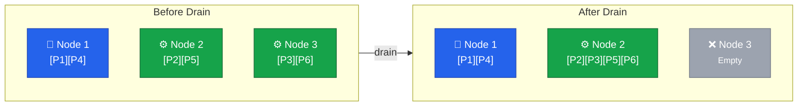
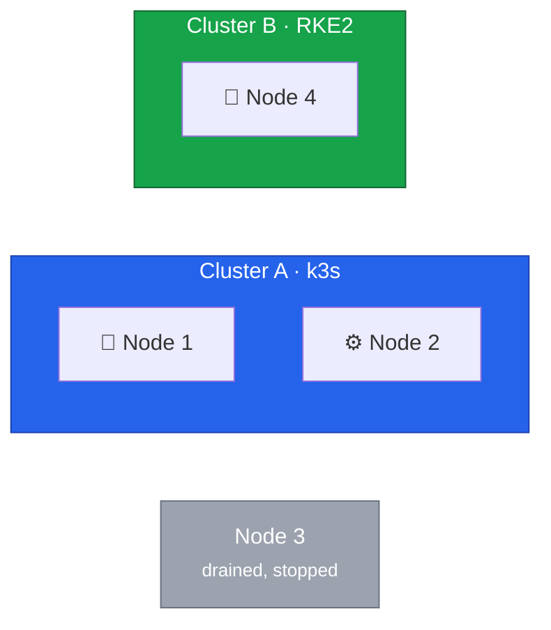

This lesson covers the critical 2-node transition phase. We will drain Node 3 from Cluster A and prepare it for
migration to Cluster B.





## Understanding the Drain Process

When we drain a node, Kubernetes:

1. **Cordons** the node (marks it unschedulable)
2. **Evicts** all pods (respecting PDBs)
3. **Reschedules** pods on remaining nodes



## Pre-Drain Verification

### Final Health Check

```bash
# Connect to Cluster A
export KUBECONFIG=/path/to/cluster-a-kubeconfig

# Verify all nodes are Ready
kubectl get nodes

# Check for problematic pods
kubectl get pods -A | grep -v Running | grep -v Completed

# Verify PDBs won't block the drain
kubectl get pdb -A
```

### Record Current State

```bash
# Save current pod distribution
kubectl get pods -A -o wide > /root/pre-drain-pods.txt

# Save node status
kubectl get nodes -o yaml > /root/pre-drain-nodes.yaml

# Save events
kubectl get events -A --sort-by='.lastTimestamp' > /root/pre-drain-events.txt
```

## Cordon Node 3

First, mark Node 3 as unschedulable to prevent new pods from being scheduled:

```bash
# Cordon the node
kubectl cordon node3

# Verify
kubectl get nodes

# Expected output:
# NAME    STATUS                     ROLES    AGE   VERSION
# node1   Ready                      master   ...   ...
# node2   Ready                      <none>   ...   ...
# node3   Ready,SchedulingDisabled   <none>   ...   ...
```

## Monitor During Drain

Open a separate terminal to monitor the drain process:

```bash
# Terminal 2: Watch pod status
watch -n 2 'kubectl get pods -A -o wide | grep -E "Terminating|Pending|ContainerCreating"'

# Terminal 3: Watch node status
watch -n 2 'kubectl get nodes'

# Terminal 4: Watch events
kubectl get events -A --watch
```

## Execute the Drain

Now drain the node:

```bash
# Drain with safeguards
kubectl drain node3 \
  --ignore-daemonsets \
  --delete-emptydir-data \
  --grace-period=300 \
  --timeout=600s

# Explanation:
# --ignore-daemonsets: DaemonSet pods will be recreated on other nodes
# --delete-emptydir-data: Allow eviction of pods using emptyDir
# --grace-period=300: Give pods 5 minutes to shut down gracefully
# --timeout=600s: Fail if drain doesn't complete in 10 minutes
```

### Handling Drain Issues

If the drain is blocked:

#### PDB Blocking Eviction

```bash
# Check which PDB is blocking
kubectl get pdb -A

# Temporarily adjust PDB if safe (be careful!)
# kubectl patch pdb <name> -n <namespace> -p '{"spec":{"minAvailable":0}}'

# Or force drain (DANGEROUS - may cause downtime)
# kubectl drain node3 --ignore-daemonsets --delete-emptydir-data --force
```

#### Stuck Terminating Pods

```bash
# Find stuck pods
kubectl get pods -A --field-selector spec.nodeName=node3 | grep Terminating

# Force delete if necessary (data may be lost!)
# kubectl delete pod <pod-name> -n <namespace> --grace-period=0 --force
```

#### Local Storage Issues

```bash
# Find pods with local storage
kubectl get pods -A -o wide --field-selector spec.nodeName=node3

# For pods using local-path-provisioner or hostPath:
# 1. Backup the data first
# 2. Use --force or handle the PVC migration separately
```

## Verify Drain Success

```bash
# Check no pods remain on Node 3 (except DaemonSets)
kubectl get pods -A -o wide --field-selector spec.nodeName=node3

# Verify workloads are running on other nodes
kubectl get pods -A | grep -v Running | grep -v Completed

# Check node status
kubectl get nodes
```

## Remove Node from k3s Cluster

Once drained, remove Node 3 from the cluster:

```bash
# Delete the node from cluster
kubectl delete node node3

# Verify
kubectl get nodes

# Expected: Only node1 and node2 remain
```

## On Node 3: Stop k3s

SSH to Node 3 and stop the k3s agent:

```bash
# SSH to Node 3
ssh root@node3

# Stop k3s agent
systemctl stop k3s-agent

# Disable k3s agent
systemctl disable k3s-agent

# Verify
systemctl status k3s-agent
```

## Verify Cluster A Stability

Before proceeding with the OS reinstall, verify Cluster A is stable:

```bash
# Back on your workstation, connected to Cluster A

# Check node status
kubectl get nodes

# Expected:
# NAME    STATUS   ROLES    AGE   VERSION
# node1   Ready    master   ...   ...
# node2   Ready    <none>   ...   ...

# Check all pods are running
kubectl get pods -A | grep -v Running | grep -v Completed

# Check for any resource pressure
kubectl describe nodes | grep -A 5 "Allocated resources"

# Verify critical services are responding
# (Test your actual services here)
```

## Current State

After successful drain:



Node 3 is drained, stopped, and ready for OS reinstall.

## Document the Transition

```bash
# Record the transition
cat <<EOF >> /root/migration-log.txt
=== Node 3 Drain Complete ===
Timestamp: $(date)
Cluster A nodes: $(kubectl get nodes -o jsonpath='{.items[*].metadata.name}')
Pod count: $(kubectl get pods -A --no-headers | wc -l)
Pods not Running: $(kubectl get pods -A --no-headers | grep -v Running | grep -v Completed | wc -l)
EOF
```

## Rollback Point

If issues arise at this stage:

```bash
# Rollback procedure:

# 1. On Node 3, restart k3s agent
ssh root@node3 "systemctl start k3s-agent"

# 2. Wait for node to rejoin (may need token)
kubectl get nodes

# 3. Uncordon if needed
kubectl uncordon node3

# 4. Verify workloads redistribute
kubectl get pods -A -o wide
```

## Ready for OS Installation

Node 3 is now:

- Drained of all pods
- Removed from Cluster A
- k3s agent stopped
- Ready for Rocky Linux installation

In the next lesson, we'll install Rocky Linux 10 and RKE2 on Node 3, joining it to Cluster B as the second control
plane node.


