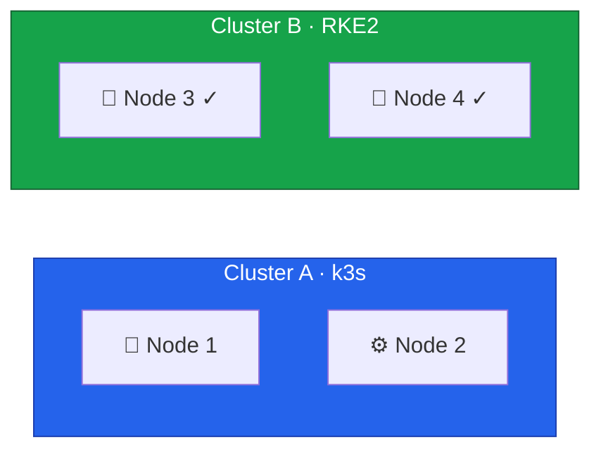

With Node 3 drained and removed from Cluster A, we'll install Rocky Linux 10 and configure it as an RKE2 control plane node to join Cluster B.



## Understanding Cluster Joins

When a new node joins an existing RKE2 cluster, it differs from bootstrapping the first node:

| Aspect | First Node (Bootstrap)   | Additional Nodes (Join)     |
| ------ | ------------------------ | --------------------------- |
| Config | Defines cluster settings | References existing cluster |
| etcd   | Creates new cluster      | Joins existing cluster      |
| Certs  | Generates CA             | Receives certs from server  |
| State  | Empty                    | Syncs from existing nodes   |

The key configuration difference is the `server` directive, which tells RKE2 where to find the existing cluster.

## Preparing Node 3

Follow the same setup process as Node 4:

1. Install Rocky Linux 10 using Hetzner Rescue System ([Lesson 5](/guides/migrating-k3s-to-rke2-without-downtime/lesson-5))
2. Configure dual-stack vSwitch networking with `10.0.0.3` and `fd00::3` ([Lesson 6](/guides/migrating-k3s-to-rke2-without-downtime/lesson-6))
3. Configure firewall for control plane ports ([Lesson 7](/guides/migrating-k3s-to-rke2-without-downtime/lesson-7))

After setup, verify connectivity to the existing cluster:

```bash
sudo hostnamectl set-hostname node3

ping -c 3 10.0.0.4
ping6 -c 3 fd00::4
nc -zv 10.0.0.4 9345
```

The last command verifies the RKE2 supervisor port is reachable.

## Installing RKE2

```bash
curl -sfL https://get.rke2.io | sudo sh -
sudo systemctl enable rke2-server.service
```

## Configuring RKE2 to Join

The configuration specifies which cluster to join via the `server` directive:

```bash
sudo mkdir -p /etc/rancher/rke2

# Get the token from Node 4 (/root/rke2-token.txt)
TOKEN="<your-cluster-token>"

sudo tee /etc/rancher/rke2/config.yaml <<EOF
server: https://10.0.0.4:9345
token: ${TOKEN}

tls-san:
  - node3
  - node3.k8s.local
  - 10.0.0.3
  - fd00::3

cni: none
node-ip: 10.0.0.3,fd00::3

cluster-cidr: 10.42.0.0/16,fd00:42::/56
service-cidr: 10.43.0.0/16,fd00:43::/112
cluster-dns: 10.43.0.10
EOF
```

The `cluster-cidr`, `service-cidr`, and `cluster-dns` values must match Node 4's configuration exactly.

## Starting RKE2

```bash
sudo systemctl start rke2-server.service
sudo journalctl -u rke2-server -f
```

The join process takes several minutes as the node:

1. Contacts Node 4's supervisor API
2. Retrieves cluster certificates
3. Joins the etcd cluster as a new member
4. Starts control plane components
5. Syncs existing cluster state

Watch for these log messages indicating success:

```
level=info msg="Starting etcd member..."
level=info msg="etcd member started"
level=info msg="Running kube-apiserver..."
```

## Verification

### Configure kubectl

```bash
mkdir -p ~/.kube
sudo cp /etc/rancher/rke2/rke2.yaml ~/.kube/config
sudo chown $(id -u):$(id -g) ~/.kube/config
echo 'export PATH=$PATH:/var/lib/rancher/rke2/bin' >> ~/.bashrc
export PATH=$PATH:/var/lib/rancher/rke2/bin
```

### Check Nodes

```bash
kubectl get nodes -o wide
```

Expected output showing both nodes with dual-stack IPs:

```
NAME    STATUS   ROLES                       AGE   VERSION          INTERNAL-IP
node3   Ready    control-plane,etcd,master   2m    v1.31.x+rke2r1   10.0.0.3,fd00::3
node4   Ready    control-plane,etcd,master   3h    v1.31.x+rke2r1   10.0.0.4,fd00::4
```

### Check etcd Membership

```bash
sudo /var/lib/rancher/rke2/bin/etcdctl \
  --endpoints=https://127.0.0.1:2379 \
  --cacert=/var/lib/rancher/rke2/server/tls/etcd/server-ca.crt \
  --cert=/var/lib/rancher/rke2/server/tls/etcd/server-client.crt \
  --key=/var/lib/rancher/rke2/server/tls/etcd/server-client.key \
  member list
```

Should show two members:

```
xxxx, started, node3-xxxx, https://10.0.0.3:2380, https://10.0.0.3:2379, false
yyyy, started, node4-xxxx, https://10.0.0.4:2380, https://10.0.0.4:2379, true
```

### Check Cilium

Cilium automatically deploys to new nodes:

```bash
kubectl get pods -n kube-system -l k8s-app=cilium -o wide
cilium status
```

## Current State





## Troubleshooting

### Node Won't Join

```bash
# Check connectivity
ping -c 3 10.0.0.4
nc -zv 10.0.0.4 9345

# Verify token matches Node 4
cat /etc/rancher/rke2/config.yaml | grep token

# Check logs for errors
sudo journalctl -u rke2-server | grep -i error
```

### etcd Issues

```bash
# Check etcd connectivity
nc -zv 10.0.0.4 2380

# Check etcd logs
sudo journalctl -u rke2-server | grep etcd
```

### Certificate Issues

```bash
# Verify certificates exist
ls -la /var/lib/rancher/rke2/server/tls/

# Check CA certificate
openssl x509 -in /var/lib/rancher/rke2/server/tls/server-ca.crt -text -noout | head -20
```

In the next lesson, we'll migrate Node 2 to achieve full HA with 3 control plane nodes.
