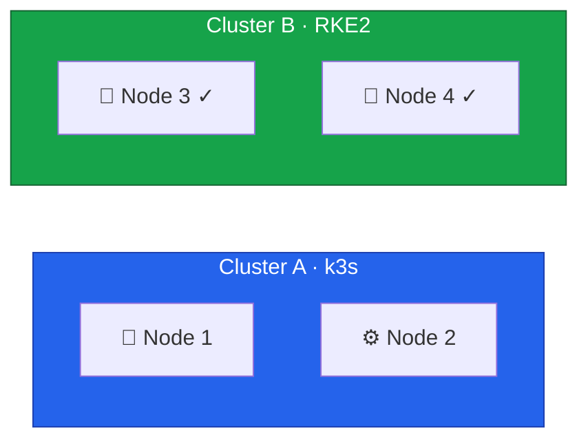

With Node 3 drained and removed from Cluster A, we'll now install Rocky Linux 10 and configure it as an RKE2
control plane node to join Cluster B.



## Prepare Node 3

Follow the same setup process as Node 4:

1. **Install Rocky Linux 10** using Hetzner Rescue System ([Lesson 5](/guides/migrating-k3s-to-rke2-without-downtime/lesson-5))
2. **Configure dual-stack vSwitch networking** with IP `10.1.1.3` and `fd00:1::3` ([Lesson 6](/guides/migrating-k3s-to-rke2-without-downtime/lesson-6))
3. **Configure firewall** for control plane ports ([Lesson 7](/guides/migrating-k3s-to-rke2-without-downtime/lesson-7))

Set the hostname after installation:

```bash
hostnamectl set-hostname node3.k8s.example.com
```

Verify connectivity to the existing cluster node:

```bash
ping -c 3 10.1.1.4    # IPv4
ping6 -c 3 fd00:1::4  # IPv6
```

## Install RKE2

```bash
# Install RKE2
curl -sfL https://get.rke2.io | sh -

# Enable the service
systemctl enable rke2-server.service
```

## Configure RKE2 to Join Cluster B

This is the key difference from Node 4 - we configure Node 3 to join the existing cluster:

```bash
# Create configuration directory
mkdir -p /etc/rancher/rke2

# Get the token from Node 4
# You saved this in /root/rke2-token.txt on Node 4
TOKEN="<your-cluster-token>"

# Create configuration to join the existing cluster
cat <<EOF > /etc/rancher/rke2/config.yaml
# Join existing cluster
server: https://10.1.1.4:9345

# Use the same token as the first node
token: ${TOKEN}

# TLS SANs for this node (include both IPv4 and IPv6)
tls-san:
  - node3
  - node3.k8s.example.com
  - 10.1.1.3
  - fd00:1::3

# Disable CNI (Cilium is already installed)
cni: none

# Dual-stack node IPs
node-ip: 10.1.1.3,fd00:1::3

# Dual-stack cluster configuration (must match Node 4)
cluster-cidr: 10.42.0.0/16,fd00:42::/56
service-cidr: 10.43.0.0/16,fd00:43::/112
cluster-dns: 10.43.0.10
EOF
```

## Start RKE2 Server

```bash
# Start RKE2
systemctl start rke2-server.service

# Watch the startup
journalctl -u rke2-server -f
```

Wait for the node to join the cluster. You should see messages like:

```
level=info msg="Waiting to retrieve agent configuration; server is not ready"
level=info msg="Starting etcd member..."
level=info msg="etcd member started"
level=info msg="Running kube-apiserver..."
```

This process takes a few minutes as the node:

1. Contacts the existing cluster
2. Joins the etcd cluster
3. Starts control plane components
4. Syncs with existing state

## Verify Node Joined

### Check from Node 3

```bash
# Set up kubectl
mkdir -p ~/.kube
cp /etc/rancher/rke2/rke2.yaml ~/.kube/config
chmod 600 ~/.kube/config
export PATH=$PATH:/var/lib/rancher/rke2/bin

# Check nodes
kubectl get nodes -o wide

# Expected output (note both IPs in INTERNAL-IP):
# NAME    STATUS   ROLES                       AGE   VERSION          INTERNAL-IP
# node3   Ready    control-plane,etcd,master   1m    v1.28.x+rke2r1   10.1.1.3,fd00:1::3
# node4   Ready    control-plane,etcd,master   2h    v1.28.x+rke2r1   10.1.1.4,fd00:1::4
```

### Check from Node 4

```bash
# SSH to Node 4
ssh root@node4

# Verify both nodes
kubectl get nodes -o wide
```

## Verify etcd Cluster

The etcd cluster should now have 2 members:

```bash
# On Node 3 or Node 4
/var/lib/rancher/rke2/bin/etcdctl \
  --endpoints=https://127.0.0.1:2379 \
  --cacert=/var/lib/rancher/rke2/server/tls/etcd/server-ca.crt \
  --cert=/var/lib/rancher/rke2/server/tls/etcd/server-client.crt \
  --key=/var/lib/rancher/rke2/server/tls/etcd/server-client.key \
  member list

# Expected output:
# xxxx, started, node3-xxxx, https://10.1.1.3:2380, https://10.1.1.3:2379, false
# yyyy, started, node4-xxxx, https://10.1.1.4:2380, https://10.1.1.4:2379, true

# Check endpoint health
etcdctl endpoint health --cluster

# Both endpoints should be healthy
```

## Verify Cilium

Cilium should automatically deploy to Node 3:

```bash
# Check Cilium pods
kubectl get pods -n kube-system -l k8s-app=cilium

# Should show pods on both nodes:
# NAME           READY   STATUS    RESTARTS   AGE
# cilium-xxxxx   1/1     Running   0          2m    (node3)
# cilium-yyyyy   1/1     Running   0          2h    (node4)

# Check Cilium status
cilium status
```

## Verify System Pods

```bash
# Check all system pods
kubectl get pods -n kube-system -o wide

# All pods should be Running
# CoreDNS, Cilium, and other components should be distributed
```

## Current Cluster State



Cluster B now has 2 control plane nodes but is **not yet HA** (needs 3 for etcd quorum).



## Troubleshooting

### Node Won't Join

```bash
# Check connectivity to Node 4
ping -c 3 10.1.1.4
nc -zv 10.1.1.4 9345

# Verify token matches
cat /etc/rancher/rke2/config.yaml | grep token

# Check RKE2 logs for errors
journalctl -u rke2-server -n 100 | grep -i error
```

### etcd Issues

```bash
# Check etcd logs
journalctl -u rke2-server | grep etcd

# Verify etcd can reach other members
nc -zv 10.1.1.4 2380
```

### Certificate Issues

```bash
# Verify certificates
ls -la /var/lib/rancher/rke2/server/tls/

# Check certificate validity
openssl x509 -in /var/lib/rancher/rke2/server/tls/server-ca.crt -text -noout | head -20
```

## Record Progress

```bash
cat <<EOF >> /root/migration-log.txt
=== Node 3 Joined Cluster B ===
Timestamp: $(date)
Cluster B nodes: $(kubectl get nodes -o jsonpath='{.items[*].metadata.name}')
etcd members: 2
HA Status: Not yet (need 3 members)
EOF
```

In the next lesson, we'll migrate Node 2 to achieve full HA with 3 control plane nodes.
