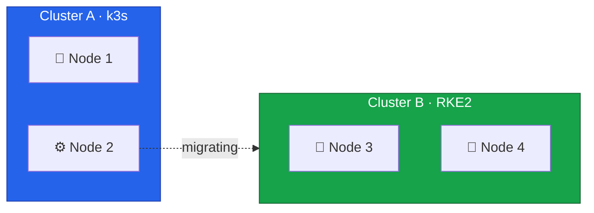
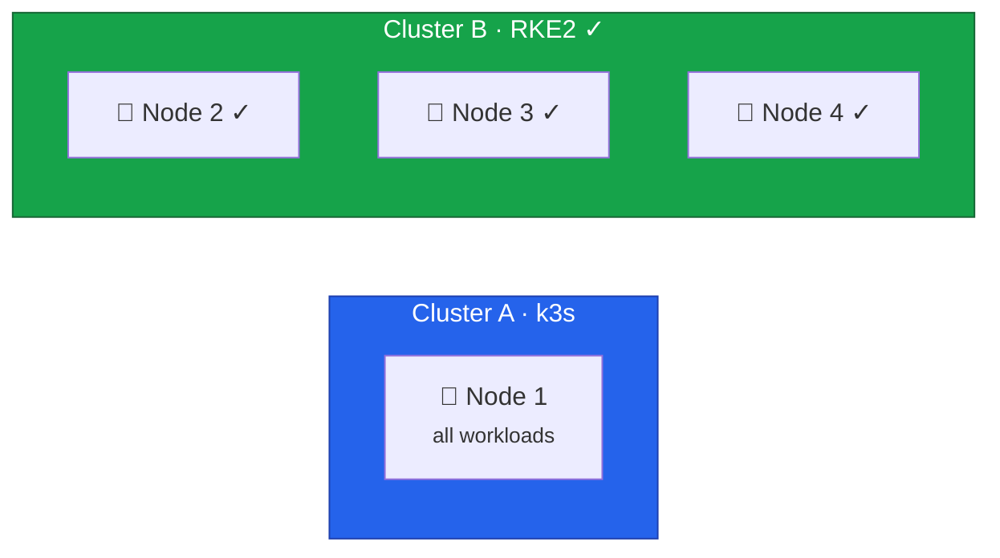

In this lesson, we'll migrate Node 2 from Cluster A to Cluster B. After this migration, Cluster B will have full
high availability with 3 control plane nodes.



## Current State



## Risk Assessment

This migration has moderate risk:

- Cluster A will be reduced to a single node (Node 1 only)
- After completion, Cluster B achieves HA (3 control planes)
- All workloads remain on Cluster A during this process

## Prepare Node 2 for Migration

### Verify Cluster A Can Run on Single Node

```bash
# Connect to Cluster A
export KUBECONFIG=/path/to/cluster-a-kubeconfig

# Check current pod distribution
kubectl get pods -A -o wide

# List pods on Node 2
kubectl get pods -A --field-selector spec.nodeName=node2

# Verify Node 1 can handle remaining workloads
kubectl top node node1
kubectl describe node node1 | grep -A 10 "Allocatable:"
```

### Backup k3s Data

```bash
# On Node 1 (k3s control plane)
ssh root@node1
sudo k3s etcd-snapshot save --name pre-node2-migration-$(date +%Y%m%d-%H%M%S)
```

## Drain and Remove Node 2

### Cordon Node 2

```bash
# Cordon the node
kubectl cordon node2

# Verify
kubectl get nodes
```

### Drain Node 2

```bash
# Drain with same safeguards as Node 3
kubectl drain node2 \
  --ignore-daemonsets \
  --delete-emptydir-data \
  --grace-period=300 \
  --timeout=600s
```

### Verify Workloads Moved to Node 1

```bash
# Check all pods are running on Node 1
kubectl get pods -A -o wide

# Verify no critical pods failed
kubectl get pods -A | grep -v Running | grep -v Completed
```

### Remove Node 2 from k3s

```bash
# Delete node from cluster
kubectl delete node node2

# On Node 2, stop k3s
ssh root@node2 "systemctl stop k3s-agent && systemctl disable k3s-agent"
```

## Cluster A Status

Cluster A is now running on a single node, which makes it vulnerable to failure.



## Install Rocky Linux and RKE2 on Node 2

### Prepare Node 2

Follow the same setup process as previous nodes:

1. **Install Rocky Linux 10** using Hetzner Rescue System ([Lesson 5](/guides/migrating-k3s-to-rke2-without-downtime/lesson-5))
2. **Configure dual-stack vSwitch networking** with IP `10.1.1.2` and `fd00:1::2` ([Lesson 6](/guides/migrating-k3s-to-rke2-without-downtime/lesson-6))
3. **Configure firewall** for control plane ports ([Lesson 7](/guides/migrating-k3s-to-rke2-without-downtime/lesson-7))

Set the hostname after installation:

```bash
hostnamectl set-hostname node2.k8s.example.com
```

Verify connectivity to existing cluster nodes:

```bash
ping -c 3 10.1.1.3    # IPv4 to Node 3
ping -c 3 10.1.1.4    # IPv4 to Node 4
ping6 -c 3 fd00:1::3  # IPv6 to Node 3
ping6 -c 3 fd00:1::4  # IPv6 to Node 4
```

### Install RKE2

```bash
curl -sfL https://get.rke2.io | sh -
systemctl enable rke2-server.service
```

### Configure RKE2 to Join Cluster

```bash
mkdir -p /etc/rancher/rke2

TOKEN="<your-cluster-token>"

cat <<EOF > /etc/rancher/rke2/config.yaml
# Join existing cluster (can use any existing control plane)
server: https://10.1.1.4:9345

token: ${TOKEN}

# TLS SANs for this node (include both IPv4 and IPv6)
tls-san:
  - node2
  - node2.k8s.example.com
  - 10.1.1.2
  - fd00:1::2

cni: none

# Dual-stack node IPs
node-ip: 10.1.1.2,fd00:1::2

# Dual-stack cluster configuration (must match other nodes)
cluster-cidr: 10.42.0.0/16,fd00:42::/56
service-cidr: 10.43.0.0/16,fd00:43::/112
cluster-dns: 10.43.0.10
EOF
```

### Start RKE2

```bash
systemctl start rke2-server.service
journalctl -u rke2-server -f
```

Wait for the node to join. This completes the etcd cluster with 3 members.

## Verify 3-Node Control Plane

### Check Nodes

```bash
mkdir -p ~/.kube
cp /etc/rancher/rke2/rke2.yaml ~/.kube/config
chmod 600 ~/.kube/config
export PATH=$PATH:/var/lib/rancher/rke2/bin

kubectl get nodes -o wide

# Expected output (note both IPs in INTERNAL-IP):
# NAME    STATUS   ROLES                       AGE   VERSION          INTERNAL-IP
# node2   Ready    control-plane,etcd,master   1m    v1.28.x+rke2r1   10.1.1.2,fd00:1::2
# node3   Ready    control-plane,etcd,master   1h    v1.28.x+rke2r1   10.1.1.3,fd00:1::3
# node4   Ready    control-plane,etcd,master   3h    v1.28.x+rke2r1   10.1.1.4,fd00:1::4
```

### Verify etcd HA

```bash
# Check etcd member list
etcdctl member list

# Expected: 3 members
# xxxx, started, node2-xxxx, https://10.1.1.2:2380, https://10.1.1.2:2379, false
# yyyy, started, node3-xxxx, https://10.1.1.3:2380, https://10.1.1.3:2379, false
# zzzz, started, node4-xxxx, https://10.1.1.4:2380, https://10.1.1.4:2379, true

# Check cluster health
etcdctl endpoint health --cluster

# All 3 endpoints should be healthy
```

### Verify HA Capability

With 3 etcd members, the cluster can tolerate 1 node failure:

```bash
# Formula: (n/2)+1 for quorum
# 3 nodes: need 2 for quorum (can lose 1)
# 2 nodes: need 2 for quorum (can lose 0) - not HA!
# 1 node: need 1 for quorum (can lose 0) - single point of failure

# Check leader
etcdctl endpoint status --cluster --write-out=table
```

### Verify Cilium

```bash
kubectl get pods -n kube-system -l k8s-app=cilium -o wide

# Should show 3 Cilium pods, one per node
cilium status
```

## Current State



Cluster A has 1 node (minimal) while Cluster B now has **3 nodes with full HA**.

## Critical Milestone Achieved

Cluster B now has:

- **3 control plane nodes** - full high availability
- **3 etcd members** - can tolerate 1 node failure
- **Cilium networking** - running on all nodes
- **Ready for workloads** - can accept production traffic

This is the point where Cluster B becomes production-ready.

## Record Progress

```bash
cat <<EOF >> /root/migration-log.txt
=== Cluster B Achieved HA ===
Timestamp: $(date)
Cluster B nodes: $(kubectl get nodes -o jsonpath='{.items[*].metadata.name}')
etcd members: 3
HA Status: FULL - can tolerate 1 node failure
Ready for workload migration: YES
EOF
```

## Next Steps

With Cluster B now fully HA, we can safely:

1. Set up storage (Longhorn + local-path)
2. Configure ingress (Traefik + Hetzner LB)
3. Migrate workloads from Cluster A
4. Switch DNS to Cluster B
5. Decommission Cluster A

In the next lesson, we'll verify the complete 3-node control plane setup before proceeding with workload migration.
