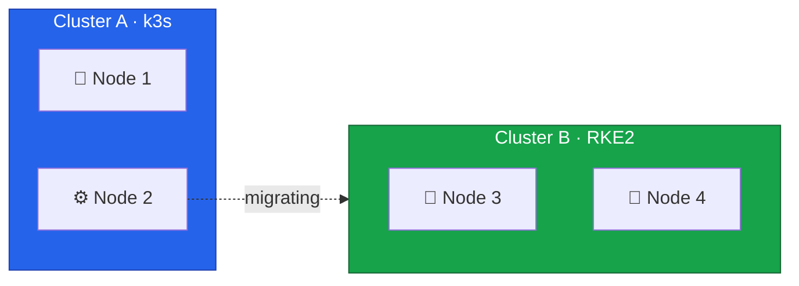
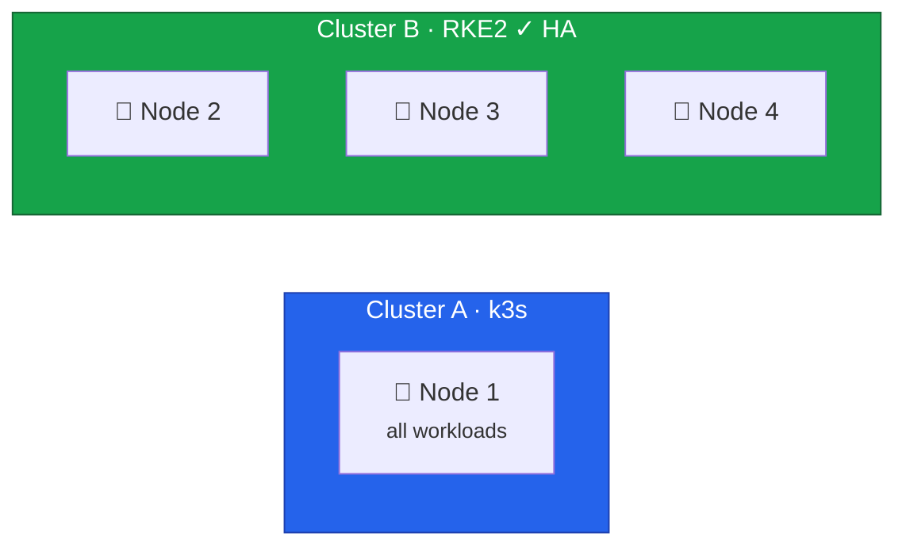

In this lesson, we'll migrate Node 2 from Cluster A to Cluster B.
After this migration, Cluster B will have full high availability with 3 control plane nodes.



## Current State



This migration reduces Cluster A to a single node temporarily, but completes Cluster B's HA setup.

## Understanding etcd Quorum

etcd uses the Raft consensus algorithm, which requires a majority of nodes to agree on any change.
This majority is called quorum.

| Nodes | Quorum Needed | Can Lose | HA Status |
| ----- | ------------- | -------- | --------- |
| 1     | 1             | 0        | None      |
| 2     | 2             | 0        | None      |
| 3     | 2             | 1        | HA        |
| 5     | 3             | 2        | Better HA |

With 2 nodes, losing either one breaks quorum.
With 3 nodes, the cluster continues operating if one node fails.
This is why achieving 3 control planes is a critical milestone.

## Draining Node 2 from Cluster A

The process is identical to Node 3.
Create a k3s backup first, then drain and remove the node.

### Backup and Drain

```bash
# On Node 1
ssh root@node1
sudo k3s etcd-snapshot save --name pre-node2-migration-$(date +%Y%m%d-%H%M%S)

# From your workstation
export KUBECONFIG=/path/to/cluster-a-kubeconfig

kubectl cordon node2
kubectl drain node2 \
  --ignore-daemonsets \
  --delete-emptydir-data \
  --grace-period=300 \
  --timeout=600s
```

### Remove from Cluster

```bash
kubectl delete node node2

ssh root@node2 "sudo systemctl stop k3s-agent && sudo systemctl disable k3s-agent"
```



## Installing RKE2 on Node 2

Follow the same process as Node 3 ([Lesson 13](/guides/migrating-k3s-to-rke2-without-downtime/lesson-13)):

1. Install Rocky Linux 10 ([Lesson 5](/guides/migrating-k3s-to-rke2-without-downtime/lesson-5))
2. Configure dual-stack networking with `10.0.0.2` and `fd00::2` ([Lesson 6](/guides/migrating-k3s-to-rke2-without-downtime/lesson-6))
3. Configure firewall ([Lesson 7](/guides/migrating-k3s-to-rke2-without-downtime/lesson-7))

### Install and Configure RKE2

```bash
sudo hostnamectl set-hostname node2

curl -sfL https://get.rke2.io | sudo sh -
sudo systemctl enable rke2-server.service

sudo mkdir -p /etc/rancher/rke2

TOKEN="<your-cluster-token>"

sudo tee /etc/rancher/rke2/config.yaml <<EOF
server: https://10.0.0.4:9345
token: ${TOKEN}

tls-san:
  - node2
  - node2.k8s.local
  - 10.0.0.2
  - fd00::2

cni: none
node-ip: 10.0.0.2,fd00::2

cluster-cidr: 10.42.0.0/16,fd00:42::/56
service-cidr: 10.43.0.0/16,fd00:43::/112
cluster-dns: 10.43.0.10
EOF

sudo systemctl start rke2-server.service
sudo journalctl -u rke2-server -f
```

## Verification

### Configure kubectl

```bash
mkdir -p ~/.kube
sudo cp /etc/rancher/rke2/rke2.yaml ~/.kube/config
sudo chown $(id -u):$(id -g) ~/.kube/config
echo 'export PATH=$PATH:/var/lib/rancher/rke2/bin' >> ~/.bashrc
export PATH=$PATH:/var/lib/rancher/rke2/bin
```

### Check 3-Node Control Plane

```bash
kubectl get nodes -o wide
```

Expected output:

```
NAME    STATUS   ROLES                       AGE   VERSION          INTERNAL-IP
node2   Ready    control-plane,etcd,master   2m    v1.31.x+rke2r1   10.0.0.2,fd00::2
node3   Ready    control-plane,etcd,master   2h    v1.31.x+rke2r1   10.0.0.3,fd00::3
node4   Ready    control-plane,etcd,master   4h    v1.31.x+rke2r1   10.0.0.4,fd00::4
```

### Verify etcd HA

```bash
etcdctl member list
```

Should show 3 members:

```
xxxx, started, node2-xxxx, https://10.0.0.2:2380, https://10.0.0.2:2379, false
yyyy, started, node3-xxxx, https://10.0.0.3:2380, https://10.0.0.3:2379, false
zzzz, started, node4-xxxx, https://10.0.0.4:2380, https://10.0.0.4:2379, true
```

Check cluster health:

```bash
etcdctl endpoint health --cluster
etcdctl endpoint status --cluster --write-out=table
```

All 3 endpoints should be healthy, with one showing as leader.

### Verify Cilium

```bash
kubectl get pods -n kube-system -l k8s-app=cilium -o wide
cilium status
```

Should show 3 Cilium pods, one per node.

## Current State



Cluster B now has **3 control plane nodes with full HA**.
The cluster can tolerate one node failure while maintaining quorum.

With the control plane complete, we can proceed to set up storage and ingress, then migrate workloads from Cluster A.
