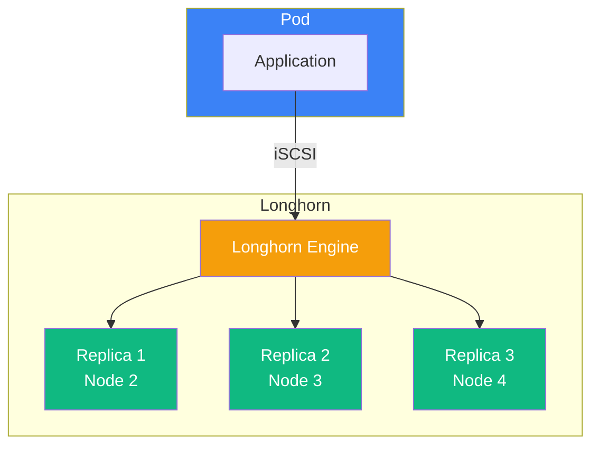

Before deploying workloads, we need to set up persistent storage on Cluster B.
This lesson configures two storage classes: Longhorn for replicated storage and local-path-provisioner for fast local storage.



## Understanding Kubernetes Storage

Kubernetes abstracts storage through several resources:

| Resource                    | Purpose                                                   |
| --------------------------- | --------------------------------------------------------- |
| StorageClass                | Defines how storage is provisioned (provider, parameters) |
| PersistentVolume (PV)       | Actual storage volume in the cluster                      |
| PersistentVolumeClaim (PVC) | Request for storage by a pod                              |
| CSI Driver                  | Interface between Kubernetes and storage backend          |

When a pod requests storage via a PVC, the storage class's provisioner creates a PV that satisfies the request.

## Understanding Longhorn

Longhorn is a distributed block storage system for Kubernetes.
It creates replicated volumes across multiple nodes, providing data redundancy.

### Architecture



The Longhorn Engine handles read/write operations and synchronizes data across replicas.
If a node fails, remaining replicas continue serving data while Longhorn rebuilds a new replica on a healthy node.

### Replication and Quorum

| Replica Count | Nodes Required | Can Lose | Best For       |
| ------------- | -------------- | -------- | -------------- |
| 1             | 1              | 0        | Development    |
| 2             | 2              | 1        | Small clusters |
| 3             | 3              | 1        | Production     |

With 3 replicas, losing one node doesn't affect data availability.
The tradeoff is storage consumption: a 10GB volume with 2 replicas uses 20GB of total cluster storage.

## Choosing Storage Classes

Different workloads have different storage needs:

| Storage Class | Replication | Performance | Use Cases                                     |
| ------------- | ----------- | ----------- | --------------------------------------------- |
| Longhorn      | Yes         | Good        | Databases, stateful apps, data you can't lose |
| local-path    | No          | Excellent   | Caching, temp storage, build artifacts        |

For our migration, we'll configure both to match the flexibility most k3s clusters have.

## Planning Storage Capacity

Longhorn stores replicas on each node's local disk.
Plan your disk space based on workload requirements:

| Component        | Minimum | Recommended | Notes                                 |
| ---------------- | ------- | ----------- | ------------------------------------- |
| OS and RKE2      | 20GB    | 40GB        | Container images, logs, etcd data     |
| Longhorn storage | 50GB    | 100GB+      | Per-node, depends on workload volumes |
| local-path       | 10GB    | 20GB        | Fast local storage for caching        |

For simple partition layouts (`/boot` + `/`), all storage shares the root partition.
Consider a dedicated partition or disk for `/var/lib/longhorn` if you have large storage requirements.

## Preparing Nodes for Longhorn

Longhorn uses iSCSI for block storage.
Install the required packages on all nodes:

```bash
for node in node2 node3 node4; do
    echo "=== Configuring $node ==="
    ssh root@$node "dnf install -y iscsi-initiator-utils nfs-utils && systemctl enable --now iscsid"
done
```

The `nfs-utils` package enables NFS backup support if you configure backups later.

## Installing Longhorn

### Add Helm Repository

```bash
export KUBECONFIG=/etc/rancher/rke2/rke2.yaml

helm repo add longhorn https://charts.longhorn.io
helm repo update
```

### Create Configuration

```bash
cat <<'EOF' > /root/longhorn-values.yaml
defaultSettings:
  defaultReplicaCount: 2
  storageMinimalAvailablePercentage: 15
  defaultDataLocality: "best-effort"
  nodeDrainPolicy: "block-if-contains-last-replica"
  guaranteedEngineManagerCPU: 12
  guaranteedReplicaManagerCPU: 12

persistence:
  defaultClass: true
  defaultClassReplicaCount: 2
  reclaimPolicy: Delete

ingress:
  enabled: false

defaultClass: true
EOF
```

Key settings:

| Setting                           | Value                          | Purpose                                                  |
| --------------------------------- | ------------------------------ | -------------------------------------------------------- |
| defaultReplicaCount               | 2                              | Replicas per volume (balances redundancy and space)      |
| storageMinimalAvailablePercentage | 15                             | Reserve disk space for system operations                 |
| defaultDataLocality               | best-effort                    | Prefer placing replicas on the node running the workload |
| nodeDrainPolicy                   | block-if-contains-last-replica | Prevent data loss during node maintenance                |

### Install

```bash
kubectl create namespace longhorn-system

helm install longhorn longhorn/longhorn \
  --namespace longhorn-system \
  --values /root/longhorn-values.yaml \
  --wait
```

Watch the installation progress:

```bash
kubectl get pods -n longhorn-system -w
```

All pods should reach Running state:

```
NAME                                        READY   STATUS    RESTARTS   AGE
longhorn-manager-xxxxx                      1/1     Running   0          2m
longhorn-driver-deployer-xxxxx              1/1     Running   0          2m
csi-attacher-xxxxx                          1/1     Running   0          2m
csi-provisioner-xxxxx                       1/1     Running   0          2m
engine-image-ei-xxxxx                       1/1     Running   0          2m
instance-manager-xxxxx                      1/1     Running   0          2m
```

## Installing local-path-provisioner

For workloads that need fast local storage without replication:

```bash
kubectl apply -f https://raw.githubusercontent.com/rancher/local-path-provisioner/master/deploy/local-path-storage.yaml

kubectl wait --for=condition=Available deployment/local-path-provisioner -n local-path-storage --timeout=60s
```

The default configuration uses `/opt/local-path-provisioner` for storage.

## Verification

### Check Storage Classes

```bash
kubectl get storageclass
```

Expected output:

```
NAME                 PROVISIONER             RECLAIMPOLICY   VOLUMEBINDINGMODE      ALLOWVOLUMEEXPANSION
longhorn (default)   driver.longhorn.io      Delete          Immediate              true
local-path           rancher.io/local-path   Delete          WaitForFirstConsumer   false
```

Longhorn is marked as the default storage class.
PVCs without an explicit `storageClassName` will use Longhorn.

### Check Longhorn Nodes

```bash
kubectl get nodes.longhorn.io -n longhorn-system
```

Should list all three nodes as schedulable for storage.

### Test Volume Provisioning

```bash
cat <<EOF | kubectl apply -f -
apiVersion: v1
kind: PersistentVolumeClaim
metadata:
  name: storage-test
spec:
  accessModes:
    - ReadWriteOnce
  storageClassName: longhorn
  resources:
    requests:
      storage: 1Gi
---
apiVersion: v1
kind: Pod
metadata:
  name: storage-test
spec:
  containers:
  - name: test
    image: busybox
    command: ['sh', '-c', 'echo "Storage works" > /data/test.txt && cat /data/test.txt && sleep 30']
    volumeMounts:
    - name: data
      mountPath: /data
  volumes:
  - name: data
    persistentVolumeClaim:
      claimName: storage-test
EOF

kubectl wait --for=condition=Ready pod/storage-test --timeout=120s
kubectl logs storage-test
```

Output should show `Storage works`.

Clean up:

```bash
kubectl delete pod storage-test
kubectl delete pvc storage-test
```

## Updating Exported Manifests

If your k3s cluster used different storage class names, update the exported PVC manifests:

```bash
grep -r "storageClassName" /root/cluster-a-export/pvcs/
```

Common mappings:

| k3s Storage Class | RKE2 Storage Class               |
| ----------------- | -------------------------------- |
| local-path        | local-path (no change)           |
| longhorn          | longhorn (no change)             |
| Other             | Update to longhorn or local-path |

## Accessing Longhorn UI

For troubleshooting and management, port-forward to the UI:

```bash
kubectl port-forward -n longhorn-system svc/longhorn-frontend 8080:80
```

Access at `http://localhost:8080`.

## Verification Checklist

- [ ] iSCSI installed on all nodes
- [ ] Longhorn installed and pods running
- [ ] Longhorn storage class is default
- [ ] local-path-provisioner installed
- [ ] Test volume provisions and mounts successfully
- [ ] Exported PVC manifests reviewed for storage class compatibility

In the next lesson, we'll set up HA ingress with Traefik and Hetzner Cloud Load Balancer.
