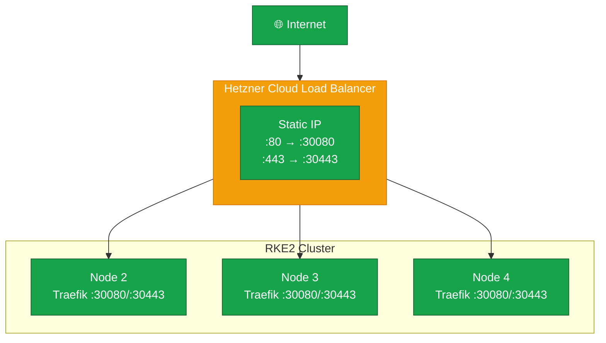

A highly available ingress setup ensures your services remain accessible even if individual nodes fail. We'll deploy
Traefik as a DaemonSet on all nodes and use Hetzner Cloud Load Balancer to distribute traffic.



## HA Ingress Architecture



## Install Traefik

### Add Traefik Helm Repository

```bash
# Add Helm repo
helm repo add traefik https://traefik.github.io/charts
helm repo update

# Search for versions
helm search repo traefik/traefik --versions | head -5
```

### Create Traefik Configuration

```bash
cat <<'EOF' > /root/traefik-values.yaml
# Traefik Configuration for HA Ingress

# Deploy as DaemonSet to run on all nodes
deployment:
  kind: DaemonSet

# Service configuration - use NodePort for LB access
service:
  type: NodePort
  annotations: {}

# Port configuration
ports:
  web:
    port: 8000
    exposedPort: 80
    expose: true
    protocol: TCP
    nodePort: 30080
  websecure:
    port: 8443
    exposedPort: 443
    expose: true
    protocol: TCP
    nodePort: 30443
    tls:
      enabled: true

# Enable access logs
logs:
  access:
    enabled: true

# Tolerate control plane nodes
tolerations:
  - operator: Exists

# Affinity - prefer spreading across nodes
affinity:
  podAntiAffinity:
    preferredDuringSchedulingIgnoredDuringExecution:
      - weight: 100
        podAffinityTerm:
          labelSelector:
            matchLabels:
              app.kubernetes.io/name: traefik
          topologyKey: kubernetes.io/hostname

# Resource requests
resources:
  requests:
    cpu: "100m"
    memory: "50Mi"
  limits:
    cpu: "300m"
    memory: "150Mi"

# Enable Kubernetes Ingress provider
providers:
  kubernetesIngress:
    enabled: true
    publishedService:
      enabled: true

# Dashboard (optional - enable for debugging)
ingressRoute:
  dashboard:
    enabled: false  # Enable if you want the dashboard

# Additional arguments
additionalArguments:
  - "--api.insecure=false"
  - "--entrypoints.web.http.redirections.entryPoint.to=websecure"
  - "--entrypoints.web.http.redirections.entryPoint.scheme=https"
EOF
```

### Install Traefik

```bash
# Create namespace
kubectl create namespace traefik

# Install Traefik
helm install traefik traefik/traefik \
  --namespace traefik \
  --values /root/traefik-values.yaml \
  --wait

# Verify installation
kubectl get pods -n traefik -o wide

# Expected: One Traefik pod per node
# NAME             READY   STATUS    RESTARTS   AGE   IP          NODE
# traefik-xxxxx    1/1     Running   0          1m    10.42.1.1   node2
# traefik-yyyyy    1/1     Running   0          1m    10.42.2.1   node3
# traefik-zzzzz    1/1     Running   0          1m    10.42.3.1   node4
```

### Verify Traefik Service

```bash
# Check service
kubectl get svc -n traefik

# Expected:
# NAME      TYPE       CLUSTER-IP      EXTERNAL-IP   PORT(S)                      AGE
# traefik   NodePort   10.43.xxx.xxx   <none>        80:30080/TCP,443:30443/TCP   1m

# Test NodePort from each node
for node in node2 node3 node4; do
    echo "Testing $node..."
    curl -s -o /dev/null -w "%{http_code}" http://10.1.1.$(echo $node | sed 's/node//'):30080/ping || echo " - curl failed"
    echo ""
done
```

## Configure Hetzner Cloud Load Balancer

### Using hcloud CLI

```bash
# Create Load Balancer
hcloud load-balancer create \
  --name k8s-ingress \
  --type lb11 \
  --location fsn1  # Adjust to your datacenter

# Get Load Balancer ID
LB_ID=$(hcloud load-balancer list -o noheader -o columns=id,name | grep k8s-ingress | awk '{print $1}')
echo "Load Balancer ID: $LB_ID"
```

### Add Targets (All Cluster Nodes)

```bash
# Add each node as a target using private IPs
# Replace server names with your actual server names from hcloud

# List your servers first
hcloud server list

# Add targets (using private IP from vSwitch)
hcloud load-balancer add-target k8s-ingress \
  --server node2-servername \
  --use-private-ip

hcloud load-balancer add-target k8s-ingress \
  --server node3-servername \
  --use-private-ip

hcloud load-balancer add-target k8s-ingress \
  --server node4-servername \
  --use-private-ip

# Note: You may need to add Node 1 later after migration
```

### Configure Services

```bash
# Add HTTP service (port 80 -> 30080)
hcloud load-balancer add-service k8s-ingress \
  --protocol tcp \
  --listen-port 80 \
  --destination-port 30080

# Add HTTPS service (port 443 -> 30443)
hcloud load-balancer add-service k8s-ingress \
  --protocol tcp \
  --listen-port 443 \
  --destination-port 30443
```

### Configure Health Checks

```bash
# Update HTTP service with health check
hcloud load-balancer update-service k8s-ingress \
  --listen-port 80 \
  --health-check-protocol http \
  --health-check-port 30080 \
  --health-check-http-path /ping \
  --health-check-interval 15s \
  --health-check-timeout 10s \
  --health-check-retries 3

# Update HTTPS service with health check
hcloud load-balancer update-service k8s-ingress \
  --listen-port 443 \
  --health-check-protocol tcp \
  --health-check-port 30443 \
  --health-check-interval 15s \
  --health-check-timeout 10s \
  --health-check-retries 3
```

### Get Load Balancer IP

```bash
# Get the public IP
hcloud load-balancer describe k8s-ingress

# The output includes:
# - IPv4: xxx.xxx.xxx.xxx
# - IPv6: xxxx:xxxx:xxxx::1

# Save this IP for DNS configuration
LB_IP=$(hcloud load-balancer describe k8s-ingress -o format='{{.PublicNet.IPv4.IP}}')
echo "Load Balancer IP: $LB_IP"
```

### Alternative: Using Hetzner Cloud Console

If you prefer the web interface:

1. Go to Hetzner Cloud Console
2. Navigate to Load Balancers
3. Create new Load Balancer:
   - Name: k8s-ingress
   - Type: LB11
   - Location: Same as your servers
4. Add targets:
   - Add all cluster nodes
   - Select "Private IP" option
5. Add services:
   - TCP 80 → 30080
   - TCP 443 → 30443
6. Configure health checks as above

## Verify Load Balancer Setup

```bash
# Check Load Balancer status
hcloud load-balancer describe k8s-ingress

# Check target health
hcloud load-balancer describe k8s-ingress -o format='{{range .Targets}}{{.Server.Name}}: {{.HealthStatus}}{{"\n"}}{{end}}'

# Test HTTP through Load Balancer
curl -v http://${LB_IP}/

# Expected: 404 (no ingress rules yet) or redirect to HTTPS
```

## Test Ingress End-to-End

### Deploy a Test Application

```bash
# Create test namespace
kubectl create namespace ingress-test

# Deploy nginx
kubectl create deployment nginx-test --image=nginx:alpine -n ingress-test

# Expose as ClusterIP service
kubectl expose deployment nginx-test --port=80 -n ingress-test

# Create ingress
cat <<EOF | kubectl apply -f -
apiVersion: networking.k8s.io/v1
kind: Ingress
metadata:
  name: nginx-test
  namespace: ingress-test
  annotations:
    traefik.ingress.kubernetes.io/router.entrypoints: web
spec:
  rules:
  - host: test.example.com  # Replace with your domain or use the LB IP
    http:
      paths:
      - path: /
        pathType: Prefix
        backend:
          service:
            name: nginx-test
            port:
              number: 80
EOF

# Test with Host header
curl -H "Host: test.example.com" http://${LB_IP}/

# Should return nginx welcome page
```

### Test Failover

```bash
# Stop Traefik on one node
ssh root@node2 "kubectl delete pod -n traefik -l app.kubernetes.io/name=traefik --field-selector spec.nodeName=node2"

# Traffic should continue through other nodes
curl -H "Host: test.example.com" http://${LB_IP}/

# The pod will be recreated by the DaemonSet
kubectl get pods -n traefik -o wide
```

### Cleanup Test

```bash
kubectl delete namespace ingress-test
```

## Update Firewall for Load Balancer

Ensure the Hetzner Load Balancer can reach the nodes:

```bash
# On each node, ensure NodePorts are accessible
# The Load Balancer uses private IPs, which should be in the kubernetes zone

# Verify ports are open
firewall-cmd --zone=kubernetes --list-ports | grep -E "30080|30443"
```

## Save Configuration

```bash
# Save Traefik configuration
cp /root/traefik-values.yaml /root/rke2-backup/

# Document Load Balancer
cat <<EOF >> /root/rke2-backup/infrastructure.txt
=== Hetzner Load Balancer ===
Name: k8s-ingress
IPv4: ${LB_IP}
Targets: node2, node3, node4
Services:
  - TCP 80 -> 30080 (HTTP)
  - TCP 443 -> 30443 (HTTPS)
EOF
```

## HA Ingress Checklist

- [ ] Traefik installed as DaemonSet
- [ ] Traefik pods running on all nodes
- [ ] NodePort services created (30080, 30443)
- [ ] Hetzner Load Balancer created
- [ ] All nodes added as targets
- [ ] Health checks configured
- [ ] Test ingress working through Load Balancer

In the next lesson, we'll migrate persistent volumes from Cluster A to Cluster B.
