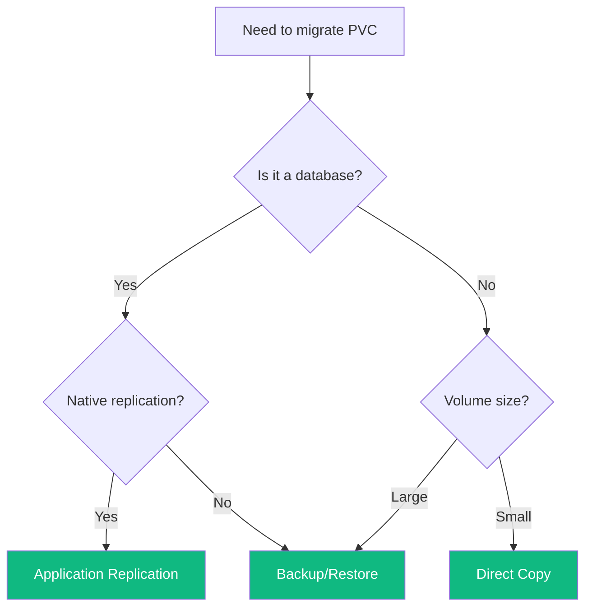

Persistent volumes contain application state that can't be recreated from manifests alone.
This lesson covers strategies for moving data between clusters.



## Understanding Data Migration

Unlike deployments or services, PVC data must be explicitly transferred.
The right strategy depends on your workload characteristics.

### Migration Challenges

| Challenge                 | Impact                                   | Mitigation                    |
| ------------------------- | ---------------------------------------- | ----------------------------- |
| Data consistency          | Writes during transfer cause divergence  | Scale down or use replication |
| Transfer time             | Large volumes delay migration            | Use incremental sync          |
| Storage class differences | PVC may not bind                         | Update storageClassName       |
| Access modes              | ReadWriteOnce blocks simultaneous access | Coordinate pod scheduling     |

## Choosing a Strategy

| Strategy                      | Downtime | Best For                          |
| ----------------------------- | -------- | --------------------------------- |
| Application-level replication | None     | Databases with native replication |
| Backup and restore            | Brief    | Most stateful applications        |
| Direct volume copy            | Brief    | Small to medium volumes           |
| Velero                        | Minimal  | Multiple related PVCs             |

### Decision Guide

## Strategy 1: Application-Level Replication

For databases with built-in replication (PostgreSQL, MySQL, MongoDB), configure the Cluster B instance as a replica of Cluster A.

1. Deploy database on Cluster B as standby/replica
2. Configure streaming replication from Cluster A
3. Wait for synchronization
4. Promote replica to primary during cutover

This provides zero-downtime migration with continuous synchronization.

## Strategy 2: Backup and Restore

The simplest approach for most applications.

1. Scale down the application on Cluster A
2. Create a backup (database dump, tar archive, etc.)
3. Transfer backup to Cluster B
4. Create PVC on Cluster B
5. Restore data into the new PVC
6. Deploy the application

Works well for databases (`pg_dump`, `mysqldump`) and file-based storage (`tar`).

## Strategy 3: Direct Volume Copy

For direct transfer using intermediate storage or rsync:

1. Backup to S3/MinIO/NFS from Cluster A
2. Restore from intermediate storage on Cluster B

Useful when you have shared storage accessible from both clusters.

## Strategy 4: Velero

For complex applications with multiple interdependent PVCs:

1. Install Velero on both clusters with shared backup location
2. Create backup on Cluster A
3. Restore on Cluster B

Velero handles PVCs, secrets, configmaps, and deployments together, maintaining relationships.

## General Workflow

For each stateful application:

1. **Analyze** what data needs migration and choose a strategy
2. **Scale down** on Cluster A to prevent writes during transfer
3. **Export** data using your chosen method
4. **Create** namespace, secrets, configmaps, and PVCs on Cluster B
5. **Restore** data to the new PVCs
6. **Deploy** the application on Cluster B
7. **Verify** data integrity and functionality

## Verification

After migrating each application:

- Check PVC is bound
- Verify pod starts successfully
- Test data integrity (checksums, record counts, application tests)
- Confirm functionality works as expected

In the next lesson, we'll deploy workloads to Cluster B.
