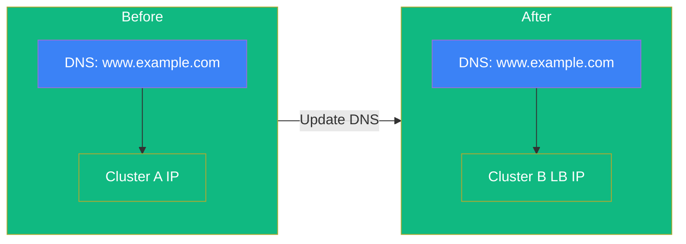

The DNS cutover is the moment when production traffic starts flowing to Cluster B.
This lesson covers how to perform a smooth traffic switch.



## Understanding DNS Cutover

DNS cutover works by updating the IP address that your domain names resolve to.
Instead of pointing to Cluster A, they point to the Cluster B load balancer.



The TTL (Time To Live) value determines how long DNS resolvers cache the old IP.
Lower TTL values speed up propagation but increase DNS query load.

## Cutover Strategies

| Strategy       | Downtime Risk              | Best For                 |
| -------------- | -------------------------- | ------------------------ |
| Direct switch  | Brief (during propagation) | Low-traffic applications |
| Weighted DNS   | Minimal                    | Critical applications    |
| Cloudflare/CDN | Minimal                    | Already using CDN        |

### Direct Switch

Update DNS records directly to the new IP.
Traffic shifts as DNS caches expire based on TTL.

### Weighted DNS

Gradually shift traffic by configuring multiple A records with weights:

1. 10% to Cluster B, 90% to Cluster A
2. 50/50 split after verification
3. 100% to Cluster B

### CDN-Based

If using Cloudflare or similar, use their load balancing or traffic steering features for instant cutover with health checks.

## Pre-Cutover Verification

Before switching DNS, verify Cluster B is ready:

```bash
# All pods running
kubectl get pods -A | grep -v Running | grep -v Completed

# Test ingress through load balancer
LB_IP=$(hcloud load-balancer describe k8s-ingress -o format='{{.PublicNet.IPv4.IP}}')
curl -H "Host: www.example.com" http://${LB_IP}/
```

### Checklist

- [ ] All pods running on Cluster B
- [ ] All services have endpoints
- [ ] Ingress responds correctly through load balancer
- [ ] TLS certificates working (if applicable)
- [ ] Application functionality verified
- [ ] Database connections working

## Execute DNS Cutover

### Step 1: Document Current State

```bash
dig +short www.example.com > /root/dns-before-cutover.txt
```

### Step 2: Update DNS Records

Update your DNS provider to point domains to the Cluster B load balancer IP.
The exact process depends on your DNS provider (Cloudflare, Route 53, Hetzner DNS, etc.).

### Step 3: Verify Propagation

```bash
# Check from multiple resolvers
dig +short www.example.com @8.8.8.8
dig +short www.example.com @1.1.1.1
```

Wait until all resolvers return the new IP.

### Step 4: Monitor Traffic

Watch Cluster B logs to confirm traffic is arriving:

```bash
kubectl logs -n traefik -l app.kubernetes.io/name=traefik -f
```

## Rollback

If issues arise, update DNS to point back to Cluster A.
This is why we keep Cluster A running during the migration.

```bash
# Verify Cluster A is still functional
# Update DNS back to Cluster A IP
# Wait for propagation
```

## Post-Cutover

### Immediate Monitoring

For the first few hours:

- Watch for HTTP 5xx errors
- Monitor response latency
- Check pod restarts
- Review application logs

### Keep Cluster A Running

Don't decommission Cluster A immediately.
Keep it available for rollback for at least 24-48 hours.

You can scale down workloads to reduce resource usage while maintaining rollback capability.

## Verification Checklist

- [ ] DNS records updated
- [ ] DNS propagation confirmed
- [ ] Traffic flowing to Cluster B
- [ ] No 5xx errors
- [ ] Application functionality verified
- [ ] Cluster A available for rollback

In the next section, we'll decommission Cluster A and add Node 1 as a worker to complete the migration.
