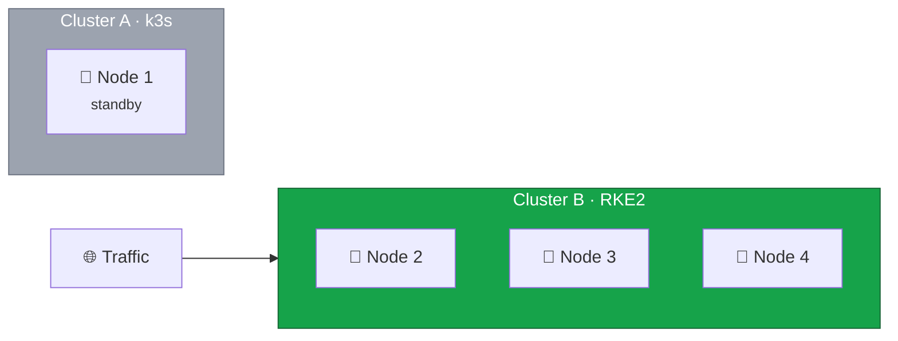

Before decommissioning Cluster A, perform thorough validation of Cluster B to ensure you won't need to rollback.



## Validation Timeline

After the DNS cutover, allow time for confidence building:

| Time Since Cutover | Focus                                 |
| ------------------ | ------------------------------------- |
| 0-4 hours          | Active monitoring, quick fixes        |
| 4-24 hours         | Extended monitoring, verify stability |
| 24-48 hours        | Final validation                      |
| 48+ hours          | Ready for decommissioning             |

## Current State



Cluster A remains on standby for rollback while Cluster B serves all traffic.

## Validation Areas

### Cluster Health

Verify all core components are healthy:

```bash
# All nodes Ready
kubectl get nodes

# etcd cluster healthy
etcdctl endpoint health --cluster

# All system pods Running
kubectl get pods -n kube-system
```

### Workload Health

Check application workloads:

```bash
# All pods Running (no CrashLoopBackOff, Pending, etc.)
kubectl get pods -A | grep -v Running | grep -v Completed

# No excessive restarts
kubectl get pods -A | awk '$5 > 5'

# All deployments at desired replicas
kubectl get deployments -A
```

### Storage Health

Verify persistent storage:

```bash
# All PVCs bound
kubectl get pvc -A | grep -v Bound

# Longhorn healthy
kubectl get pods -n longhorn-system
```

### Network Health

Check networking and ingress:

```bash
# Canal healthy
kubectl get pods -n kube-system -l k8s-app=canal

# Traefik running on all nodes
kubectl get pods -n traefik -o wide

# Load balancer targets healthy
hcloud load-balancer describe k8s-ingress
```

### Application Testing

Run application-specific tests:

- Health check endpoints
- Database connectivity
- Critical user flows
- API functionality

## Decision Point

**If validation passes:** Proceed to decommissioning Cluster A.

**If validation fails:**

- Document issues
- Fix problems before proceeding
- Re-validate after fixes
- Consider rollback if issues are severe

## Validation Checklist

### Infrastructure

- [ ] All 3 control plane nodes healthy
- [ ] etcd cluster healthy (3 members)
- [ ] All nodes have sufficient resources

### Workloads

- [ ] All pods Running
- [ ] No excessive restarts
- [ ] All services have endpoints

### Storage

- [ ] All PVCs bound
- [ ] Longhorn healthy

### Networking

- [ ] Canal healthy
- [ ] Ingress working
- [ ] Load balancer healthy

### Applications

- [ ] Health checks passing
- [ ] No application errors
- [ ] User-facing functionality working

In the next lesson, we'll safely decommission Cluster A.
