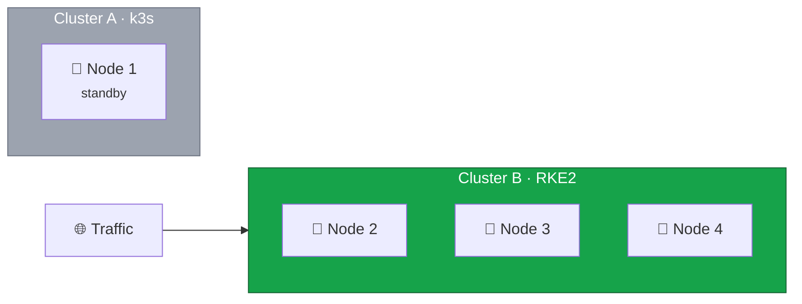

The previous lessons built a fully operational RKE2 cluster with three control plane nodes, verified high availability, and configured storage and ingress.
Before decommissioning Cluster A, we need to confirm that everything has been migrated and that Cluster B is healthy enough to stand on its own.



## Completing the Workload Migration

This guide covers the infrastructure migration — building Cluster B, moving nodes, and configuring the platform.
The actual workload migration — deploying your applications, secrets, and persistent data to Cluster B — depends entirely on your setup.



Once your workloads are running on Cluster B, the cluster should look like this:



All production traffic flows to Cluster B.
Cluster A remains on standby with only Node 1, serving as a rollback option until we are confident in the new cluster.

## Validating the Cluster

Give Cluster B at least 24-48 hours of serving production traffic before decommissioning Cluster A.
This allows time for issues to surface that only appear under real load — memory leaks, certificate renewals, cron jobs, and edge cases in application behavior.

### Control Plane Health

Verify that all three nodes are `Ready` and that etcd has full quorum:

```bash
$ kubectl get nodes
NAME    STATUS   ROLES                       AGE
node2   Ready    control-plane,etcd,master   2d
node3   Ready    control-plane,etcd,master   6d
node4   Ready    control-plane,etcd,master   7d
```

```bash
$ sudo etcdctl endpoint health --cluster
https://10.1.0.12:2379 is healthy: successfully committed proposal: took = 3.0ms
https://10.1.0.13:2379 is healthy: successfully committed proposal: took = 4.1ms
https://10.1.0.14:2379 is healthy: successfully committed proposal: took = 3.8ms
```

All three nodes should be `Ready` and all three etcd endpoints should report as healthy.

### Workload Health

Check that no pods are stuck in a failed state:

```bash
$ kubectl get pods -A | grep -v Running | grep -v Completed
```

This command filters out healthy pods.
If the output shows pods in `CrashLoopBackOff`, `Pending`, or `Error` state, investigate and resolve them before proceeding.

Excessive restarts indicate instability even when pods show `Running`:

```bash
$ kubectl get pods -A --sort-by='.status.containerStatuses[0].restartCount' | tail -10
```

A handful of restarts during initial deployment is normal.
Pods that keep restarting after 24 hours need attention.

### Storage Health

Confirm that all PersistentVolumeClaims are bound and that Longhorn is healthy:

```bash
$ kubectl get pvc -A
```

Every PVC should show `Bound` status.
An `Unbound` or `Pending` PVC means the volume was not provisioned correctly — check the Longhorn manager logs for details.

```bash
$ kubectl get pods -n longhorn-system
```

All Longhorn components — manager, driver, and engine images — should be `Running` across the cluster.

### Networking and Ingress

Verify that Canal is running on all nodes and that Traefik is serving traffic through the load balancer:

```bash
$ kubectl get pods -n kube-system -l k8s-app=canal -o wide
```

Three Canal pods should appear — one per node, all `Running`.

```bash
$ kubectl get pods -n traefik -o wide
```

Traefik should be running on each node that receives traffic from the load balancer.
Test a request through the load balancer to confirm end-to-end connectivity:

```bash
$ curl -s -o /dev/null -w "%{http_code}" -H "Host: your-domain.com" https://<load-balancer-ip>/
200
```

A `200` response confirms the full path — load balancer to Traefik to your application — is working.

## Deciding to Proceed

If all validation checks pass and Cluster B has been stable for at least 24 hours, it is safe to decommission Cluster A.
Keep in mind that once Node 1 is wiped and reinstalled, there is no rollback path to the k3s cluster.

If validation reveals issues, fix them while Cluster A is still available as a fallback.
There is no rush — Cluster A costs nothing extra to keep running in standby.
