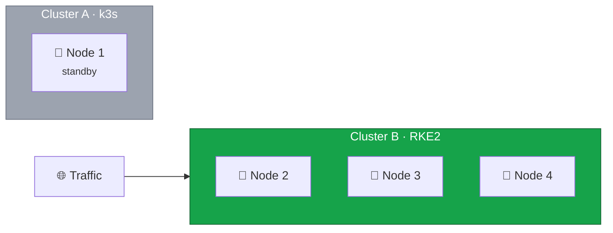

Before decommissioning Cluster A, we need to perform a thorough validation of Cluster B to ensure everything is
working correctly and we won't need to rollback.



## Validation Timeline

After the DNS cutover:

- **0-4 hours**: Active monitoring, quick fixes
- **4-24 hours**: Extended monitoring, verify stability
- **24-48 hours**: Confidence building, final validation
- **48+ hours**: Ready for decommissioning

## Current State



Cluster A is on standby for rollback while Cluster B serves all traffic.

## 1. Cluster Health Validation

### Node Health

```bash
# Check all nodes are Ready
kubectl get nodes -o wide

# Verify node conditions
kubectl describe nodes | grep -A 10 "Conditions:"

# Check for node resource pressure
kubectl top nodes
```

### etcd Health

```bash
# Verify all etcd members are healthy
etcdctl endpoint health --cluster

# Check member list
etcdctl member list

# Verify leader
etcdctl endpoint status --cluster --write-out=table
```

### Control Plane Health

```bash
# Check control plane pods
kubectl get pods -n kube-system | grep -E "etcd|apiserver|controller|scheduler"

# Check component status
kubectl get componentstatuses 2>/dev/null || kubectl get --raw='/healthz?verbose'

# Verify API server accessibility from all nodes
for node in node2 node3 node4; do
    echo "=== $node ==="
    ssh root@$node "kubectl get nodes"
done
```

## 2. Workload Validation

### Pod Health

```bash
# Check all pods are running
kubectl get pods -A | grep -v Running | grep -v Completed | grep -v NAME

# Check for pods with restarts
kubectl get pods -A -o wide | awk '$5 > 0'

# Check pod resource usage
kubectl top pods -A --sort-by=memory | head -20
```

### Deployment Health

```bash
# Check all deployments are available
kubectl get deployments -A -o wide

# Verify replica counts
kubectl get deployments -A -o jsonpath='{range .items[*]}{.metadata.namespace}/{.metadata.name}: {.status.replicas}/{.spec.replicas}{"\n"}{end}'
```

### Service Health

```bash
# Check services have endpoints
kubectl get endpoints -A | awk 'NF==3 || $2==""'  # Empty endpoints

# Test DNS resolution for services
for svc in $(kubectl get svc -A -o jsonpath='{range .items[*]}{.metadata.namespace}/{.metadata.name}{"\n"}{end}' | head -10); do
    ns=$(echo $svc | cut -d/ -f1)
    name=$(echo $svc | cut -d/ -f2)
    kubectl run dns-test-$RANDOM --image=busybox --rm -it --restart=Never -- nslookup $name.$ns.svc.cluster.local 2>/dev/null | grep -q "Address" && echo "$svc: OK" || echo "$svc: FAIL"
done
```

## 3. Storage Validation

### Longhorn Health

```bash
# Check Longhorn system
kubectl get pods -n longhorn-system

# Check volumes
kubectl get volumes.longhorn.io -n longhorn-system

# Check replicas
kubectl get replicas.longhorn.io -n longhorn-system

# Verify all PVCs are bound
kubectl get pvc -A | grep -v Bound
```

### PVC Health

```bash
# List all PVCs with status
kubectl get pvc -A -o wide

# Check for any issues
kubectl get pvc -A -o jsonpath='{range .items[*]}{.metadata.namespace}/{.metadata.name}: {.status.phase}{"\n"}{end}'
```

## 4. Network Validation

### Cilium Health

```bash
# Check Cilium status
cilium status

# Run connectivity test
cilium connectivity test --single-node

# Check Cilium endpoints
kubectl get ciliumendpoints -A
```

### Ingress Validation

```bash
# Check Traefik pods
kubectl get pods -n traefik -o wide

# Verify all nodes have Traefik running
TRAEFIK_PODS=$(kubectl get pods -n traefik -o jsonpath='{.items[*].spec.nodeName}' | tr ' ' '\n' | sort -u | wc -l)
TOTAL_NODES=$(kubectl get nodes --no-headers | wc -l)
echo "Traefik pods on $TRAEFIK_PODS/$TOTAL_NODES nodes"

# Test ingress endpoints
LB_IP=$(hcloud load-balancer describe k8s-ingress -o format='{{.PublicNet.IPv4.IP}}')
for host in $(kubectl get ingress -A -o jsonpath='{range .items[*]}{.spec.rules[*].host}{"\n"}{end}'); do
    status=$(curl -s -o /dev/null -w "%{http_code}" -H "Host: $host" http://${LB_IP}/ --max-time 5)
    echo "$host: $status"
done
```

### Load Balancer Health

```bash
# Check Hetzner LB status
hcloud load-balancer describe k8s-ingress

# Check target health
hcloud load-balancer describe k8s-ingress -o json | jq '.targets[].health_status'
```

## 5. Application-Specific Validation

### Database Checks

```bash
# Example: Check PostgreSQL
kubectl exec -n <namespace> <postgres-pod> -- pg_isready

# Example: Check MySQL
kubectl exec -n <namespace> <mysql-pod> -- mysqladmin -uroot -p<password> status

# Verify data integrity (application-specific)
# Run your application's health checks
```

### API Health Checks

```bash
# Test API endpoints
for endpoint in /health /ready /api/status; do
    for host in api.example.com; do
        echo -n "$host$endpoint: "
        curl -s -o /dev/null -w "%{http_code}" https://$host$endpoint --max-time 5
        echo ""
    done
done
```

### End-to-End Tests

Run your application's test suite against production:

```bash
# Example: Run smoke tests
./run-smoke-tests.sh --env production

# Example: Check critical user flows
# 1. Login
# 2. Core functionality
# 3. Data consistency
```

## 6. Monitoring and Logging Validation

### Verify Metrics Collection

```bash
# If using Prometheus/Grafana
kubectl get pods -n monitoring

# Check metrics endpoints
kubectl port-forward -n monitoring svc/prometheus 9090:9090 &
curl -s localhost:9090/-/healthy
```

### Verify Log Collection

```bash
# If using Loki/ELK
kubectl get pods -n logging

# Verify logs are flowing
kubectl logs -n <namespace> <pod-name> --since=5m | head
```

## 7. Security Validation

### Network Policies

```bash
# Verify network policies are applied
kubectl get networkpolicies -A

# Test policy enforcement
# (Run connectivity tests between namespaces)
```

### RBAC

```bash
# Check service account permissions
kubectl auth can-i --list --as=system:serviceaccount:<namespace>:<sa-name>
```

## Generate Validation Report

```bash
cat <<'EOF' > /root/validation-report.sh
#!/bin/bash
echo "=============================================="
echo "    CLUSTER B VALIDATION REPORT"
echo "    Generated: $(date)"
echo "=============================================="
echo ""

echo "=== CLUSTER HEALTH ==="
echo "Nodes: $(kubectl get nodes --no-headers | wc -l)"
echo "Nodes Ready: $(kubectl get nodes --no-headers | grep Ready | wc -l)"
echo ""

echo "=== etcd HEALTH ==="
etcdctl endpoint health --cluster 2>&1 | head -5
echo ""

echo "=== WORKLOADS ==="
echo "Total Pods: $(kubectl get pods -A --no-headers | wc -l)"
echo "Running Pods: $(kubectl get pods -A --no-headers | grep Running | wc -l)"
echo "Non-Running Pods: $(kubectl get pods -A --no-headers | grep -v Running | grep -v Completed | wc -l)"
echo ""
echo "High-Restart Pods:"
kubectl get pods -A --no-headers | awk '$5 > 5 {print $1"/"$2": "$5" restarts"}'
echo ""

echo "=== STORAGE ==="
echo "Total PVCs: $(kubectl get pvc -A --no-headers | wc -l)"
echo "Bound PVCs: $(kubectl get pvc -A --no-headers | grep Bound | wc -l)"
echo ""

echo "=== NETWORKING ==="
echo "Cilium Status:"
cilium status --brief 2>/dev/null
echo ""

echo "Traefik Pods:"
kubectl get pods -n traefik -o wide --no-headers
echo ""

echo "=== INGRESS HEALTH ==="
LB_IP=$(hcloud load-balancer describe k8s-ingress -o format='{{.PublicNet.IPv4.IP}}' 2>/dev/null)
for host in $(kubectl get ingress -A -o jsonpath='{range .items[*]}{.spec.rules[*].host}{"\n"}{end}' | head -5); do
    status=$(curl -s -o /dev/null -w "%{http_code}" -H "Host: $host" http://${LB_IP}/ --max-time 5 2>/dev/null)
    echo "$host: $status"
done
echo ""

echo "=== VALIDATION RESULT ==="
ISSUES=0

# Check for non-running pods
if [ $(kubectl get pods -A --no-headers | grep -v Running | grep -v Completed | wc -l) -gt 0 ]; then
    echo "WARNING: Non-running pods detected"
    ISSUES=$((ISSUES+1))
fi

# Check for unbound PVCs
if [ $(kubectl get pvc -A --no-headers | grep -v Bound | wc -l) -gt 0 ]; then
    echo "WARNING: Unbound PVCs detected"
    ISSUES=$((ISSUES+1))
fi

# Check node count
if [ $(kubectl get nodes --no-headers | grep Ready | wc -l) -lt 3 ]; then
    echo "WARNING: Less than 3 nodes ready"
    ISSUES=$((ISSUES+1))
fi

if [ $ISSUES -eq 0 ]; then
    echo "ALL CHECKS PASSED - Ready for decommissioning"
else
    echo "$ISSUES ISSUES DETECTED - Review before proceeding"
fi

echo ""
echo "=============================================="
EOF

chmod +x /root/validation-report.sh
/root/validation-report.sh | tee /root/validation-report-$(date +%Y%m%d).txt
```

## Validation Checklist

### Infrastructure

- [ ] All 3 control plane nodes healthy
- [ ] etcd cluster healthy (3 members)
- [ ] All nodes have sufficient resources

### Workloads

- [ ] All pods Running
- [ ] No excessive restarts
- [ ] All deployments at desired replica count
- [ ] All services have endpoints

### Storage

- [ ] All PVCs bound
- [ ] Longhorn healthy
- [ ] Data integrity verified

### Networking

- [ ] Cilium healthy
- [ ] DNS working
- [ ] Ingress working
- [ ] Load balancer healthy

### Applications

- [ ] All health checks passing
- [ ] No application errors
- [ ] Data consistency verified
- [ ] User-facing functionality working

### Monitoring

- [ ] Metrics being collected
- [ ] Logs being collected
- [ ] Alerting configured

## Decision Point

If validation passes:

- Proceed to decommissioning Cluster A

If validation fails:

- Document issues
- Fix problems before proceeding
- Re-validate after fixes
- Consider rollback if issues are severe

In the next lesson, we'll safely decommission Cluster A.
