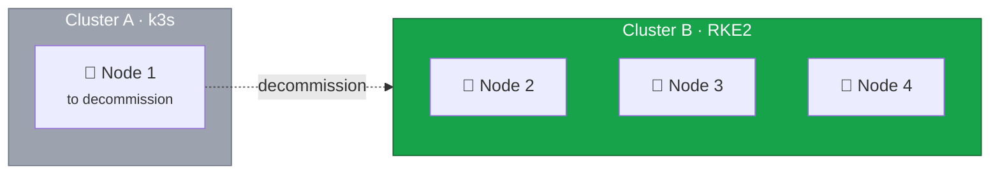

This guide covers the infrastructure migration — building Cluster B, moving nodes, and configuring the platform.
The actual workload migration — deploying your applications, secrets, and persistent data to Cluster B — depends entirely on your setup and must be completed before this lesson.



{% include alert.liquid.html type='warning' title='All Workloads Must Be Migrated' content='
Do not proceed until all your applications, persistent data, and DNS records have been moved to Cluster B.
How you accomplish this depends on your deployment method (Helm, GitOps, manual manifests) and data migration strategy (database replication, backup/restore, volume copy).
Give Cluster B at least 24-48 hours of serving production traffic before decommissioning — this allows time for issues to surface that only appear under real load.
' %}

## Current State



## Final Backup

Create a final backup of the k3s data:

```bash
ssh root@node1

# Create final etcd snapshot
sudo k3s etcd-snapshot save --name final-backup-$(date +%Y%m%d-%H%M%S)

# Copy backups to safe location
scp -r /var/lib/rancher/k3s/server/db/snapshots/* root@node4:/root/k3s-final-backups/
```

## Verify No Active Traffic

Confirm Cluster A is not receiving traffic:

```bash
sudo journalctl -u k3s --since "1 hour ago" | grep -c "HTTP"
```

Should show zero or minimal activity.

## Stop k3s

```bash
sudo systemctl stop k3s
sudo systemctl disable k3s
```

## Remove k3s Installation

The k3s uninstall script removes all components:

```bash
sudo /usr/local/bin/k3s-uninstall.sh
```

This removes:

- k3s binaries and systemd services
- Configuration in `/etc/rancher/k3s/`
- Data in `/var/lib/rancher/k3s/`
- CNI configurations and iptables rules
- Container images via containerd

## Clean Up Remaining Files

```bash
rm -rf ~/.kube
rm -rf /var/lib/kubelet
rm -rf /etc/kubernetes
```

## Verify Clean State

```bash
# No k3s processes
ps aux | grep k3s

# No kubernetes ports
ss -tlnp | grep -E "6443|10250|2379|2380"

# No k3s files
ls /var/lib/rancher/ 2>/dev/null
ls /etc/rancher/ 2>/dev/null
```



## Summary

| Component    | Status                 |
| ------------ | ---------------------- |
| k3s service  | Stopped and removed    |
| k3s binaries | Removed                |
| k3s data     | Backed up and removed  |
| Node 1       | Ready for OS reinstall |

In the next lesson, we'll install Rocky Linux 10 on Node 1 and add it to Cluster B as a worker node.
