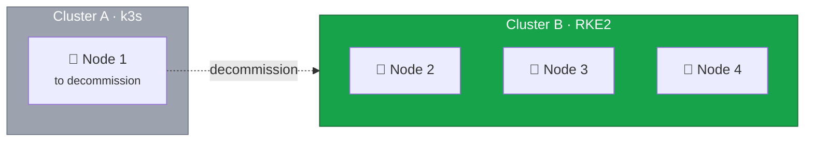

With Cluster B validated and stable, we can now safely decommission Cluster A. This is the point of no return for
the k3s cluster.



## Pre-Decommissioning Checklist

Before proceeding, confirm:

- [ ] Cluster B validation passed
- [ ] At least 24-48 hours since DNS cutover
- [ ] No traffic going to Cluster A
- [ ] All stakeholders notified
- [ ] Final backup of k3s data created

## Current State



## Step 1: Final Backup

Create a final backup of the k3s data:

```bash
# Connect to Node 1
ssh root@node1

# Create final etcd snapshot
sudo k3s etcd-snapshot save --name final-backup-$(date +%Y%m%d-%H%M%S)

# Verify backup
sudo k3s etcd-snapshot ls

# Copy backups to safe location
scp -r /var/lib/rancher/k3s/server/db/snapshots/* root@node4:/root/k3s-final-backups/
```

## Step 2: Verify No Active Traffic

Confirm Cluster A is not receiving traffic:

```bash
# Check k3s logs for recent requests
sudo journalctl -u k3s --since "1 hour ago" | grep -c "HTTP"

# Check Traefik logs (if applicable)
kubectl logs -n kube-system -l app=traefik --since=1h 2>/dev/null | wc -l

# Should show zero or very minimal activity
```

## Step 3: Stop k3s Service

```bash
# Stop k3s service
sudo systemctl stop k3s

# Disable k3s service
sudo systemctl disable k3s

# Verify
sudo systemctl status k3s
```

## Step 4: Remove k3s Installation

The k3s uninstall script removes all components:

```bash
# Run the uninstall script (included with k3s)
sudo /usr/local/bin/k3s-uninstall.sh

# This removes:
# - k3s binaries
# - k3s systemd services
# - k3s data directory
# - Container images (via containerd)
# - Network interfaces created by k3s
```

### What the Uninstall Script Does

1. Stops k3s service
2. Kills all k3s processes
3. Removes k3s binaries from `/usr/local/bin`
4. Removes systemd service files
5. Removes `/etc/rancher/k3s/`
6. Removes `/var/lib/rancher/k3s/`
7. Cleans up iptables rules
8. Removes CNI configurations
9. Removes containerd data

## Step 5: Clean Up Remaining Files

```bash
# Remove any remaining Kubernetes configurations
rm -rf ~/.kube

# Remove any lingering files
rm -rf /var/lib/kubelet
rm -rf /etc/kubernetes

# Clean up network interfaces
ip link show | grep -E "cni|flannel|veth" | while read line; do
    iface=$(echo $line | cut -d: -f2 | tr -d ' ')
    if [ -n "$iface" ]; then
        echo "Removing interface: $iface"
        ip link delete $iface 2>/dev/null || true
    fi
done

# Clean up iptables (if any rules remain)
iptables -F
iptables -X
iptables -t nat -F
iptables -t nat -X
iptables -t mangle -F
iptables -t mangle -X
```

## Step 6: Verify Clean State

```bash
# Check no k3s processes running
ps aux | grep k3s

# Check no kubernetes ports in use
ss -tlnp | grep -E "6443|10250|2379|2380"

# Check no k3s files remain
ls /var/lib/rancher/ 2>/dev/null
ls /etc/rancher/ 2>/dev/null

# Check system resources
free -h
df -h
```

## Step 7: Document Decommissioning

```bash
cat <<EOF > /root/k3s-decommissioned.txt
=== k3s Cluster Decommissioned ===
Date: $(date)
Node: node1

Final backup location: /root/k3s-final-backups/ on node4
Uninstall completed: YES

Reason: Migration to RKE2 Cluster B complete

Cluster B status at decommissioning:
- Nodes: 3 (node2, node3, node4)
- All workloads migrated
- Traffic cutover complete
- Validation passed

This node is ready for OS reinstallation and
joining Cluster B as a worker node.
EOF

cat /root/k3s-decommissioned.txt
```

## Step 8: Update Migration Log

```bash
# On Cluster B (node4)
ssh root@node4

cat <<EOF >> /root/migration-log.txt

=== Cluster A (k3s) Decommissioned ===
Timestamp: $(date)

Actions taken:
1. Final etcd backup created
2. Verified no active traffic
3. Stopped k3s service
4. Ran k3s-uninstall.sh
5. Cleaned up remaining files
6. Verified clean state

Node 1 status:
- k3s removed
- Ready for OS reinstallation
- Will join Cluster B as worker

Cluster B remains at 3 control plane nodes
until Node 1 is added as worker.
EOF
```

## Optional: Keep Data for Archive

If you need to preserve the k3s data for compliance or archival:

```bash
# Before running uninstall, archive data
tar czvf /root/k3s-archive-$(date +%Y%m%d).tar.gz \
    /var/lib/rancher/k3s/server/db/snapshots/ \
    /var/lib/rancher/k3s/server/manifests/ \
    /etc/rancher/k3s/

# Transfer to archive storage
scp /root/k3s-archive-*.tar.gz backup-server:/archives/
```

## Prepare for Node 1 Migration

Before reinstalling the OS:

```bash
# Document current network configuration
ip addr show > /root/network-config-before.txt
cat /etc/NetworkManager/system-connections/* > /root/nm-connections.txt 2>/dev/null || true

# Note the private network configuration for vSwitch
# IP: 10.1.1.1
# Interface: [check your setup]
# VLAN: [if applicable]
```

## Summary

Cluster A is now fully decommissioned:

| Component        | Status                 |
| ---------------- | ---------------------- |
| k3s service      | Stopped and removed    |
| k3s binaries     | Removed                |
| k3s data         | Backed up and removed  |
| Container images | Removed                |
| Network config   | Cleaned up             |
| Node 1           | Ready for OS reinstall |

## Point of No Return



## Next Steps

In the next lesson, we'll:

1. Install Rocky Linux 10 on Node 1
2. Configure it as an RKE2 agent (worker)
3. Join it to Cluster B

This will complete the 4-node cluster with 3 control planes and 1 worker.
