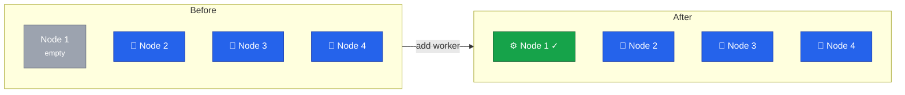

With k3s decommissioned, we'll now install Rocky Linux 9 on Node 1 and add it to Cluster B as a worker node.



## Current State



## Prepare Node 1

Follow the same setup process as previous nodes:

1. **Install Rocky Linux 9** using Hetzner Rescue System ([Lesson 5](/guides/migrating-k3s-to-rke2-without-downtime/lesson-5))
2. **Configure dual-stack vSwitch networking** with IP `10.1.1.1` and `fd00:1::1` ([Lesson 6](/guides/migrating-k3s-to-rke2-without-downtime/lesson-6))
3. **Configure firewall** for worker node ports ([Lesson 7](/guides/migrating-k3s-to-rke2-without-downtime/lesson-7))



Set the hostname after installation:

```bash
hostnamectl set-hostname node1.k8s.example.com
```

Verify connectivity to existing cluster nodes:

```bash
ping -c 3 10.1.1.2    # IPv4
ping -c 3 10.1.1.3
ping -c 3 10.1.1.4
ping6 -c 3 fd00:1::2  # IPv6
ping6 -c 3 fd00:1::3
ping6 -c 3 fd00:1::4
```

## Install RKE2 Agent

Unlike control plane nodes, workers install the agent component:

```bash
# Install RKE2 agent
curl -sfL https://get.rke2.io | INSTALL_RKE2_TYPE="agent" sh -

# Enable the service
systemctl enable rke2-agent.service
```

## Configure RKE2 Agent

Get the cluster token from an existing control plane node:

```bash
# On any control plane node (e.g., node4):
# cat /root/rke2-token.txt

# Or find it in the config:
# grep token /etc/rancher/rke2/config.yaml
```

Configure the agent on Node 1:

```bash
# Create configuration directory
mkdir -p /etc/rancher/rke2

# Get token from control plane
TOKEN="<your-cluster-token>"

# Create agent configuration
cat <<EOF > /etc/rancher/rke2/config.yaml
# Connect to control plane (can use any control plane node)
server: https://10.1.1.4:9345

# Cluster token
token: ${TOKEN}

# Dual-stack node IPs
node-ip: 10.1.1.1,fd00:1::1
EOF
```

## Start RKE2 Agent

```bash
# Start the agent
systemctl start rke2-agent.service

# Watch the startup logs
journalctl -u rke2-agent -f
```

Wait for the node to join. You should see messages like:

```
level=info msg="Starting rke2 agent..."
level=info msg="Connecting to proxy"
level=info msg="Running kubelet..."
```

## Verify Node Joined

### From a Control Plane Node

```bash
# Check nodes
kubectl get nodes -o wide

# Expected output (note both IPs in INTERNAL-IP):
# NAME    STATUS   ROLES                       AGE   VERSION          INTERNAL-IP
# node1   Ready    <none>                      1m    v1.28.x+rke2r1   10.1.1.1,fd00:1::1
# node2   Ready    control-plane,etcd,master   2d    v1.28.x+rke2r1   10.1.1.2,fd00:1::2
# node3   Ready    control-plane,etcd,master   2d    v1.28.x+rke2r1   10.1.1.3,fd00:1::3
# node4   Ready    control-plane,etcd,master   3d    v1.28.x+rke2r1   10.1.1.4,fd00:1::4
```

Note that Node 1 has no roles (worker only).

### Label the Worker Node (Optional)

```bash
# Add worker label for clarity
kubectl label node node1 node-role.kubernetes.io/worker=true

# Verify
kubectl get nodes

# Now shows:
# NAME    STATUS   ROLES                       AGE   VERSION
# node1   Ready    worker                      5m    v1.28.x+rke2r1
# node2   Ready    control-plane,etcd,master   2d    v1.28.x+rke2r1
# ...
```

## Verify Cilium

Cilium should automatically deploy to the new node:

```bash
# Check Cilium pods
kubectl get pods -n kube-system -l k8s-app=cilium -o wide

# Should show 4 pods, one per node
# cilium-xxxxx   1/1   Running   0   1m   10.1.1.1   node1
# ...
```

## Verify Traefik

Traefik DaemonSet should deploy to the worker:

```bash
# Check Traefik pods
kubectl get pods -n traefik -o wide

# Should show 4 pods, one per node
```

## Add Node 1 to Load Balancer

Add Node 1 as a target in the Hetzner Load Balancer:

```bash
# Add Node 1 to load balancer
hcloud load-balancer add-target k8s-ingress \
  --server node1-servername \
  --use-private-ip

# Verify targets
hcloud load-balancer describe k8s-ingress

# Check target health (may take a minute)
hcloud load-balancer describe k8s-ingress -o json | jq '.targets[].health_status'
```

## Test Worker Node

### Schedule a Test Pod on Node 1

```bash
# Create a test pod that specifically schedules on node1
cat <<EOF | kubectl apply -f -
apiVersion: v1
kind: Pod
metadata:
  name: test-worker-node1
spec:
  nodeSelector:
    kubernetes.io/hostname: node1
  containers:
  - name: test
    image: nginx:alpine
    ports:
    - containerPort: 80
EOF

# Verify pod is on node1
kubectl get pod test-worker-node1 -o wide

# Test the pod
kubectl exec test-worker-node1 -- curl -s localhost

# Cleanup
kubectl delete pod test-worker-node1
```

## Verify Full Cluster

```bash
# Check all nodes
kubectl get nodes -o wide

# Check node resources
kubectl top nodes

# Check pod distribution
kubectl get pods -A -o wide | grep node1

# Run full cluster check
/root/validation-report.sh
```

## Update Documentation

```bash
cat <<EOF >> /root/migration-log.txt

=== Node 1 Added as Worker ===
Timestamp: $(date)

Node 1 configuration:
- Role: Worker (agent)
- IP: 10.1.1.1
- OS: Rocky Linux 9
- RKE2: Agent mode

Final cluster configuration:
- node1: worker
- node2: control-plane, etcd, master
- node3: control-plane, etcd, master
- node4: control-plane, etcd, master

Total: 3 control plane + 1 worker = 4 nodes

Load Balancer updated: YES
Traefik running on node1: YES
Cilium running on node1: YES

MIGRATION COMPLETE!
EOF
```

## Summary

The cluster is now complete:

| Node  | Role          | IP       |
| ----- | ------------- | -------- |
| node1 | Worker        | 10.1.1.1 |
| node2 | Control Plane | 10.1.1.2 |
| node3 | Control Plane | 10.1.1.3 |
| node4 | Control Plane | 10.1.1.4 |

- **3 control plane nodes** for HA
- **1 worker node** for dedicated workload capacity
- **4 nodes in load balancer** for HA ingress
- **All workloads migrated** from k3s

In the final lesson, we'll cover post-migration cleanup and documentation.
