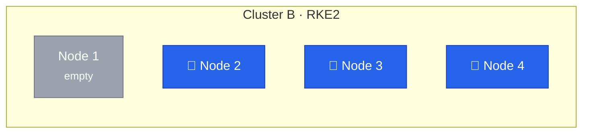
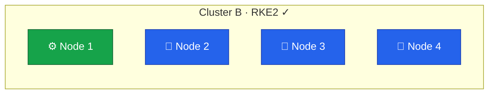

Node 1 follows the same OS preparation as the previous node migrations — install Rocky Linux, configure networking, set up the firewall.
The key difference is that Node 1 joins as a worker (agent) rather than a control plane node (server), so it does not run etcd, the API server, or the scheduler.
Refer to [Lesson 11](/guides/migrating-k3s-to-rke2-without-downtime/lesson-11) for full explanations of the OS setup stages.



## Current State



Cluster A has been decommissioned in the previous lesson.
Node 1 is a blank server ready for a fresh OS install.

## Server vs Agent

The previous nodes all joined as `rke2-server` — running the full control plane stack alongside workloads.
Node 1 joins as `rke2-agent`, which is lighter:

| Component          | Server (Nodes 2-4) | Agent (Node 1) |
| ------------------ | ------------------ | -------------- |
| kubelet            | Yes                | Yes            |
| Container runtime  | Yes                | Yes            |
| Canal (CNI)        | Yes                | Yes            |
| etcd               | Yes                | No             |
| API server         | Yes                | No             |
| Controller manager | Yes                | No             |
| Scheduler          | Yes                | No             |

A worker node only needs the cluster token and the address of a control plane node to join.
The configuration is simpler — no `tls-san`, no security settings, no authentication config.

## Preparing the OS

The OS preparation follows the same process used for the other nodes in [Lesson 11](/guides/migrating-k3s-to-rke2-without-downtime/lesson-11) — install Rocky Linux 10, configure dual-stack networking with `10.1.0.11` and `fd00::11`, and set up the Hetzner firewall.

Worker nodes need fewer firewall ports than control plane nodes.
The etcd ports (`2379`, `2380`) and API server port (`6443`) are not required since the agent does not run those services.

## Installing RKE2 Agent

Set the hostname and install the agent variant of RKE2:

```bash
$ sudo hostnamectl set-hostname node1

$ curl -sfL https://get.rke2.io | INSTALL_RKE2_TYPE="agent" sudo sh -
$ sudo systemctl enable rke2-agent.service
```

The `INSTALL_RKE2_TYPE="agent"` environment variable tells the installer to set up the agent service instead of the server.

Create the configuration directory:

```bash
$ sudo mkdir -p /etc/rancher/rke2
```

The agent needs only two things — where to connect and how to authenticate:

```yaml
# /etc/rancher/rke2/config.yaml
server: https://10.1.0.14:9345
token: <paste-token-from-node4>
node-ip: 10.1.0.11,fd00::11
```

Retrieve the token from any control plane node at `/var/lib/rancher/rke2/server/node-token`.
The `server` address points to Node 4's supervisor API — the same endpoint used when joining Nodes 2 and 3.

## Starting the Agent

```bash
$ sudo systemctl start rke2-agent.service
$ sudo journalctl -u rke2-agent -f
```

The agent contacts Node 4's supervisor API, retrieves certificates, and registers itself with the cluster.
Canal deploys automatically and establishes WireGuard tunnels to all three control plane nodes.

## Verification

### Node Status

All four nodes should appear, with Node 1 showing no control plane roles:

```bash
$ kubectl get nodes -o wide
NAME    STATUS   ROLES                       AGE
node1   Ready    <none>                      2m
node2   Ready    control-plane,etcd,master   3d
node3   Ready    control-plane,etcd,master   7d
node4   Ready    control-plane,etcd,master   8d
```

The `<none>` role for Node 1 indicates it is a pure worker.
Optionally, add a label for clarity:

```bash
$ kubectl label node node1 node-role.kubernetes.io/worker=true
```

### Canal and WireGuard

Verify that Canal has deployed a pod on Node 1:

```bash
$ kubectl get pods -n kube-system -l k8s-app=canal -o wide
```

Four Canal pods should appear — one per node, all `Running`.

On Node 1, check the WireGuard interface to confirm tunnels to all three control plane nodes:

```bash
$ sudo wg show flannel-wg
```

The output should list three peers — one for each control plane node — each with a recent handshake timestamp.

## Preparing Longhorn Storage

Longhorn needs system-level dependencies on every node before it can schedule replicas.
The process is identical to the other nodes — see [Lesson 7](/guides/migrating-k3s-to-rke2-without-downtime/lesson-7) for details on what each dependency does.

Install `longhornctl` and run the preflight installer:

```bash
$ curl -fL -o /usr/local/bin/longhornctl \
    https://github.com/longhorn/cli/releases/download/v1.11.0/longhornctl-linux-amd64
$ chmod +x /usr/local/bin/longhornctl

$ /usr/local/bin/longhornctl --kubeconfig /etc/rancher/rke2/rke2.yaml install preflight
```

Run the preflight check to confirm all dependencies are in place:

```bash
$ /usr/local/bin/longhornctl --kubeconfig /etc/rancher/rke2/rke2.yaml check preflight
```

The check should report no errors for Node 1.
Verify that Longhorn recognizes all four nodes as schedulable:

```bash
$ kubectl get nodes.longhorn.io -n longhorn-system
NAME    READY   ALLOWSCHEDULING   SCHEDULABLE   AGE
node1   True    true              True          2m
node2   True    true              True          3d
node3   True    true              True          7d
node4   True    true              True          8d
```

With four storage nodes, Longhorn has more capacity for distributing replicas across the cluster.

## Final State



The migration is complete.
Cluster B has three control plane nodes for high availability and one dedicated worker node for additional workload capacity.
All four nodes participate in Longhorn storage and the WireGuard mesh.
