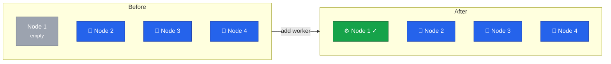

With k3s decommissioned, we'll install Rocky Linux 10 on Node 1 and add it to Cluster B as a worker node.



## Understanding Worker Nodes

Worker nodes (agents) differ from control plane nodes:

| Aspect     | Control Plane | Worker |
| ---------- | ------------- | ------ |
| RKE2 type  | server        | agent  |
| etcd       | Yes           | No     |
| API server | Yes           | No     |
| Scheduler  | Yes           | No     |
| Workloads  | Optional      | Yes    |

Workers run application workloads without the overhead of control plane components.

## Current State



## Prepare Node 1

Follow the same setup process as previous nodes:

1. Install Rocky Linux 10 ([Lesson 5](/guides/migrating-k3s-to-rke2-without-downtime/lesson-5))
2. Configure dual-stack vSwitch networking with `10.1.1.1` and `fd00:1::1` ([Lesson 6](/guides/migrating-k3s-to-rke2-without-downtime/lesson-6))
3. Configure firewall ([Lesson 7](/guides/migrating-k3s-to-rke2-without-downtime/lesson-7))



Set hostname and verify connectivity:

```bash
hostnamectl set-hostname node1

ping -c 3 10.1.1.4
nc -zv 10.1.1.4 9345
```

## Install RKE2 Agent

Unlike control plane nodes, workers install the agent component:

```bash
curl -sfL https://get.rke2.io | INSTALL_RKE2_TYPE="agent" sh -
systemctl enable rke2-agent.service
```

## Configure RKE2 Agent

Get the cluster token from an existing control plane node, then configure the agent:

```bash
mkdir -p /etc/rancher/rke2

TOKEN="<your-cluster-token>"

cat <<EOF > /etc/rancher/rke2/config.yaml
server: https://10.1.1.4:9345
token: ${TOKEN}
node-ip: 10.1.1.1,fd00:1::1
EOF
```

## Start RKE2 Agent

```bash
systemctl start rke2-agent.service
journalctl -u rke2-agent -f
```

Wait for the node to join.
You should see messages indicating successful connection to the control plane.

## Verification

### Check Node Status

```bash
kubectl get nodes -o wide
```

Expected output:

```
NAME    STATUS   ROLES                       AGE   VERSION          INTERNAL-IP
node1   Ready    <none>                      1m    v1.31.x+rke2r1   10.1.1.1,fd00:1::1
node2   Ready    control-plane,etcd,master   2d    v1.31.x+rke2r1   10.1.1.2,fd00:1::2
node3   Ready    control-plane,etcd,master   2d    v1.31.x+rke2r1   10.1.1.3,fd00:1::3
node4   Ready    control-plane,etcd,master   3d    v1.31.x+rke2r1   10.1.1.4,fd00:1::4
```

### Label Worker Node (Optional)

```bash
kubectl label node node1 node-role.kubernetes.io/worker=true
```

### Verify Cilium and Traefik

Both should automatically deploy to the new node:

```bash
kubectl get pods -n kube-system -l k8s-app=cilium -o wide
kubectl get pods -n traefik -o wide
```

Should show 4 pods each, one per node.

## Add to Load Balancer

Add Node 1 as a target in the Hetzner Load Balancer:

```bash
hcloud load-balancer add-target k8s-ingress --server node1 --use-private-ip
```

## Final Cluster State

| Node  | Role          | IP       |
| ----- | ------------- | -------- |
| node1 | Worker        | 10.1.1.1 |
| node2 | Control Plane | 10.1.1.2 |
| node3 | Control Plane | 10.1.1.3 |
| node4 | Control Plane | 10.1.1.4 |

The cluster now has:

- 3 control plane nodes for HA
- 1 worker node for dedicated workload capacity
- 4 nodes in load balancer for HA ingress

In the final lesson, we'll cover post-migration cleanup and documentation.
