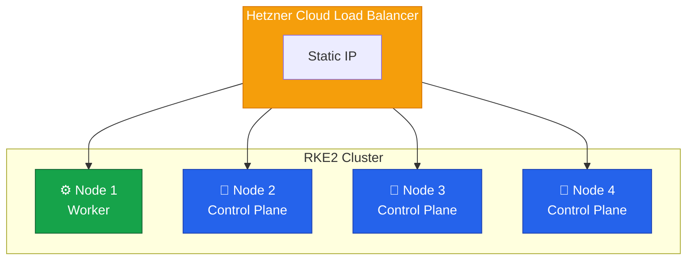

Congratulations!
You have successfully migrated from k3s to RKE2 without downtime.
This final lesson covers post-migration cleanup and documentation.



## Final Cluster State



**Components:**

| Component    | Technology                      |
| ------------ | ------------------------------- |
| Distribution | RKE2                            |
| CNI          | Canal (dual-stack)              |
| Storage      | Longhorn (default), local-path  |
| Ingress      | Traefik + Hetzner Load Balancer |

## Cleanup Tasks

### Remove Migration Artifacts

```bash
# Remove exported manifests and temporary files
rm -rf /root/cluster-a-export

# Securely delete exported secrets
find /root -name "secrets" -type d -exec rm -rf {} \; 2>/dev/null
```

### Remove Test Resources

```bash
kubectl delete namespace ingress-test 2>/dev/null || true
kubectl delete pod -l purpose=test -A 2>/dev/null || true
```

### Restore DNS TTL

Change DNS TTL back to normal values (e.g., 3600 seconds) in your DNS provider.

## Documentation Updates

### Update Runbooks

Document the new cluster for operations:

- Node information (IPs, roles)
- Access procedures (kubeconfig, SSH)
- Important paths (`/etc/rancher/rke2/`, `/var/lib/longhorn/`)
- Backup procedures
- Common operations (adding/removing nodes, upgrades)

### Update CI/CD

- Replace k3s kubeconfig with RKE2 kubeconfig
- Update service account tokens if needed
- Test automated deployments

### Update Monitoring

- Update Prometheus/Grafana targets
- Configure alerts for new cluster
- Archive old k3s dashboards

## Operational Handoff

### Team Training

- [ ] Team trained on RKE2 operations
- [ ] Runbook reviewed
- [ ] Emergency procedures practiced
- [ ] On-call rotation updated

### Credential Handoff

Securely share:

- Kubeconfig location and access
- SSH keys and authorized users
- RKE2 token for node join operations

## Retention

| Item                  | Retention | Notes           |
| --------------------- | --------- | --------------- |
| k3s backups           | 90 days   | Then delete     |
| Migration logs        | 1 year    | For reference   |
| Configuration backups | Permanent | Version control |

## Migration Complete Checklist

- [ ] Migration artifacts removed
- [ ] Test resources cleaned up
- [ ] DNS TTL restored
- [ ] Monitoring updated
- [ ] CI/CD updated
- [ ] Documentation created
- [ ] Team trained
- [ ] Credentials handed off

## What You Accomplished

1. **Planned** a comprehensive zero-downtime migration strategy
2. **Built** a new RKE2 cluster with 3-node HA control plane
3. **Migrated** nodes one by one without service interruption
4. **Configured** Canal CNI for dual-stack networking
5. **Configured** Longhorn for replicated storage
6. **Implemented** HA ingress with Traefik and Hetzner Load Balancer
7. **Migrated** all workloads and data
8. **Switched** traffic with zero downtime
9. **Decommissioned** the old cluster safely
10. **Documented** everything for operations

Your infrastructure now runs on an enterprise-grade RKE2 cluster with high availability, advanced networking, and replicated storage.

Thank you for following this guide!
