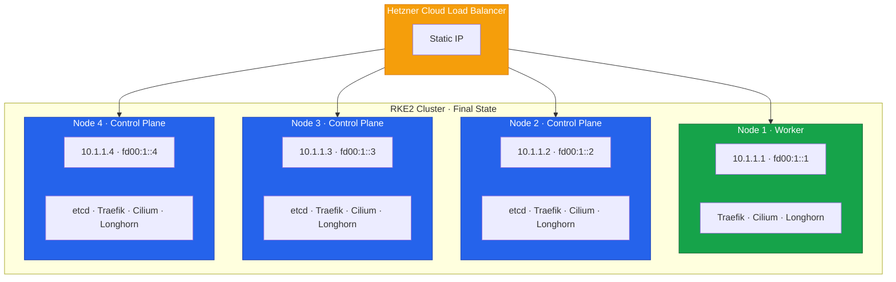

Congratulations! You have successfully migrated from k3s to RKE2 without downtime. This final lesson covers
post-migration cleanup, documentation, and operational considerations.



## Final Cluster State



**Infrastructure Summary:**

- **Storage Classes:** longhorn (default), local-path
- **CNI:** Cilium (eBPF, kube-proxy replacement, dual-stack)
- **Ingress:** Traefik (DaemonSet) + Hetzner Load Balancer

## 1. Cleanup Tasks

### Remove Migration Artifacts

```bash
# On each node, clean up migration scripts and temporary files

# On control plane nodes
for node in node2 node3 node4; do
    ssh root@$node "rm -rf /root/cluster-a-export /tmp/migration-*"
done

# Keep backups for a retention period, then remove
# rm -rf /root/k3s-final-backups  # After retention period
```

### Clean Up Exported Secrets

```bash
# Securely delete exported secrets
find /root/cluster-a-export/secrets -name "*.yaml" -exec shred -u {} \;
rm -rf /root/cluster-a-export/secrets
```

### Remove Temporary Resources

```bash
# Delete any test pods/namespaces
kubectl delete namespace ingress-test 2>/dev/null || true
kubectl delete pod -l purpose=test -A 2>/dev/null || true
```

### Verify No Orphaned Resources

```bash
# Check for orphaned PVs
kubectl get pv | grep -v Bound

# Check for unused ConfigMaps/Secrets
kubectl get configmaps -A | grep -v kube-system | grep -v longhorn
kubectl get secrets -A | grep -v kube-system | grep -v longhorn | grep -v service-account
```

## 2. Update DNS TTL

Restore normal DNS TTL:

```bash
# Change TTL back to normal (e.g., 3600 seconds)
# In your DNS provider, update the TTL for migrated domains

# Verify
dig +short +ttlid www.example.com
```

## 3. Update Monitoring and Alerting

### Update Prometheus Targets (if applicable)

```bash
# Update scrape configs to use new cluster endpoints
# Remove old k3s targets
# Add new RKE2 targets
```

### Update Alert Rules

```bash
# Review and update alert thresholds for new cluster
# Ensure alerts reference correct endpoints
# Test alert routing
```

### Update Dashboards

```bash
# Update Grafana dashboards with new cluster name
# Add RKE2-specific metrics
# Archive old k3s dashboards
```

## 4. Update CI/CD Pipelines

### Update Kubeconfig

```bash
# Replace k3s kubeconfig with RKE2 kubeconfig in CI/CD systems
# Update service account tokens if needed
# Test deployments through CI/CD
```

### Update Deployment Scripts

```bash
# Update any scripts that referenced k3s-specific paths or commands
# Test automated deployments
```

## 5. Documentation Updates

### Create Cluster Documentation

```bash
cat <<'EOF' > /root/cluster-documentation.md
# Kubernetes Cluster Documentation

## Cluster Overview

| Property | Value |
|----------|-------|
| Distribution | RKE2 |
| Version | v1.28.x+rke2r1 |
| Nodes | 4 (3 CP + 1 Worker) |
| CNI | Cilium |
| Storage | Longhorn + local-path |
| Ingress | Traefik + Hetzner LB |

## Node Information

| Node | Role | IP | Purpose |
|------|------|-----|---------|
| node1 | Worker | 10.1.1.1 | General workloads |
| node2 | Control Plane | 10.1.1.2 | API + etcd |
| node3 | Control Plane | 10.1.1.3 | API + etcd |
| node4 | Control Plane | 10.1.1.4 | API + etcd |

## Access Information

### kubectl Access
```

# From workstation

export KUBECONFIG=/path/to/rke2-kubeconfig
kubectl get nodes

```
### Direct Node Access
```

ssh root@<node-ip>

```
### etcd Access
```

etcdctl endpoint health --cluster

````
## Important Paths

| Path | Node | Content |
|------|------|---------|
| /etc/rancher/rke2/config.yaml | All | RKE2 configuration |
| /etc/rancher/rke2/rke2.yaml | CP | Kubeconfig |
| /var/lib/rancher/rke2/server/db/ | CP | etcd data |
| /var/lib/longhorn/ | All | Longhorn storage |

## Backup Procedures

### etcd Backup
```bash
# Automatic: Every 6 hours (configured in RKE2)
# Manual:
rke2 etcd-snapshot save --name manual-backup
````

### Application Backup

```bash
# Use Velero or application-specific backup tools
```

## Common Operations

### Adding a Node

1. Install Rocky Linux 9
2. Configure vSwitch
3. Install RKE2 (server for CP, agent for worker)
4. Configure and start RKE2

### Removing a Node

1. Drain: `kubectl drain <node> --ignore-daemonsets`
2. Delete: `kubectl delete node <node>`
3. On node: Stop RKE2, uninstall

### Upgrading RKE2

Follow SUSE/Rancher upgrade documentation.
EOF

````
### Create Runbook

```bash
cat <<'EOF' > /root/operations-runbook.md
# Operations Runbook

## Emergency Procedures

### Node Failure
1. Check node status: `kubectl get nodes`
2. Check etcd health: `etcdctl endpoint health --cluster`
3. If control plane: verify quorum (need 2 of 3)
4. Check workload redistribution
5. Investigate root cause

### etcd Recovery
1. Check member status: `etcdctl member list`
2. If unhealthy member: consider removal and rejoin
3. For full recovery: restore from snapshot

### Network Issues
1. Check Cilium: `cilium status`
2. Check connectivity: `cilium connectivity test`
3. Review Cilium logs

### Storage Issues
1. Check Longhorn UI or CLI
2. Verify volume health
3. Check replica status

## Maintenance Procedures

### Scheduled Maintenance
1. Notify stakeholders
2. Cordon node: `kubectl cordon <node>`
3. Drain node: `kubectl drain <node> --ignore-daemonsets`
4. Perform maintenance
5. Uncordon: `kubectl uncordon <node>`

### Certificate Renewal
RKE2 handles certificate rotation automatically.
Check: `openssl x509 -in /var/lib/rancher/rke2/server/tls/... -noout -dates`

## Monitoring Alerts

| Alert | Action |
|-------|--------|
| NodeNotReady | Check node, SSH, investigate |
| PodCrashLoopBackOff | Check logs, fix application |
| PVCPending | Check storage class, capacity |
| HighCPU/Memory | Scale or optimize |
EOF
````

## 6. Operational Handoff

### Share Access Credentials

```bash
# Create secure credential document
cat <<'EOF' > /root/credentials-handoff.md
# Cluster Credentials (CONFIDENTIAL)

## Kubeconfig
Location: [shared securely]
Users: admin, ci-cd-service-account

## SSH Keys
Authorized users: [list]
Key rotation schedule: [date]

## RKE2 Token
Used for: Node join
Stored: [secure location]
EOF

# Share securely (not via email/chat)
```

### Training Checklist

- [ ] Team trained on RKE2 operations
- [ ] Runbook reviewed with team
- [ ] Emergency procedures practiced
- [ ] Monitoring dashboards walkthrough
- [ ] On-call rotation updated

## 7. Generate Final Migration Report

```bash
cat <<'EOF' > /root/migration-final-report.sh
#!/bin/bash
echo "=============================================="
echo "    K3S TO RKE2 MIGRATION - FINAL REPORT"
echo "    Generated: $(date)"
echo "=============================================="
echo ""

echo "=== MIGRATION SUMMARY ==="
echo "Source: k3s cluster (3 nodes)"
echo "Target: RKE2 cluster (4 nodes)"
echo "Downtime: Zero"
echo ""

echo "=== FINAL CLUSTER STATE ==="
kubectl get nodes -o wide
echo ""

echo "=== COMPONENT VERSIONS ==="
kubectl version --short 2>/dev/null || kubectl version
echo ""

echo "=== WORKLOAD COUNT ==="
echo "Namespaces: $(kubectl get namespaces --no-headers | wc -l)"
echo "Deployments: $(kubectl get deployments -A --no-headers | wc -l)"
echo "StatefulSets: $(kubectl get statefulsets -A --no-headers | wc -l)"
echo "Pods: $(kubectl get pods -A --no-headers | wc -l)"
echo "Services: $(kubectl get services -A --no-headers | wc -l)"
echo "Ingresses: $(kubectl get ingress -A --no-headers | wc -l)"
echo "PVCs: $(kubectl get pvc -A --no-headers | wc -l)"
echo ""

echo "=== HEALTH STATUS ==="
echo "etcd:"
etcdctl endpoint health --cluster 2>&1 | head -5
echo ""

echo "Cilium:"
cilium status --brief 2>/dev/null
echo ""

echo "=== STORAGE ==="
kubectl get storageclass
echo ""

echo "=== INGRESS ==="
echo "Load Balancer:"
hcloud load-balancer describe k8s-ingress 2>/dev/null | head -10
echo ""

echo "=== MIGRATION COMPLETE ==="
echo "All workloads migrated successfully"
echo "Zero downtime achieved"
echo "=============================================="
EOF

chmod +x /root/migration-final-report.sh
/root/migration-final-report.sh | tee /root/migration-final-report-$(date +%Y%m%d).txt
```

## 8. Retention and Archival

| Item                  | Retention | Location                |
| --------------------- | --------- | ----------------------- |
| k3s etcd backups      | 90 days   | /root/k3s-final-backups |
| Migration logs        | 1 year    | /root/migration-log.txt |
| Configuration backups | Permanent | /root/rke2-backup       |
| Documentation         | Permanent | Version control         |

## Migration Complete Checklist

### Cleanup

- [ ] Migration artifacts removed
- [ ] Exported secrets securely deleted
- [ ] Test resources removed
- [ ] Orphaned resources cleaned up

### DNS

- [ ] TTL restored to normal
- [ ] All records verified

### Monitoring

- [ ] Targets updated
- [ ] Alerts configured
- [ ] Dashboards updated

### CI/CD

- [ ] Kubeconfig updated
- [ ] Pipelines tested
- [ ] Deployments verified

### Documentation

- [ ] Cluster documentation created
- [ ] Runbook created
- [ ] Credentials handed off
- [ ] Team trained

### Final

- [ ] Migration report generated
- [ ] Stakeholders notified
- [ ] Lessons learned documented

## Lessons Learned

Document what went well and what could be improved:

```markdown
## What Went Well

- Zero downtime achieved
- Phased approach reduced risk
- Comprehensive verification before cutover

## Challenges Encountered

- [Document any issues you faced]

## Improvements for Future Migrations

- [Suggestions for improvement]
```

## Congratulations!

You have successfully:

1. **Planned** a comprehensive migration strategy
2. **Built** a new RKE2 cluster with HA control plane
3. **Migrated** nodes one by one without downtime
4. **Deployed** advanced networking with Cilium
5. **Configured** robust storage with Longhorn
6. **Implemented** HA ingress with Traefik and Hetzner LB
7. **Migrated** all workloads and data
8. **Switched** traffic with zero downtime
9. **Decommissioned** the old cluster safely
10. **Documented** everything for operations

Your infrastructure is now running on an enterprise-grade RKE2 cluster with:

- High availability (3 control planes)
- Advanced networking (Cilium eBPF)
- Replicated storage (Longhorn)
- HA ingress (Traefik + Load Balancer)

Thank you for following this guide!
