A successful zero-downtime migration requires meticulous planning. In this lesson, we'll develop our complete migration strategy, identify risks, and establish mitigation procedures.



## Migration Phases Overview

Our migration consists of five distinct phases, each with specific objectives and success criteria:

```mermaid!
%%{init: {
  "theme": "base",
  "flowchart": {
    "nodeSpacing": 20,
    "rankSpacing": 30
  },
  "themeVariables": {
    "padding": 6,
    "nodePadding": 6,
    "subGraphPadding": 8,
    "fontSize": "12px"
  }
}}%%

flowchart LR

%% =========================
%% Global Styles
%% =========================
classDef clusterA fill:#2563eb,color:#ffffff,stroke:#1e40af
classDef clusterB fill:#16a34a,color:#ffffff,stroke:#166534
classDef unassigned fill:#9ca3af,color:#ffffff,stroke:#6b7280
classDef critical stroke:#dc2626,stroke-width:3px
classDef success stroke:#16a34a,stroke-width:2px

%% =========================
%% Phase 0 — Initial State
%% =========================
subgraph Phase0["Phase 0 · Initial State"]
  direction LR

  subgraph P0A["k3s"]
    direction TB
    P0A1["🧠 Node 1"]
    P0A2["⚙️ Node 2"]
    P0A3["⚙️ Node 3"]
  end

  P0U["Node 4 · Unassigned"]
end

class P0A clusterA
class P0U unassigned

%% =========================
%% Phase 1 — Bootstrap
%% =========================
subgraph Phase1["Phase 1 · Bootstrap"]
  direction LR

  subgraph P1A["k3s"]
    direction TB
    P1A1["🧠 Node 1"]
    P1A2["⚙️ Node 2"]
    P1A3["⚙️ Node 3"]
  end

  subgraph P1B["RKE2"]
    direction TB
    P1B4["🧠 Node 4"]
  end
end

class P1A clusterA
class P1B clusterB

%% =========================
%% Phase 2 — Critical Split
%% =========================
subgraph Phase2["Phase 2 · Critical"]
  direction LR

  subgraph P2A["k3s"]
    direction TB
    P2A1["🧠 Node 1"]
    P2A2["⚙️ Node 2"]
  end

  subgraph P2B["RKE2"]
    direction TB
    P2B3["🧠 Node 3"]
    P2B4["🧠 Node 4"]
  end
end

class P2A clusterA
class P2B clusterB
class Phase2 critical

%% =========================
%% Phase 3 — HA Achieved
%% =========================
subgraph Phase3["Phase 3 · HA Achieved"]
  direction LR

  subgraph P3A["k3s"]
    direction TB
    P3A1["🧠 Node 1"]
  end

  subgraph P3B["RKE2"]
    direction TB
    P3B2["🧠 Node 2"]
    P3B3["🧠 Node 3"]
    P3B4["🧠 Node 4"]
  end
end

class P3A clusterA
class P3B clusterB
class Phase3 success

%% =========================
%% Phase 4 — Migration Complete
%% =========================
subgraph Phase4["Phase 4 · Complete"]
  direction LR

  subgraph P4B["RKE2"]
    direction TB
    P4B1["⚙️ Node 1"]
    P4B2["🧠 Node 2"]
    P4B3["🧠 Node 3"]
    P4B4["🧠 Node 4"]
  end
end

class P4B clusterB
class Phase4 success

%% =========================
%% Timeline
%% =========================
Phase0 -.-> Phase1 -.-> Phase2 -.-> Phase3 -.-> Phase4
```

## Phase 1: Bootstrap Cluster B (LOW RISK)

We are starting of with our existing k3s cluster `Cluster A` using Node 1 as the control plane and Nodes 2 and 3 as workers. In phase 1 our objective is creating a new RKE2 cluster `Cluster B` using Node 4 as the first control plane.

The steps we will take are:

1. Install Rocky Linux 9 on Node 4
2. Configure Hetzner vSwitch networking
3. Install RKE2 with first control plane
4. Deploy Cilium CNI
5. Verify cluster functionality

At the end of this phase we will have a single-node RKE2 cluster running on Node 4, while Cluster A remains fully operational with Nodes 1-3.

## Phase 2: First Node Migration (CRITICAL RISK)

In this phase we will remove node 3 from `Cluster A` and add it as a control plane node to `Cluster B`. This phase is critical because to acquire a control plane quorum, the cluster needs an odd number of control plane nodes, which will not be possible at this point.

The actions we will take are:

1. Cordon and drain Node 3 from `Cluster A`
2. Remove Node 3 from `Cluster A`
3. (Optional) Reinstall OS with Rocky Linux 9
4. Join as RKE2 control plane node
5. Verify etcd cluster health

Before draining the nodes, ensure that all workloads are running on Node 1 and Node 2, and that Node 3 is not hosting any critical services. This will minimize the risk of downtime during the transition. Furthermore, we need to ensure all DNS records are not pointing to Node 3, and that any external traffic is routed to Nodes 1 and 2.

This will reduce compute capacity from `Cluster A`, so make sure that Node 1 is healthy and can handle the load. At the end of this phase, `Cluster A` will be running with Nodes 1 and 2, while `Cluster B` will have Nodes 3 and 4 as control planes.

As `Cluster B` is not fully operational yet, we will not be able to switch workloads or traffic to it until we achieve high availability in the next phase.

At the end of this phase, `Cluster A` will be running with Node 1 as the only control plane and Node 2 as a worker, while `Cluster B` will have Nodes 3 and 4 as control planes.

## Phase 3: Second Node Migration

In this phase we will remove node 2 from `Cluster A` and add it as a control plane node to `Cluster B`. This phase is important because it will allow us to achieve high availability in `Cluster B` with 3 control plane nodes, while `Cluster A` will be left with only the single control plane node.

The steps we will take are:

1. Cordon and drain Node 2 from Cluster A
2. Remove Node 2 from cluster and uninstall k3s
3. (Optional) Reinstall with Rocky Linux 9
4. Join as RKE2 control plane
5. Verify 3-node etcd quorum

Once again we need to ensure that all workloads are running on Node 1, but at this point we start to be able to switch workloads to `Cluster B` if needed, as it will have a healthy control plane with 3 nodes.

## Phase 4: Workload Migration

Now that we have a fully operational RKE2 cluster with 3 control plane nodes, we can proceed to migrate workloads from `Cluster A` to `Cluster B`. This phase is critical because it involves moving production workloads and switching traffic, so careful planning and execution are required.

The steps we will take are:

1. Set up storage on Cluster B (Longhorn + local-path)
2. Configure ingress (Traefik + Hetzner LB)
3. Export workload manifests from Cluster A
4. Migrate persistent data
5. Deploy workloads to Cluster B
6. Verify workload health
7. Switch DNS to Cluster B ingress
8. Monitor and validate

At the end of this phase, all workloads will be running on `Cluster B`, and external traffic will be routed to it. `Cluster A` will still have Node 1 running, but it will not be serving any production workloads anymore.

## Phase 5: Cleanup and Consolidation

Now that the migration is complete and all workloads are running on `Cluster B`, we can proceed to decommission `Cluster A` and finalize our new RKE2 cluster. The steps we will take are:

1. Verify Cluster B stability (24-48 hour soak)
2. Stop and uninstall k3s on Node 1
3. (Optional) Reinstall with Rocky Linux 9
4. Join as RKE2 agent (worker)
5. Verify final cluster health

In the next lesson, we'll audit your existing infrastructure and verify all prerequisites are in place.
