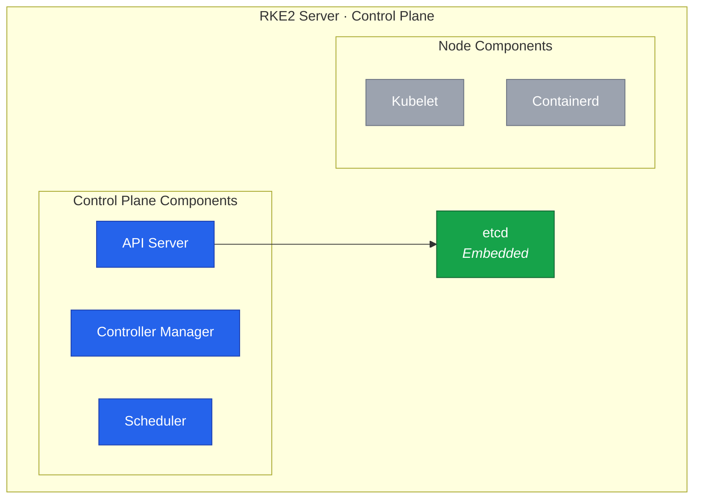

With networking and firewall configured, Node 4 is ready to run the first RKE2 control plane with dual-stack networking.
This establishes the foundation of Cluster B that will eventually replace the k3s cluster.





## Understanding RKE2

### Architecture Overview

RKE2 (also known as RKE Government) is a fully conformant Kubernetes distribution focused on security and compliance.
Unlike k3s which prioritizes minimal resource usage, RKE2 prioritizes security hardening and FIPS compliance.



Each RKE2 node runs as either a server (control plane) or an agent (worker), with the server embedding etcd directly.
The diagram above shows the components that make up a single RKE2 server node.

| Component   | Description                                                    |
| ----------- | -------------------------------------------------------------- |
| rke2-server | Control plane: API server, controller manager, scheduler, etcd |
| rke2-agent  | Worker node: kubelet and container runtime                     |
| etcd        | Embedded distributed key-value store for cluster state         |
| containerd  | Container runtime (Docker is not used)                         |

### Security Features

RKE2 includes several security features that we configure during initial setup.

Secrets encryption at rest protects Kubernetes secrets stored in etcd.
Enabling this later requires re-encrypting all existing secrets, so we enable it from the start.

Pod Security Standards (PSS) replace the deprecated PodSecurityPolicy and define three escalating profiles:

| Profile    | Description                                         |
| ---------- | --------------------------------------------------- |
| privileged | No restrictions (default)                           |
| baseline   | Prevents known privilege escalations                |
| restricted | Heavily restricted, follows security best practices |

We go with `restricted` from the start to enforce security best practices.
Starting strict avoids the effort of tightening policies later when workloads are already running.

Network policies are enforced by the CNI plugin.
Canal uses Calico's policy engine to provide L3-L4 network policies out of the box.

### Bundled Addons

RKE2 automatically installs several components as Helm charts during startup:

| Addon                            | Purpose                   | Our action |
| -------------------------------- | ------------------------- | ---------- |
| CNI plugin (Canal by default)    | Pod networking            | Keep       |
| rke2-coredns                     | Cluster DNS               | Keep       |
| rke2-metrics-server              | Resource metrics          | Keep       |
| rke2-ingress-nginx               | Ingress controller        | Disable    |
| rke2-snapshot-controller         | CSI volume snapshots      | Keep       |
| rke2-snapshot-controller-crd     | Snapshot custom resources | Keep       |
| rke2-snapshot-validation-webhook | Snapshot validation       | Keep       |

We disable `rke2-ingress-nginx` because k3s ships with Traefik as its default ingress controller.
Our existing Ingress and IngressRoute definitions already target Traefik, so deploying Traefik on the RKE2 cluster lets us reuse them without changes.

## Configuration Planning

### Network CIDRs

These CIDR ranges were planned in [Lesson 6](/guides/migrating-k3s-to-rke2-without-downtime/lesson-6) and cannot be changed after cluster creation:

| Network         | IPv4 CIDR    | IPv6 CIDR     |
| --------------- | ------------ | ------------- |
| Node Network    | 10.1.0.0/16  | fd00::/64     |
| Pod Network     | 10.42.0.0/16 | fd00:42::/56  |
| Service Network | 10.43.0.0/16 | fd00:43::/112 |
| Cluster DNS     | 10.43.0.10   | fd00:43::a    |

### Configuration Options

The RKE2 configuration file supports these key options for dual-stack:

| Option               | Purpose                                    |
| -------------------- | ------------------------------------------ |
| `token`              | Authenticates nodes joining the cluster    |
| `tls-san`            | Additional names/IPs for API server cert   |
| `cni`                | CNI plugin (Canal is the default)          |
| `node-ip`            | Node's IPs, comma-separated for dual-stack |
| `cluster-cidr`       | Pod network CIDRs, comma-separated         |
| `service-cidr`       | Service network CIDRs, comma-separated     |
| `cluster-dns`        | DNS service IP                             |
| `secrets-encryption` | Enable encryption at rest                  |

### File Locations

RKE2 stores its configuration, certificates, and data across several directories:

| Path                                      | Content             |
| ----------------------------------------- | ------------------- |
| `/etc/rancher/rke2/config.yaml.d/`        | RKE2 configuration  |
| `/etc/rancher/rke2/rke2.yaml`             | Kubeconfig file     |
| `/var/lib/rancher/rke2/bin/`              | Kubernetes binaries |
| `/var/lib/rancher/rke2/server/node-token` | Cluster join token  |
| `/var/lib/rancher/rke2/server/tls/`       | TLS certificates    |
| `/var/lib/rancher/rke2/server/db/`        | etcd data           |

## Installing RKE2

### Run the Installer

RKE2 provides an install script that downloads the correct binary for our architecture.
The available options and flags are documented in the [RKE2 installation guide](https://docs.rke2.io/install/).

```bash
$ curl -sfL https://get.rke2.io | sh -
[INFO]  finding release for channel stable
[INFO]  using 1.34 series from channel stable
Rancher RKE2 Common (stable)                                                                                                                                                                                                                                  4.0 kB/s | 659  B     00:00
Rancher RKE2 Common (stable)                                                                                                                                                                                                                                   29 kB/s | 2.4 kB     00:00
Importing GPG key 0xE257814A:
...

# Verify installation
$ rke2 --version
rke2 version v1.34.3+rke2r3 (7598946e0086a9131564ccbb3c142b3fa54516ad)
go version go1.24.11 X:boringcrypto
```

### Create Configuration

RKE2 reads configuration from `/etc/rancher/rke2/config.yaml` and `/etc/rancher/rke2/config.yaml.d/*.yaml` in alphabetical order.
Splitting settings into numbered files keeps each concern isolated and makes it easy to add or remove features later without editing a single monolithic file.

```bash
$ mkdir -p /etc/rancher/rke2/config.yaml.d
```

The network configuration sets up dual-stack node addressing, keeps API server traffic on the private vSwitch, and defines the pod and service CIDRs planned in [Lesson 6](/guides/migrating-k3s-to-rke2-without-downtime/lesson-6):

```yaml
# /etc/rancher/rke2/config.yaml.d/10-network.yaml

# Canal is the default CNI and auto-detects dual-stack from the cluster CIDRs
cni: canal

# Dual-stack node IPs on the private vSwitch interface
node-ip: 10.1.0.14,fd00::14
# Public IPs so Kubernetes knows how to reach this node externally
node-external-ip:
  - 135.181.XX.XX
  - 2a01:4f9:XX:XX::2
# Advertise the API server on the private vSwitch IP for cluster communication
advertise-address: 10.1.0.14
# Bind the API server to the private vSwitch IP
bind-address: 10.1.0.14

# Dual-stack pod and service CIDRs (cannot be changed after cluster creation)
cluster-cidr: 10.42.0.0/16,fd00:42::/56
service-cidr: 10.43.0.0/16,fd00:43::/112
cluster-dns: 10.43.0.10

# Use a clean resolv.conf so Tailscale's MagicDNS does not leak search domains into pods
kubelet-arg:
  - "resolv-conf=/etc/rancher/rke2/resolv.conf"
```

Kubelet normally reads the host's `/etc/resolv.conf` to build each pod's DNS configuration.
When Tailscale is installed on the host, it replaces `/etc/resolv.conf` with its MagicDNS proxy and adds search domains like `tailc7bf.ts.net` that leak into every pod.
Combined with the Kubernetes default of `ndots:5`, this causes pod DNS lookups for external hostnames to generate unnecessary queries against these search domains, leading to intermittent timeouts under concurrent load.
The `resolv-conf` kubelet argument points to a static file with only the upstream nameservers — we explain the full mechanism in [Lesson 6](/guides/migrating-k3s-to-rke2-without-downtime/lesson-6#isolating-host-dns-from-pod-dns).

Create the clean resolv.conf:

```bash
$ cat <<'EOF' | sudo tee /etc/rancher/rke2/resolv.conf
nameserver 1.1.1.1
nameserver 1.0.0.1
EOF
```

The external access configuration adds SANs to the API server certificate so `kubectl` can connect via hostname, IP, or a public DNS name without TLS errors:

```yaml
# /etc/rancher/rke2/config.yaml.d/20-external-access.yaml

tls-san:
  - node4
  - node4.k8s.local
  - 10.1.0.14
  - fd00::14
  - cluster.yourdomain.com # Optional: a public DNS name for external kubectl access

```

The security configuration enables secrets encryption from the start, disables bundled components we replace ourselves, and schedules automatic etcd backups:

```yaml
# /etc/rancher/rke2/config.yaml.d/30-security.yaml

# Encrypt secrets at rest in etcd, best enabled before storing any secrets
secrets-encryption: true

# Disable the bundled ingress controller since we will deploy Traefik later
disable:
  - rke2-ingress-nginx

# Automatic etcd snapshots every 6 hours, keeping the last 5
etcd-snapshot-schedule-cron: "0 */6 * * *"
etcd-snapshot-retention: 5
```

### Start RKE2

Enable the service so it starts on boot, then start it:

```bash
$ systemctl enable rke2-server.service
Created symlink '/etc/systemd/system/multi-user.target.wants/rke2-server.service' → '/usr/lib/systemd/system/rke2-server.service'.
$ systemctl start rke2-server.service

$ journalctl -u rke2-server -f
...
rke2[108343]: time="2026-02-15T01:12:50+02:00" level=info msg="rke2 is up and running"
systemd[1]: Started rke2-server.service - Rancher Kubernetes Engine v2 (server).
...
```

The first start takes several minutes as RKE2 downloads images, initializes etcd, and generates certificates.
Wait until the log shows the API server is ready:

```bash
rke2[108343]: time="2026-02-15T01:12:47+02:00" level=info msg="Kube API server is now running"
```

Press `Ctrl+C` to exit the log view.

After startup, RKE2 generates a cluster join token at `/var/lib/rancher/rke2/server/node-token`.
This token is needed when registering additional server or agent nodes to the cluster.

### Configure kubectl

RKE2 generates a kubeconfig file at `/etc/rancher/rke2/rke2.yaml` and places the `kubectl` binary in `/var/lib/rancher/rke2/bin/`.
We copy the kubeconfig to the standard location and add the binary path to our shell:

```bash
# Create the kubeconfig directory with the correct permissions
$ mkdir -p ~/.kube
$ cp /etc/rancher/rke2/rke2.yaml ~/.kube/config
$ chown $(id -u):$(id -g) ~/.kube/config
$ chmod 600 ~/.kube/config

# Add kubectl to PATH
$ echo 'export PATH=$PATH:/var/lib/rancher/rke2/bin' >> ~/.bashrc
$ export PATH=$PATH:/var/lib/rancher/rke2/bin

# Verify kubectl can connect to the cluster
$ kubectl version
Client Version: v1.34.3+rke2r3
Kustomize Version: v5.7.1
Server Version: v1.34.3+rke2r3
```

### Install etcdctl

RKE2 embeds etcd as a static pod but does not ship the `etcdctl` CLI on the host.
We need `etcdctl` to inspect cluster health, list members, and debug issues — tasks that become essential once additional control plane nodes join.

Query the etcd pod image to determine the running version:

```bash
$ kubectl -n kube-system get pod -l component=etcd -o jsonpath='{.items[0].spec.containers[0].image}'
index.docker.io/rancher/hardened-etcd:v3.6.7-k3s1-build20260126
```

Download and install the corresponding `etcdctl` release:

```bash
# Replace with the version from the previous command
$ export ETCD_VER=v3.6.7
$ curl -fL https://storage.googleapis.com/etcd/${ETCD_VER}/etcd-${ETCD_VER}-linux-amd64.tar.gz \
    -o /tmp/etcd-linux-amd64.tar.gz
$ mkdir -p /tmp/etcd-download
$ tar xzf /tmp/etcd-linux-amd64.tar.gz -C /tmp/etcd-download --strip-components=1
$ cp /tmp/etcd-download/etcdctl /usr/local/bin/
$ rm -rf /tmp/etcd-download /tmp/etcd-linux-amd64.tar.gz

$ /usr/local/bin/etcdctl version
etcdctl version: 3.6.7
API version: 3.6
```

Every `etcdctl` command against RKE2's etcd requires TLS certificate flags.
A shell alias keeps these out of the way:

```bash
$ cat <<'EOF' >> ~/.bashrc
alias etcdctl='/usr/local/bin/etcdctl \
  --endpoints=https://127.0.0.1:2379 \
  --cacert=/var/lib/rancher/rke2/server/tls/etcd/server-ca.crt \
  --cert=/var/lib/rancher/rke2/server/tls/etcd/server-client.crt \
  --key=/var/lib/rancher/rke2/server/tls/etcd/server-client.key'
EOF
$ source ~/.bashrc
```

## Verification

### Cluster Status

Check that the node is registered with the cluster:

```bash
$ kubectl get nodes -o wide
NAME   STATUS   ROLES                AGE   VERSION          INTERNAL-IP   EXTERNAL-IP     OS-IMAGE                        KERNEL-VERSION                  CONTAINER-RUNTIME
node4   Ready    control-plane,etcd   10m   v1.34.3+rke2r3   10.1.0.14      135.181.1.252   Rocky Linux 10.1 (Red Quartz)   6.12.0-124.27.1.el10_1.x86_64   containerd://2.1.5-k3s1
```

The node may initially show `NotReady` while Canal deploys, then transition to `Ready` when the cluster is fully operational.

### Dual-Stack Configuration

Verify the node has both IPv4 and IPv6 addresses registered:

```bash
$ kubectl get nodes -o jsonpath='{.items[*].status.addresses}' | jq .
[
  {
    "address": "10.1.0.14",
    "type": "InternalIP"
  },
  {
    "address": "fd00::14",
    "type": "InternalIP"
  },
  {
    "address": "135.181.X.X",
    "type": "ExternalIP"
  },
  {
    "address": "2a01:4f9:X:X::2",
    "type": "ExternalIP"
  },
  {
    "address": "node4",
    "type": "Hostname"
  }
]
```

We should see both `InternalIP` entries — one for `10.1.0.14` and one for `fd00::14`.

Confirm the cluster CIDR configuration matches what we planned:

```bash
$ kubectl cluster-info dump | grep -E "cluster-cidr|service-cluster-ip-range"
                            "--cluster-cidr=10.42.0.0/16,fd00:42::/56",
                            "--service-cluster-ip-range=10.43.0.0/16,fd00:43::/112",
                            "--cluster-cidr=10.42.0.0/16,fd00:42::/56",
                            "--service-cluster-ip-range=10.43.0.0/16,fd00:43::/112",
                            "--cluster-cidr=10.42.0.0/16,fd00:42::/56",
```

The output shows both IPv4 and IPv6 CIDRs for `cluster-cidr` and `service-cluster-ip-range`.

### etcd Health

Verify the embedded etcd instance is healthy using the `etcdctl` alias we configured earlier:

```bash
$ etcdctl endpoint health --cluster --write-out=table
+-----------------------+--------+------------+-------+
|       ENDPOINT        | HEALTH |    TOOK    | ERROR |
+-----------------------+--------+------------+-------+
| https://10.1.0.14:2379 |   true | 2.527854ms |       |
+-----------------------+--------+------------+-------+
```

A single-node cluster shows one endpoint.
As we add control plane nodes in later lessons, this table grows to three entries.

## Configuring CoreDNS Upstream DNS

RKE2 bundles CoreDNS as its cluster DNS service.
By default, CoreDNS forwards external DNS queries to whatever nameservers are listed in the node's `/etc/resolv.conf`.
This works on most systems, but tools like Tailscale, VPN clients, and NetworkManager can overwrite `/etc/resolv.conf` with addresses that are only reachable from the host network namespace — not from inside pods.

On our node, Tailscale has replaced `/etc/resolv.conf` with its MagicDNS resolver at `100.100.100.100`.
CoreDNS pods cannot reach this address because Tailscale's DNS listener binds to the host network, not the pod network.
Internal lookups like `kubernetes.default.svc.cluster.local` still work because CoreDNS resolves those directly, but any external domain — container registries, Helm repositories, package mirrors — fails with `server misbehaving`.

The fix is to override CoreDNS's upstream forwarder with explicit public DNS servers using a `HelmChartConfig` resource — the same mechanism we use for Canal in [Lesson 9](/guides/migrating-k3s-to-rke2-without-downtime/lesson-9).

Create the manifest at `/var/lib/rancher/rke2/server/manifests/rke2-coredns-config.yaml`:

```yaml
# /var/lib/rancher/rke2/server/manifests/rke2-coredns-config.yaml
apiVersion: helm.cattle.io/v1
kind: HelmChartConfig
metadata:
  name: rke2-coredns
  namespace: kube-system
spec:
  valuesContent: |-
    servers:
    - zones:
      - zone: .
      port: 53
      plugins:
      - name: errors
      - name: health
        configBlock: |-
          lameduck 5s
      - name: ready
      - name: kubernetes
        parameters: cluster.local in-addr.arpa ip6.arpa
        configBlock: |-
          pods insecure
          fallthrough in-addr.arpa ip6.arpa
          ttl 30
      - name: prometheus
        parameters: 0.0.0.0:9153
      - name: forward
        parameters: . 1.1.1.1 1.0.0.1 2606:4700:4700::1111 2606:4700:4700::1001
      - name: cache
        parameters: 30
      - name: loop
      - name: reload
      - name: loadbalance
```

The critical change is `forward . 1.1.1.1 1.0.0.1 2606:4700:4700::1111 2606:4700:4700::1001` which replaces the default `forward . /etc/resolv.conf`.
CoreDNS queries Cloudflare DNS directly over both IPv4 and IPv6, bypassing whatever the host's resolv.conf contains.

RKE2 detects the new manifest and upgrades the CoreDNS Helm release automatically.
Restart the deployment to apply the change:

```bash
$ kubectl rollout restart deployment rke2-coredns-rke2-coredns -n kube-system
$ kubectl rollout status deployment rke2-coredns-rke2-coredns -n kube-system --timeout=60s
deployment "rke2-coredns-rke2-coredns" successfully rolled out
```

Verify that external DNS resolution works from within the cluster:

```bash
$ kubectl run dns-test -n kube-system --rm -it --image=busybox:1.36 --restart=Never -- nslookup charts.longhorn.io
Server:         10.43.0.10
Address:        10.43.0.10:53

Non-authoritative answer:
charts.longhorn.io      canonical name = longhorn.github.io
Name:   longhorn.github.io
Address: 2606:50c0:8000::153
Name:   longhorn.github.io
Address: 2606:50c0:8001::153
Name:   longhorn.github.io
Address: 2606:50c0:8003::153
Name:   longhorn.github.io
Address: 2606:50c0:8002::153

Non-authoritative answer:
charts.longhorn.io      canonical name = longhorn.github.io
Name:   longhorn.github.io
Address: 185.199.110.153
Name:   longhorn.github.io
Address: 185.199.109.153
Name:   longhorn.github.io
Address: 185.199.108.153
Name:   longhorn.github.io
Address: 185.199.111.153

pod "dns-test" deleted from kube-system namespace
```

If the lookup returns addresses, CoreDNS is forwarding correctly and the cluster can reach external services.

## Create Initial Backup

Before making any further changes, we back up the configuration files and take an etcd snapshot:

```bash
$ mkdir -p /root/rke2-backup
$ chmod 700 /root/rke2-backup
$ cp -r /etc/rancher/rke2/config.yaml.d /root/rke2-backup/
$ cp /var/lib/rancher/rke2/server/node-token /root/rke2-backup/
$ cp ~/.kube/config /root/rke2-backup/kubeconfig

$ rke2 etcd-snapshot save --name initial-setup
```

This gives us a restore point in case anything goes wrong during subsequent configuration.

## Troubleshooting

### RKE2 Fails to Start

If the service fails to start, check the status and logs for details:

```bash
$ systemctl status rke2-server
$ journalctl -xeu rke2-server
```

The most common cause is port `6443` already being in use by an existing k3s or Kubernetes installation.
Firewall rules blocking required ports can also prevent startup — check that the vSwitch rule from Lesson 4 is in place.
Another frequent issue is invalid CIDR format in the dual-stack configuration: IPv4 and IPv6 ranges must be comma-separated without spaces.

### Dual-Stack Issues

If pods are not receiving IPv6 addresses or the API server rejects dual-stack configurations, verify that IPv6 is enabled on the system — the value should be `0`:

```bash
$ sysctl net.ipv6.conf.all.disable_ipv6
```

Also confirm the API server certificate includes the IPv6 SAN entries we configured:

```bash
$ openssl s_client -connect 127.0.0.1:6443 -showcerts </dev/null 2>/dev/null | \
  openssl x509 -noout -text | grep -A1 "Subject Alternative Name"
```

If `fd00::14` is missing from the output, the `tls-san` entries in the configuration may not have been applied before the first start.

### Canal Flannel CrashLoopBackOff

If the `rke2-canal` pod shows `CrashLoopBackOff` with only the `kube-flannel` container failing, check its logs:

```bash
$ kubectl -n kube-system logs -l k8s-app=canal -c kube-flannel
```

The error `failed to get default v6 interface: unable to find default v6 route` means the host has no IPv6 default route.
Flannel auto-detects which interface to use by looking for a default route, and without one for IPv6 it refuses to start.

Verify whether a default IPv6 route exists:

```bash
$ ip -6 route show default
```

If the output is empty, the public interface is missing its IPv6 configuration.
Follow the "Configuring Public IPv6" section in [Lesson 6](/guides/migrating-k3s-to-rke2-without-downtime/lesson-6) to add the address and gateway, then delete the failing pod to force a restart:

```bash
$ kubectl -n kube-system delete pod -l k8s-app=canal
```

### etcd Issues

Check the etcd-related log entries and ensure the data directory has sufficient disk space:

```bash
$ journalctl -u rke2-server | grep etcd
$ df -h /var/lib/rancher/rke2/
```

The node may briefly show `NotReady` while Canal finishes deploying.
Once the Canal pods are running, the node transitions to `Ready`.
