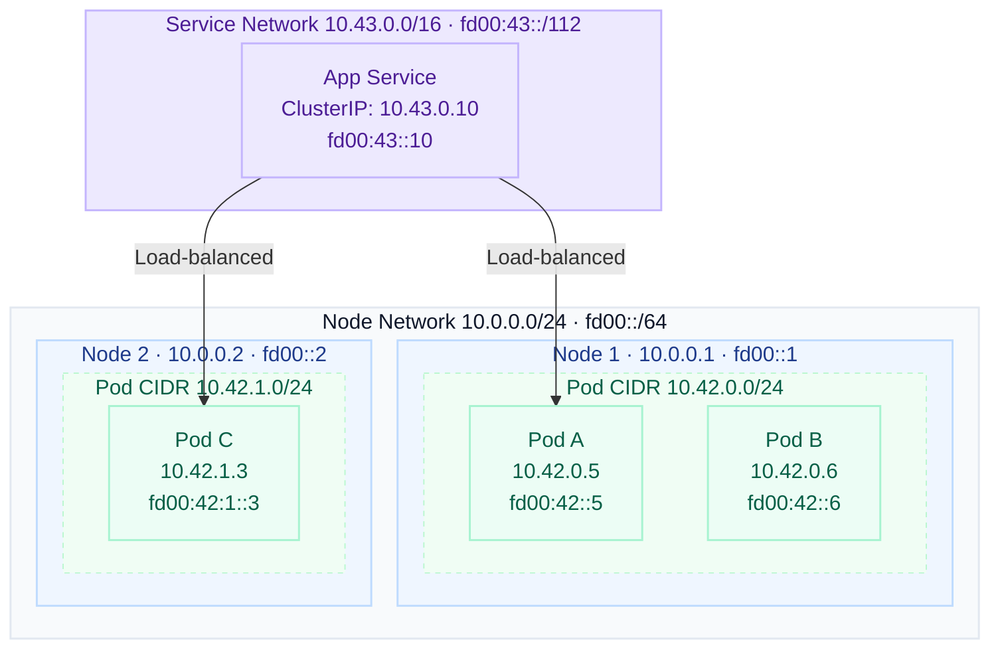
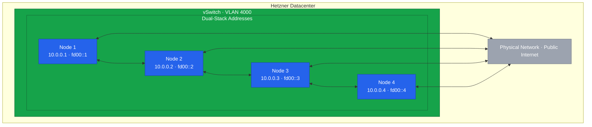

Hetzner's vSwitch provides Layer 2 private networking between dedicated servers, allowing cluster nodes to communicate without traversing the public internet.
Before we can use this private network for Kubernetes, we need to make an important architectural decision: should we configure IPv4 only, or invest the extra effort now to support both IPv4 and IPv6?



## Understanding Dual-Stack Networking

### Why Dual-Stack Matters

Kubernetes networking configuration is deeply embedded in your cluster's DNA.
The CIDR ranges you choose become part of certificates, etcd data, and running workloads, making them nearly impossible to change without rebuilding the entire cluster.
This permanence means that adding IPv6 support later isn't a simple configuration change—it requires migrating to a completely new cluster.

Since we're already building a new cluster to migrate from k3s to RKE2, this is the ideal time to future-proof our networking.
Dual-stack gives us IPv4 compatibility for existing services while preparing for the gradual transition to IPv6 as addresses become scarcer and more services adopt the newer protocol.
The additional configuration effort is minimal compared to the cost of rebuilding later.

### Kubernetes Network Architecture

Every Kubernetes cluster operates across three distinct network ranges, each serving a specific purpose and requiring its own CIDR allocation.
The node network consists of the actual IP addresses assigned to your physical or virtual machines—in our case, the vSwitch addresses we'll configure in this lesson.
The pod network provides addresses for individual containers, with each node receiving a subnet from which it allocates IPs to pods it runs.
Finally, the service network gives stable virtual IPs to Kubernetes Services, allowing pods to discover and communicate with each other through consistent addresses even as the underlying pods come and go.

These three networks must never overlap, and in a dual-stack cluster, each one needs both an IPv4 and IPv6 CIDR range.

| Network         | Purpose                                            |
| --------------- | -------------------------------------------------- |
| Node Network    | Physical or virtual IPs assigned to cluster nodes  |
| Pod Network     | Virtual IPs assigned to individual pods            |
| Service Network | Virtual IPs for Kubernetes Services (ClusterIP/LB) |

**Example:**



The diagram illustrates how these networks interact: each node receives a subnet from the pod CIDR (Node 1 uses 10.42.0.x while Node 2 uses 10.42.1.x), and the CNI plugin assigns individual pod addresses from that per-node range.
Services sit above this layer, providing stable virtual IPs that load-balance traffic across pods regardless of which node they're running on.

### CNI and Dual-Stack Support

The Container Network Interface (CNI) plugin is responsible for all pod networking—assigning addresses, configuring routes, and handling network policies.
Your choice of CNI directly impacts how well dual-stack works in practice, as not all plugins implement both address families equally well.

RKE2 bundles [Canal](https://docs.rke2.io/networking/basic_network_options) as its default CNI, which combines Flannel for inter-node traffic with Calico for intra-node traffic and network policies.
Canal auto-detects dual-stack from the cluster CIDRs and requires no additional configuration.

We'll use Canal throughout this guide since it is the RKE2 default, supports dual-stack out of the box, and provides Calico's network policy engine for L3-L4 security.

### IP Family Preference

When you create a Kubernetes Service in a dual-stack cluster, you need to decide how it handles the two address families.
Kubernetes offers three policies: `SingleStack` assigns only one family (IPv4 or IPv6), `RequireDualStack` demands both families and fails if either is unavailable, and `PreferDualStack` requests both but gracefully falls back if one isn't available.

For maximum compatibility, we'll configure our cluster with `PreferDualStack` and list IPv4 first.
This means services receive both addresses with IPv4 as the primary, ensuring existing IPv4-only clients continue working while IPv6-capable clients can use the newer protocol.

### NAT64 Considerations

A common question when planning dual-stack is whether you need NAT64 or DNS64 to reach IPv4-only external services like `github.com` from pods that might prefer IPv6.
The answer, in a true dual-stack environment, is no—every pod has both an IPv4 and an IPv6 address, so when DNS resolution returns only an A record (IPv4), the pod simply uses its IPv4 address to make the connection.
The kernel handles this address family selection automatically based on what DNS returns.

NAT64 becomes necessary only in pure IPv6 environments where nodes have no IPv4 connectivity at all.
Since our Hetzner dedicated servers have both IPv4 and IPv6 on the public interface and we're configuring dual-stack on the vSwitch, this complexity doesn't apply to us.

## Hetzner vSwitch Architecture

### How vSwitch Works

Hetzner's vSwitch service creates a private Layer 2 network segment connecting dedicated servers within the same datacenter.
Unlike traffic over the public internet, communication through the vSwitch flows directly between servers at wire speed, never leaving Hetzner's internal infrastructure.
This makes it ideal for Kubernetes cluster traffic where nodes need to exchange large volumes of data with minimal latency.



The diagram shows how each server maintains two distinct network paths: a connection to the public internet for external traffic, and the private vSwitch for inter-node communication.
Since vSwitch uses VLAN tagging to separate traffic from other customers, you'll need to create a VLAN subinterface on each node to access it.

### Security Characteristics

While the vSwitch provides logical isolation through VLAN tagging, it's important to understand what this means for security.
The physical network infrastructure is shared across Hetzner customers, with VLAN segmentation preventing direct access between tenants—but the traffic itself travels unencrypted over the shared switches.
This is generally acceptable for a private datacenter network, but for defense in depth we'll add encryption at the cluster level using Canal's WireGuard support in a later lesson.

### ULA Addresses for IPv6

For our private IPv6 addresses, we'll use Unique Local Addresses (ULA) from the `fd00::/8` range.
Think of ULA as the IPv6 equivalent of familiar private IPv4 ranges like `10.0.0.0/8` or `192.168.0.0/16`—they're guaranteed not to be routable on the public internet, making them safe to use for internal cluster communication without worrying about conflicts with globally routable addresses.

## Planning Your Network

### CIDR Allocation

Before touching any configuration files, take time to document your chosen CIDR ranges.
These values will appear in multiple places throughout the cluster setup—the vSwitch configuration, RKE2 settings, and firewall rules—and inconsistencies between them are a common source of subtle networking failures that can be difficult to debug.

| Network         | IPv4 CIDR    | IPv6 CIDR     | Purpose                  |
| --------------- | ------------ | ------------- | ------------------------ |
| Node Network    | 10.0.0.0/24  | fd00::/64     | vSwitch inter-node comms |
| Pod Network     | 10.42.0.0/16 | fd00:42::/56  | IP addresses for pods    |
| Service Network | 10.43.0.0/16 | fd00:43::/112 | ClusterIP services       |

#### Understanding IPv6 CIDR Sizing

Kubernetes allocates each node a `/64` subnet from the cluster's pod CIDR, and a `/64` contains 2^64 addresses, which is a number so vast that even running 10,000 pods on a single node would use a negligible fraction.
The practical limit on pods per node comes from CPU, memory, and kubelet configuration, not from address space.

The real constraint is how many `/64` subnets fit within your cluster's pod CIDR:

| Cluster Pod CIDR | Max Nodes (with /64 per node) |
| ---------------- | ----------------------------- |
| `/56`            | 256                           |
| `/52`            | 4,096                         |
| `/48`            | 65,536                        |

We've chosen `/56` for this guide because 256 nodes comfortably exceeds what most organizations need, even accounting for growth.
If you're building infrastructure that might eventually scale beyond that, consider using `/48` instead - there's no practical downside to the larger range, just a longer prefix to type.

For the service network, `/112` provides 65,536 addresses, deliberately matching the capacity of our IPv4 `/16` service range.
Most clusters use only a few hundred services at most, so this is more than sufficient.

### Node Address Assignment

For clarity and easier troubleshooting, assign each node a consistent address across both address families.
Using the same final octet/segment (node1 gets .1 and ::1, node2 gets .2 and ::2) makes it obvious which addresses belong to which node when you're debugging network issues at 2 AM.

| Node  | IPv4 Address | IPv6 Address |
| ----- | ------------ | ------------ |
| node1 | 10.0.0.1     | fd00::1      |
| node2 | 10.0.0.2     | fd00::2      |
| node3 | 10.0.0.3     | fd00::3      |
| node4 | 10.0.0.4     | fd00::4      |

### Ingress Planning

Whatever ingress controller and load balancer you choose must support dual-stack from day one—retrofitting this later creates the same migration headaches we discussed earlier.
Traefik handles dual-stack natively without special configuration, and Hetzner's Cloud Load Balancer can target both IPv4 and IPv6 backends.
If you prefer MetalLB for bare-metal load balancing, be aware that it requires separate address pools for each address family.

We'll configure Traefik with the Hetzner Cloud Load Balancer in later lessons, but keep these requirements in mind if you plan to substitute different components.

### Existing Infrastructure

If you're following this guide with an existing k3s cluster, your nodes likely already have IPv4 addresses on the vSwitch but no IPv6.
That's expected—we'll configure node4 with dual-stack from the start, and add IPv6 to the existing nodes when we migrate each one to RKE2 in later lessons.
This approach avoids touching the running k3s cluster's networking until we're ready to migrate each node.

## Prerequisites

Before proceeding with the configuration, verify that your Hetzner infrastructure is ready.
You should have already created a vSwitch in the Hetzner Robot console, added all your servers to it, and noted the VLAN ID it uses (we're using 4000 throughout this guide, but yours may differ).
Make sure you've documented your chosen IP ranges as shown in the tables above—you'll reference them repeatedly throughout the configuration process.

## Configuring the vSwitch Interface

With the planning complete, we can now configure the actual network interface.
The vSwitch appears as a VLAN on your server's physical network interface, so the first step is identifying which interface to use.

### Identifying the Network Interface

List the network interfaces on your server to see what's available:

```bash
1: lo: <LOOPBACK,UP,LOWER_UP> mtu 65536 qdisc noqueue state UNKNOWN mode DEFAULT group default qlen 1000
    link/loopback 00:00:00:00:00:00 brd 00:00:00:00:00:00
2: enp5s0f3u2u2c2: <BROADCAST,MULTICAST,UP,LOWER_UP> mtu 1500 qdisc fq_codel state UNKNOWN mode DEFAULT group default qlen 1000
    link/ether 4a:d7:b5:34:aa:ce brd ff:ff:ff:ff:ff:ff
    altname enx4ad7b534aace
3: enp195s0: <BROADCAST,MULTICAST,UP,LOWER_UP> mtu 1500 qdisc mq state UP mode DEFAULT group default qlen 1000
    link/ether d4:5d:64:08:e8:30 brd ff:ff:ff:ff:ff:ff
    altname enxd45d6408e830
4: tailscale0: <POINTOPOINT,MULTICAST,NOARP,UP,LOWER_UP> mtu 1280 qdisc fq_codel state UNKNOWN mode DEFAULT group default qlen 500
    link/none
```

The interface names vary depending on your server's hardware, but you're looking for the one carrying your public IP address.
Run `ip addr show` and find the interface with an address like `135.181.x.x` - that's your main network interface, and the vSwitch VLAN will be created as a subinterface on it.

```bash
$ ip addr show
1: lo: <LOOPBACK,UP,LOWER_UP> mtu 65536 qdisc noqueue state UNKNOWN group default qlen 1000
    link/loopback 00:00:00:00:00:00 brd 00:00:00:00:00:00
    inet 127.0.0.1/8 scope host lo
       valid_lft forever preferred_lft forever
    inet6 ::1/128 scope host noprefixroute
       valid_lft forever preferred_lft forever
2: enp5s0f3u2u2c2: <BROADCAST,MULTICAST,UP,LOWER_UP> mtu 1500 qdisc fq_codel state UNKNOWN group default qlen 1000
    link/ether 4a:d7:b5:34:aa:ce brd ff:ff:ff:ff:ff:ff
    altname enx4ad7b534aace
    inet6 fe80::d9e6:c53b:7c65:ca8c/64 scope link noprefixroute
       valid_lft forever preferred_lft forever
3: enp195s0: <BROADCAST,MULTICAST,UP,LOWER_UP> mtu 1500 qdisc mq state UP group default qlen 1000
    link/ether d4:5d:64:08:e8:30 brd ff:ff:ff:ff:ff:ff
    altname enxd45d6408e830
    inet 135.181.1.252/26 brd 135.181.1.255 scope global dynamic noprefixroute enp195s0
       valid_lft 31318sec preferred_lft 31318sec
    inet6 fe80::81d8:8f88:4416:3876/64 scope link noprefixroute
       valid_lft forever preferred_lft forever
4: tailscale0: <POINTOPOINT,MULTICAST,NOARP,UP,LOWER_UP> mtu 1280 qdisc fq_codel state UNKNOWN group default qlen 500
    link/none
    inet 100.122.121.38/32 scope global tailscale0
       valid_lft forever preferred_lft forever
    inet6 fd7a:115c:a1e0::e332:7926/128 scope global
       valid_lft forever preferred_lft forever
    inet6 fe80::4b3c:4678:6c60:e7b1/64 scope link stable-privacy proto kernel_ll
       valid_lft forever preferred_lft forever
```

### Creating the VLAN Interface

Rocky Linux 10 uses NetworkManager for all network configuration, which makes creating VLAN interfaces straightforward.
The following command creates a new VLAN subinterface with both IPv4 and IPv6 addresses configured:

```bash
# Replace enp195s0 with your actual interface name
# Replace 4000 with your VLAN ID
# Replace addresses with your node's assigned IPs

$ sudo nmcli connection add \
    type vlan \
    con-name vswitch \
    dev enp195s0 \
    id 4000 \
    ipv4.method manual \
    ipv4.addresses 10.0.0.4/24 \
    ipv6.method manual \
    ipv6.addresses fd00::4/64
Connection 'vswitch' (2ecf2e01-122a-4ce2-b786-f4d41fe459cf) successfully added.

$ sudo nmcli connection up vswitch
Connection successfully activated (D-Bus active path: /org/freedesktop/NetworkManager/ActiveConnection/1997)
```

After bringing up the connection, verify that both addresses are properly assigned:

```bash
$ ip addr show enp195s0.4000
5: enp195s0.4000@enp195s0: <BROADCAST,MULTICAST,UP,LOWER_UP> mtu 1500 qdisc noqueue state UP group default qlen 1000
    link/ether d4:5d:64:08:e8:30 brd ff:ff:ff:ff:ff:ff
    inet 10.0.0.4/24 brd 10.0.0.255 scope global noprefixroute enp195s0.4000
       valid_lft forever preferred_lft forever
    inet6 fd00::4/64 scope global noprefixroute
       valid_lft forever preferred_lft forever
    inet6 fe80::cad:c5f2:6cc4:d67b/64 scope link noprefixroute
       valid_lft forever preferred_lft forever
```

You should see both an `inet` line with your IPv4 address and an `inet6` line with your IPv6 ULA address.
If either is missing, check the nmcli command for typos before proceeding.

### Configuring Public IPv6

Hetzner assigns each dedicated server an IPv6 subnet (typically a `/64`), but Rocky Linux's default DHCP configuration only picks up the IPv4 address automatically.
Without a public IPv6 address and default route, services like Canal's Flannel component fail to detect a valid IPv6 interface—and any workload attempting outbound IPv6 connections will have no route to the internet.

You can find your assigned IPv6 subnet in the Hetzner Robot panel under your server's IPs tab.
Configure it on the public interface by setting the address, prefix, and gateway:

```bash
# Replace "Wired connection 1" with your connection name (run nmcli connection to check)
# Replace the address with your assigned IPv6 from Hetzner
$ nmcli connection modify "Wired connection 1" \
    ipv6.method manual \
    ipv6.addresses "2a01:4f9:XX:XX::2/64" \
    ipv6.gateway "fe80::1"
$ nmcli connection up "Wired connection 1"
```

Hetzner uses `fe80::1` as the IPv6 gateway across all dedicated servers.
After applying the change, verify that both the address and default route are in place:

```bash
$ ip -6 addr show dev enp195s0
3: enp195s0: <BROADCAST,MULTICAST,UP,LOWER_UP> mtu 1500 qdisc mq state UP group default qlen 1000
    altname enxd45d6408e830
    inet6 2a01:4f9:XX:XX::2/64 scope global noprefixroute
       valid_lft forever preferred_lft forever
    inet6 fe80::81d8:8f88:4416:3876/64 scope link noprefixroute
       valid_lft forever preferred_lft forever

$ ip -6 route show default
default via fe80::1 dev enp195s0 proto static metric 103 pref medium
```

You should see your public IPv6 address with `scope global` and a default route via `fe80::1`.

### Enabling IPv6 Forwarding

By default, Linux doesn't forward IPv6 packets between interfaces—it only handles traffic destined for itself.
Kubernetes needs forwarding enabled so that pod traffic can flow between nodes:

```bash
$ sudo tee /etc/sysctl.d/99-ipv6-forward.conf <<EOF
net.ipv6.conf.all.forwarding = 1
net.ipv6.conf.default.forwarding = 1
EOF
$ sudo sysctl -p /etc/sysctl.d/99-ipv6-forward.conf
net.ipv6.conf.all.forwarding = 1
net.ipv6.conf.default.forwarding = 1
```

## Verifying Connectivity

Before moving on to firewall configuration, verify that the vSwitch is working correctly.
These tests should be run from node4 (the node we just configured) to confirm it can reach the existing nodes.

### Testing IPv4

Start with IPv4 to confirm node4 can communicate with the existing cluster nodes over the vSwitch:

```bash
$ ping -c 3 10.0.0.1 # Node 1
PING 10.0.0.1 (10.0.0.1) 56(84) bytes of data.
64 bytes from 10.0.0.1: icmp_seq=1 ttl=64 time=0.351 ms
64 bytes from 10.0.0.1: icmp_seq=2 ttl=64 time=0.182 ms
64 bytes from 10.0.0.1: icmp_seq=3 ttl=64 time=0.175 ms

--- 10.0.0.1 ping statistics ---
3 packets transmitted, 3 received, 0% packet loss, time 2027ms
rtt min/avg/max/mdev = 0.175/0.236/0.351/0.081 ms
$ ping -c 3 10.0.0.2 # Node 2
PING 10.0.0.2 (10.0.0.2) 56(84) bytes of data.
64 bytes from 10.0.0.2: icmp_seq=1 ttl=64 time=2.70 ms
64 bytes from 10.0.0.2: icmp_seq=2 ttl=64 time=0.215 ms
64 bytes from 10.0.0.2: icmp_seq=3 ttl=64 time=0.195 ms

--- 10.0.0.2 ping statistics ---
3 packets transmitted, 3 received, 0% packet loss, time 2043ms
rtt min/avg/max/mdev = 0.195/1.036/2.700/1.176 ms

$ ping -c 3 10.0.0.3 # Node 3
PING 10.0.0.3 (10.0.0.3) 56(84) bytes of data.
64 bytes from 10.0.0.3: icmp_seq=1 ttl=64 time=0.437 ms
64 bytes from 10.0.0.3: icmp_seq=2 ttl=64 time=0.421 ms
64 bytes from 10.0.0.3: icmp_seq=3 ttl=64 time=0.585 ms

--- 10.0.0.3 ping statistics ---
3 packets transmitted, 3 received, 0% packet loss, time 2087ms
rtt min/avg/max/mdev = 0.421/0.481/0.585/0.073 ms
```

All three should succeed since the existing nodes already have IPv4 configured on the vSwitch.

### Testing IPv6

Since the existing nodes don't have IPv6 on their vSwitch interfaces yet, you can only verify that node4's IPv6 configuration is correct by checking the interface:

```bash
$ ip -6 addr show enp195s0.4000
7: enp195s0.4000@enp195s0: <BROADCAST,MULTICAST,UP,LOWER_UP> mtu 1500 qdisc noqueue state UP group default qlen 1000
    inet6 fd00::4/64 scope global noprefixroute
       valid_lft forever preferred_lft forever
    inet6 fe80::cad:c5f2:6cc4:d67b/64 scope link noprefixroute
       valid_lft forever preferred_lft forever
```

You should see your ULA address (`fd00::4/64`) listed.
Full IPv6 connectivity testing will become possible as we migrate each node and add IPv6 to their vSwitch interfaces in later lessons.
