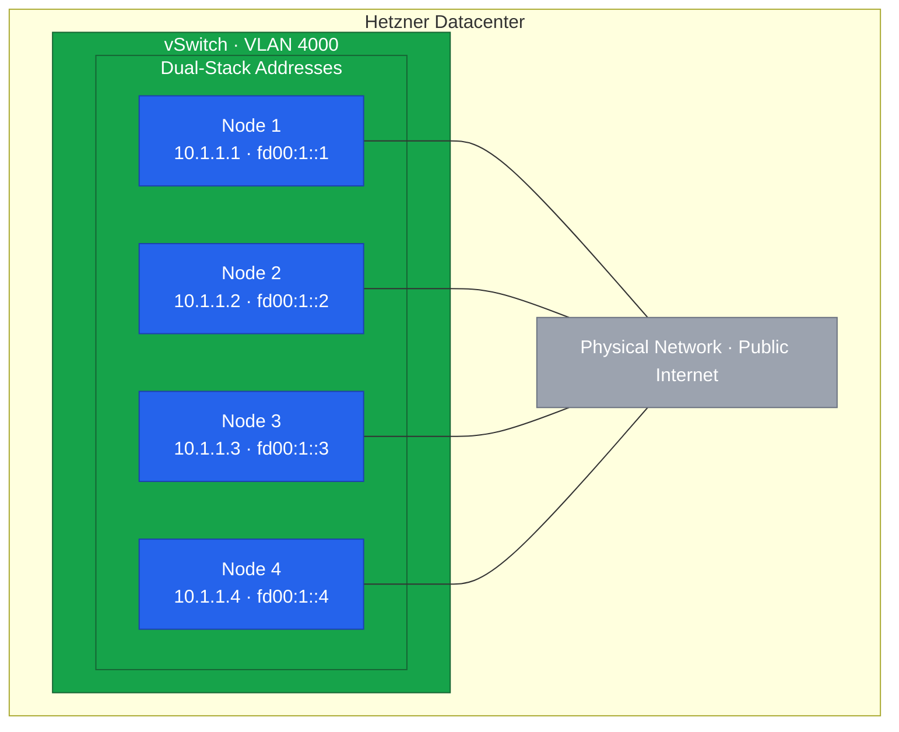

Hetzner's vSwitch provides Layer 2 private networking between dedicated servers.
In this lesson, we'll configure dual-stack networking (IPv4 + IPv6) to future-proof our cluster while maintaining compatibility with IPv4-only services.



## Understanding Dual-Stack Networking

### Why Dual-Stack Matters

Kubernetes cluster networking CIDRs are embedded in certificates, etcd data, and running workloads.
Changing from single-stack to dual-stack later requires a complete cluster rebuild.
Since we're building a new cluster anyway, this is the perfect opportunity to future-proof it.

Dual-stack networking provides:

- IPv4 compatibility with existing services and external APIs
- IPv6 readiness as IPv4 addresses become scarcer
- Larger address space for pods and services
- No NAT required for IPv6 traffic

### Kubernetes Network Architecture

A Kubernetes cluster uses three distinct network ranges that must not overlap:

| Network         | Purpose                                            |
| --------------- | -------------------------------------------------- |
| Node Network    | Physical or virtual IPs assigned to cluster nodes  |
| Pod Network     | Virtual IPs assigned to individual pods            |
| Service Network | Virtual IPs for Kubernetes Services (ClusterIP/LB) |

In a dual-stack cluster, each network has both IPv4 and IPv6 CIDR ranges.
The node network uses the vSwitch addresses we configure in this lesson.
The pod and service networks are configured during RKE2 installation.

### CNI and Dual-Stack Support

The Container Network Interface (CNI) plugin manages pod networking.
Not all CNIs support dual-stack equally:

- Cilium has excellent dual-stack support with eBPF, native routing, and WireGuard encryption
- Calico supports dual-stack but requires more configuration
- Flannel has limited dual-stack support

We'll use Cilium for its superior dual-stack implementation and observability features.

### IP Family Preference

Kubernetes supports three IP family policies for Services:

- `SingleStack` - Services get only IPv4 or only IPv6
- `PreferDualStack` - Services get both families, preferring the first listed
- `RequireDualStack` - Services must have both families or fail

With `PreferDualStack` and IPv4 listed first, services get both addresses with IPv4 as primary.
This provides maximum compatibility while enabling IPv6 where supported.

### NAT64 Considerations

You might wonder if you need NAT64/DNS64 to reach IPv4-only external services from IPv6 pods.
In a true dual-stack cluster, pods have both IPv4 and IPv6 addresses.
When a pod needs to reach an IPv4-only service, it uses its IPv4 address automatically.
The kernel handles address family selection based on DNS resolution.

NAT64 is only needed in IPv6-only environments where nodes lack IPv4 connectivity entirely.
Since Hetzner dedicated servers have both IPv4 and IPv6 public addresses, this isn't a concern.

## Hetzner vSwitch Architecture

### How vSwitch Works

Hetzner's vSwitch creates a Layer 2 network segment between dedicated servers in the same datacenter.
Traffic flows directly between servers without routing through the public internet.



Each server maintains two network paths: the public internet connection and the private vSwitch.
The vSwitch uses VLAN tagging to isolate traffic, requiring a VLAN subinterface on each node.

### Security Characteristics

The vSwitch provides Layer 2 isolation, but traffic is not encrypted by default.
Other Hetzner customers may share the same physical switches, though VLAN isolation prevents direct access.
For defense in depth, RKE2 and Cilium will encrypt cluster traffic using WireGuard in later lessons.

### ULA Addresses for IPv6

We use Unique Local Addresses (ULA) from the `fd00::/8` range for IPv6.
ULA addresses are the IPv6 equivalent of private IPv4 ranges like `10.0.0.0/8`.
They are not routable on the public internet, making them ideal for internal cluster communication.

## Planning Your Network

### CIDR Allocation

Before configuring anything, document your chosen CIDR ranges:

| Network         | IPv4 CIDR    | IPv6 CIDR     | Purpose                  |
| --------------- | ------------ | ------------- | ------------------------ |
| Node Network    | 10.1.1.0/24  | fd00:1::/64   | vSwitch inter-node comms |
| Pod Network     | 10.42.0.0/16 | fd00:42::/56  | IP addresses for pods    |
| Service Network | 10.43.0.0/16 | fd00:43::/112 | ClusterIP services       |

The IPv6 CIDR sizes follow common conventions: `/56` for pods allows 256 `/64` subnets per node, and `/112` for services provides 65536 IPs matching the IPv4 service range.



### Node Address Assignment

Assign consistent addresses to each node across both address families:

| Node  | IPv4 Address | IPv6 Address |
| ----- | ------------ | ------------ |
| node1 | 10.1.1.1     | fd00:1::1    |
| node2 | 10.1.1.2     | fd00:1::2    |
| node3 | 10.1.1.3     | fd00:1::3    |
| node4 | 10.1.1.4     | fd00:1::4    |

### Ingress Planning

Your ingress controller and load balancer must support dual-stack from day one:

- Traefik supports dual-stack natively
- Hetzner Cloud Load Balancer supports both IPv4 and IPv6 targets
- MetalLB requires separate address pools for each family

We'll configure Traefik with the Hetzner Cloud Load Balancer in later lessons.

## Prerequisites

Before proceeding, ensure:

- vSwitch is created in the Hetzner Robot console
- All servers are added to the vSwitch
- You have noted the VLAN ID (we use 4000 in this guide)
- IP ranges are documented as shown above

## Configuring the vSwitch Interface

### Identifying the Network Interface

First, identify the network interfaces on your server:

```bash
$ ip link show
1: lo: <LOOPBACK,UP,LOWER_UP> ...
2: enp5s0f3u2u2c2: <BROADCAST,MULTICAST,UP,LOWER_UP> ...
3: enp195s0: <BROADCAST,MULTICAST,UP,LOWER_UP> ...
4: tailscale0: <POINTOPOINT,MULTICAST,NOARP,UP,LOWER_UP> ...
```

Check which interface has the public IP assigned:

```bash
$ ip addr show
```

The interface with your public IP (like `135.181.x.x`) is your main interface.
The vSwitch VLAN will be created as a subinterface on this interface.

### Creating the VLAN Interface

Rocky Linux 10 uses NetworkManager for network configuration.
Create a VLAN interface with both IPv4 and IPv6 addresses:

```bash
# Replace enp195s0 with your actual interface name
# Replace 4000 with your VLAN ID
# Replace addresses with your node's assigned IPs

sudo nmcli connection add \
    type vlan \
    con-name vswitch \
    dev enp195s0 \
    id 4000 \
    ipv4.method manual \
    ipv4.addresses 10.1.1.4/24 \
    ipv6.method manual \
    ipv6.addresses fd00:1::4/64

sudo nmcli connection up vswitch
```

Verify the interface has both addresses:

```bash
$ ip addr show enp195s0.4000
5: enp195s0.4000@enp195s0: <BROADCAST,MULTICAST,UP,LOWER_UP> ...
    inet 10.1.1.4/24 brd 10.1.1.255 scope global noprefixroute enp195s0.4000
    inet6 fd00:1::4/64 scope global noprefixroute
```

### Enabling IPv6 Forwarding

For Kubernetes to route IPv6 traffic between pods, enable IPv6 forwarding:

```bash
sudo tee /etc/sysctl.d/99-ipv6-forward.conf <<EOF
net.ipv6.conf.all.forwarding = 1
net.ipv6.conf.default.forwarding = 1
EOF

sudo sysctl -p /etc/sysctl.d/99-ipv6-forward.conf
```

### Configuring Host Resolution

Add entries for all cluster nodes to `/etc/hosts`:

```bash
sudo tee -a /etc/hosts <<EOF

# Kubernetes Cluster Nodes (IPv4)
10.1.1.1  node1 node1.k8s.local
10.1.1.2  node2 node2.k8s.local
10.1.1.3  node3 node3.k8s.local
10.1.1.4  node4 node4.k8s.local

# Kubernetes Cluster Nodes (IPv6)
fd00:1::1  node1-v6 node1-v6.k8s.local
fd00:1::2  node2-v6 node2-v6.k8s.local
fd00:1::3  node3-v6 node3-v6.k8s.local
fd00:1::4  node4-v6 node4-v6.k8s.local
EOF
```

## Verifying Connectivity

### Testing IPv4

```bash
ping -c 3 10.1.1.1  # Node 1
ping -c 3 10.1.1.2  # Node 2
ping -c 3 10.1.1.3  # Node 3
```

### Testing IPv6

```bash
ping6 -c 3 fd00:1::1  # Node 1
ping6 -c 3 fd00:1::2  # Node 2
ping6 -c 3 fd00:1::3  # Node 3
```

If IPv4 works but IPv6 fails, verify that all nodes have IPv6 addresses configured on their vSwitch interfaces.

### Testing Host Resolution

```bash
ping -c 1 node1
ping6 -c 1 node1-v6
```

## Troubleshooting

### Interface Not Coming Up

```bash
# Check interface status
nmcli device status

# Check for errors
journalctl -u NetworkManager | tail -20

# Verify VLAN module is loaded
lsmod | grep 8021q
sudo modprobe 8021q
```

### IPv6 Not Working

```bash
# Verify IPv6 is enabled on the interface
ip -6 addr show

# Check if IPv6 forwarding is enabled
sysctl net.ipv6.conf.all.forwarding

# Verify no firewall is blocking ICMPv6
sudo firewall-cmd --list-all

# Check for IPv6 neighbor discovery
ip -6 neigh show
```

### Cannot Ping Other Nodes

```bash
# Verify interface has both IPs
ip addr show

# Check if interface is in correct VLAN
ip -d link show enp195s0.4000
```

Also verify in Hetzner Robot that the vSwitch exists, all servers are added, and the VLAN ID matches your configuration.

### MTU Issues

If you experience packet loss with large packets:

```bash
# Check current MTU
ip link show enp195s0.4000 | grep mtu

# Set MTU (Hetzner vSwitch typically supports 1400)
sudo nmcli connection modify vswitch ethernet.mtu 1400
sudo nmcli connection up vswitch
```

In the next lesson, we'll configure firewalld to allow the necessary Kubernetes traffic over both IPv4 and IPv6.
