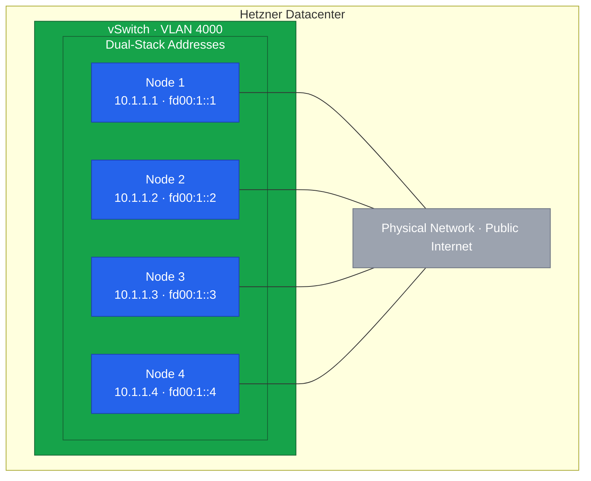

Hetzner's vSwitch provides Layer 2 private networking between dedicated servers.
We'll configure dual-stack networking (IPv4 + IPv6) to future-proof our cluster while maintaining compatibility with IPv4-only services.



## Why Dual-Stack?

Dual-stack networking gives you the best of both worlds:

- IPv4 compatibility with existing services and external APIs
- IPv6 readiness for the future as IPv4 addresses become scarcer
- Larger address space for pods and services
- No NAT required for IPv6 traffic

For our private vSwitch network, we'll use:

- **IPv4**: `10.1.1.0/24` (private range)
- **IPv6**: `fd00:1::/64` (ULA - Unique Local Address range)



## Understanding the Network Layout



## Prerequisites

Before proceeding, ensure:

- vSwitch is created in Hetzner Robot console
- All servers are added to the vSwitch
- VLAN ID is noted (we use 4000 in this guide)
- IP ranges are planned as shown above

## Identify the Network Interface

First, identify the network interface that connects to the vSwitch:

```bash
# List all network interfaces
ip link show

# Typical output on Hetzner dedicated servers:
# 1: lo: <LOOPBACK,UP,LOWER_UP> ...
# 2: enp0s31f6: <BROADCAST,MULTICAST,UP,LOWER_UP> ...  ← Main interface
# 3: enp4s0: <BROADCAST,MULTICAST> ...                 ← Could be this one

# Check which interface has the public IP
ip addr show
```

The interface connected to the vSwitch is typically a secondary Ethernet interface.
If you only have one interface, you'll create a VLAN subinterface on the main interface.

## Configure Dual-Stack with NetworkManager

Rocky Linux 9 uses NetworkManager for network configuration.
We'll create a VLAN interface with both IPv4 and IPv6 addresses.

### Option A: VLAN on Main Interface (Most Common)

If your vSwitch uses VLAN tagging on the main interface:

```bash
# Create VLAN interface with dual-stack
# Replace enp0s31f6 with your actual interface name
# Replace 4000 with your VLAN ID

nmcli connection add \
    type vlan \
    con-name vswitch \
    dev enp0s31f6 \
    id 4000 \
    ipv4.method manual \
    ipv4.addresses 10.1.1.4/24 \
    ipv6.method manual \
    ipv6.addresses fd00:1::4/64

# Bring up the connection
nmcli connection up vswitch

# Verify both addresses are configured
ip addr show enp0s31f6.4000
```

You should see both an `inet` (IPv4) and `inet6` (IPv6) address in the output.

### Option B: Dedicated Interface (No VLAN Tag)

If you have a dedicated interface for the vSwitch without VLAN tagging:

```bash
# Configure the interface with dual-stack
nmcli connection add \
    type ethernet \
    con-name vswitch \
    ifname enp4s0 \
    ipv4.method manual \
    ipv4.addresses 10.1.1.4/24 \
    ipv6.method manual \
    ipv6.addresses fd00:1::4/64

# Bring up the connection
nmcli connection up vswitch

# Verify
ip addr show enp4s0
```

### Verify Configuration Files

NetworkManager stores connection files in `/etc/NetworkManager/system-connections/`:

```bash
# View the created connection
sudo cat /etc/NetworkManager/system-connections/vswitch.nmconnection

# Expected content for dual-stack VLAN configuration:
# [connection]
# id=vswitch
# type=vlan
# interface-name=enp0s31f6.4000
#
# [vlan]
# id=4000
# parent=enp0s31f6
#
# [ipv4]
# address1=10.1.1.4/24
# method=manual
#
# [ipv6]
# address1=fd00:1::4/64
# method=manual
```

## Test Dual-Stack Connectivity

Verify connectivity to other nodes using both protocols:

```bash
# Test IPv4 connectivity
ping -c 3 10.1.1.1  # Node 1
ping -c 3 10.1.1.2  # Node 2
ping -c 3 10.1.1.3  # Node 3

# Test IPv6 connectivity
ping6 -c 3 fd00:1::1  # Node 1
ping6 -c 3 fd00:1::2  # Node 2
ping6 -c 3 fd00:1::3  # Node 3
```

If IPv4 works but IPv6 fails, check that all nodes have their IPv6 addresses configured on the vSwitch interface.

## Configure /etc/hosts

Add dual-stack entries for all cluster nodes:

```bash
cat <<EOF >> /etc/hosts

# Kubernetes Cluster Nodes (IPv4)
10.1.1.1  node1 node1.k8s.example.com
10.1.1.2  node2 node2.k8s.example.com
10.1.1.3  node3 node3.k8s.example.com
10.1.1.4  node4 node4.k8s.example.com

# Kubernetes Cluster Nodes (IPv6)
fd00:1::1  node1-v6 node1-v6.k8s.example.com
fd00:1::2  node2-v6 node2-v6.k8s.example.com
fd00:1::3  node3-v6 node3-v6.k8s.example.com
fd00:1::4  node4-v6 node4-v6.k8s.example.com
EOF

# Verify both protocols
ping -c 1 node1
ping6 -c 1 node1-v6
```

## Enable IPv6 Forwarding

For Kubernetes to route IPv6 traffic between pods, enable IPv6 forwarding:

```bash
# Enable IPv6 forwarding
cat <<EOF > /etc/sysctl.d/99-ipv6-forward.conf
net.ipv6.conf.all.forwarding = 1
net.ipv6.conf.default.forwarding = 1
EOF

# Apply immediately
sysctl -p /etc/sysctl.d/99-ipv6-forward.conf

# Verify
sysctl net.ipv6.conf.all.forwarding
```

## Document Network Configuration

Save the dual-stack network configuration for reference:

```bash
cat <<EOF > /root/network-config.txt
=== Node 4 Network Configuration (Dual-Stack) ===
Date: $(date)

Public Interface: enp0s31f6
Public IPv4: $(ip -4 addr show enp0s31f6 | grep inet | awk '{print $2}')
Public IPv6: $(ip -6 addr show enp0s31f6 scope global | grep inet6 | awk '{print $2}')

vSwitch Interface: enp0s31f6.4000
vSwitch VLAN ID: 4000
Private IPv4: 10.1.1.4/24
Private IPv6: fd00:1::4/64

Cluster Nodes:
- node1: 10.1.1.1 / fd00:1::1
- node2: 10.1.1.2 / fd00:1::2
- node3: 10.1.1.3 / fd00:1::3
- node4: 10.1.1.4 / fd00:1::4 (this node)

IPv4 Routes:
$(ip -4 route)

IPv6 Routes:
$(ip -6 route)
EOF

cat /root/network-config.txt
```

## Troubleshooting

### Interface Not Coming Up

```bash
# Check interface status
nmcli device status

# Check for errors
journalctl -u NetworkManager | tail -20

# Verify VLAN module is loaded
lsmod | grep 8021q
modprobe 8021q
```

### IPv6 Not Working

```bash
# Verify IPv6 is enabled on the interface
ip -6 addr show enp0s31f6.4000

# Check if IPv6 forwarding is enabled
sysctl net.ipv6.conf.all.forwarding

# Verify no firewall is blocking ICMPv6
firewall-cmd --list-all

# Check for IPv6 neighbor discovery
ip -6 neigh show
```

### Cannot Ping Other Nodes

```bash
# Verify interface has both IPs
ip addr show enp0s31f6.4000

# Check if interface is in correct VLAN
ip -d link show enp0s31f6.4000

# Verify in Hetzner Robot that:
# 1. vSwitch exists
# 2. All servers are added to vSwitch
# 3. VLAN ID matches
```

### MTU Issues

If you experience packet loss with large packets:

```bash
# Check current MTU
ip link show enp0s31f6.4000 | grep mtu

# Set MTU (Hetzner vSwitch typically supports 1400)
nmcli connection modify vswitch ethernet.mtu 1400
nmcli connection up vswitch
```

## Network Security Considerations

The vSwitch provides Layer 2 isolation, but consider:

- Traffic on vSwitch is not encrypted by default
- Layer 2 only means no routing between vSwitches
- Other Hetzner customers may be on same physical switches

For additional security, RKE2 and Cilium will encrypt cluster traffic using WireGuard, which we'll configure in later lessons.

## Summary

Node 4 now has:

- Dual-stack networking with both IPv4 and IPv6 on the vSwitch
- IPv6 forwarding enabled for Kubernetes pod routing
- Connectivity verified to all other nodes on both protocols

In the next lesson, we'll configure firewalld to allow the necessary Kubernetes traffic over both IPv4 and IPv6.
