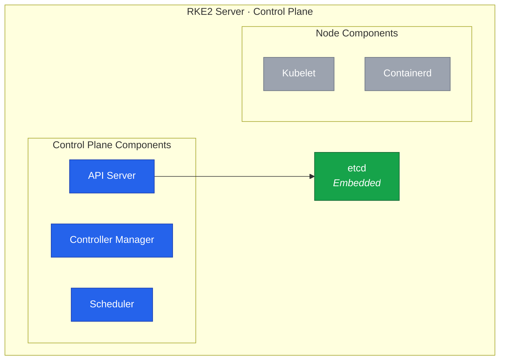

In this lesson, we'll install RKE2 on Node 4 as the first control plane node with dual-stack networking.
This establishes the foundation of Cluster B that will eventually replace the k3s cluster.



## Understanding RKE2 Architecture

RKE2 (also known as RKE Government) is a fully conformant Kubernetes distribution that focuses on security and compliance.
Key components include:

- **rke2-server**: Control plane components (API server, controller manager, scheduler, etcd)
- **rke2-agent**: Worker node components (kubelet, kube-proxy)
- **Embedded etcd**: Distributed key-value store for cluster state
- **Containerd**: Container runtime (not Docker)



## Dual-Stack Network Planning

For our dual-stack cluster, we need separate CIDR ranges for IPv4 and IPv6:

| Network         | IPv4 CIDR    | IPv6 CIDR     |
| --------------- | ------------ | ------------- |
| Node Network    | 10.1.1.0/24  | fd00:1::/64   |
| Pod Network     | 10.42.0.0/16 | fd00:42::/56  |
| Service Network | 10.43.0.0/16 | fd00:43::/112 |
| Cluster DNS     | 10.43.0.10   | fd00:43::a    |



## Generate Cluster Token

First, generate a secure token that will be used by all nodes to join the cluster:

```bash
# Generate a secure random token
openssl rand -hex 32 > /root/rke2-token.txt

# View the token (save this securely!)
cat /root/rke2-token.txt
```



## Install RKE2

Download and install RKE2:

```bash
# Download and run the RKE2 installer
curl -sfL https://get.rke2.io | sh -

# This installs RKE2 to:
# - /usr/local/bin/rke2
# - /usr/local/share/rke2/

# Verify installation
rke2 --version
```

## Create Configuration Directory

```bash
# Create RKE2 configuration directory
mkdir -p /etc/rancher/rke2
```

## Configure RKE2 for Dual-Stack

Create the RKE2 configuration file with dual-stack networking:

```bash
# Get the token we generated earlier
TOKEN=$(cat /root/rke2-token.txt)

# Create dual-stack configuration
cat <<EOF > /etc/rancher/rke2/config.yaml
# Cluster token for node authentication
token: ${TOKEN}

# TLS Subject Alternative Names
# Include all IPs/hostnames that might be used to access the API server
tls-san:
  - node4
  - node4.k8s.example.com
  - 10.1.1.4
  - fd00:1::4
  # Add load balancer IP when available
  # - k8s.example.com

# Disable default CNI (we'll install Cilium separately)
cni: none

# Disable default ingress controller (we'll install Traefik separately)
disable:
  - rke2-ingress-nginx

# Dual-stack node IPs (comma-separated, IPv4 first)
node-ip: 10.1.1.4,fd00:1::4

# Bind API server to all interfaces
bind-address: 0.0.0.0

# Write kubeconfig with correct server address
write-kubeconfig-mode: "0644"

# Dual-stack pod network (comma-separated CIDRs)
cluster-cidr: 10.42.0.0/16,fd00:42::/56

# Dual-stack service network (comma-separated CIDRs)
service-cidr: 10.43.0.0/16,fd00:43::/112

# Cluster DNS (IPv4 address - CoreDNS will handle both)
cluster-dns: 10.43.0.10

# Enable etcd snapshots
etcd-snapshot-schedule-cron: "0 */6 * * *"
etcd-snapshot-retention: 5
EOF
```

## Configuration Options Explained

| Option         | Value                      | Purpose                                     |
| -------------- | -------------------------- | ------------------------------------------- |
| `token`        | Secret string              | Authenticates nodes joining the cluster     |
| `tls-san`      | IPs/hostnames (v4 and v6)  | Adds to API server certificate              |
| `cni: none`    | Disables default           | We'll install Cilium as our CNI             |
| `node-ip`      | 10.1.1.4,fd00:1::4         | Both node IPs for dual-stack                |
| `cluster-cidr` | 10.42.0.0/16,fd00:42::/56  | Dual-stack pod network ranges               |
| `service-cidr` | 10.43.0.0/16,fd00:43::/112 | Dual-stack service network ranges           |
| `cluster-dns`  | 10.43.0.10                 | DNS service IP (CoreDNS serves both stacks) |

## Enable and Start RKE2

```bash
# Enable RKE2 server service
systemctl enable rke2-server.service

# Start RKE2 server
systemctl start rke2-server.service

# Watch the startup logs
journalctl -u rke2-server -f
```

The first start takes a few minutes as RKE2:

1. Downloads container images
2. Initializes etcd
3. Starts control plane components
4. Generates certificates for both IPv4 and IPv6

Wait until you see messages indicating the API server is ready:

```
level=info msg="Running kube-apiserver ..."
level=info msg="Waiting for API server to become available"
level=info msg="Tunnel server is Running"
level=info msg="Running etcd ..."
```

Press `Ctrl+C` to exit the log view once startup is complete.

## Configure kubectl

Set up kubectl to communicate with the new cluster:

```bash
# Create .kube directory
mkdir -p ~/.kube

# Copy the kubeconfig
cp /etc/rancher/rke2/rke2.yaml ~/.kube/config

# Set proper permissions
chmod 600 ~/.kube/config

# Add kubectl to PATH
export PATH=$PATH:/var/lib/rancher/rke2/bin

# Make PATH permanent
echo 'export PATH=$PATH:/var/lib/rancher/rke2/bin' >> ~/.bashrc

# Verify
kubectl version
```

## Verify Cluster Status

Check that the cluster is running:

```bash
# Check node status
kubectl get nodes -o wide

# Expected output (node will be NotReady until CNI is installed):
# NAME    STATUS     ROLES                       AGE   VERSION          INTERNAL-IP
# node4   NotReady   control-plane,etcd,master   1m    v1.28.x+rke2r1   10.1.1.4,fd00:1::4

# Check system pods
kubectl get pods -n kube-system

# Expected: Several pods in Pending or ContainerCreating
# (This is normal - they're waiting for CNI)
```

The node showing `NotReady` is expected because we haven't installed a CNI plugin yet.

## Verify Dual-Stack Configuration

Confirm the cluster is configured for dual-stack:

```bash
# Check node addresses (should show both IPv4 and IPv6)
kubectl get nodes -o jsonpath='{.items[*].status.addresses}' | jq .

# Check cluster CIDR configuration
kubectl cluster-info dump | grep -E "cluster-cidr|service-cluster-ip-range"

# Verify API server is listening on IPv6
ss -tlnp | grep 6443
```

## Verify etcd Health

Check that etcd is running properly:

```bash
# RKE2 includes etcdctl
/var/lib/rancher/rke2/bin/etcdctl \
  --endpoints=https://127.0.0.1:2379 \
  --cacert=/var/lib/rancher/rke2/server/tls/etcd/server-ca.crt \
  --cert=/var/lib/rancher/rke2/server/tls/etcd/server-client.crt \
  --key=/var/lib/rancher/rke2/server/tls/etcd/server-client.key \
  endpoint health

# Expected output:
# https://127.0.0.1:2379 is healthy: successfully committed proposal
```

## Create etcdctl Alias

For convenience, create an alias for etcdctl:

```bash
cat <<'EOF' >> ~/.bashrc

# etcdctl alias with RKE2 certificates
alias etcdctl='/var/lib/rancher/rke2/bin/etcdctl \
  --endpoints=https://127.0.0.1:2379 \
  --cacert=/var/lib/rancher/rke2/server/tls/etcd/server-ca.crt \
  --cert=/var/lib/rancher/rke2/server/tls/etcd/server-client.crt \
  --key=/var/lib/rancher/rke2/server/tls/etcd/server-client.key'
EOF

source ~/.bashrc

# Now you can use:
etcdctl endpoint health
```

## Important File Locations

Reference for troubleshooting:

| Path                                  | Content             |
| ------------------------------------- | ------------------- |
| `/etc/rancher/rke2/config.yaml`       | RKE2 configuration  |
| `/etc/rancher/rke2/rke2.yaml`         | Kubeconfig file     |
| `/var/lib/rancher/rke2/bin/`          | Kubernetes binaries |
| `/var/lib/rancher/rke2/server/tls/`   | TLS certificates    |
| `/var/lib/rancher/rke2/server/db/`    | etcd data           |
| `/var/lib/rancher/rke2/agent/images/` | Container images    |
| `/var/log/pods/`                      | Pod logs            |

## Troubleshooting

### RKE2 Won't Start

```bash
# Check service status
systemctl status rke2-server

# View detailed logs
journalctl -xeu rke2-server

# Common issues:
# - Port 6443 already in use (check for existing k3s/k8s)
# - Firewall blocking ports
# - Incorrect permissions on config files
# - Invalid CIDR format in dual-stack config
```

### Dual-Stack Issues

```bash
# Verify IPv6 is enabled
sysctl net.ipv6.conf.all.disable_ipv6

# Should return 0 (IPv6 enabled)

# Check if API server has IPv6 in SAN
openssl s_client -connect 127.0.0.1:6443 -showcerts </dev/null 2>/dev/null | \
  openssl x509 -noout -text | grep -A1 "Subject Alternative Name"

# Verify node has both IPs
kubectl get node node4 -o jsonpath='{.status.addresses}' | jq .
```

### API Server Unreachable

```bash
# Check if API server is listening
ss -tlnp | grep 6443

# Verify kubeconfig
cat ~/.kube/config
```

### etcd Issues

```bash
# Check etcd logs
journalctl -u rke2-server | grep etcd

# Verify etcd data directory
ls -la /var/lib/rancher/rke2/server/db/etcd/

# Check disk space (etcd needs space)
df -h /var/lib/rancher/rke2/
```

## Backup the Configuration

Before proceeding, backup critical files:

```bash
# Create backup directory
mkdir -p /root/rke2-backup

# Backup configuration
cp /etc/rancher/rke2/config.yaml /root/rke2-backup/
cp /root/rke2-token.txt /root/rke2-backup/
cp ~/.kube/config /root/rke2-backup/kubeconfig

# Create etcd snapshot
/var/lib/rancher/rke2/bin/rke2 etcd-snapshot save --name initial-setup
```

## Summary

Node 4 now has:

- RKE2 installed with dual-stack IPv4/IPv6 networking
- Pod network configured for both 10.42.0.0/16 and fd00:42::/56
- Service network configured for both 10.43.0.0/16 and fd00:43::/112
- etcd running and healthy
- API server accessible on both protocols

The node is in `NotReady` state because we haven't installed a CNI.
In the next lesson, we'll install Cilium with dual-stack support to provide pod networking.
