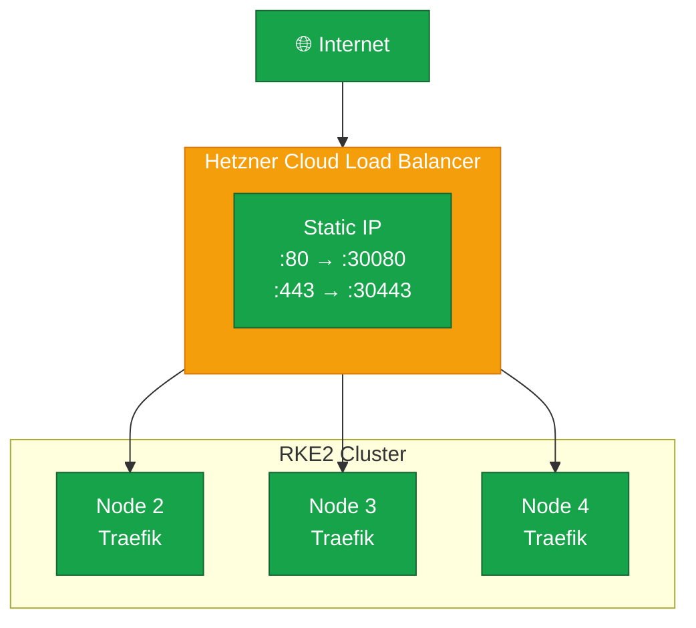

A highly available ingress setup ensures services remain accessible even if individual nodes fail.
We'll deploy Traefik as a DaemonSet on all nodes and use a Hetzner Cloud Load Balancer to distribute traffic.



## Understanding HA Ingress

In a standard ingress setup, a single ingress controller handles all external traffic.
If that node fails, external access is lost until Kubernetes reschedules the pod.

An HA ingress setup solves this by running the ingress controller on every node and distributing traffic via an external load balancer.

### Architecture



Traffic flows through three layers:

| Layer    | Component          | Purpose                                                |
| -------- | ------------------ | ------------------------------------------------------ |
| External | Load Balancer      | Provides static IP, distributes traffic, health checks |
| NodePort | Kubernetes Service | Exposes Traefik on fixed ports across all nodes        |
| Internal | Traefik DaemonSet  | Routes requests to appropriate backend services        |

### Why DaemonSet Over Deployment

| Aspect                  | Deployment                     | DaemonSet               |
| ----------------------- | ------------------------------ | ----------------------- |
| Pod distribution        | Scheduler decides              | One per node guaranteed |
| Scaling                 | Manual or HPA                  | Automatic with nodes    |
| Node failure            | May leave node without ingress | Always one pod per node |
| Resource predictability | Variable                       | Consistent              |

A DaemonSet ensures every node can handle ingress traffic independently.

## Installing Traefik

### Add Helm Repository

```bash
helm repo add traefik https://traefik.github.io/charts
helm repo update
```

### Create Configuration

```bash
cat <<'EOF' > /root/traefik-values.yaml
deployment:
  kind: DaemonSet

service:
  type: NodePort

ports:
  web:
    port: 8000
    exposedPort: 80
    nodePort: 30080
  websecure:
    port: 8443
    exposedPort: 443
    nodePort: 30443
    tls:
      enabled: true

tolerations:
  - operator: Exists

resources:
  requests:
    cpu: "100m"
    memory: "50Mi"
  limits:
    cpu: "300m"
    memory: "150Mi"

providers:
  kubernetesIngress:
    enabled: true
    publishedService:
      enabled: true

ingressRoute:
  dashboard:
    enabled: false

additionalArguments:
  - "--api.insecure=false"
  - "--entrypoints.web.http.redirections.entryPoint.to=websecure"
  - "--entrypoints.web.http.redirections.entryPoint.scheme=https"
EOF
```

The most important settings control how Traefik is scheduled and exposed:

| Setting         | Value       | Purpose                          |
| --------------- | ----------- | -------------------------------- |
| deployment.kind | DaemonSet   | Run on every node                |
| service.type    | NodePort    | Fixed ports for load balancer    |
| nodePort        | 30080/30443 | Predictable ports for LB targets |
| tolerations     | Exists      | Run on control plane nodes too   |
| HTTP redirect   | websecure   | Force HTTPS for all traffic      |

### Install Traefik

```bash
kubectl create namespace traefik

helm install traefik traefik/traefik \
  --namespace traefik \
  --values /root/traefik-values.yaml \
  --wait
```

### Verify Installation

Confirm that Traefik is running with one pod per node:

```bash
$ kubectl get pods -n traefik -o wide
```

```
NAME             READY   STATUS    RESTARTS   AGE   NODE
traefik-xxxxx    1/1     Running   0          1m    node2
traefik-yyyyy    1/1     Running   0          1m    node3
traefik-zzzzz    1/1     Running   0          1m    node4
```

Also verify the NodePort service is exposing the expected ports:

```bash
$ kubectl get svc -n traefik
```

```
NAME      TYPE       CLUSTER-IP      EXTERNAL-IP   PORT(S)                      AGE
traefik   NodePort   10.43.xxx.xxx   <none>        80:30080/TCP,443:30443/TCP   1m
```

## Configuring Hetzner Cloud Load Balancer

The load balancer provides a static public IP and distributes traffic to healthy nodes.

### Create Load Balancer

```bash
hcloud load-balancer create \
  --name k8s-ingress \
  --type lb11 \
  --location fsn1

LB_ID=$(hcloud load-balancer list -o noheader -o columns=id,name | grep k8s-ingress | awk '{print $1}')
```

### Add Cluster Nodes as Targets

```bash
hcloud server list

hcloud load-balancer add-target k8s-ingress --server node2 --use-private-ip
hcloud load-balancer add-target k8s-ingress --server node3 --use-private-ip
hcloud load-balancer add-target k8s-ingress --server node4 --use-private-ip
```

The `--use-private-ip` flag routes traffic through the vSwitch, keeping load balancer traffic off the public network.

### Configure Services

```bash
hcloud load-balancer add-service k8s-ingress \
  --protocol tcp \
  --listen-port 80 \
  --destination-port 30080

hcloud load-balancer add-service k8s-ingress \
  --protocol tcp \
  --listen-port 443 \
  --destination-port 30443
```

### Configure Health Checks

```bash
hcloud load-balancer update-service k8s-ingress \
  --listen-port 80 \
  --health-check-protocol http \
  --health-check-port 30080 \
  --health-check-http-path /ping \
  --health-check-interval 15s \
  --health-check-timeout 10s \
  --health-check-retries 3

hcloud load-balancer update-service k8s-ingress \
  --listen-port 443 \
  --health-check-protocol tcp \
  --health-check-port 30443 \
  --health-check-interval 15s \
  --health-check-timeout 10s \
  --health-check-retries 3
```

Health checks ensure traffic only routes to nodes with a healthy Traefik instance.

### Get Load Balancer IP

```bash
LB_IP=$(hcloud load-balancer describe k8s-ingress -o format='{{.PublicNet.IPv4.IP}}')
echo "Load Balancer IP: $LB_IP"
```

Save this IP for DNS configuration.

## Verification

### Check Load Balancer Health

```bash
hcloud load-balancer describe k8s-ingress
```

All targets should show healthy status.

### Test End-to-End

To confirm the full chain works, deploy a temporary nginx pod behind an Ingress resource and curl it through the load balancer IP:

```bash
kubectl create namespace ingress-test
kubectl create deployment nginx-test --image=nginx:alpine -n ingress-test
kubectl expose deployment nginx-test --port=80 -n ingress-test

cat <<EOF | kubectl apply -f -
apiVersion: networking.k8s.io/v1
kind: Ingress
metadata:
  name: nginx-test
  namespace: ingress-test
  annotations:
    traefik.ingress.kubernetes.io/router.entrypoints: web
spec:
  rules:
  - host: test.example.com
    http:
      paths:
      - path: /
        pathType: Prefix
        backend:
          service:
            name: nginx-test
            port:
              number: 80
EOF

curl -H "Host: test.example.com" http://${LB_IP}/
```

The response should contain the nginx welcome page, confirming that traffic flows from the internet through the load balancer, into the NodePort, and to the backend pod via Traefik.

Remove the test resources once verified:

```bash
kubectl delete namespace ingress-test
```

## Troubleshooting

### Traefik Pod Not Starting

Inspect the pod events and logs to identify the cause:

```bash
$ kubectl describe pod -n traefik -l app.kubernetes.io/name=traefik
$ kubectl logs -n traefik -l app.kubernetes.io/name=traefik
```

Common causes include port conflicts (another service already bound to `30080` or `30443`) and missing tolerations preventing scheduling on control plane nodes.

### Load Balancer Shows Unhealthy Targets

If the Hetzner load balancer reports targets as unhealthy, verify that the NodePort is reachable from each node's vSwitch address:

```bash
# Replace with your actual vSwitch IPs
for ip in 10.0.0.2 10.0.0.3 10.0.0.4; do
    echo "Testing $ip..."
    curl -s -o /dev/null -w "%{http_code}" http://$ip:30080/ping
    echo ""
done
```

A `200` response confirms Traefik is responding on that node.
If you get connection refused, check that the Traefik pod is running on that node and the firewall allows traffic on the NodePort range.

### 404 on All Requests

A blanket 404 usually means Traefik is running but has no Ingress routes configured.
Verify that Ingress resources exist and that Traefik has picked them up:

```bash
$ kubectl get ingress -A
$ kubectl logs -n traefik -l app.kubernetes.io/name=traefik | grep -i ingress
```

If the Ingress exists but Traefik does not log it, check that the `kubernetesIngress` provider is enabled in the Helm values.
