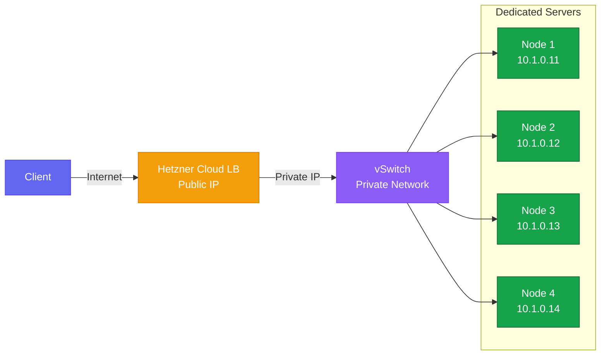
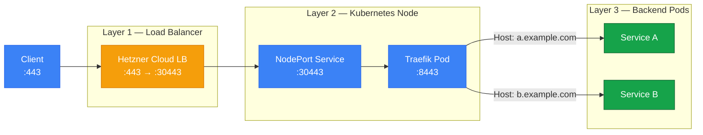

A highly available ingress setup ensures that services remain accessible even when individual nodes fail.
This lesson deploys Traefik as a DaemonSet across all nodes and places a Hetzner Cloud Load Balancer in front of them to distribute external traffic.



## Why We Need a Load Balancer

Our cluster runs on dedicated servers at Hetzner, each with its own public IP address.
In the simplest ingress setup, a DNS record points at one node's IP and the ingress controller runs there.
If that node goes down, every service behind it becomes unreachable until the DNS record is updated and propagation completes — which can take minutes to hours depending on TTL settings and resolver caching.

Running the ingress controller on every node helps, but does not solve the problem on its own.
DNS still points to a specific set of IPs, and clients cache those records.
What we need is a single stable IP address or DNS name that automatically routes traffic only to healthy nodes.
That is the role of a load balancer.

### Virtual IPs and Why They Do Not Work Here

The classic on-premise approach to high availability is a virtual IP (VIP) that floats between nodes using VRRP — typically implemented with Keepalived and HAProxy.
One node holds the VIP and serves traffic.
If it fails, another node claims the VIP via a gratuitous ARP announcement, and traffic continues within seconds.

This approach requires all participating nodes to share a Layer 2 broadcast domain — the same switch or VLAN — so the ARP announcement reaches the network's switches and updates their MAC tables.
Our Hetzner dedicated servers sit on the public internet, where gratuitous ARP packets cannot be sent between hosts.
The vSwitch connecting our servers does operate at Layer 2, but it assigns private IPs (`10.x.x.x`) that are not routable from the internet.
A VIP on the vSwitch would be reachable between nodes but invisible to external clients.

For readers interested in the VIP approach, [Lesson 15 - Configuring Load Balancing for the Control Plane](/guides/building-a-production-ready-kubernetes-cluster-from-scratch/lesson-15.md) of our guide on [Building a production-ready Kubernetes cluster from scratch](/guides/building-a-production-ready-kubernetes-cluster-from-scratch) covers the setup in detail.
Due to our hosting environment, this approach is not viable for us.

### Hetzner Failover IPs

Hetzner offers failover IPs — public addresses that can be reassigned between servers via an API call.
This sounds like a managed VIP, but the switchover is not instant.
The API call triggers a network reconfiguration on Hetzner's side that takes several seconds to minutes, during which traffic to that IP is dropped entirely.
For a zero-downtime migration, even a brief gap in availability is unacceptable, so this approach is also not suitable.

### DNS Failover vs Traffic Failover

Two broad strategies exist for routing around failed nodes.

#### DNS Failover

Multiple A records are published — one per node — and an external health checker removes records for unhealthy nodes.
The weakness is propagation time.
Even with a low TTL, recursive resolvers and client-side caches may hold stale records for minutes.
During that window, some clients continue sending traffic to the failed node and receive errors, with no way to force an immediate refresh.

#### Traffic Failover

Traffic is sent through a load balancer, which operates at a different layer.
The load balancer owns a single public IP, accepts all incoming connections, and forwards them to healthy backends.
When a health check fails, the load balancer stops sending traffic to that backend within seconds — completely transparent to clients, who never see the individual node IPs.

A load balancer can also become a single point of failure if it goes down.
That is why we need a highly available, managed load balancer that can withstand failures without impacting traffic.

### Why Hetzner Cloud Load Balancer

We choose Hetzner's managed Cloud Load Balancer because it provides a stable public IP that is independent of any single server and connects to our dedicated servers through the vSwitch private network, keeping backend traffic off the public internet.
Health checks run over the private network and can detect failures within seconds.
Staying within a single provider also avoids external dependencies like Cloudflare.

The following diagram shows the traffic path from the internet to a backend pod:



The client connects to the load balancer's public IP.
The load balancer forwards the connection over the vSwitch private network to one of the healthy nodes.
The node's Traefik instance receives the request and routes it to the appropriate backend service inside the cluster.
This architecture abstracts away the cluster's internal structure and provides a single stable endpoint for all ingress traffic.

## Understanding the Ingress Architecture

With the load balancer providing a stable entry point, the next question is how traffic gets from a node's network interface to the correct backend pod.
This happens in three layers.

### Traffic Flow



| Layer    | Component          | Purpose                                                |
| -------- | ------------------ | ------------------------------------------------------ |
| External | Load Balancer      | Provides static IP, distributes traffic, health checks |
| NodePort | Kubernetes Service | Exposes Traefik on fixed ports across all nodes        |
| Internal | Traefik DaemonSet  | Routes requests to appropriate backend services        |

The external load balancer forwards traffic to a fixed NodePort on each cluster node.
Traefik, listening behind that NodePort, inspects the Ingress resources in the cluster and routes each request to the correct backend service.

### Why DaemonSet Over Deployment

A DaemonSet guarantees exactly one Traefik pod per node, which makes every node independently capable of handling ingress traffic.

| Aspect                  | Deployment                     | DaemonSet               |
| ----------------------- | ------------------------------ | ----------------------- |
| Pod distribution        | Scheduler decides              | One per node guaranteed |
| Scaling                 | Manual or HPA                  | Automatic with nodes    |
| Node failure            | May leave node without ingress | Always one pod per node |
| Resource predictability | Variable                       | Consistent              |

With a Deployment, the scheduler might place multiple ingress pods on the same node, leaving other nodes unable to serve traffic.
A DaemonSet avoids this entirely — when a new node joins the cluster, it automatically receives its own Traefik instance.

### Helm Chart vs Operator

Traefik provides both a Helm chart and a Kubernetes operator.
The operator adds custom resource definitions like `IngressRoute` and `Middleware` that extend Traefik's configuration beyond what standard Kubernetes Ingress resources offer.

For our use case, standard `Ingress` resources are sufficient.
We do not need dynamic middleware management or Traefik-specific routing CRDs.
The operator would add complexity — extra CRDs to maintain, another controller to monitor — without providing any benefit we actually need.
The Helm chart gives us full control over Traefik's deployment configuration while keeping the stack simple.

## Installing Traefik

RKE2 includes a Helm controller that automatically installs and manages Helm charts from manifest files — the same mechanism we used for Longhorn in [Lesson 7](/guides/migrating-k3s-to-rke2-without-downtime/lesson-7) and the Canal `HelmChartConfig` in [Lesson 6](/guides/migrating-k3s-to-rke2-without-downtime/lesson-6).
For external charts like Traefik, we use a `HelmChart` resource that specifies the repository, chart name, version, and values.

### Configuration

Create the manifest at `/var/lib/rancher/rke2/server/manifests/traefik.yaml`:

```yaml
# /var/lib/rancher/rke2/server/manifests/traefik.yaml
apiVersion: helm.cattle.io/v1
kind: HelmChart
metadata:
  name: traefik
  namespace: kube-system
spec:
  repo: https://traefik.github.io/charts
  chart: traefik
  version: "39.0.1"
  targetNamespace: kube-system
  valuesContent: |-
    # Run one Traefik pod per node instead of a variable-count Deployment
    deployment:
      kind: DaemonSet

    # Expose fixed NodePorts so the Hetzner LB can target predictable ports
    service:
      type: NodePort

    ports:
      web:
        port: 8000
        exposedPort: 80
        nodePort: 30080        # LB forwards :80 here
        proxyProtocol:
          trustedIPs:
            - 10.0.0.0/8
      websecure:
        port: 8443
        exposedPort: 443
        nodePort: 30443        # LB forwards :443 here
        http:
          tls:
            enabled: true
        proxyProtocol:
          trustedIPs:
            - 10.0.0.0/8

    # Schedule on every node, including control plane nodes
    tolerations:
      - operator: Exists

    # Conservative limits — Traefik is lightweight for simple routing
    resources:
      requests:
        cpu: "100m"
        memory: "50Mi"
      limits:
        cpu: "300m"
        memory: "150Mi"

    # Use standard Kubernetes Ingress resources for routing
    providers:
      kubernetesIngress:
        enabled: true
        # Write the LB IP back into Ingress status so cert-manager
        # and other tools can discover the external address
        publishedService:
          enabled: true

    # Disable the Traefik dashboard — not needed in production
    ingressRoute:
      dashboard:
        enabled: false

    additionalArguments:
      # Do not expose the API without authentication
      - "--api.insecure=false"
      # Redirect HTTP to HTTPS on port 443 (the external port, not container port 8443).
      # This must use additionalArguments because the Helm chart's native redirect
      # validates against entrypoint names, and redirecting to "websecure" would
      # produce Location headers with port 8443 instead of 443.
      #
      # While it is best practice to disallow HTTP entirely and only listen on HTTPS, some
      # we need HTTP support for cert-manager's HTTP-01 challenge, which requires responding
      # to HTTP requests on port 80.
      # - "--entrypoints.web.http.redirections.entryPoint.to=:443"
      # - "--entrypoints.web.http.redirections.entryPoint.scheme=https"
```

The key settings control scheduling and network exposure:

| Setting         | Value       | Purpose                           |
| --------------- | ----------- | --------------------------------- |
| deployment.kind | DaemonSet   | Run on every node                 |
| service.type    | NodePort    | Fixed ports for load balancer     |
| nodePort        | 30080/30443 | Predictable ports for LB targets  |
| tolerations     | Exists      | Run on control plane nodes too    |
| HTTP redirect   | :443        | Force HTTPS for all traffic       |
| proxyProtocol   | 10.0.0.0/8  | Trust proxy protocol from vSwitch |

The `tolerations` setting with `operator: Exists` allows Traefik to schedule on control plane nodes as well, maximizing the number of nodes available for ingress.

RKE2 detects the new manifest and installs the chart automatically within a few seconds.

### Verifying the Installation

Confirm that Traefik has one pod per node:

```bash
$ kubectl get pods -n kube-system -l app.kubernetes.io/name=traefik -o wide
NAME            READY   STATUS    RESTARTS   AGE   IP           NODE   NOMINATED NODE   READINESS GATES
traefik-msgqz   1/1     Running   0          40s   10.42.0.50   node4   <none>           <none>
```

Also verify the NodePort service is exposing the expected ports:

```bash
$ kubectl get svc -n kube-system -l app.kubernetes.io/name=traefik
NAME      TYPE       CLUSTER-IP      EXTERNAL-IP   PORT(S)                      AGE
traefik   NodePort   10.43.171.253   <none>        80:30080/TCP,443:30443/TCP   64s
```

The `PORT(S)` column confirms that external ports `80` and `443` map to NodePorts `30080` and `30443`.

## Configuring the Hetzner Cloud Load Balancer

The load balancer sits in front of the cluster and provides a single static IP address for all ingress traffic.
It distributes requests across the cluster nodes and removes unhealthy nodes from the rotation automatically.

The Hetzner Cloud Load Balancer is a managed service that lives in the Hetzner Cloud platform — separate from the dedicated servers that run our cluster.
We manage it through the `hcloud` CLI, though the Hetzner Cloud Console web interface works as well.

### Installing the Hetzner Cloud CLI

The `hcloud` CLI is available through most package managers.
On macOS and Linux, the simplest method is Homebrew:

```bash
$ brew install hcloud
```

On Linux without Homebrew, download the binary directly:

```bash
$ curl -sSLO https://github.com/hetznercloud/cli/releases/latest/download/hcloud-linux-amd64.tar.gz
$ sudo tar -C /usr/local/bin --no-same-owner -xzf hcloud-linux-amd64.tar.gz hcloud
$ rm hcloud-linux-amd64.tar.gz
```

Verify the installation:

```bash
$ hcloud version
hcloud v1.61.0
```

For other platforms and methods, see the [official setup guide](https://github.com/hetznercloud/cli/blob/main/docs/tutorials/setup-hcloud-cli.md).

### Creating a Project and API Token

Hetzner Cloud organizes resources into projects.
Each project has its own set of servers, load balancers, networks, and API tokens.
A clear naming convention helps when managing multiple clusters — for example, `k8s-prod-hel1-2` identifies the second production cluster in the Helsinki region.

We create projects in the [Hetzner Cloud Console](https://console.hetzner.cloud):

1. Open the Cloud Console and click **+ New Project**
2. Name it something descriptive (for our example: `k8s-prod-hel1-2`)
3. Open the new project, navigate to **Security** then **API Tokens**
4. Click **Generate API Token**, select **Read & Write** permissions, and copy the token

The token is shown only once — store it securely.

### Setting Up a CLI Context

A CLI context links a name to an API token, letting us switch between projects without re-entering credentials.
Create a context for the new project:

```bash
$ hcloud context create k8s-prod-hel1-2
```

The CLI prompts for the API token.
Paste the token from the previous step.

Confirm the context is active and working:

```bash
$ hcloud datacenter list
```

This should return a list of Hetzner datacenters, confirming that authentication is set up correctly.
From this point on, all `hcloud` commands operate within the `k8s-prod-hel1-2` project context.

### Creating the Load Balancer and Adding Targets

With the CLI configured, we create the load balancer in the same region as the cluster nodes.
Our dedicated servers are located in the Helsinki region (`hel1`).
The `lb11` size is sufficient for basic ingress traffic, but a larger size can be chosen if higher throughput or more concurrent connections are expected.

```bash
$ hcloud load-balancer create \
  --name k8s-ingress \
  --type lb11 \
  --location hel1
 ✓ Waiting for create_load_balancer 100% 0s (load_balancer: 5820086)
Load Balancer 5820086 created
IPv4: 65.109.40.190
IPv6: 2a01:4f9:c01d:54e::1
```

Before adding targets, the load balancer must be attached to the Cloud Network that is connected to the vSwitch.
Without this, the load balancer has no route to the nodes' private IPs and target registration will fail.

First, identify the Cloud Network connected to the vSwitch:

```bash
$ hcloud network list
ID   NAME   IP RANGE   SERVERS   AGE
```

In our case no Cloud Network exists yet, so we need to create one and connect it to the vSwitch.
A Cloud Network is Hetzner's virtual network for Cloud resources.
On its own it cannot reach dedicated servers — we bridge the two by adding a vSwitch subnet.

Create the Cloud Network with an IP range that covers the vSwitch addresses.
The network range must be broad enough to contain the vSwitch subnet.
Our nodes use `10.1.0.0/16`, so the Cloud Network needs at least a `/8` to encompass it:

```bash
$ hcloud network create \
  --name k8s-network \
  --ip-range 10.0.0.0/8
Network 11937387 created
```

Next, add a vSwitch subnet that links this Cloud Network to the Robot vSwitch.
The vSwitch ID can be found in the Hetzner Robot panel under **vSwitches**:

```bash
# Replace <your-vswitch-id> with the numeric ID from Robot
$ hcloud network add-subnet k8s-network \
  --type vswitch \
  --ip-range 10.1.0.0/16 \
  --network-zone eu-central \
  --vswitch-id <your-vswitch-id>
 ✓ Waiting for add_subnet          100% 0s (network: 11937387)
Subnet added to Network 11937387
```

The `--network-zone` must match the region where the dedicated servers are located.

The load balancer also needs a cloud type subnet to receive an IP from — it cannot use the vSwitch subnet.
Add one to the same network:

```bash
$ hcloud network add-subnet k8s-network \
  --type cloud \
  --ip-range 10.0.0.0/24 \
  --network-zone eu-central
 ✓ Waiting for add_subnet          100% 0s (network: 11937387)
Subnet added to Network 11937387
```

Now attach the load balancer to the Cloud Network:

```bash
$ hcloud load-balancer attach-to-network k8s-ingress --network k8s-network
 ✓ Waiting for attach_to_network   100% 15s (load_balancer: 5820086, network: 11937387)
Load Balancer 5820086 attached to Network 11937387
```

Our cluster runs on Hetzner dedicated (Robot) servers, not Hetzner Cloud servers.
The `--server` flag only works for Cloud server instances, so we add dedicated servers as targets by their vSwitch IP address using the `--ip` flag instead:

```bash
$ hcloud load-balancer add-target k8s-ingress --ip 10.1.0.11
 ✓ Waiting for add_target          100% 0s (load_balancer: 5820086)
Target added to Load Balancer 5820086

$ hcloud load-balancer add-target k8s-ingress --ip 10.1.0.12
 ✓ Waiting for add_target          100% 0s (load_balancer: 5820086)
Target added to Load Balancer 5820086

$ hcloud load-balancer add-target k8s-ingress --ip 10.1.0.13
 ✓ Waiting for add_target          100% 0s (load_balancer: 5820086)
Target added to Load Balancer 5820086

$ hcloud load-balancer add-target k8s-ingress --ip 10.1.0.14
 ✓ Waiting for add_target          100% 0s (load_balancer: 5820086)
Target added to Load Balancer 5820086
```

Replace the IPs with the actual vSwitch addresses.
The dedicated servers must belong to the same Hetzner account and their IPs must be managed through Hetzner Robot.
Traffic between the load balancer and the nodes flows over the private vSwitch network, keeping it off the public internet.

### Configuring Services and Health Checks

The load balancer needs three services: HTTP on port `80`, HTTPS on port `443`, and the Kubernetes API on port `6443`.
The first two forward traffic to Traefik's NodePorts, while the API service passes traffic directly to the kube-apiserver.

```bash
$ hcloud load-balancer add-service k8s-ingress \
  --protocol tcp \
  --listen-port 80 \
  --destination-port 30080
 ✓ Waiting for add_service         100% 0s (load_balancer: 5820086)
Service was added to Load Balancer 5820086

$ hcloud load-balancer add-service k8s-ingress \
  --protocol tcp \
  --listen-port 443 \
  --destination-port 30443
 ✓ Waiting for add_service         100% 0s (load_balancer: 5820086)
Service was added to Load Balancer 5820086

$ hcloud load-balancer add-service k8s-ingress \
  --protocol tcp \
  --listen-port 6443 \
  --destination-port 6443
 ✓ Waiting for add_service         100% 0s (load_balancer: 5820086)
Service was added to Load Balancer 5820086
```

The first two services forward to Traefik's NodePorts for web traffic.
The third service forwards port `6443` directly to the Kubernetes API server, which listens on `6443` on every control plane node.
Worker nodes do not run the API server, so the health check on port `6443` naturally excludes them from the rotation.

Health checks ensure the load balancer only sends traffic to nodes where Traefik is responding.
Both web services enable proxy protocol so the load balancer prepends a header with the real client IP — without it, Traefik would only see the load balancer's private address as the source.

The health checks use TCP rather than HTTP.
Since proxy protocol is enabled, Traefik expects a PROXY header as the first bytes of every connection from the load balancer's IP.
The load balancer's health check probes do not include this header, so an HTTP health check would fail to parse.
A TCP health check only verifies that the port is open — the TCP handshake completes at the kernel level before Traefik's proxy protocol parsing, so it works correctly:

```bash
$ hcloud load-balancer update-service k8s-ingress \
  --listen-port 80 \
  --proxy-protocol \
  --health-check-protocol tcp \
  --health-check-port 30080 \
  --health-check-interval 15s \
  --health-check-timeout 10s \
  --health-check-retries 3
 ✓ Waiting for update_service      100% 0s (load_balancer: 5820086)
Service 80 on Load Balancer 5820086 was updated

$ hcloud load-balancer update-service k8s-ingress \
  --listen-port 443 \
  --proxy-protocol \
  --health-check-protocol tcp \
  --health-check-port 30443 \
  --health-check-interval 15s \
  --health-check-timeout 10s \
  --health-check-retries 3
 ✓ Waiting for update_service      100% 0s (load_balancer: 5820086)
Service 443 on Load Balancer 5820086 was updated

$ hcloud load-balancer update-service k8s-ingress \
  --listen-port 6443 \
  --health-check-protocol tcp \
  --health-check-port 6443 \
  --health-check-interval 15s \
  --health-check-timeout 10s \
  --health-check-retries 3
 ✓ Waiting for update_service      100% 0s (load_balancer: 5820086)
Service 6443 on Load Balancer 5820086 was updated
```

The API server service does not use proxy protocol — the Kubernetes API server does not understand it and does not need real client IPs from the load balancer.
Authentication is handled via bearer tokens and certificates, not source IP addresses.

With three retries at 15-second intervals, a failing node is removed from the rotation within 45 seconds.

### Retrieving the Load Balancer IP

```bash
$ LB_IP=$(hcloud load-balancer describe k8s-ingress -o format='{{.PublicNet.IPv4.IP}}')
$ echo "Load Balancer IP: $LB_IP"
```

Save this IP for DNS configuration.

### Updating the API Server Certificate

When clients connect to the API server through the load balancer, TLS verification checks whether the server certificate includes the LB's IP or hostname in its Subject Alternative Names (SANs).
Without the LB IP in the SAN list, `kubectl` and CI/CD pipelines connecting via the load balancer will fail with a certificate error.

Update `/etc/rancher/rke2/config.yaml.d/20-external-access.yaml` on the first control plane node (Node 4) to include the load balancer's public IP:

```yaml
# /etc/rancher/rke2/config.yaml.d/20-external-access.yaml
tls-san:
  - node4
  - node4.k8s.local
  - 10.1.0.14
  - fd00::14
  - 65.109.40.190 # Hetzner Cloud LB public IP
  - cluster.yourdomain.com # Public DNS name pointing to LB
write-kubeconfig-mode: "0644"
```

Restart RKE2 to regenerate the API server certificate with the new SANs:

```bash
$ sudo systemctl restart rke2-server
```

Point the `cluster.yourdomain.com` DNS record at the load balancer's public IP so that external `kubectl` access and CI/CD pipelines route through the LB rather than directly to a single node.

## Verification

### Checking Load Balancer Health

```bash
$ hcloud load-balancer describe k8s-ingress
```

All targets should show healthy status.
If any targets appear unhealthy, check the troubleshooting section below before continuing.

### Testing the Kubernetes API via Load Balancer

Verify that the API server is reachable through the load balancer:

```bash
$ curl -sk https://${LB_IP}:6443/readyz
ok
```

A response of `ok` confirms that the load balancer is forwarding port `6443` to a healthy control plane node and the API server certificate includes the LB IP in its SANs.

### Testing End-to-End

To confirm the full traffic path works — from the internet through the load balancer, into the NodePort, and to a backend pod via Traefik — we deploy a temporary test service behind an Ingress resource.
The [nginxdemos/hello](https://github.com/nginxinc/NGINX-Demos/tree/master/nginx-hello) image returns the server name and pod IP in plain text, which makes it easy to verify routing without parsing HTML:

```bash
$ kubectl create namespace ingress-test
$ kubectl create deployment nginx-hello --image=nginxdemos/hello:plain-text -n ingress-test
$ kubectl expose deployment nginx-hello --port=80 -n ingress-test

$ cat <<EOF | kubectl apply -f -
apiVersion: networking.k8s.io/v1
kind: Ingress
metadata:
  name: nginx-hello
  namespace: ingress-test
  annotations:
    traefik.ingress.kubernetes.io/router.entrypoints: websecure
spec:
  rules:
  - host: test.example.com
    http:
      paths:
      - path: /
        pathType: Prefix
        backend:
          service:
            name: nginx-hello
            port:
              number: 80
EOF
```

The Ingress targets the `websecure` entrypoint because the `web` entrypoint redirects all traffic to HTTPS at the entrypoint level — before Traefik evaluates any routing rules.
No Ingress rules are needed on `web` for the redirect to work.

Store the load balancer's public IP for testing:

```bash
$ LB_IP=$(hcloud load-balancer describe k8s-ingress -o format='{{.PublicNet.IPv4.IP}}')
```

First, verify that HTTP requests are redirected to HTTPS on port `443`:

```bash
$ curl -sI -H "Host: test.example.com" http://${LB_IP}/
HTTP/1.1 308 Permanent Redirect
Location: https://test.example.com/
Date: Sun, 15 Feb 2026 14:56:09 GMT
Content-Length: 18
```

The `Location` header should show `https://test.example.com/` without an explicit port number, confirming the redirect targets port `443`.

Next, verify the full HTTPS path returns a response from the backend pod:

```bash
$ curl -sk -H "Host: test.example.com" https://${LB_IP}/
Server address: 10.42.0.68:80
Server name: nginx-hello-55bbf79f74-txczp
Date: 15/Feb/2026:15:00:29 +0000
URI: /
Request ID: 13a2d801bb9cd12e1ed7e794e4c2391c
```

The `Server address` shows the pod's cluster IP and the `Server name` matches the pod name, confirming that traffic flows through all layers: internet, load balancer, NodePort, Traefik, and backend pod.
Traefik responds with its default self-signed certificate since we have not configured cert-manager yet.
The `-k` flag tells curl to accept the untrusted certificate.

Remove the test resources once verified:

```bash
$ kubectl delete namespace ingress-test
```

## Troubleshooting

### Traefik Pod Not Starting

Inspect the pod events and logs to identify the cause:

```bash
$ kubectl describe pod -n kube-system -l app.kubernetes.io/name=traefik
$ kubectl logs -n kube-system -l app.kubernetes.io/name=traefik
```

Common causes include port conflicts — another service already bound to `30080` or `30443` — and missing tolerations preventing scheduling on control plane nodes.

### Load Balancer Shows Unhealthy Targets

If the Hetzner load balancer reports targets as unhealthy, work through these checks in order.

#### Cloud Subnet Route

The most common cause of unhealthy targets is a missing route for the cloud subnet.
The load balancer's private IP (`10.0.0.2`) lives on the cloud subnet (`10.0.0.0/24`), which is separate from the vSwitch subnet (`10.1.0.0/16`).
Without a route via the Cloud Network gateway (`10.1.0.1`), the node sends health check responses to the wrong destination and the handshake never completes.

Verify the route exists:

```bash
$ ip route | grep 10.0.0
10.0.0.0/24 via 10.1.0.1 dev enp195s0.4000
```

If missing, add it:

```bash
$ nmcli connection modify vswitch +ipv4.routes "10.0.0.0/24 10.1.0.1"
$ nmcli connection up vswitch
```

#### NodePort Reachability

Verify that the NodePort is reachable from each node's vSwitch address:

```bash
# Replace with the actual vSwitch IPs
$ for ip in 10.1.0.11 10.1.0.12 10.1.0.13 10.1.0.14; do
    echo "Testing $ip..."
    curl -s -o /dev/null -w "%{http_code}" http://$ip:30080/ping
    echo ""
done

Testing 10.1.0.11...
000
Testing 10.1.0.12...
000
Testing 10.1.0.13...
000
Testing 10.1.0.14...
301
```

A `301` response confirms Traefik is responding on that node — the redirect is expected since we configured HTTP to HTTPS redirection.
If the response is a connection refused, check that the Traefik pod is running on that node and the firewall allows traffic on the NodePort range.
Some nodes are expected to fail as they have not been migrated yet.

### 404 on All Requests

A blanket 404 usually means Traefik is running but has no Ingress routes configured.
Verify that Ingress resources exist and that Traefik has picked them up:

```bash
$ kubectl get ingress -A
$ kubectl logs -n kube-system -l app.kubernetes.io/name=traefik | grep -i ingress
```

If the Ingress exists but Traefik does not log it, check that the `kubernetesIngress` provider is enabled in the Helm values.
