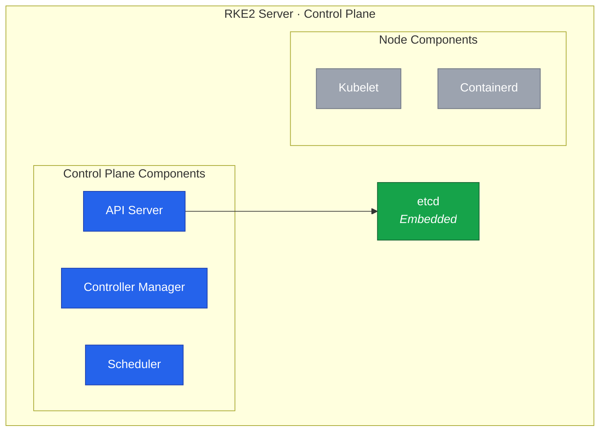

In this lesson, we'll install RKE2 on Node 4 as the first control plane node with dual-stack networking.
This establishes the foundation of Cluster B that will eventually replace the k3s cluster.



## Understanding RKE2

### Architecture Overview

RKE2 (also known as RKE Government) is a fully conformant Kubernetes distribution focused on security and compliance.
Unlike k3s which prioritizes minimal resource usage, RKE2 prioritizes security hardening and FIPS compliance.



The key components are:

| Component   | Description                                                    |
| ----------- | -------------------------------------------------------------- |
| rke2-server | Control plane: API server, controller manager, scheduler, etcd |
| rke2-agent  | Worker node: kubelet and container runtime                     |
| etcd        | Embedded distributed key-value store for cluster state         |
| containerd  | Container runtime (Docker is not used)                         |

### Security Features

RKE2 includes several security features that should be configured during initial setup.

**Secrets Encryption at Rest** encrypts Kubernetes secrets in etcd.
Enabling this later requires re-encrypting all existing secrets, so it's best to enable from the start.

**Pod Security Standards (PSS)** replace the deprecated PodSecurityPolicy:

| Profile    | Description                                         |
| ---------- | --------------------------------------------------- |
| privileged | No restrictions (default)                           |
| baseline   | Prevents known privilege escalations                |
| restricted | Heavily restricted, follows security best practices |

You can start with `privileged` and tighten later, or start strict with `restricted`.

**Network Policies** are enforced by the CNI plugin.
With Cilium, you get L3-L7 network policies out of the box.

## Configuration Planning

### Network CIDRs

These CIDR ranges were planned in [Lesson 6](/guides/migrating-k3s-to-rke2-without-downtime/lesson-6) and cannot be changed after cluster creation:

| Network         | IPv4 CIDR    | IPv6 CIDR     |
| --------------- | ------------ | ------------- |
| Node Network    | 10.0.0.0/24  | fd00::/64     |
| Pod Network     | 10.42.0.0/16 | fd00:42::/56  |
| Service Network | 10.43.0.0/16 | fd00:43::/112 |
| Cluster DNS     | 10.43.0.10   | fd00:43::a    |

### Configuration Options

The RKE2 configuration file supports these key options for dual-stack:

| Option               | Purpose                                    |
| -------------------- | ------------------------------------------ |
| `token`              | Authenticates nodes joining the cluster    |
| `tls-san`            | Additional names/IPs for API server cert   |
| `cni`                | CNI plugin (set to `none` for Cilium)      |
| `node-ip`            | Node's IPs, comma-separated for dual-stack |
| `cluster-cidr`       | Pod network CIDRs, comma-separated         |
| `service-cidr`       | Service network CIDRs, comma-separated     |
| `cluster-dns`        | DNS service IP                             |
| `secrets-encryption` | Enable encryption at rest                  |

### File Locations

| Path                                | Content             |
| ----------------------------------- | ------------------- |
| `/etc/rancher/rke2/config.yaml`     | RKE2 configuration  |
| `/etc/rancher/rke2/rke2.yaml`       | Kubeconfig file     |
| `/var/lib/rancher/rke2/bin/`        | Kubernetes binaries |
| `/var/lib/rancher/rke2/server/tls/` | TLS certificates    |
| `/var/lib/rancher/rke2/server/db/`  | etcd data           |

## Installing RKE2

### Generate Cluster Token

Generate a secure token that all nodes will use to join the cluster:

```bash
openssl rand -hex 32 | sudo tee /root/rke2-token.txt
```



### Run the Installer

```bash
curl -sfL https://get.rke2.io | sudo sh -

# Verify installation
rke2 --version
```

### Create Configuration

```bash
sudo mkdir -p /etc/rancher/rke2

TOKEN=$(sudo cat /root/rke2-token.txt)

sudo tee /etc/rancher/rke2/config.yaml <<EOF
token: ${TOKEN}

tls-san:
  - node4
  - node4.k8s.local
  - 10.0.0.4
  - fd00::4

cni: none
disable:
  - rke2-ingress-nginx

node-ip: 10.0.0.4,fd00::4
bind-address: 0.0.0.0
write-kubeconfig-mode: "0644"

cluster-cidr: 10.42.0.0/16,fd00:42::/56
service-cidr: 10.43.0.0/16,fd00:43::/112
cluster-dns: 10.43.0.10

etcd-snapshot-schedule-cron: "0 */6 * * *"
etcd-snapshot-retention: 5

secrets-encryption: true
EOF
```

### Start RKE2

```bash
sudo systemctl enable rke2-server.service
sudo systemctl start rke2-server.service

# Watch startup logs
sudo journalctl -u rke2-server -f
```

The first start takes several minutes as RKE2 downloads images, initializes etcd, and generates certificates.
Wait until you see the API server is ready:

```
level=info msg="Running kube-apiserver ..."
level=info msg="Tunnel server is Running"
```

Press `Ctrl+C` to exit the log view.

### Configure kubectl

```bash
mkdir -p ~/.kube
sudo cp /etc/rancher/rke2/rke2.yaml ~/.kube/config
sudo chown $(id -u):$(id -g) ~/.kube/config
chmod 600 ~/.kube/config

echo 'export PATH=$PATH:/var/lib/rancher/rke2/bin' >> ~/.bashrc
export PATH=$PATH:/var/lib/rancher/rke2/bin

kubectl version
```

## Verification

### Cluster Status

```bash
kubectl get nodes -o wide
```

The node will show `NotReady` until the CNI is installed:

```
NAME    STATUS     ROLES                       AGE   VERSION
node4   NotReady   control-plane,etcd,master   1m    v1.31.x+rke2r1
```

### Dual-Stack Configuration

Verify the node has both IPv4 and IPv6 addresses:

```bash
kubectl get nodes -o jsonpath='{.items[*].status.addresses}' | jq .
```

Check the cluster CIDR configuration:

```bash
kubectl cluster-info dump | grep -E "cluster-cidr|service-cluster-ip-range"
```

### etcd Health

```bash
sudo /var/lib/rancher/rke2/bin/etcdctl \
  --endpoints=https://127.0.0.1:2379 \
  --cacert=/var/lib/rancher/rke2/server/tls/etcd/server-ca.crt \
  --cert=/var/lib/rancher/rke2/server/tls/etcd/server-client.crt \
  --key=/var/lib/rancher/rke2/server/tls/etcd/server-client.key \
  endpoint health
```

For convenience, add an alias:

```bash
cat <<'EOF' >> ~/.bashrc
alias etcdctl='sudo /var/lib/rancher/rke2/bin/etcdctl \
  --endpoints=https://127.0.0.1:2379 \
  --cacert=/var/lib/rancher/rke2/server/tls/etcd/server-ca.crt \
  --cert=/var/lib/rancher/rke2/server/tls/etcd/server-client.crt \
  --key=/var/lib/rancher/rke2/server/tls/etcd/server-client.key'
EOF
source ~/.bashrc
```

### Create Initial Backup

```bash
sudo mkdir -p /root/rke2-backup
sudo cp /etc/rancher/rke2/config.yaml /root/rke2-backup/
sudo cp /root/rke2-token.txt /root/rke2-backup/
cp ~/.kube/config /root/rke2-backup/kubeconfig

sudo /var/lib/rancher/rke2/bin/rke2 etcd-snapshot save --name initial-setup
```

## Troubleshooting

### RKE2 Won't Start

```bash
sudo systemctl status rke2-server
sudo journalctl -xeu rke2-server
```

Common issues:

- Port 6443 already in use (existing k3s or Kubernetes installation)
- Firewall blocking required ports
- Invalid CIDR format in dual-stack config

### Dual-Stack Issues

```bash
# Verify IPv6 is enabled (should return 0)
sysctl net.ipv6.conf.all.disable_ipv6

# Check API server certificate includes IPv6
openssl s_client -connect 127.0.0.1:6443 -showcerts </dev/null 2>/dev/null | \
  openssl x509 -noout -text | grep -A1 "Subject Alternative Name"
```

### etcd Issues

```bash
sudo journalctl -u rke2-server | grep etcd
df -h /var/lib/rancher/rke2/
```

The node is in `NotReady` state because we haven't installed a CNI.
In the next lesson, we'll install Cilium with dual-stack support to provide pod networking.
