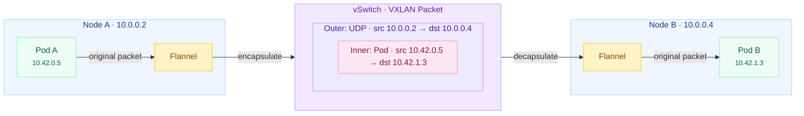

Canal was installed automatically when RKE2 started in [Lesson 8](/guides/migrating-k3s-to-rke2-without-downtime/lesson-8).
This lesson verifies that dual-stack networking is working, enables WireGuard encryption for inter-node traffic, and configures Calico network policies to secure pod communication.



## Understanding Canal

### Architecture

Canal is a composite CNI that combines two well-established projects: [Flannel](https://github.com/flannel-io/flannel) handles inter-node traffic by creating a VXLAN overlay network, while [Calico](https://www.tigera.io/project-calico/) manages intra-node routing and enforces network policies.
This separation of concerns gives Canal the simplicity of Flannel's overlay networking with the power of Calico's policy engine.

| Component      | Role                  | Responsibility                                       |
| -------------- | --------------------- | ---------------------------------------------------- |
| Flannel        | Inter-node overlay    | VXLAN tunnels between nodes, IP masquerading         |
| Calico (Felix) | Intra-node routing    | Local pod routing, iptables/nftables rule management |
| Calico         | Network policy engine | L3-L4 network policy enforcement                     |

Each Canal pod runs both a Flannel and a Calico container as a DaemonSet, ensuring every node in the cluster participates in both the overlay network and the policy engine.

### Data Plane: iptables vs eBPF

Traditional Kubernetes networking and Canal's default data plane rely on iptables (or its successor nftables) to process packets.
The kernel evaluates packets against a chain of rules, and each Kubernetes Service adds entries to that chain.
In a dual-stack cluster the rule count effectively doubles, since separate chains exist for IPv4 and IPv6.

eBPF (extended Berkeley Packet Filter) is an alternative data plane technology that runs sandboxed programs directly inside the Linux kernel.
Rather than traversing rule chains, eBPF programs use hash maps for O(1) lookups and can process both IPv4 and IPv6 in a single code path.
CNI plugins like Cilium and newer versions of Calico support eBPF natively, replacing iptables entirely.

Canal does not use eBPF — it relies on the traditional iptables/nftables stack.
For most clusters this performs well, but it's worth understanding the trade-off:

| Aspect             | iptables (Canal)                  | eBPF (Cilium, Calico eBPF)         |
| ------------------ | --------------------------------- | ---------------------------------- |
| Rule complexity    | Linear chain, grows with Services | Hash maps, constant-time lookups   |
| Dual-stack         | Separate rule sets per family     | Unified code path                  |
| Policy scope       | L3-L4 (NetworkPolicy)             | L3-L7 (extended policy CRDs)       |
| Kernel requirement | Any modern kernel                 | 4.19+ (5.8+ recommended)           |
| Maturity           | Battle-tested, decades of use     | Rapidly maturing, production-ready |

We chose Canal because it is the RKE2 default, auto-detects dual-stack, and requires no additional installation or kernel dependencies.
If your workloads eventually need L7 policy enforcement or eBPF performance, RKE2 also bundles Cilium and Calico with eBPF support as alternative CNI options, but switching CNI requires rebuilding the cluster.

### IPAM (IP Address Management)

IPAM controls how pod IP addresses are allocated across the cluster.
Different CNI plugins support different allocation strategies:

| Mode         | Description                                                  |
| ------------ | ------------------------------------------------------------ |
| kubernetes   | Delegates to Kubernetes, uses each node's PodCIDR allocation |
| cluster-pool | The CNI manages a cluster-wide pool of IPs                   |
| multi-pool   | Multiple pools with different CIDRs per node                 |

Canal uses the `kubernetes` mode exclusively.
RKE2 configures the pod CIDRs at startup (we set `cluster-cidr: 10.42.0.0/16,fd00:42::/56` in Lesson 8), and the Kubernetes controller manager assigns each node a subnet from that range.
When a pod starts, it receives one IPv4 and one IPv6 address from its node's allocated subnets.

This means the CNI never makes allocation decisions itself and it simply uses the addresses that Kubernetes provides.
You can see this in action by inspecting any running pod's IP assignments:

```bash
$ kubectl -n kube-system get pod etcd-node4 -o jsonpath='{.status.podIPs}' | jq .
[
  { "ip": "10.0.0.4" },
  { "ip": "fd00::4" }
]
```

Static pods like etcd use the node's own addresses, but regular pods receive addresses from the pod CIDR subnets allocated to their node.
The advantage is that pod CIDR assignments stay consistent with the cluster configuration, and tools like `kubectl get nodes -o jsonpath` accurately reflect which subnets belong to which nodes.

```bash
$ kubectl -n kube-system get pod rke2-metrics-server-7b59bd8854-blsqz -o jsonpath='{.status.podIPs}' | jq .
[
  {
    "ip": "10.42.0.8"
  },
  {
    "ip": "fd00:42::8"
  }
]
```

### Overlay and Encryption

VXLAN (Virtual Extensible LAN) is a network encapsulation protocol that creates a virtual Layer 2 network on top of an existing Layer 3 infrastructure.
It works by wrapping each original Ethernet frame inside a UDP packet with a VXLAN header, effectively creating a tunnel between two endpoints.
The outer UDP packet is routable across any IP network, while the inner frame carries the original pod-to-pod traffic unchanged.

Canal uses VXLAN as its default overlay for inter-node traffic.
When a pod on Node A sends a packet to a pod on Node B, Flannel wraps the packet in a VXLAN header addressed to Node B's IP, sends it across the vSwitch, and Flannel on Node B unwraps it and delivers the original packet to the destination pod.



The diagram shows how the original pod-to-pod packet is nested inside VXLAN encapsulation for transit across the vSwitch.
The underlying infrastructure only needs to route between node IPs—it never sees the pod CIDRs directly.

The trade-off is a small overhead per packet (approximately 50 bytes for the VXLAN + UDP + outer IP headers) and the fact that the encapsulated traffic is unencrypted by default.
On a private vSwitch this is generally acceptable, but for defense in depth we'll enable WireGuard encryption later in this lesson.

## Verification

### Canal Pod Status

Verify that both containers in the Canal pod are running on every node:

```bash
$ kubectl get pods -n kube-system -l k8s-app=canal -o wide
NAME               READY   STATUS    RESTARTS   AGE   IP         NODE
rke2-canal-xxxxx   2/2     Running   0          30m   10.0.0.4   node4
```

Both containers must show `2/2` in the `READY` column—one for Calico and one for Flannel.
A single-node cluster shows one pod; this grows to one per node as additional nodes join.

### Dual-Stack Pod Test

Deploy a test pod and confirm it receives both an IPv4 and IPv6 address from the pod CIDRs:

```bash
$ kubectl run dual-stack-test --image=busybox:1.36 --restart=Never -- sleep 3600
pod/dual-stack-test created
$ kubectl wait --for=condition=Ready pod/dual-stack-test --timeout=60s
pod/dual-stack-test condition met
$ kubectl get pod dual-stack-test -o jsonpath='{.status.podIPs}' | jq .
[
  {
    "ip": "10.42.0.10"
  },
  {
    "ip": "fd00:42::a"
  }
]
```

The pod should have one address from `10.42.0.0/16` and one from `fd00:42::/56`.

Test that the pod can reach the node over both address families:

```bash
$ kubectl exec dual-stack-test -- ping -c 2 10.0.0.4
PING 10.0.0.4 (10.0.0.4): 56 data bytes
64 bytes from 10.0.0.4: seq=0 ttl=64 time=0.105 ms
64 bytes from 10.0.0.4: seq=1 ttl=64 time=0.069 ms

--- 10.0.0.4 ping statistics ---
2 packets transmitted, 2 packets received, 0% packet loss
round-trip min/avg/max = 0.069/0.087/0.105 ms

$ kubectl exec dual-stack-test -- ping6 -c 2 fd00::4
PING fd00::4 (fd00::4): 56 data bytes
64 bytes from fd00::4: seq=0 ttl=64 time=0.148 ms
64 bytes from fd00::4: seq=1 ttl=64 time=0.108 ms

--- fd00::4 ping statistics ---
2 packets transmitted, 2 packets received, 0% packet loss
round-trip min/avg/max = 0.108/0.128/0.148 ms
```

Clean up the test pod:

```bash
$ kubectl delete pod dual-stack-test
```



## Enabling WireGuard Encryption

### Why Encrypt Overlay Traffic

VXLAN encapsulation carries pod traffic in cleartext between nodes.
On a shared physical network like Hetzner's vSwitch — where VLAN tagging provides logical isolation but not encryption — a compromised adjacent server could theoretically capture inter-node packets.

WireGuard adds an encryption layer around the VXLAN tunnel, so the packet on the wire is fully encrypted:

```mermaid!
flowchart LR
    subgraph NodeA["Node A · 10.0.0.2"]
        PodA["Pod A<br/><small>10.42.0.5</small>"]
        FA["Flannel"]
        WA["WireGuard"]
    end

    subgraph Wire["vSwitch · Encrypted Packet"]
        direction TB
        subgraph WG["WireGuard · encrypted"]
            subgraph Outer["VXLAN · src 10.0.0.2 → dst 10.0.0.4"]
                subgraph Inner["Pod · src 10.42.0.5 → dst 10.42.1.3"]
                end
            end
        end
    end

    subgraph NodeB["Node B · 10.0.0.4"]
        WB["WireGuard"]
        FB["Flannel"]
        PodB["Pod B<br/><small>10.42.1.3</small>"]
    end

    PodA -->|"original"| FA
    FA -->|"VXLAN wrap"| WA
    WA -->|"encrypt"| Wire
    Wire -->|"decrypt"| WB
    WB -->|"VXLAN unwrap"| FB
    FB -->|"original"| PodB

    classDef node fill:#eff6ff,color:#1e3a8a,stroke:#bfdbfe,stroke-width:1.5px
    classDef pod fill:#ecfdf5,color:#065f46,stroke:#a7f3d0,stroke-width:1.5px
    classDef flannel fill:#fef3c7,color:#92400e,stroke:#fcd34d,stroke-width:1.5px
    classDef wg fill:#d1fae5,color:#065f46,stroke:#6ee7b7,stroke-width:1.5px
    classDef wire fill:#f3e8ff,color:#5b21b6,stroke:#c4b5fd,stroke-width:1.5px
    classDef outer fill:#ede9fe,color:#4c1d95,stroke:#c4b5fd,stroke-width:1.5px
    classDef inner fill:#fce7f3,color:#831843,stroke:#f9a8d4,stroke-width:1.5px
    classDef encrypted fill:#d1fae5,color:#065f46,stroke:#6ee7b7,stroke-width:1.5px

    class NodeA,NodeB node
    class PodA,PodB pod
    class FA,FB flannel
    class WA,WB wg
    class Wire wire
    class WG encrypted
    class Outer outer
    class Inner inner
```



The diagram extends the earlier VXLAN flow with WireGuard wrapping the entire VXLAN packet in an encrypted tunnel before it hits the wire.
Each node establishes a WireGuard tunnel to every other node, and all overlay traffic flows through these tunnels transparently.

### Applying the Configuration

WireGuard requires kernel module support.
Before applying the configuration, verify the module loads correctly:

```bash
$ modprobe wireguard
$ lsmod | grep wireguard
wireguard             118784  0
```

If the module fails to load, your kernel may need the WireGuard package installed.
On Rocky Linux 10, WireGuard is included in the default kernel.

RKE2 bundles Canal as a Helm chart, and customizations are applied through a `HelmChartConfig` resource placed in the auto-deploy manifests directory:

```bash
$ cat <<'EOF' > /var/lib/rancher/rke2/server/manifests/rke2-canal-config.yaml
apiVersion: helm.cattle.io/v1
kind: HelmChartConfig
metadata:
  name: rke2-canal
  namespace: kube-system
spec:
  valuesContent: |-
    flannel:
      backend: "wireguard"
EOF
```

RKE2 detects the new manifest and upgrades the Canal Helm release automatically.
Restart the Canal DaemonSet to apply the new backend:

```bash
$ kubectl rollout restart ds rke2-canal -n kube-system
daemonset.apps/rke2-canal restarted
$ kubectl rollout status ds rke2-canal -n kube-system --timeout=120s
Waiting for daemon set "rke2-canal" rollout to finish: 0 of 1 updated pods are available...
daemon set "rke2-canal" successfully rolled out
```

WireGuard tunnels are only established between peers, so there is nothing to verify on a single-node cluster.
We'll confirm that WireGuard encryption is active in Lesson 11 after the second control plane node joins.

## Network Policies

### Understanding Network Policies

By default, Kubernetes allows all pod-to-pod communication across all namespaces.
A `NetworkPolicy` resource changes this by defining explicit ingress and egress rules for pods matching a selector.
Once any NetworkPolicy selects a pod, all traffic not explicitly allowed by a policy is denied.

Canal enforces these policies through Calico's policy engine, which supports standard Kubernetes `NetworkPolicy` resources at L3-L4 (IP addresses, ports, and protocols).

| Scope              | Resource type    | Enforced by       |
| ------------------ | ---------------- | ----------------- |
| Pod-to-pod traffic | `NetworkPolicy`  | Calico (in Canal) |
| Host-level traffic | Hetzner firewall | Hetzner network   |

Unlike Cilium, Canal does not provide host-level network policies—the Hetzner firewall configured in [Lesson 7](/guides/migrating-k3s-to-rke2-without-downtime/lesson-7) serves that role.

### Default Deny per Namespace

A common security pattern is to deny all ingress traffic by default and then allow specific communication paths.
This policy selects all pods in a namespace and permits only traffic from within the same namespace.

Pods also need to reach CoreDNS (in `kube-system`) to resolve service names, so a companion egress policy must allow DNS traffic.
Without it, pods cannot look up any service addresses.

We place both policies in the RKE2 auto-deploy manifests directory so they are applied on every cluster start and survive node rebuilds—consistent with how we deployed the Canal HelmChartConfig. Create a file at `/var/lib/rancher/rke2/server/manifests/default-network-policies.yaml` with the following content:

```yaml
# Default deny ingress: only allow traffic from within the same namespace
apiVersion: networking.k8s.io/v1
kind: NetworkPolicy
metadata:
  name: default-deny-ingress
  namespace: default
spec:
  podSelector: {}
  policyTypes:
    - Ingress
  ingress:
    - from:
        - podSelector: {}
---
# Allow DNS egress to CoreDNS in kube-system
apiVersion: networking.k8s.io/v1
kind: NetworkPolicy
metadata:
  name: allow-dns
  namespace: default
spec:
  podSelector: {}
  policyTypes:
    - Egress
  egress:
    - to:
        - namespaceSelector:
            matchLabels:
              kubernetes.io/metadata.name: kube-system
      ports:
        - port: 53
          protocol: TCP
        - port: 53
          protocol: UDP
```

RKE2 picks up the manifest automatically within a few seconds.
The `default-deny-ingress` policy restricts pods in the `default` namespace to only accept traffic from other pods in the same namespace, while `allow-dns` ensures DNS resolution continues to work.

For additional namespaces you create, apply the same pair of policies by duplicating the manifest with the appropriate `namespace` field—or use the CIS hardening profile described below.

### CIS Hardening Profile

RKE2 can automatically apply namespace-level network policies and stricter Pod Security Standards when started with the `profile: cis` configuration option.
This applies a default-deny ingress policy and a DNS-allow policy to the `kube-system`, `kube-public`, and `default` namespaces—similar to the manual policies above but managed by RKE2 itself.

For namespaces you create, you are still responsible for applying appropriate network policies.
The manual policies shown above serve as a template for securing your application namespaces.

### Verifying Network Policies

Check that both policies are applied:

```bash
$ kubectl get networkpolicies -A
NAMESPACE   NAME                   POD-SELECTOR   AGE
default     allow-dns              <none>         26s
default     default-deny-ingress   <none>         26s
```

Test from within a pod that DNS works but cross-namespace traffic is blocked:

```bash
$ kubectl run policy-test --image=busybox:1.36 -n default --restart=Never -- sleep 3600
pod/policy-test created

$ kubectl wait --for=condition=Ready pod/policy-test -n default --timeout=60s
pod/policy-test condition met

# DNS should work
$ kubectl exec -n default policy-test -- nslookup kubernetes.default.svc.cluster.local
Server:         10.43.0.10
Address:        10.43.0.10:53


Name:   kubernetes.default.svc.cluster.local
Address: 10.43.0.1

# Cross-namespace traffic should be blocked (will timeout)
$ kubectl exec -n default policy-test -- wget -qO- --timeout=3 http://rke2-metrics-server.kube-system.svc:443 2>&1 || echo "Blocked as expected"
wget: download timed out
command terminated with exit code 1
Blocked as expected

$ kubectl delete pod policy-test -n default
pod "policy-test" deleted from default namespace
```

## Troubleshooting

For Canal pod startup failures and dual-stack IPv6 issues, refer to the troubleshooting section in [Lesson 8](/guides/migrating-k3s-to-rke2-without-downtime/lesson-8).
The sections below cover issues specific to this lesson's configuration.

### Network Policy Not Blocking Traffic

Calico applies network policies asynchronously.
After creating a policy, allow a few seconds for Felix to program the iptables rules.
Verify that the policy is recognized:

```bash
$ kubectl get networkpolicies -n <namespace>
```

If traffic is still flowing despite a deny policy, check that no other policy in the namespace is allowing it.
Kubernetes network policies are additive, meaning any policy that allows traffic takes precedence.
