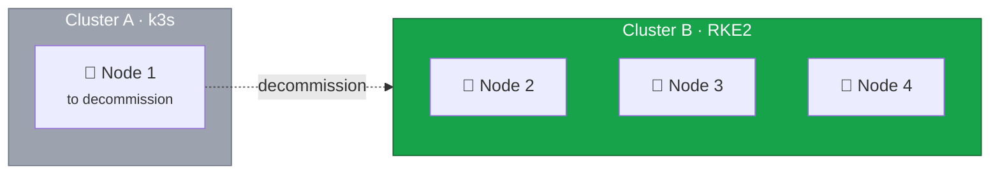

This guide covers the infrastructure migration — building Cluster B, moving nodes, and configuring the platform.
The actual workload migration — deploying applications, secrets, and persistent data to Cluster B — depends entirely on your setup and must be completed before this lesson.



{% include alert.liquid.html type='warning' title='All Workloads Must Be Migrated' content='
Do not proceed until all applications, persistent data, and DNS records have been moved to Cluster B.
How you accomplish this depends on your deployment method (Helm, GitOps, manual manifests) and data migration strategy (database replication, backup/restore, volume copy).
Give Cluster B at least 24-48 hours of serving production traffic before decommissioning — this allows time for issues to surface that only appear under real load.
' %}

## Current State



Cluster B is serving all production traffic with three control plane nodes while Cluster A still has Node 1 running k3s.
The goal of this lesson is to shut down k3s cleanly and remove every trace of it from Node 1.
Once that is done, Node 1 is ready for a fresh OS install and can join Cluster B as a worker in Lesson 15.

## Final Backup

Before tearing anything down, we take a final etcd snapshot and copy it off the node.
This gives us a point-in-time recovery option if anything was missed during workload migration.

```bash
$ ssh root@node1

# Create final etcd snapshot
$ sudo k3s etcd-snapshot save --name final-backup-$(date +%Y%m%d-%H%M%S)

# Copy backups to safe location
$ scp -r /var/lib/rancher/k3s/server/db/snapshots/* k8sadmin@node4:/tmp/k3s-final-backups/
```

With the backup safely stored on Node 4 (move it to a permanent location with `sudo mv /tmp/k3s-final-backups/ /root/`), we can verify that no traffic is still hitting the old cluster.

## Verifying No Active Traffic

We check the k3s journal for recent HTTP activity to confirm that Cluster A is no longer receiving requests.

```bash
$ sudo journalctl -u k3s --since "1 hour ago" | grep -c "HTTP"
0
```

The count should be zero or near-zero.
Any significant activity means DNS records or load balancer rules still point to Cluster A and must be corrected before continuing.

## Removing k3s

With the backup saved and traffic confirmed idle, we stop the k3s service and prevent it from starting on reboot.

```bash
$ sudo systemctl stop k3s
$ sudo systemctl disable k3s
```

The k3s uninstall script removes all components — binaries, systemd services, configuration under `/etc/rancher/k3s/`, data under `/var/lib/rancher/k3s/`, CNI configurations, iptables rules, and container images.

```bash
$ sudo /usr/local/bin/k3s-uninstall.sh
```

A few directories outside the k3s tree may still contain Kubernetes-related state from the previous installation.
We remove those as well.

```bash
$ rm -rf ~/.kube
$ rm -rf /var/lib/kubelet
$ rm -rf /etc/kubernetes
```

## Verification

We confirm that no k3s processes, listening ports, or leftover files remain on Node 1.

```bash
# No k3s processes
$ ps aux | grep k3s

# No kubernetes ports
$ ss -tlnp | grep -E "6443|10250|2379|2380"

# No k3s files
$ ls /var/lib/rancher/ 2>/dev/null
$ ls /etc/rancher/ 2>/dev/null
```

All four commands should produce no output.
If any k3s process is still running or a port is still listening, investigate before proceeding — a leftover process could conflict with the RKE2 agent we install in Lesson 15.


