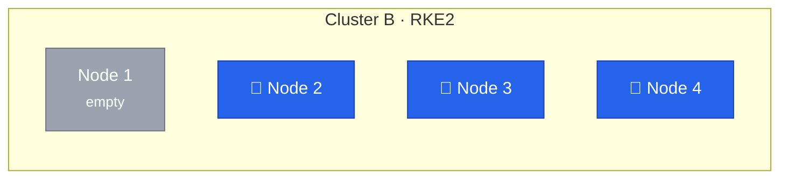
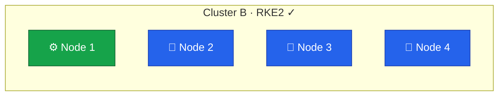

Node 1 follows the same OS preparation as the previous node migrations — install Rocky Linux, configure networking, and set up the firewall.
The key difference is that Node 1 joins as a worker (agent) rather than a control plane node (server), so it does not run etcd, the API server, or the scheduler.
We covered the full OS setup process in Lesson 11.



## Current State



Cluster A was decommissioned in the previous [lesson-14](/guides/migrating-k3s-to-rke2/lesson-14).
Node 1 is a blank server ready for a fresh OS install.

## Server vs Agent

The previous nodes all joined as `rke2-server` — running the full control plane stack alongside workloads.
Node 1 joins as `rke2-agent`, which is a lighter process that only runs the components needed to schedule and execute pods.

| Component          | Server (Nodes 2-4) | Agent (Node 1) |
| ------------------ | ------------------ | -------------- |
| kubelet            | Yes                | Yes            |
| Container runtime  | Yes                | Yes            |
| Canal (CNI)        | Yes                | Yes            |
| etcd               | Yes                | No             |
| API server         | Yes                | No             |
| Controller manager | Yes                | No             |
| Scheduler          | Yes                | No             |

A worker node only needs the cluster token and the address of a control plane node to join.
The configuration is simpler — no `tls-san`, no security settings, no authentication config.

## Preparing the OS

The OS preparation follows the same process we used for the other nodes in [Lesson 11](/guides/migrating-k3s-to-rke2/lesson-11) — install Rocky Linux 10, configure dual-stack networking with `10.1.0.11` and `fd00::11`, and set up the Hetzner firewall.

Worker nodes need fewer firewall ports than control plane nodes.
The etcd ports (`2379`, `2380`) and API server port (`6443`) are not required since the agent does not run those services.

## Installing RKE2 Agent

We set the hostname and install the agent variant of RKE2:

```bash
# Run using root or a user with sudo privileges
$ curl -sfL https://get.rke2.io | INSTALL_RKE2_TYPE="agent" sh -
$ systemctl enable rke2-agent.service
```

The `INSTALL_RKE2_TYPE="agent"` environment variable tells the installer to set up the agent service instead of the server.

We create the configuration directory next:

```bash
$ sudo mkdir -p /etc/rancher/rke2
```

The agent needs only two things — where to connect and how to authenticate.
Retrieve the cluster token from any control plane node:

```bash
# On any control plane node (Node 2, 3, or 4)
$ sudo cat /var/lib/rancher/rke2/server/node-token
K10...::server:xxxx
```

RKE2 generated this token during the initial cluster bootstrap and stored it at `/var/lib/rancher/rke2/server/node-token`.
The same token was used when joining Nodes 2 and 3 in [Lesson 11](/guides/migrating-k3s-to-rke2/lesson-11).

Back on Node 1, create the configuration file with the token and the address of a control plane node:

```yaml
# /etc/rancher/rke2/config.yaml
server: https://10.1.0.14:9345
token: <paste-token-from-node4>
node-ip: 10.1.0.11,fd00::11

kubelet-arg:
  - "resolv-conf=/etc/rancher/rke2/resolv.conf"
```

The `server` address points to Node 4's supervisor API on port `9345` — the same endpoint used when joining the other nodes.

Create the clean resolv.conf to isolate pod DNS from Tailscale on the host, as in [Lesson 6](/guides/migrating-k3s-to-rke2/lesson-6#isolating-host-dns-from-pod-dns):

```bash
$ cat <<'EOF' | sudo tee /etc/rancher/rke2/resolv.conf
nameserver 1.1.1.1
nameserver 1.0.0.1
EOF
```

## Starting the Agent

Start the agent for the first time to let RKE2 create its data directory:

```bash
$ sudo systemctl start rke2-agent.service
$ sudo journalctl -u rke2-agent -f
```

Once the agent is running and the node appears in `kubectl get nodes`, stop it to apply the runc workaround:

```bash
$ sudo systemctl stop rke2-agent.service
```

The data directory now exists at `/var/lib/rancher/rke2/data/`, so we can apply the runc v1.3.4 patch from [Lesson 5](/guides/migrating-k3s-to-rke2/lesson-5#patching-runc-workaround-for-container-exec-failures).
Download the binary and replace the bundled runc — the same steps used on the control plane nodes.

Start the agent again with the patched runc:

```bash
$ sudo systemctl start rke2-agent.service
$ sudo journalctl -u rke2-agent -f
```

The agent contacts Node 4's supervisor API, retrieves certificates, and registers itself with the cluster.
Canal deploys automatically and establishes WireGuard tunnels to all three control plane nodes.

## Verification

### Node Status

All four nodes should appear, with Node 1 showing no control plane roles:

```bash
$ kubectl get nodes -o wide
NAME    STATUS   ROLES                       AGE
node1   Ready    <none>                      2m
node2   Ready    control-plane,etcd,master   3d
node3   Ready    control-plane,etcd,master   7d
node4   Ready    control-plane,etcd,master   8d
```

The `<none>` role for Node 1 indicates it is a pure worker.
We can add a label for clarity:

```bash
$ kubectl label node node1 node-role.kubernetes.io/worker=true
```

### Canal and WireGuard

We verify that Canal has deployed a pod on Node 1:

```bash
$ kubectl get pods -n kube-system -l k8s-app=canal -o wide
NAME               READY   STATUS    RESTARTS   AGE     IP          NODE         NOMINATED NODE   READINESS GATES
rke2-canal-4gtl2   2/2     Running   0          2m47s   10.1.0.11   node1   <none>           <none>
rke2-canal-mbg2b   2/2     Running   0          23h     10.1.0.12   node2   <none>           <none>
rke2-canal-lbvzm   2/2     Running   0          23h     10.1.0.13   node3   <none>           <none>
rke2-canal-2p4sf   2/2     Running   0          23h     10.1.0.14   node4   <none>           <none>
```

Four Canal pods should appear — one per node, all `Running`.

On Node 1, we check the WireGuard interface to confirm tunnels to all three control plane nodes:

```bash
$ sudo wg show flannel-wg
interface: flannel-wg
  public key: nM1gPsD9oUNGOBUbailDEMFkYTX37VkiZZmNSkt8BAM=
  private key: (hidden)
  listening port: 51820

peer: zNYaU32ej6Cimr8yyLymTmy+2yaCzY8iCHtqrMdJhzU=
  endpoint: 37.27.XX.XX:51820
  allowed ips: 10.42.1.0/24
  latest handshake: 34 seconds ago
  transfer: 22.39 KiB received, 25.20 KiB sent

peer: rgId15u7J94Df1t1LwnYP7H+6Q6nz2erce9V4a0m1Qw=
  endpoint: 135.181.XX.XX:51820
  allowed ips: 10.42.0.0/24
  latest handshake: 38 seconds ago
  transfer: 16.60 KiB received, 14.57 KiB sent

peer: GcVgmEwB5ZFmx2VN9DcxqmqY3gFLj0zM9YJU78barSs=
  endpoint: 135.181.XX.XX:51820
  allowed ips: 10.42.2.0/24
  latest handshake: 50 seconds ago
  transfer: 159.75 KiB received, 97.62 KiB sent
```

The output should list three peers — one for each control plane node — each with a recent handshake timestamp.

## Preparing Longhorn Storage

Longhorn needs system-level dependencies on every node before it can schedule replicas.
The process is identical to the other nodes — we covered what each dependency does in Lesson 7.

Agent nodes do not have a kubeconfig file — only control plane nodes store one at `/etc/rancher/rke2/rke2.yaml`.
Run the `longhornctl` commands from any control plane node, where they will install dependencies across all nodes in the cluster including Node 1.

On a control plane node (Node 2, 3, or 4), install `longhornctl` if it is not already present and run the preflight installer:

```bash
$ curl -fL -o /usr/local/bin/longhornctl \
    https://github.com/longhorn/cli/releases/download/v1.11.0/longhornctl-linux-amd64
$ chmod +x /usr/local/bin/longhornctl

$ /usr/local/bin/longhornctl --kubeconfig /etc/rancher/rke2/rke2.yaml install preflight
```

Run the preflight check to confirm all dependencies are in place:

```bash
$ /usr/local/bin/longhornctl --kubeconfig /etc/rancher/rke2/rke2.yaml check preflight
INFO[2026-02-21T11:36:54+02:00] Initializing preflight installer
INFO[2026-02-21T11:36:54+02:00] Cleaning up preflight installer
INFO[2026-02-21T11:36:54+02:00] Running preflight installer
INFO[2026-02-21T11:36:54+02:00] Installing dependencies with package manager
INFO[2026-02-21T11:37:01+02:00] Installed dependencies with package manager
INFO[2026-02-21T11:37:01+02:00] Retrieved preflight installer result:
node1:
  info:
  - Successfully probed module nfs
  - Successfully probed module iscsi_tcp
  - Successfully probed module dm_crypt
  - Successfully started service iscsid
node2:
  info:
  - Successfully probed module nfs
  - Successfully probed module iscsi_tcp
  - Successfully probed module dm_crypt
  - Successfully started service iscsid
node3:
  info:
  - Successfully probed module nfs
  - Successfully probed module iscsi_tcp
  - Successfully probed module dm_crypt
  - Successfully started service iscsid
node4:
  info:
  - Successfully probed module nfs
  - Successfully probed module iscsi_tcp
  - Successfully probed module dm_crypt
  - Successfully started service iscsid
INFO[2026-02-21T11:37:01+02:00] Cleaning up preflight installer
INFO[2026-02-21T11:37:01+02:00] Completed preflight installer. Use 'longhornctl check preflight' to check the result (on some os a reboot and a new install execution is required first)
```

The check should report no errors for Node 1.
We verify that Longhorn recognizes all four nodes as schedulable:

```bash
$ kubectl get nodes.longhorn.io -n longhorn-system
NAME    READY   ALLOWSCHEDULING   SCHEDULABLE   AGE
node1   True    true              True          2m
node2   True    true              True          3d
node3   True    true              True          7d
node4   True    true              True          8d
```

With four storage nodes, Longhorn has more capacity for distributing replicas across the cluster.

## Final State



Cluster B now has three control plane nodes for high availability and one dedicated worker node for additional workload capacity.
All four nodes participate in Longhorn storage and the WireGuard mesh.
