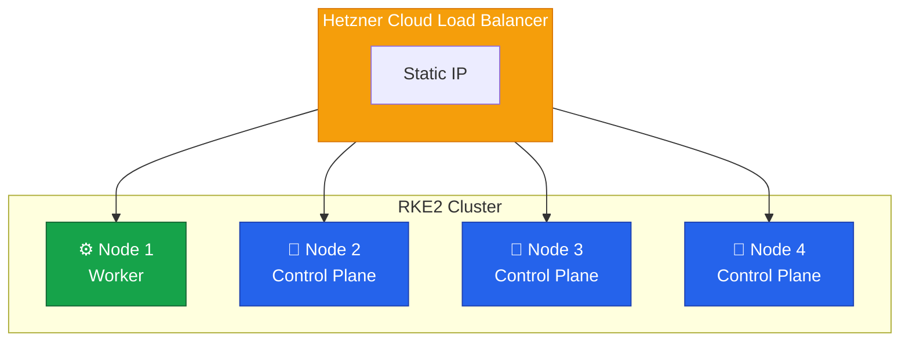

With Node 1 added as a worker in the previous lesson, the full 4-node RKE2 cluster is operational.
What started as a single k3s cluster has become a highly available control plane with encrypted pod networking and replicated storage — all without taking the old cluster offline until the new one was ready to serve traffic.



## Final Architecture

| Component    | Technology                      |
| ------------ | ------------------------------- |
| Distribution | RKE2                            |
| OS           | Rocky Linux 10                  |
| CNI          | Canal with WireGuard encryption |
| Storage      | Longhorn (2 replicas)           |
| Ingress      | Traefik + Hetzner Load Balancer |
| Certificates | cert-manager with Let's Encrypt |

The three control plane nodes provide etcd quorum tolerance — any single node can go down without affecting cluster operations.
Node 1 serves as a dedicated worker, keeping workload scheduling separate from control plane responsibilities.
All four nodes participate in the WireGuard mesh and Longhorn storage pool.

## What's Next

With the cluster running, there are several directions to take it further.

### Monitoring and Observability

The cluster currently has no visibility into resource usage, pod health trends, or alerting.
Setting up Prometheus and Grafana — either through the Rancher Monitoring stack or a standalone kube-prometheus-stack Helm chart — provides dashboards for cluster health, resource consumption, and application metrics.
Pairing this with Alertmanager means we get notified before problems become outages.

### GitOps

Deploying workloads manually with `kubectl apply` works for getting started, but does not scale.
A GitOps tool like Flux or ArgoCD watches a Git repository and automatically reconciles the cluster state to match.
This turns our Git repository into the single source of truth for what runs on the cluster, with full audit trails and easy rollbacks.

### Automated Upgrades

RKE2 releases new versions regularly with security patches and Kubernetes updates.
The [System Upgrade Controller](https://docs.rke2.io/upgrade/automated_upgrade) automates rolling upgrades across the cluster, draining nodes one at a time and upgrading them in sequence without downtime.

An automated upgrade replaces the RKE2 data directory, which means the runc v1.3.4 workaround from [Lesson 5](/guides/migrating-k3s-to-rke2/lesson-5#patching-runc-workaround-for-container-exec-failures) will be overwritten.
Check whether the upstream runc regression has been fixed in the new RKE2 release before upgrading — if not, reapply the patch on each node after the upgrade completes.

### Backup Strategy

We configured etcd snapshots to run every 6 hours in Lesson 5, but a complete backup strategy should also cover Longhorn volumes and application data.
Velero can snapshot both Kubernetes resources and persistent volumes to an external object store like S3, providing disaster recovery across the entire cluster state.

## More Guides

For those interested in building Kubernetes clusters from the ground up, [Building a production-ready Kubernetes cluster from scratch](/guides/building-a-production-ready-kubernetes-cluster-from-scratch) is a companion guide that walks through assembling a Raspberry Pi cluster, from hardware to a fully operational Kubernetes environment.

For the backstory on how this migration started, [New K3s agent node for our cluster](/2025-11-23-new-k3s-agent-node) covers the original k3s expansion that eventually led to the decision to move to RKE2.
