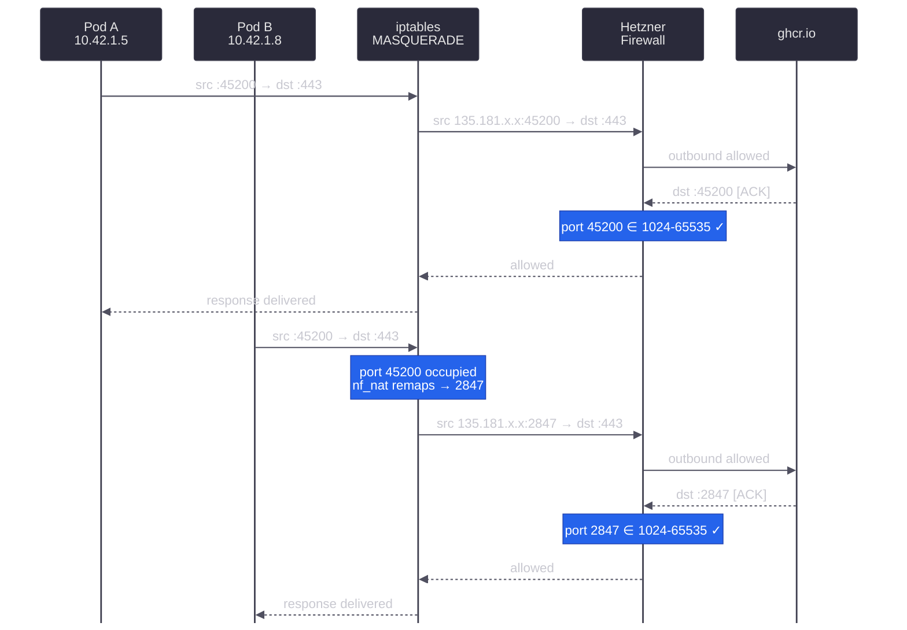

With the vSwitch network in place from [Lesson 3](/guides/migrating-k3s-to-rke2/lesson-3), our nodes can reach each other over a private Layer 2 link.
Traffic on that link still passes through Hetzner's firewall infrastructure, so we need explicit rules before RKE2 components can communicate reliably.



## Understanding the Security Model

Our architecture routes all service traffic through a Hetzner Cloud Load Balancer that connects to nodes over the private vSwitch network.
This means the public firewall on each dedicated server only needs to allow SSH and return traffic for outbound connections.
Every other inbound service port stays closed to the public internet.

Security operates at three layers, each with a distinct role:

| Layer | Component                | Purpose                                                    |
| ----- | ------------------------ | ---------------------------------------------------------- |
| 1     | Hetzner Firewall         | Blocks all unsolicited public traffic except SSH           |
| 2     | Hetzner Cloud LB         | Single entry point for web and API traffic via the vSwitch |
| 3     | Kubernetes NetworkPolicy | Pod-to-pod isolation and service-level access control      |

The Hetzner firewall acts as the outermost boundary, rejecting everything that is not SSH or return traffic.
The load balancer receives external web and API connections on its own public IP and forwards them to node backends over the vSwitch.
The firewall already permits this traffic through the vSwitch rule.
Kubernetes' [Network Policies](https://kubernetes.io/docs/concepts/services-networking/network-policies/) handle the innermost layer, controlling which pods can communicate with each other inside the cluster.

### Why the Public Firewall Can Be So Tight

In a setup without a load balancer, nodes must expose service ports (`80`, `443`, `6443`, `30000-32767`, etc.) directly on their public IPs, which forces the firewall to allow a wide range of inbound traffic.
Our architecture avoids this entirely by reducing it down to a single ingress point.

The Hetzner Cloud Load Balancer sits on the same Cloud Network as the vSwitch and forwards traffic to nodes using their private IPs (`10.1.0.x`).
From the node's perspective, load balancer traffic is indistinguishable from inter-node cluster traffic, so a single vSwitch firewall rule covers both.

The only service that requires direct public access is SSH, which we need for server administration from outside the private network.
Tailscale provides an alternative access path using NAT traversal with outbound connections, so it works without any inbound firewall rule.

## Understanding Hetzner's Firewall

Hetzner's dedicated server firewall operates at the network level, filtering packets before they reach the server.
This is more secure than host-based firewalls because malicious traffic never touches the machine's network stack.
The firewall is stateless, meaning it evaluates each packet independently without tracking connection state.



When the server makes an HTTPS request to download a container image, the response packets need a rule that permits them.
We handle this with a rule that allows TCP packets with the `ACK` flag set on ephemeral ports.

### vSwitch Traffic



This single rule carries the bulk of our cluster's networking needs.
All inter-node communication flows over the vSwitch: etcd replication (`2379`, `2380`), the Kubernetes API (`6443`), the RKE2 supervisor API (`9345`), kubelet communication, WireGuard-encrypted pod traffic (`51820`), Longhorn storage replication via iSCSI (`3260`) and NFS (`2049`), and load balancer health checks and forwarded traffic.

WireGuard traffic only stays on the vSwitch if Flannel is configured to use the vSwitch interface for its tunnel endpoints.
We configure this with `flannel.regexIface` in [Lesson 6](/guides/migrating-k3s-to-rke2/lesson-6).
Without that setting, Flannel defaults to the public interface and WireGuard endpoints would use public IPs, bypassing the vSwitch entirely.

### Return Traffic Ports

When the server makes an outbound connection, such as downloading container images or querying APIs, the kernel assigns a temporary source port from the ephemeral range (`32768-60999` by default on Linux).
The response packets return to this port, so the firewall must allow them through.

Kubernetes complicates this, as pod traffic leaving the node passes through iptables MASQUERADE, which rewrites the source IP to the node's public IP.
Since each pod operates in its own network namespace, the kernel tracks port assignments independently, and two pods can legitimately receive the same ephemeral port.
If both connect to the same destination, their source ports collide after the rewrite.
When this happens, the kernel's `nf_nat` module picks a replacement port from the full non-privileged range (`1024-65535`), not just the ephemeral range.

**Example:**

Pod A on node1 (`10.42.1.5`) pulls a container image from `ghcr.io:443`.
The kernel assigns ephemeral source port `45200`, and MASQUERADE rewrites the source address from `10.42.1.5:45200` to `135.181.x.x:45200` (the public IP).
The response arrives at the same node at port `45200` with the `ACK` flag set, comfortably within the ephemeral range.

Now Pod B (`10.42.1.8`) also connects to `ghcr.io:443` and the kernel assigns the same source port `45200`.
MASQUERADE cannot reuse that port because Pod A's connection already occupies it, so `nf_nat` picks a replacement from the full `1024-65535` range and lands on port `2847`.
The return traffic now arrives at port `2847`, well below the ephemeral range.
A firewall rule limited to `32768-65535` would silently drop this packet.



The diagram traces both connections through the same MASQUERADE and firewall path.
Pod A's traffic flows normally on ephemeral port `45200`, but Pod B hits a collision and gets remapped to port `2847`.
Both responses pass the firewall because the `ACK` rule covers `1024-65535`, not just the ephemeral range.

Our firewall rules use `1024-65535` as the destination port range to cover both direct server connections (ephemeral ports) and MASQUERADE-remapped pod traffic (any non-privileged port).

### IPv6 Considerations

Hetzner's firewall has some limitations with IPv6.
ICMPv6 traffic is always allowed and cannot be filtered, which is actually helpful since IPv6 requires ICMPv6 for neighbor discovery.
However, we cannot filter IPv6 traffic by source or destination IP address, only by protocol and port.
For our dual-stack cluster, the vSwitch rule only applies to IPv4, but since our ULA addresses (`fd00::/64`) are not routable on the public internet, this is not a security concern.

## Configuring the Firewall

Navigate to the [Hetzner Robot](https://robot.hetzner.com/server) interface, select the server (node4), and click "Firewall" to access the rules configuration.

### Firewall Settings

| Setting                     | Value  | Notes                                  |
| --------------------------- | ------ | -------------------------------------- |
| Status                      | active | Enable the firewall                    |
| Filter IPv6 packets         | yes    | Enable IPv6 filtering                  |
| Hetzner Services (incoming) | yes    | Allow rescue system, DNS, SysMon, etc. |

### Rules (incoming)

The firewall has a **10-rule limit**, but our load balancer architecture means we only need five.

| ID | Name               | Version | Protocol | Source IP  | Source Port | Dest Port  | TCP Flags | Action |
| -- | ------------------ | ------- | -------- | ---------- | ----------- | ---------- | --------- | ------ |
| #1 | vswitch            | ipv4    | \*       | 10.0.0.0/8 |             |            |           | accept |
| #2 | tcp established    | ipv4    | tcp      |            |             | 1024-65535 | ack       | accept |
| #3 | tcp established-v6 | ipv6    | tcp      |            |             | 1024-65535 | ack       | accept |
| #4 | dns responses      | ipv4    | udp      |            | 53          | 1024-65535 |           | accept |
| #5 | ssh                | \*      | tcp      |            |             | 22         |           | accept |

Rules #6 through #10 are available for future use.

### Rules (outgoing)

| ID | Name      | Version | Protocol | Source IP | Dest IP | Source Port | Dest Port | TCP Flags | Action |
| -- | --------- | ------- | -------- | --------- | ------- | ----------- | --------- | --------- | ------ |
| #1 | allow all | \*      | \*       |           |         |             |           |           | accept |

### Rule Explanations

Rule #1 (vswitch) allows all traffic from the `10.0.0.0/8` private range, covering every service described in the vSwitch Traffic section above.
The range is wider than the vSwitch subnet (`10.1.0.x`) because the load balancer's health checks originate from `10.0.0.2` on the Cloud Network.



Rules #2-3 (tcp established) allow inbound TCP packets with the `ACK` flag on ports `1024-65535`, for both IPv4 and IPv6.
This range covers both normal ephemeral ports and the wider range that MASQUERADE may assign, as explained in the [Return Traffic Ports section](#return-traffic-ports).

Rule #4 (dns responses) permits DNS reply packets.
DNS queries go out on a random high port, and responses come back from source port `53`.
This rule ensures those UDP responses reach the server.

Rule #5 (ssh) opens port `22` for remote administration.
The `*` version field covers both IPv4 and IPv6 in a single rule.

Tailscale is not listed because it uses NAT traversal over outbound connections, which the outgoing allow-all rule already covers.
ICMP is also absent from the rules, so public pings are blocked, but inter-node pings still work through Rule #1's vSwitch allowance.

### Applying the Rules

After entering all rules, click "Save" to apply them.
Changes typically propagate within 30-60 seconds.

## Verification

### vSwitch Connectivity

We test that nodes can communicate over the private network using IPv4.
From node1, ping node4:

```bash
$ ping -c 3 10.1.0.14
64 bytes from 10.1.0.14: icmp_seq=1 ttl=64 time=0.351 ms
...
3 packets transmitted, 3 received, 0% packet loss
```

From node4, ping node1:

```bash
$ ping -c 3 10.1.0.11
64 bytes from 10.1.0.11: icmp_seq=1 ttl=64 time=0.348 ms
...
3 packets transmitted, 3 received, 0% packet loss
```

If pings fail, verify that Rule #1 has the correct source IP (`10.0.0.0/8`) and is set to `accept`.
IPv6 connectivity over the vSwitch is not configured on the existing nodes yet, so we only test IPv4 here.

### Port Scan from vSwitch (Optional)

To verify which ports are reachable over the vSwitch, we can perform a port scan from node1 to node4's private IP. `nmap` is the perfect tool for this task, as it can distinguish between `closed` (reachable but no service listening) and `filtered` (blocked by firewall) ports.

Install nmap on node1 if it is not already available:

```bash
$ dnf install -y nmap
```

Verify that the vSwitch rule allows unrestricted access by scanning node4 from node1:

```bash
# Scan all ports on node4's private IP from node1
$ nmap -sT 10.1.0.14 -p-
Nmap scan report for 10.1.0.14
Host is up (0.00018s latency).
Not shown: 65534 closed tcp ports (conn-refused)

PORT   STATE SERVICE
22/tcp open  ssh

Nmap done: 1 IP address (1 host up) scanned in 1.33 seconds
```

Only SSH (port `22`) is open since it is the only service running on the fresh server.
The remaining 65534 ports show as `closed` (reachable but no service listening), and none show as `filtered`.
This confirms Rule #1 permits all traffic from the vSwitch subnet regardless of port or protocol.

### Port Scan from Public Internet

From a machine outside the vSwitch, scan node4's public IP to verify the firewall boundaries:

```bash
# From an external machine, scan node4's public IP for relevant ports
$ nmap -Pn -sT -v -T4 --min-rate 5000 <node4-public-ip> -p 21,22,23,80,443,1024,6443,30080,30443

PORT      STATE    SERVICE
21/tcp    filtered ftp
22/tcp    open     ssh
23/tcp    filtered telnet
80/tcp    filtered http
443/tcp   filtered https
1024/tcp  filtered kdm
6443/tcp  filtered sun-sr-https
30080/tcp filtered unknown
30443/tcp filtered unknown
```

The results confirm our tight firewall configuration:

| Port  | State    | Reason                                                    |
| ----- | -------- | --------------------------------------------------------- |
| 21    | filtered | Not in any allowed range, blocked                         |
| 22    | open     | SSH rule (#5), the only publicly accessible service       |
| 23    | filtered | Not in any allowed range, blocked                         |
| 80    | filtered | No public rule. Web traffic arrives via LB over vSwitch   |
| 443   | filtered | No public rule. Web traffic arrives via LB over vSwitch   |
| 1024  | filtered | Return traffic rules require ACK flag, SYN is blocked     |
| 6443  | filtered | No public rule. API traffic arrives via LB over vSwitch   |
| 30080 | filtered | No public rule. NodePorts are reached via LB over vSwitch |
| 30443 | filtered | No public rule. NodePorts are reached via LB over vSwitch |

The `-Pn` flag skips host discovery since there is no public ICMP rule.
Every port except SSH shows as `filtered`, meaning the firewall silently drops the packets before they reach the server.
This is the tightest configuration possible while still allowing the cluster to function.
The load balancer handles all service ingress over the private network.
