Canal was installed automatically when RKE2 started in Lesson 5.
This lesson verifies that dual-stack networking is working, enables WireGuard encryption for inter-node traffic, and configures Calico network policies to secure pod communication.



## Understanding Canal

### Architecture

Canal is a composite CNI that combines two well-established projects.
[Flannel](https://github.com/flannel-io/flannel) handles inter-node traffic by creating a VXLAN overlay network, while [Calico](https://www.tigera.io/project-calico/) manages intra-node routing and enforces network policies.
This separation of concerns gives Canal the simplicity of Flannel's overlay networking with the power of Calico's policy engine.

| Component      | Role                  | Responsibility                                       |
| -------------- | --------------------- | ---------------------------------------------------- |
| Flannel        | Inter-node overlay    | VXLAN tunnels between nodes, IP masquerading         |
| Calico (Felix) | Intra-node routing    | Local pod routing, iptables/nftables rule management |
| Calico         | Network policy engine | L3-L4 network policy enforcement                     |

Each Canal pod runs both a Flannel and a Calico container as a DaemonSet, ensuring every node in the cluster participates in both the overlay network and the policy engine.

### Data Plane: iptables vs eBPF

Traditional Kubernetes networking and Canal's default data plane rely on iptables (or its successor nftables) to process packets.
The kernel evaluates packets against a chain of rules, and each Kubernetes Service adds entries to that chain.
In a dual-stack cluster the rule count effectively doubles, since separate chains exist for IPv4 and IPv6.

eBPF (extended Berkeley Packet Filter) is an alternative data plane technology that runs sandboxed programs directly inside the Linux kernel.
Rather than traversing rule chains, eBPF programs use hash maps for O(1) lookups and can process both IPv4 and IPv6 in a single code path.
CNI plugins like Cilium and newer versions of Calico support eBPF natively, replacing iptables entirely.

Canal does not use eBPF — it relies on the traditional iptables/nftables stack.
For most clusters this performs well, but understanding the trade-off helps when evaluating future CNI options:

| Aspect             | iptables (Canal)                  | eBPF (Cilium, Calico eBPF)         |
| ------------------ | --------------------------------- | ---------------------------------- |
| Rule complexity    | Linear chain, grows with Services | Hash maps, constant-time lookups   |
| Dual-stack         | Separate rule sets per family     | Unified code path                  |
| Policy scope       | L3-L4 (NetworkPolicy)             | L3-L7 (extended policy CRDs)       |
| Kernel requirement | Any modern kernel                 | 4.19+ (5.8+ recommended)           |
| Maturity           | Battle-tested, decades of use     | Rapidly maturing, production-ready |

We chose Canal because it is the RKE2 default, auto-detects dual-stack, and requires no additional installation or kernel dependencies.
If your workloads eventually need L7 policy enforcement or eBPF performance, RKE2 also bundles Cilium and Calico with eBPF support as alternative CNI options.
Switching CNI requires rebuilding the cluster.

### IPAM (IP Address Management)

IPAM controls how pod IP addresses are allocated across the cluster.
Different CNI plugins support different allocation strategies:

| Mode         | Description                                                  |
| ------------ | ------------------------------------------------------------ |
| kubernetes   | Delegates to Kubernetes, uses each node's PodCIDR allocation |
| cluster-pool | The CNI manages a cluster-wide pool of IPs                   |
| multi-pool   | Multiple pools with different CIDRs per node                 |

Canal uses the `kubernetes` mode exclusively.
RKE2 configures the pod CIDRs at startup (we set `cluster-cidr: 10.42.0.0/16,fd00:42::/56` in Lesson 5), and the Kubernetes controller manager assigns each node a subnet from that range.
When a pod starts, it receives one IPv4 and one IPv6 address from its node's allocated subnets.

The CNI never makes allocation decisions itself — it simply uses the addresses that Kubernetes provides.
We can see this in action by inspecting any running pod's IP assignments:

```bash
$ kubectl -n kube-system get pod etcd-node4 -o jsonpath='{.status.podIPs}' | jq .
[
  { "ip": "10.1.0.14" },
  { "ip": "fd00::14" }
]
```

Static pods like etcd use the node's own addresses, but regular pods receive addresses from the pod CIDR subnets allocated to their node.
The advantage is that pod CIDR assignments stay consistent with the cluster configuration, and tools like `kubectl get nodes -o jsonpath` accurately reflect which subnets belong to which nodes.

```bash
$ kubectl -n kube-system get pod rke2-metrics-server-7b59bd8854-blsqz -o jsonpath='{.status.podIPs}' | jq .
[
  {
    "ip": "10.42.0.8"
  },
  {
    "ip": "fd00:42::8"
  }
]
```

### Overlay and Encryption

VXLAN (Virtual Extensible LAN) is a network encapsulation protocol that creates a virtual Layer 2 network on top of an existing Layer 3 infrastructure.
It works by wrapping each original Ethernet frame inside a UDP packet with a VXLAN header, effectively creating a tunnel between two endpoints.
The outer UDP packet is routable across any IP network, while the inner frame carries the original pod-to-pod traffic unchanged.

Canal uses VXLAN as its default overlay for inter-node traffic.
When a pod on Node A sends a packet to a pod on Node B, Flannel wraps the packet in a VXLAN header addressed to Node B's IP, sends it across the vSwitch, and Flannel on Node B unwraps it and delivers the original packet to the destination pod.

```mermaid!
%%{init: {"theme": "base", "flowchart": {"nodeSpacing": 15, "rankSpacing": 25}, "themeVariables": {"fontSize": "12px", "background": "#181818", "textColor": "#c8c8d0", "lineColor": "#505060", "primaryColor": "#2a2a3a", "primaryTextColor": "#e6e6e6", "primaryBorderColor": "#404050", "clusterBkg": "#1e1e28", "clusterBorder": "#3a3a4a", "edgeLabelBackground": "#1e1e28", "titleColor": "#c8c8d0"}}}%%
flowchart LR
    subgraph NodeA["Node A · 10.1.0.12"]
        PodA["Pod A<br/><small>10.42.0.5</small>"]
        FA["Flannel"]
    end

    subgraph Wire["vSwitch · VXLAN Packet"]
        direction TB
        subgraph Outer["Outer: UDP · src 10.1.0.12 → dst 10.1.0.14"]
            subgraph Inner["Inner: Pod · src 10.42.0.5 → dst 10.42.1.3"]
            end
        end
    end

    subgraph NodeB["Node B · 10.1.0.14"]
        FB["Flannel"]
        PodB["Pod B<br/><small>10.42.1.3</small>"]
    end

    PodA -->|"original packet"| FA
    FA -->|"encapsulate"| Wire
    Wire -->|"decapsulate"| FB
    FB -->|"original packet"| PodB

    classDef node fill:#eff6ff,color:#1e3a8a,stroke:#bfdbfe,stroke-width:1.5px
    classDef pod fill:#ecfdf5,color:#065f46,stroke:#a7f3d0,stroke-width:1.5px
    classDef flannel fill:#fef3c7,color:#92400e,stroke:#fcd34d,stroke-width:1.5px
    classDef wire fill:#f3e8ff,color:#5b21b6,stroke:#c4b5fd,stroke-width:1.5px
    classDef outer fill:#ede9fe,color:#4c1d95,stroke:#c4b5fd,stroke-width:1.5px
    classDef inner fill:#fce7f3,color:#831843,stroke:#f9a8d4,stroke-width:1.5px

    class NodeA,NodeB node
    class PodA,PodB pod
    class FA,FB flannel
    class Wire wire
    class Outer outer
    class Inner inner
```



The diagram shows how the original pod-to-pod packet is nested inside VXLAN encapsulation for transit across the vSwitch.
The underlying infrastructure only needs to route between node IPs — it never sees the pod CIDRs directly.

The trade-off is a small overhead per packet (approximately 50 bytes for the VXLAN + UDP + outer IP headers) and the fact that encapsulated traffic is unencrypted by default.
On a private vSwitch this is generally acceptable, but for defense in depth we enable WireGuard encryption later in this lesson.

### MTU and Encapsulation Overhead

Every layer of encapsulation adds headers to each packet, reducing the maximum payload that fits within the physical network's MTU.
Our Hetzner vSwitch interface has a standard MTU of 1500 bytes, and each overlay technology subtracts its header size from that budget:

| Backend   | Header Overhead | Tunnel MTU | Pod veth MTU |
| --------- | --------------- | ---------- | ------------ |
| VXLAN     | ~50 bytes       | 1450       | 1450         |
| WireGuard | ~80 bytes       | 1420       | 1420         |

When Flannel uses VXLAN, it creates a `flannel.1` interface at MTU 1450 and sets the pod veth to match.
When Flannel switches to the WireGuard backend, it creates `flannel-wg` interfaces at MTU 1420 — but Canal's default `veth_mtu` remains at 1450 unless explicitly overridden.

This mismatch is critical: if pod interfaces have a higher MTU than the WireGuard tunnel, packets between 1421 and 1450 bytes that cross nodes will exceed the tunnel capacity.
TCP relies on Path MTU Discovery (PMTUD) to detect this and reduce the segment size, but PMTUD depends on ICMP "Packet Too Big" messages reaching the sender — which can fail when packets traverse multiple encapsulation layers.
The result is intermittent connection stalls and timeouts that are difficult to diagnose because small requests succeed while larger transfers hang.

We avoid this entirely by setting `mtu: 1420` in the Canal configuration when enabling WireGuard, ensuring pod interfaces never send packets larger than the tunnel can carry.

## Verification

### Canal Pod Status

We start by verifying that both containers in the Canal pod are running on every node:

```bash
$ kubectl get pods -n kube-system -l k8s-app=canal -o wide
NAME               READY   STATUS    RESTARTS   AGE   IP         NODE
rke2-canal-xxxxx   2/2     Running   0          30m   10.1.0.14   node4
```

Both containers must show `2/2` in the `READY` column — one for Calico and one for Flannel.
A single-node cluster shows one pod; this grows to one per node as additional nodes join.

### Dual-Stack Pod Test

Deploy a test pod and confirm it receives both an IPv4 and IPv6 address from the pod CIDRs:

```bash
$ kubectl run dual-stack-test --image=busybox:1.36 --restart=Never -- sleep 3600
pod/dual-stack-test created
$ kubectl wait --for=condition=Ready pod/dual-stack-test --timeout=60s
pod/dual-stack-test condition met
$ kubectl get pod dual-stack-test -o jsonpath='{.status.podIPs}' | jq .
[
  {
    "ip": "10.42.0.10"
  },
  {
    "ip": "fd00:42::a"
  }
]
```

The pod should have one address from `10.42.0.0/16` and one from `fd00:42::/56`.

Test that the pod can reach the node over both address families:

```bash
$ kubectl exec dual-stack-test -- ping -c 2 10.1.0.14
PING 10.1.0.14 (10.1.0.14): 56 data bytes
64 bytes from 10.1.0.14: seq=0 ttl=64 time=0.105 ms
64 bytes from 10.1.0.14: seq=1 ttl=64 time=0.069 ms

--- 10.1.0.14 ping statistics ---
2 packets transmitted, 2 packets received, 0% packet loss
round-trip min/avg/max = 0.069/0.087/0.105 ms

$ kubectl exec dual-stack-test -- ping6 -c 2 fd00::14
PING fd00::14 (fd00::14): 56 data bytes
64 bytes from fd00::14: seq=0 ttl=64 time=0.148 ms
64 bytes from fd00::14: seq=1 ttl=64 time=0.108 ms

--- fd00::14 ping statistics ---
2 packets transmitted, 2 packets received, 0% packet loss
round-trip min/avg/max = 0.108/0.128/0.148 ms
```

Clean up the test pod:

```bash
$ kubectl delete pod dual-stack-test
```



## Enabling WireGuard Encryption

### Why Encrypt Overlay Traffic

VXLAN encapsulation carries pod traffic in cleartext between nodes.
On a shared physical network like Hetzner's vSwitch — where VLAN tagging provides logical isolation but not encryption — a compromised adjacent server could theoretically capture inter-node packets.

WireGuard adds an encryption layer around the VXLAN tunnel, so the packet on the wire is fully encrypted:

```mermaid!
%%{init: {"theme": "base", "flowchart": {"nodeSpacing": 15, "rankSpacing": 25}, "themeVariables": {"fontSize": "12px", "background": "#181818", "textColor": "#c8c8d0", "lineColor": "#505060", "primaryColor": "#2a2a3a", "primaryTextColor": "#e6e6e6", "primaryBorderColor": "#404050", "clusterBkg": "#1e1e28", "clusterBorder": "#3a3a4a", "edgeLabelBackground": "#1e1e28", "titleColor": "#c8c8d0"}}}%%
flowchart LR
    subgraph NodeA["Node A · 10.1.0.12"]
        PodA["Pod A<br/><small>10.42.0.5</small>"]
        FA["Flannel"]
        WA["WireGuard"]
    end

    subgraph Wire["vSwitch · Encrypted Packet"]
        direction TB
        subgraph WG["WireGuard · encrypted"]
            subgraph Outer["VXLAN · src 10.1.0.12 → dst 10.1.0.14"]
                subgraph Inner["Pod · src 10.42.0.5 → dst 10.42.1.3"]
                end
            end
        end
    end

    subgraph NodeB["Node B · 10.1.0.14"]
        WB["WireGuard"]
        FB["Flannel"]
        PodB["Pod B<br/><small>10.42.1.3</small>"]
    end

    PodA -->|"original"| FA
    FA -->|"VXLAN wrap"| WA
    WA -->|"encrypt"| Wire
    Wire -->|"decrypt"| WB
    WB -->|"VXLAN unwrap"| FB
    FB -->|"original"| PodB

    classDef node fill:#eff6ff,color:#1e3a8a,stroke:#bfdbfe,stroke-width:1.5px
    classDef pod fill:#ecfdf5,color:#065f46,stroke:#a7f3d0,stroke-width:1.5px
    classDef flannel fill:#fef3c7,color:#92400e,stroke:#fcd34d,stroke-width:1.5px
    classDef wg fill:#d1fae5,color:#065f46,stroke:#6ee7b7,stroke-width:1.5px
    classDef wire fill:#f3e8ff,color:#5b21b6,stroke:#c4b5fd,stroke-width:1.5px
    classDef outer fill:#ede9fe,color:#4c1d95,stroke:#c4b5fd,stroke-width:1.5px
    classDef inner fill:#fce7f3,color:#831843,stroke:#f9a8d4,stroke-width:1.5px
    classDef encrypted fill:#d1fae5,color:#065f46,stroke:#6ee7b7,stroke-width:1.5px

    class NodeA,NodeB node
    class PodA,PodB pod
    class FA,FB flannel
    class WA,WB wg
    class Wire wire
    class WG encrypted
    class Outer outer
    class Inner inner
```



The diagram extends the earlier VXLAN flow with WireGuard wrapping the entire VXLAN packet in an encrypted tunnel before it hits the wire.
Each node establishes a WireGuard tunnel to every other node, and all overlay traffic flows through these tunnels transparently.

### Applying the Configuration

WireGuard requires kernel module support.
Before applying the configuration, verify the module loads correctly:

```bash
$ modprobe wireguard
$ lsmod | grep wireguard
wireguard             118784  0
```

If the module fails to load, the kernel may need the WireGuard package installed.
On Rocky Linux 10, WireGuard is included in the default kernel.

RKE2 bundles Canal as a Helm chart, and customizations are applied through a `HelmChartConfig` resource placed in the auto-deploy manifests directory:

```bash
$ cat <<'EOF' > /var/lib/rancher/rke2/server/manifests/rke2-canal-config.yaml
apiVersion: helm.cattle.io/v1
kind: HelmChartConfig
metadata:
  name: rke2-canal
  namespace: kube-system
spec:
  valuesContent: |-
    flannel:
      backend: "wireguard"
      regexIface: "\\.4000$"
    calico:
      vethuMTU: 1420
EOF
```

Three settings require explanation.

`flannel.regexIface` controls which network interface Flannel uses for inter-node tunnel endpoints.
When this value is empty, Flannel follows the default route to discover the outbound interface — which on Hetzner dedicated servers is the public network interface.
WireGuard tunnels would then use public IPs as their endpoints, forcing inter-node pod traffic onto the public internet and requiring an additional firewall rule for UDP port `51820`.
Setting `regexIface` to `\\.4000$` matches the VLAN-tagged vSwitch interface (e.g., `enp35s0.4000` or `enp195s0.4000`) on every node, regardless of the underlying NIC name.
Flannel then uses the vSwitch IP (`10.1.0.x`) as the WireGuard endpoint, keeping all tunnel traffic on the private network where the Hetzner firewall's vSwitch rule already permits it.
The Helm chart maps this value to the `FLANNELD_IFACE_REGEX` environment variable in the flannel container — see the [Flannel configuration documentation](https://github.com/flannel-io/flannel/blob/master/Documentation/configuration.md) for details on interface selection behavior.

`flannel.backend: "wireguard"` switches the overlay from VXLAN to WireGuard, as described in the encryption section above.

`calico.vethuMTU: 1420` aligns the pod veth MTU with the WireGuard tunnel MTU, preventing the mismatch described in the MTU section above.
Without this, Canal defaults to a veth MTU of 1450 (the `calico.vethuMTU` default in the Helm chart), which exceeds the WireGuard tunnel capacity of 1420 and causes intermittent packet loss for cross-node traffic.
Note that `flannel.mtu` controls the WireGuard tunnel's own MTU (which already defaults to 1420), while `calico.vethuMTU` controls the pod-facing veth interfaces — both must match for reliable cross-node communication.

RKE2 detects the new manifest and upgrades the Canal Helm release automatically.
Restart the Canal DaemonSet to apply the new backend:

```bash
$ kubectl rollout restart ds rke2-canal -n kube-system
daemonset.apps/rke2-canal restarted
$ kubectl rollout status ds rke2-canal -n kube-system --timeout=120s
Waiting for daemon set "rke2-canal" rollout to finish: 0 of 1 updated pods are available...
daemon set "rke2-canal" successfully rolled out
```

Verify the ConfigMap reflects the new MTU:

```bash
$ kubectl get configmap -n kube-system rke2-canal-config -o jsonpath='{.data.veth_mtu}'
1420
```

Existing pods keep the MTU they were created with, so all workloads must be restarted to pick up the new veth MTU.
Restart all Deployments, StatefulSets, and DaemonSets across the cluster:

```bash
$ kubectl get deployments --all-namespaces --no-headers -o custom-columns=NS:.metadata.namespace,NAME:.metadata.name | \
    while read ns name; do kubectl rollout restart deployment "$name" -n "$ns"; done

$ kubectl get statefulsets --all-namespaces --no-headers -o custom-columns=NS:.metadata.namespace,NAME:.metadata.name | \
    while read ns name; do kubectl rollout restart statefulset "$name" -n "$ns"; done

$ kubectl get daemonsets --all-namespaces --no-headers -o custom-columns=NS:.metadata.namespace,NAME:.metadata.name | \
    while read ns name; do kubectl rollout restart daemonset "$name" -n "$ns"; done
```

Standalone pods (such as CronJob-created pods) will pick up the new MTU when they are next recreated.

### Installing WireGuard Tools

The WireGuard kernel module is built into Rocky Linux 10's default kernel, but the `wg` userspace tool for inspecting tunnels is a separate package.
Install it now so it is available when we verify cross-node tunnels later:

```bash
$ sudo dnf install -y wireguard-tools
```

### Verifying the Interface

On a single-node cluster, WireGuard tunnels have no peers to connect to — but we can verify the interface was created and the kernel module is active:

```bash
$ ip link show | grep flannel-wg
87: flannel-wg: <POINTOPOINT,NOARP,UP,LOWER_UP> mtu 1420 qdisc noqueue state UNKNOWN mode DEFAULT group default
88: flannel-wg-v6: <POINTOPOINT,NOARP,UP,LOWER_UP> mtu 1420 qdisc noqueue state UNKNOWN mode DEFAULT group default

$ wg show flannel-wg
interface: flannel-wg
  public key: <node-public-key>
  private key: (hidden)
  listening port: 51820
```

The `flannel-wg` and `flannel-wg-v6` interfaces confirm that Canal switched from VXLAN to WireGuard.
Both interfaces should show `mtu 1420`, matching the value we configured.
The `wg show` output should list the interface with a public key and listening port, but no peers yet.
Peers appear automatically as additional nodes join the cluster in Lesson 11.

Confirm that Flannel selected the vSwitch interface by checking the node annotation:

```bash
$ kubectl get node $(hostname) -o jsonpath='{.metadata.annotations.flannel\.alpha\.coreos\.com/public-ip}'
10.1.0.14
```

The `public-ip` annotation should show the vSwitch address, not the server's public IP.
If it shows a public IP, the `regexIface` pattern did not match the vSwitch interface — verify the interface name with `ip -o addr show | grep '10.1.0'` and adjust the regex accordingly.

Verify that the pod veth MTU also matches the WireGuard tunnel MTU by deploying a test pod:

```bash
$ kubectl run mtu-test --image=busybox:1.36 --restart=Never -- sleep 60
pod/mtu-test created
$ kubectl exec mtu-test -- cat /sys/class/net/eth0/mtu
1420
$ kubectl delete pod mtu-test
pod "mtu-test" deleted
```

The pod's `eth0` interface must report `1420`.
If it shows `1450` instead, the `calico.vethuMTU: 1420` setting in the `HelmChartConfig` was not applied — verify the manifest contents and restart the Canal DaemonSet.



### TCP MSS Clamping

Matching the pod veth MTU to the WireGuard tunnel prevents pods from _sending_ oversized packets, but it does not protect against Path MTU Discovery (PMTUD) failures on the return path.
Although the pod correctly advertises a reduced MSS during the TCP handshake, PMTUD must still function across the entire network path for the remote side to respect the effective MTU.
In environments where ICMP "Fragmentation Needed" (IPv4) or "Packet Too Big" (IPv6) messages are filtered — which is common with Hetzner's stateless firewall, cloud overlays, and WireGuard encapsulation — large return packets may be silently dropped.
The result is connections that work fine for small requests but stall or time out when transferring larger payloads.

The standard fix is TCP MSS clamping: an iptables rule in the mangle table that rewrites the MSS value in TCP SYN and SYN-ACK packets to match the path MTU.
With `--clamp-mss-to-pmtu`, the kernel automatically calculates the correct MSS from the outgoing interface's MTU, ensuring that neither side of the connection ever sends segments too large for the tunnel.

Calico Felix manages MTU on tunnel interfaces and veth devices but [does not insert MSS clamping rules](https://docs.tigera.io/calico/latest/networking/configuring/mtu).
We deploy the rule ourselves using a privileged DaemonSet — the same pattern the guide uses for Canal, Longhorn, and Traefik.
A DaemonSet runs on every node automatically, including nodes that join the cluster later, so no per-node manual setup is needed.

Create the manifest at `/var/lib/rancher/rke2/server/manifests/mss-clamp.yaml`:

```yaml
# /var/lib/rancher/rke2/server/manifests/mss-clamp.yaml
apiVersion: apps/v1
kind: DaemonSet
metadata:
  name: mss-clamp
  namespace: kube-system
  labels:
    k8s-app: mss-clamp
spec:
  selector:
    matchLabels:
      k8s-app: mss-clamp
  template:
    metadata:
      labels:
        k8s-app: mss-clamp
    spec:
      hostNetwork: true
      tolerations:
        - operator: Exists
      initContainers:
        - name: mss-clamp
          image: rancher/hardened-calico:v3.31.3-build20260206
          command:
            - /bin/sh
            - -c
            - |
                iptables -t mangle -C FORWARD -p tcp --tcp-flags SYN,RST SYN -j TCPMSS --clamp-mss-to-pmtu 2>/dev/null \
                  || iptables -t mangle -A FORWARD -p tcp --tcp-flags SYN,RST SYN -j TCPMSS --clamp-mss-to-pmtu
                ip6tables -t mangle -C FORWARD -p tcp --tcp-flags SYN,RST SYN -j TCPMSS --clamp-mss-to-pmtu 2>/dev/null \
                  || ip6tables -t mangle -A FORWARD -p tcp --tcp-flags SYN,RST SYN -j TCPMSS --clamp-mss-to-pmtu
          securityContext:
            privileged: true
            capabilities:
              add: ["NET_ADMIN", "NET_RAW"]
      containers:
        - name: pause
          image: rancher/mirrored-pause:3.6
          resources:
            requests:
              cpu: 1m
              memory: 4Mi
            limits:
              cpu: 10m
              memory: 16Mi
```

The DaemonSet uses an init container to apply the iptables rules on the host's network namespace (`hostNetwork: true`), then idles with a minimal pause container.
The `tolerations` with `operator: Exists` ensures it schedules on every node, including control plane nodes — matching the Traefik DaemonSet configuration from [Lesson 8](/guides/migrating-k3s-to-rke2/lesson-8).
We use the `rancher/hardened-calico` image that Canal already pulls on every node, so no additional image download is required.

The `-C` flag checks whether the rule already exists before `-A` appends it, preventing duplicate entries if the pod restarts.

RKE2 detects the new manifest and deploys the DaemonSet automatically.
Verify the rules are in place on any node:

```bash
$ sudo iptables -t mangle -L FORWARD -v -n
Chain FORWARD (policy ACCEPT 0 packets, 0 bytes)
 pkts bytes target     prot opt in     out     source               destination
    0     0 TCPMSS     tcp  --  *      *       0.0.0.0/0            0.0.0.0/0            tcp flags:0x06/0x02 TCPMSS clamp to PMTU
```

The rule matches TCP packets with the `SYN` flag set and rewrites the MSS option to fit the outgoing interface's MTU.

### Isolating Host DNS from Pod DNS

Kubelet reads the host's `/etc/resolv.conf` to build each pod's DNS configuration.
It copies the `search` domains into the pod's `/etc/resolv.conf` and combines them with the cluster DNS service address and Kubernetes search domains (`svc.cluster.local`, `cluster.local`).
On a clean host this adds the machine's own domain — typically the hosting provider's domain like `your-server.de` for Hetzner — which is harmless.

When Tailscale is installed on the host, it takes ownership of `/etc/resolv.conf` and replaces it with its MagicDNS configuration:

```text
# /etc/resolv.conf (managed by Tailscale)
nameserver 100.100.100.100
search tailc7bf.ts.net your-server.de
```

Kubelet then injects both `tailc7bf.ts.net` and `your-server.de` into every pod's search domain list.
Combined with the Kubernetes default of `ndots:5`, any external hostname with fewer than five dots — which is virtually all of them — triggers search domain expansion before attempting an absolute lookup.
A simple resolution of `api.github.com` becomes six sequential DNS queries:

1. `api.github.com.renovate-bots.svc.cluster.local` — answered locally by CoreDNS
2. `api.github.com.svc.cluster.local` — answered locally
3. `api.github.com.cluster.local` — answered locally
4. `api.github.com.tailc7bf.ts.net` — forwarded to upstream DNS
5. `api.github.com.your-server.de` — forwarded to upstream DNS
6. `api.github.com.` — forwarded to upstream, returns the actual result

The first three queries are answered instantly from CoreDNS's local zone data.
The last three require round-trips to the upstream forwarders (`1.1.1.1` and `1.0.0.1` in our configuration) and back.
When a pod opens many concurrent connections — as dependency management tools like Renovate, npm, or Maven do during startup — the glibc resolver serializes hundreds of these expanded queries and some inevitably time out, causing cascading `ETIMEDOUT` and `getaddrinfo EAI_AGAIN` errors.

The fix is to give kubelet a clean resolv.conf that contains only the upstream nameservers and no search domains.
Create the file on every node:

```bash
$ cat <<'EOF' | sudo tee /etc/rancher/rke2/resolv.conf
nameserver 1.1.1.1
nameserver 1.0.0.1
EOF
```

Then add the `kubelet-arg` to the RKE2 network configuration we created in Lesson 5.
Append the following line to `/etc/rancher/rke2/config.yaml.d/10-network.yaml`:

```yaml
# /etc/rancher/rke2/config.yaml.d/10-network.yaml (append to existing file)
kubelet-arg:
  - "resolv-conf=/etc/rancher/rke2/resolv.conf"
```

Restart the RKE2 service for the change to take effect:

```bash
$ sudo systemctl restart rke2-server
```

After the restart, new pods receive a resolv.conf with only the Kubernetes search domains and no Tailscale or provider domains:

```text
search renovate-bots.svc.cluster.local svc.cluster.local cluster.local
nameserver 10.43.0.10
options ndots:5
```

The same `api.github.com` lookup now tries only four queries instead of six, and the three cluster-local queries are answered instantly by CoreDNS.
The absolute lookup at the end is the only one that requires upstream forwarding.

Existing pods keep their original resolv.conf until they are recreated.
CronJob pods pick up the change on their next scheduled run, while long-running Deployments and StatefulSets need a rollout restart.



## Network Policies

### Understanding Network Policies

By default, Kubernetes allows all pod-to-pod communication across all namespaces.
A `NetworkPolicy` resource changes this by defining explicit ingress and egress rules for pods matching a selector.
Once any NetworkPolicy selects a pod, all traffic not explicitly allowed by a policy is denied.

Canal enforces these policies through Calico's policy engine, which supports standard Kubernetes `NetworkPolicy` resources at L3-L4 (IP addresses, ports, and protocols).

| Scope              | Resource type    | Enforced by       |
| ------------------ | ---------------- | ----------------- |
| Pod-to-pod traffic | `NetworkPolicy`  | Calico (in Canal) |
| Host-level traffic | Hetzner firewall | Hetzner network   |

Unlike Cilium, Canal does not provide host-level network policies — the Hetzner firewall configured in Lesson 4 serves that role.

### Default Deny per Namespace

A common security pattern is to deny all ingress traffic by default and then allow specific communication paths.
This policy selects all pods in a namespace and permits only traffic from within the same namespace.

Pods also need to reach CoreDNS (in `kube-system`) to resolve service names, so a companion egress policy must allow DNS traffic.
Without it, pods cannot look up any service addresses.

We place both policies in the RKE2 auto-deploy manifests directory so they are applied on every cluster start and survive node rebuilds — consistent with how we deployed the Canal `HelmChartConfig`.
Create a file at `/var/lib/rancher/rke2/server/manifests/default-network-policies.yaml` with the following content:

```yaml
# Default deny ingress: only allow traffic from within the same namespace
apiVersion: networking.k8s.io/v1
kind: NetworkPolicy
metadata:
  name: default-deny-ingress
  namespace: default
spec:
  podSelector: {}
  policyTypes:
    - Ingress
  ingress:
    - from:
        - podSelector: {}
---
# Allow DNS egress to CoreDNS in kube-system
apiVersion: networking.k8s.io/v1
kind: NetworkPolicy
metadata:
  name: allow-dns
  namespace: default
spec:
  podSelector: {}
  policyTypes:
    - Egress
  egress:
    - to:
        - namespaceSelector:
            matchLabels:
              kubernetes.io/metadata.name: kube-system
      ports:
        - port: 53
          protocol: TCP
        - port: 53
          protocol: UDP
```

RKE2 picks up the manifest automatically within a few seconds.
The `default-deny-ingress` policy restricts pods in the `default` namespace to only accept traffic from other pods in the same namespace, while `allow-dns` ensures DNS resolution continues to work.

For additional namespaces, apply the same pair of policies by duplicating the manifest with the appropriate `namespace` field — or use the CIS hardening profile described below.

### CIS Hardening Profile

RKE2 can automatically apply namespace-level network policies and stricter Pod Security Standards when started with the `profile: cis` configuration option.
This applies a default-deny ingress policy and a DNS-allow policy to the `kube-system`, `kube-public`, and `default` namespaces — similar to the manual policies above but managed by RKE2 itself.

For namespaces we create, we are still responsible for applying appropriate network policies.
The manual policies shown above serve as a template for securing application namespaces.

### Verifying Network Policies

Check that both policies are applied:

```bash
$ kubectl get networkpolicies -A
NAMESPACE   NAME                   POD-SELECTOR   AGE
default     allow-dns              <none>         26s
default     default-deny-ingress   <none>         26s
```

Test from within a pod that DNS works but cross-namespace traffic is blocked:

```bash
$ kubectl run policy-test --image=busybox:1.36 -n default --restart=Never -- sleep 3600
pod/policy-test created

$ kubectl wait --for=condition=Ready pod/policy-test -n default --timeout=60s
pod/policy-test condition met

# DNS should work
$ kubectl exec -n default policy-test -- nslookup kubernetes.default.svc.cluster.local
Server:         10.43.0.10
Address:        10.43.0.10:53


Name:   kubernetes.default.svc.cluster.local
Address: 10.43.0.1

# Cross-namespace traffic should be blocked (will timeout)
$ kubectl exec -n default policy-test -- wget -qO- --timeout=3 http://rke2-metrics-server.kube-system.svc:443 2>&1 || echo "Blocked as expected"
wget: download timed out
command terminated with exit code 1
Blocked as expected

$ kubectl delete pod policy-test -n default
pod "policy-test" deleted from default namespace
```

## Troubleshooting

For Canal pod startup failures and dual-stack IPv6 issues, refer to the troubleshooting section in Lesson 5.
The sections below cover issues specific to this lesson's configuration.

### Network Policy Not Blocking Traffic

Calico applies network policies asynchronously.
After creating a policy, allow a few seconds for Felix to program the iptables rules.
Verify that the policy is recognized:

```bash
$ kubectl get networkpolicies -n <namespace>
```

If traffic is still flowing despite a deny policy, check that no other policy in the namespace is allowing it.
Kubernetes network policies are additive, meaning any policy that allows traffic takes precedence.

### Intermittent Timeouts After Enabling WireGuard

If pods experience sporadic connection timeouts — especially for large downloads or HTTP requests that succeed for small payloads but hang on larger ones — the most likely cause is an MTU mismatch between the pod veth and the WireGuard tunnel.

Check the pod veth MTU and the WireGuard tunnel MTU:

```bash
# Pod veth MTU (should be 1420)
$ kubectl run mtu-check --image=busybox:1.36 --restart=Never -- sleep 60
pod/mtu-check created
$ kubectl exec mtu-check -- cat /sys/class/net/eth0/mtu
1420

# WireGuard tunnel MTU (should also be 1420)
$ ip link show flannel-wg | grep mtu
862: flannel-wg: <POINTOPOINT,NOARP,UP,LOWER_UP> mtu 1420 qdisc noqueue state UNKNOWN mode DEFAULT group default
```

If the pod veth shows `1450` while `flannel-wg` shows `1420`, add `calico.vethuMTU: 1420` to the Canal `HelmChartConfig` as described in the "Applying the Configuration" section above, restart the Canal DaemonSet, and then restart all workload pods so they pick up the new MTU.

If the MTU values match but timeouts persist, verify that MSS clamping is active on the node handling the traffic:

```bash
$ sudo iptables -t mangle -L FORWARD -v -n | grep TCPMSS
    0     0 TCPMSS     tcp  --  *      *       0.0.0.0/0            0.0.0.0/0            tcp flags:0x06/0x02 TCPMSS clamp to PMTU
```

If no `TCPMSS` rule appears, follow the "TCP MSS Clamping" section above to install it.
Without MSS clamping, external servers may send TCP segments sized for the node's 1500-byte physical MTU rather than the 1420-byte tunnel MTU, causing large responses to stall.

### DNS Failures and Fragmented UDP Packets

If pods fail to resolve external domains through CoreDNS — returning `getaddrinfo` errors or timing out — but `nslookup` from the same pod succeeds, the cause is likely fragmented UDP packets being dropped by conntrack.

The `nf_conntrack` kernel module loads `nf_defrag_ipv4`, which intercepts IP fragments in PREROUTING and attempts to reassemble them before they enter the iptables chains.
When reassembly fails — due to missing fragments, reordering, or timeout — the individual fragments pass through unassembled and `nf_conntrack` marks them as `INVALID` because they cannot be matched to a tracked connection.

Three independent sets of rules then drop these INVALID packets:

| Rule source    | Chain               | Effect                                         |
| -------------- | ------------------- | ---------------------------------------------- |
| kube-proxy     | `KUBE-FORWARD`      | Drops all INVALID packets in the FORWARD chain |
| Calico (Felix) | `cali-fw-*` per pod | Drops INVALID packets leaving each pod         |
| Calico (Felix) | `cali-tw-*` per pod | Drops INVALID packets entering each pod        |

This affects any protocol that produces fragments — most commonly DNS responses over UDP with EDNS0, which can exceed the tunnel MTU when returning large record sets.
TCP traffic is not affected when MSS clamping is in place, because the clamped MSS prevents segments from exceeding the tunnel capacity in the first place.

Check whether fragment reassembly is failing on the node:

```bash
$ cat /proc/net/snmp | grep "^Ip:"
Ip: Forwarding DefaultTTL InReceives ... ReasmReqds ReasmOKs ReasmFails ...
Ip: 1 64 281405114 ... 62 0 46 ...
```

A non-zero `ReasmFails` with `ReasmOKs` at zero confirms that every reassembly attempt is failing and the fragments are being dropped as INVALID.

Confirm the INVALID drop rules are present:

```bash
$ sudo iptables-save | grep "INVALID"
-A KUBE-FORWARD -m conntrack --ctstate INVALID -j DROP
-A cali-fw-cali0463b04862f ... --ctstate INVALID -j DROP
...
```

The `KUBE-FORWARD` rule is added by kube-proxy and cannot be removed without patching kube-proxy.
The Calico per-pod rules are managed by Felix and regenerated automatically.
The practical fix is to prevent fragmentation from occurring rather than trying to remove these rules.

For TCP, MSS clamping (described earlier in this lesson) eliminates fragmentation entirely.
For UDP, ensure that applications and DNS resolvers use response sizes that fit within the 1420-byte tunnel MTU.
CoreDNS can be configured to limit EDNS0 buffer sizes by adding a `bufsize` plugin to the Corefile, which prevents upstream DNS servers from sending responses large enough to require fragmentation.
